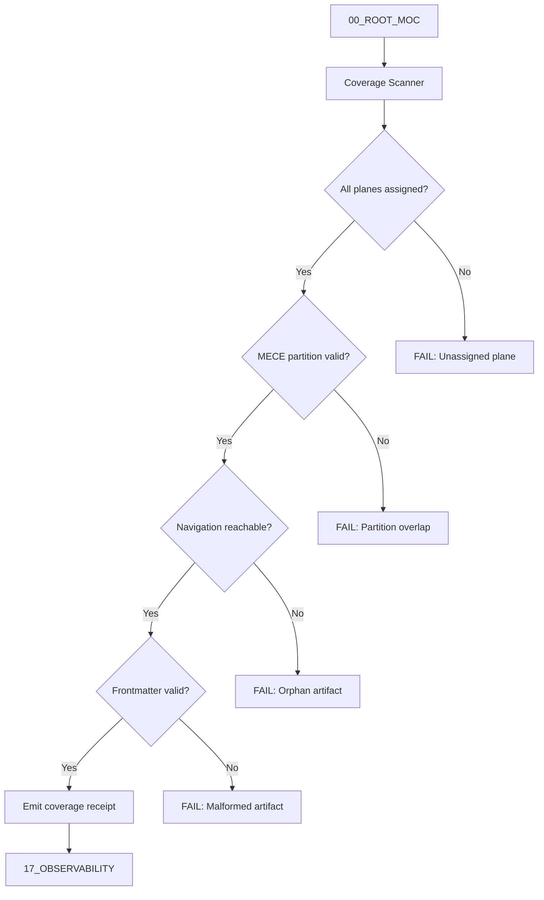

# 00 Root Coverage — Plane Governance Specification

> **Origin Architect / Steward:** Trang Phan  
> **AMOS_CORE Target:** `v4.4`  
> **Conclusion Class:** `AMOS_MODEL`  
> **Status:** `ACTIVE_SPECIFICATION`

---

## 1. Architectural Scope

`00_ROOT_COVERAGE` defines the typed contracts, invariants, and operational procedures for `00_ROOT` within the AMOS Full Brain OS MECE architecture. The `00_ROOT` plane serves as the navigation and authority-pointer meta-plane, sitting outside the numbered MECE partition (planes 01 through 25). It governs:

- **Structural navigation contracts** that bind all 26 physical planes into a coherent vault topology.
- **Coverage verification** ensuring every plane, artifact, and cross-reference is accounted for in the master index.
- **Epistemic boundary enforcement** at the root level, preventing unauthorized promotion of model claims to observed facts.
- **Compatibility routing** for legacy file references and superseded naming conventions.

This file exists because `00_ROOT` is not merely a directory container; it is the authoritative meta-plane whose contracts determine how all downstream planes are discovered, validated, and governed. Without explicit coverage specifications, structural drift between the vault's physical layout and its declared architecture would go undetected.

```text
00_ROOT = navigation_meta_plane
00_ROOT != numbered_plane
00_ROOT != runtime_execution_surface
00_ROOT != authority_issuer
```

---

## 2. Governing Invariants

- **INV-ROOT-COV-001 (MECE Partition Integrity):** The set of numbered planes {01..25} must equal the union of partitions A through F, with pairwise empty intersection. Any plane not assigned to exactly one partition is a structural violation.
- **INV-ROOT-COV-002 (Navigation Completeness):** Every canonical artifact in the vault must be reachable from `00_ROOT_MOC` within at most 3 hop-depth traversals. Orphaned artifacts trigger fail-closed coverage alerts.
- **INV-ROOT-COV-003 (Axiom Adherence):** All coverage verification procedures are strictly bound by M01 through M20 core laws defined in `01_CANON/01_CORE_LAWS`.
- **INV-ROOT-COV-004 (Fail-Closed Execution):** Rejects unverified or malformed inputs into the coverage verification basin. Missing frontmatter, missing RSCF blocks, or unclosed structural elements block promotion.
- **INV-ROOT-COV-005 (Immutable Receipts):** Emits auditable trace logs to `17_OBSERVABILITY` for every coverage verification pass, including pass/fail counts and structural anomaly detections.
- **INV-ROOT-COV-006 (Epistemic Non-Promotion):** Coverage verification confirms structural presence; it does not confirm semantic correctness, implementation status, or authority. `INDEXED != IMPLEMENTED`.
- **INV-ROOT-COV-007 (Steward Authority):** Trang Phan remains the origin architect and steward. Agent-initiated structural changes to `00_ROOT` coverage contracts require governed successor evidence and explicit promotion records.

---

## 3. Mathematical Formulation

Let $\mathcal{P} = \{P_0, P_1, \ldots, P_{25}\}$ be the set of all AMOS planes, where $P_0 = \texttt{00\_ROOT}$ and $\{P_1, \ldots, P_{25}\}$ are numbered planes. The MECE partition function $\pi$ maps each numbered plane to exactly one partition:

$$\pi: \{P_1, \ldots, P_{25}\} \to \{A, B, C, D, E, F\}$$

The coverage completeness invariant requires:

$$\forall P_i \in \{P_1, \ldots, P_{25}\}: \exists! k \in \{A,B,C,D,E,F\} \mid \pi(P_i) = k$$

$$\bigcup_{k \in \{A,B,C,D,E,F\}} \pi^{-1}(k) = \{P_1, \ldots, P_{25}\}$$

$$\forall k_1 \neq k_2: \pi^{-1}(k_1) \cap \pi^{-1}(k_2) = \emptyset$$

The navigation reachability function $R(d)$ computes the set of artifacts reachable from `00_ROOT_MOC` within hop-depth $d$:

$$R(d) = \{a \in \mathcal{A} \mid \text{shortestPath}(\texttt{00\_ROOT\_MOC}, a) \leq d\}$$

Coverage completeness requires $R(3) = \mathcal{A}_{\text{canonical}}$, where $\mathcal{A}_{\text{canonical}}$ is the set of all canonical vault artifacts.

---

## 4. Operational Architecture



The coverage scanner operates in a fail-closed mode: any single violation halts promotion and routes the diagnostic to `17_OBSERVABILITY` for audit. The scanner does not auto-repair; it only detects and reports.

---

## 5. MECE Mapping to AMOS Full Brain OS

| Coverage Component | Primary Plane | Partition | Key Dependencies |
|:---|:---|:---|:---|
| Navigation contracts | 00_ROOT | Meta-plane | 01_CANON, 03_CONTROL_PLANE |
| Partition assignment | 00_ROOT | Meta-plane | FULL_BRAIN_OS_MECE_ARCHITECTURE |
| Artifact registry | 00_ROOT | Meta-plane | ALL_FILES_LINK_REGISTRY |
| Orphan detection | 00_ROOT | Meta-plane | 17_OBSERVABILITY |
| Structural audit | 20_OPERATIONS | F | 00_ROOT, 19_TESTS |
| Coverage receipts | 17_OBSERVABILITY | F | 00_ROOT |

`00_ROOT` is outside the numbered partition. It points into partitions A through F but does not own execution, cognition, or effect governance.

---

## 6. Safety Invariants & Firewalls

- **INV-ROOT-COV-101 (No Silent Promotion):** Coverage verification output `PASS` does not imply semantic correctness or implementation status. Firewall: `INDEXED != IMPLEMENTED`.
- **INV-ROOT-COV-102 (No Auto-Repair):** The coverage scanner detects and reports only. It must not mutate artifacts, frontmatter, or cross-references without governed promotion records.
- **INV-ROOT-COV-103 (Stale Census Rejection):** Static copied inventories are rejected in favor of live registry resolution. Firewall: `CURRENT_NORMALIZED_STATIC_REGISTRY > STALE_HISTORICAL_CENSUS`.
- **INV-ROOT-COV-104 (Drive-Wide Boundary):** Files found by drive-wide search are not automatically vault members. Firewall: `DRIVE_WIDE_SEARCH != _AMOS_OS_MEMBERSHIP`.
- **INV-ROOT-COV-105 (Linked vs Canonical):** A wikilink pointing to an artifact does not establish canonical status. Firewall: `LINKED != CANONICAL`.

---

## 7. Navigation & Bindings

- **Master MOC:** [[00_ROOT/00_ROOT_MOC|00_ROOT_MOC]]
- **Partition Architecture:** [[00_ROOT/FULL_BRAIN_OS_MECE_ARCHITECTURE|FULL_BRAIN_OS_MECE_ARCHITECTURE]]
- **File Registry:** [[00_ROOT/ALL_FILES_LINK_REGISTRY|ALL_FILES_LINK_REGISTRY]]
- **Artifacts Index:** [[00_ROOT/ALL_ARTIFACTS_INDEX|ALL_ARTIFACTS_INDEX]]
- **Orphan Audit:** [[00_ROOT/ORPHAN_LINK_AUDIT|ORPHAN_LINK_AUDIT]]
- **Core Laws:** [[01_CANON/01_CORE_LAWS/LAW_HIERARCHY|LAW_HIERARCHY]]
- **Observability:** [[17_OBSERVABILITY/17_OBSERVABILITY_MOC|17_OBSERVABILITY_MOC]]
- **Control Plane Contract:** [[03_CONTROL_PLANE/CONTROL_PLANE_CONTROL_PLANE_CONTRACT|CONTROL_PLANE_CONTROL_PLANE_CONTRACT]]
- **Audit Ledger:** [[20_OPERATIONS/AMOS_OS_AUDIT_2026-09-03|AMOS_OS_AUDIT_2026-09-03]]

---

## 8. Known Gaps & Falsifiers

- **GAP-ROOT-COV-001:** Approximately 2,408 Google Drive-only files have not been resynced to the local Documents copy. Coverage verification is bounded by the synced subset. State: `UNKNOWN/GAP`.
- **GAP-ROOT-COV-002:** The `copilot/copilot-conversations` logs carry 64 broken wikilinks. These are conversation exports, not canonical vault notes, and are excluded from coverage verification. State: `KNOWN_EXCLUSION`.
- **GAP-ROOT-COV-003:** End-to-end governed OS implementation closure is not established by structural coverage alone. Coverage verifies document presence, not executable runtime. State: `UNKNOWN/GAP`.
- **GAP-ROOT-COV-004:** The exact authoritative precedence hierarchy among core law artifacts remains `UNKNOWN/GAP` unless source-supported by `LAW_HIERARCHY` content.
- **GAP-ROOT-COV-005:** Falsifier: if any numbered plane is found to belong to two partitions simultaneously, the MECE coverage invariant is falsified and must be repaired before further promotion.
