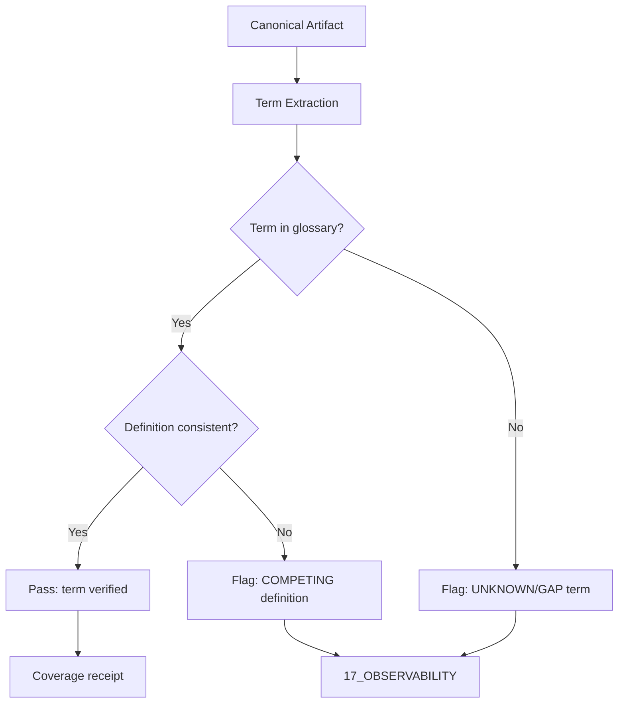

# 00 Root Glossary — Plane Governance Specification

> **Origin Architect / Steward:** Trang Phan  
> **AMOS_CORE Target:** `v4.4`  
> **Conclusion Class:** `AMOS_MODEL`  
> **Status:** `ACTIVE_SPECIFICATION`

---

## 1. Architectural Scope

`00_ROOT_GLOSSARY` defines the canonical terminology, typed contracts, and semantic invariants for the `00_ROOT` meta-plane within the AMOS Full Brain OS MECE architecture. It serves as the authoritative glossary for all terms used across the 26-plane vault, ensuring that every artifact, agent, and cross-reference operates on a shared vocabulary. The glossary governs:

- **Term definitions** for AMOS-specific concepts (RSCF, MECE, plane, partition, epistemic class, conclusion class).
- **Semantic boundary enforcement** preventing conflation of distinct concepts (e.g., capability vs authority, model vs observation).
- **Cross-plane terminology consistency** ensuring that terms like "commit," "rollback," "receipt," and "canon" carry identical semantics regardless of which plane uses them.
- **Epistemic class taxonomy** defining the allowable values for `epistemic_class` and `conclusion_class` frontmatter fields.

This file exists because terminology drift is a primary vector for entropy corruption. Without a root-level glossary, downstream planes may silently redefine shared terms, producing semantic contradictions that propagate through the vault.

```text
GLOSSARY = canonical_terminology_contract
GLOSSARY != implementation_dictionary
GLOSSARY != runtime_api_spec
TERM_DEFINED != TERM_IMPLEMENTED
```

---

## 2. Governing Invariants

- **INV-ROOT-GLO-001 (Term Uniqueness):** Each canonical term has exactly one authoritative definition in this glossary. Competing definitions in downstream planes are flagged as `COMPETING` and must not be silently resolved.
- **INV-ROOT-GLO-002 (Epistemic Non-Conflation):** The glossary enforces strict separation between `MODEL`, `OBSERVATION`, `SOURCE_CLAIM`, `DERIVED`, and `UNKNOWN/GAP` epistemic classes. No term definition may bridge these classes without explicit governed promotion.
- **INV-ROOT-GLO-003 (Axiom Adherence):** All glossary definitions are strictly bound by M01 through M20 core laws. Definitions that contradict a core law are rejected.
- **INV-ROOT-GLO-004 (Fail-Closed on Missing Terms):** If a term used in a canonical artifact is absent from this glossary, the artifact's coverage verification returns `UNKNOWN/GAP` for that term, blocking promotion.
- **INV-ROOT-GLO-005 (Immutable Receipts):** Glossary updates emit auditable trace logs to `17_OBSERVABILITY`, including the old definition, new definition, and promotion record.
- **INV-ROOT-GLO-006 (Non-Promotion Firewall):** A glossary entry confirms that a term is defined; it does not confirm that the term's referent is implemented, deployed, or empirically validated. `DOCUMENTED != IMPLEMENTED`.
- **INV-ROOT-GLO-007 (Steward Authority):** Trang Phan remains the origin architect and steward. Agent-initiated glossary additions require governed successor evidence and explicit promotion records.

---

## 3. Mathematical Formulation

Let $\mathcal{T}$ be the set of all canonical AMOS terms and $\mathcal{D}: \mathcal{T} \to \mathcal{S}$ be the definition function mapping each term to its semantic specification string. The glossary completeness invariant requires:

$$\forall t \in \mathcal{T}_{\text{used}}: \exists! d \in \mathcal{S} \mid \mathcal{D}(t) = d$$

where $\mathcal{T}_{\text{used}}$ is the set of terms appearing in canonical vault artifacts. The epistemic separation invariant requires:

$$\forall t \in \mathcal{T}: \text{epistemicClass}(\mathcal{D}(t)) \in \{\texttt{MODEL}, \texttt{OBSERVATION}, \texttt{SOURCE\_CLAIM}, \texttt{DERIVED}, \texttt{UNKNOWN/GAP}\}$$

$$\text{epistemicClass}(\mathcal{D}(t)) = \texttt{MODEL} \implies \text{epistemicClass}(\mathcal{D}(t)) \neq \texttt{OBSERVATION}$$

The term entropy metric $H_{\text{term}}(t)$ measures definitional drift across planes:

$$H_{\text{term}}(t) = -\sum_{i=1}^{n} p_i \log_2 p_i$$

where $p_i$ is the fraction of planes using definition variant $i$ for term $t$. $H_{\text{term}}(t) = 0$ indicates perfect consistency; $H_{\text{term}}(t) > 0$ triggers a `COMPETING` alert.

---

## 4. Operational Architecture



The glossary verification pass is non-mutating: it detects and reports only. Term additions and definition updates require governed promotion through the control plane.

### Canonical Term Registry (Excerpt)

| Term | Definition | Epistemic Class |
|:---|:---|:---|
| RSCF | Root Source Claim Framework; provenance tracking for all AMOS artifacts | DERIVED |
| MECE | Mutually Exclusive, Collectively Exhaustive partition of planes | DERIVED |
| Plane | Physical/operational namespace in the vault (00 through 25) | DERIVED |
| Partition | Functional responsibility domain (A through F) grouping planes | DERIVED |
| Canon | Admitted law/definition/lineage artifact in 01_CANON | SOURCE_CLAIM |
| Receipt | Cryptographic audit trace emitted to 17_OBSERVABILITY | DERIVED |
| Commit | State mutation delta admitted by control plane authority | DERIVED |
| Rollback | Reversible state change applying inverse delta | DERIVED |
| MVCC | Multi-Version Concurrency Control for state versioning | DERIVED |
| CAS | Compare-And-Swap monotonic version comparison | DERIVED |

---

## 5. MECE Mapping to AMOS Full Brain OS

| Glossary Component | Primary Plane | Partition | Key Dependencies |
|:---|:---|:---|:---|
| Term definitions | 00_ROOT | Meta-plane | 01_CANON, 11_KNOWLEDGE |
| Epistemic class taxonomy | 00_ROOT | Meta-plane | 01_CANON/01_CORE_LAWS |
| Cross-plane consistency | 00_ROOT | Meta-plane | 17_OBSERVABILITY |
| Canon terminology | 01_CANON | A | 00_ROOT |
| State terminology | 12_STATE | D | 00_ROOT |
| Security terminology | 18_SECURITY | E | 00_ROOT |

`00_ROOT` glossary is the meta-plane terminology authority. Downstream planes may specialize terms but must not contradict root definitions.

---

## 6. Safety Invariants & Firewalls

- **INV-ROOT-GLO-101 (No Silent Redefinition):** Downstream planes must not silently redefine canonical terms. Firewall: `ROOT_DEFINITION > PLANE_SPECIALIZATION`.
- **INV-ROOT-GLO-102 (No Epistemic Bridging):** A term defined as `MODEL` must not be used as `OBSERVATION` in any artifact without explicit governed promotion. Firewall: `MODEL != OBSERVATION`.
- **INV-ROOT-GLO-103 (No Authority from Definition):** Defining a term does not grant authority over its referent. Firewall: `CAPABILITY != AUTHORITY`.
- **INV-ROOT-GLO-104 (No Implementation from Documentation):** A glossary entry documenting a mechanism does not confirm the mechanism is implemented. Firewall: `DOCUMENTED != IMPLEMENTED`.
- **INV-ROOT-GLO-105 (Competing Preservation):** When two planes offer incompatible definitions, both are preserved as `COMPETING` rather than silently resolved. Firewall: `COMPETING != RESOLVED`.

---

## 7. Navigation & Bindings

- **Master MOC:** [[00_ROOT/00_ROOT_MOC|00_ROOT_MOC]]
- **Partition Architecture:** [[00_ROOT/FULL_BRAIN_OS_MECE_ARCHITECTURE|FULL_BRAIN_OS_MECE_ARCHITECTURE]]
- **Core Laws:** [[01_CANON/01_CORE_LAWS/LAW_HIERARCHY|LAW_HIERARCHY]]
- **RSCF Nodes:** [[00_ROOT/AMOS_RSCF_NODES|AMOS_RSCF_NODES]]
- **Knowledge Base:** [[11_KNOWLEDGE/11_KNOWLEDGE_MOC|11_KNOWLEDGE_MOC]]
- **Observability:** [[17_OBSERVABILITY/17_OBSERVABILITY_MOC|17_OBSERVABILITY_MOC]]
- **Schemas:** [[16_SCHEMAS/16_SCHEMAS_MOC|16_SCHEMAS_MOC]]
- **Control Plane Contract:** [[03_CONTROL_PLANE/CONTROL_PLANE_CONTROL_PLANE_CONTRACT|CONTROL_PLANE_CONTROL_PLANE_CONTRACT]]

---

## 8. Known Gaps & Falsifiers

- **GAP-ROOT-GLO-001:** The glossary is not exhaustively populated for all 7,098+ canonical vault notes. Terms appearing only in archived or historical artifacts may be absent. State: `UNKNOWN/GAP`.
- **GAP-ROOT-GLO-002:** Vietnamese-language terms from the Khung Trang canon do not have standardized English glossary entries in all cases. State: `PARTIAL`.
- **GAP-ROOT-GLO-003:** The term entropy metric $H_{\text{term}}$ is specified but not yet computed across the full vault. State: `UNIMPLEMENTED`.
- **GAP-ROOT-GLO-004:** Falsifier: if any canonical term is found to have two incompatible authoritative definitions in this glossary, the term uniqueness invariant is falsified.
- **GAP-ROOT-GLO-005:** Falsifier: if a core law (M01-M20) is found to contradict a glossary definition, the axiom adherence invariant is falsified and the definition must be repaired or removed.
