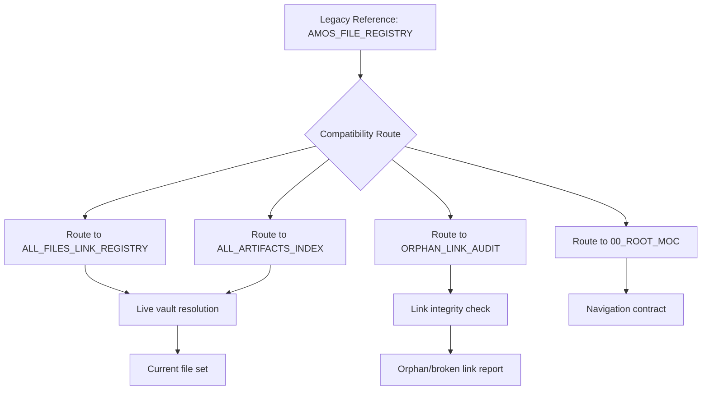

# AMOS File Registry — Compatibility Route

> **Origin Architect / Steward:** Trang Phan
> **AMOS_CORE Target:** `v4.4`
> **Conclusion Class:** `DERIVED`
> **Status:** `ACTIVE_COMPATIBILITY_ROUTE`

This file intentionally carries no copied file census. Static copied inventories become stale after moves, deletes, archival, or concurrent repair.

Use the current surfaces:

- [[00_ROOT/ALL_FILES_LINK_REGISTRY|ALL_FILES_LINK_REGISTRY]] — static exhaustive core-Obsidian registry for the recorded/current repair set.
- [[00_ROOT/ALL_ARTIFACTS_INDEX|ALL_ARTIFACTS_INDEX]] — human-facing exhaustive navigation entry point.
- [[00_ROOT/ORPHAN_LINK_AUDIT|ORPHAN_LINK_AUDIT]] — live navigation/backlink/unresolved-link audit.
- [[00_ROOT/00_ROOT_MOC|00_ROOT_MOC]] — authoritative root navigation contract.

Hard boundaries:

```text
CURRENT_NORMALIZED_STATIC_REGISTRY > STALE_HISTORICAL_CENSUS
DRIVE_WIDE_SEARCH != _AMOS_OS_MEMBERSHIP
LINKED != CANONICAL
INDEXED != IMPLEMENTED
ARCHIVED != ACTIVE
```

Legacy references to `AMOS_FILE_REGISTRY` remain valid through this compatibility route, while file membership itself is resolved live.

---

## 1. Architectural Scope

`AMOS_FILE_REGISTRY` is a compatibility redirect artifact. It exists to preserve backward compatibility with legacy references to a static file census that was intentionally deprecated. The registry does not store file listings; instead, it routes all file-membership queries to live resolution surfaces. This design exists because:

- **Stale census prevention:** Static copied inventories diverge from reality after any file move, delete, archival, or concurrent repair operation. A stale census is worse than no census because it creates false confidence.
- **Single source of truth:** File membership is resolved at query time against the current vault state, not against a snapshot that may be hours, days, or weeks out of date.
- **Compatibility preservation:** Legacy agents, workflows, and cross-references that point to `AMOS_FILE_REGISTRY` continue to function without requiring mass link updates.

```text
REGISTRY = compatibility_redirect
REGISTRY != static_census
REGISTRY != file_listing
REGISTRY != authority_surface
```

---

## 2. Governing Invariants

- **INV-ROOT-REG-001 (No Static Census):** This file must never contain a copied file listing. Any attempt to populate it with a static census is a structural violation.
- **INV-ROOT-REG-002 (Live Resolution):** File membership queries must be routed to `ALL_FILES_LINK_REGISTRY` or `ALL_ARTIFACTS_INDEX` for live resolution against current vault state.
- **INV-ROOT-REG-003 (Stale Census Rejection):** Historical file censuses are explicitly rejected as authoritative. `CURRENT_NORMALIZED_STATIC_REGISTRY > STALE_HISTORICAL_CENSUS`.
- **INV-ROOT-REG-004 (Drive-Wide Boundary):** Files found by drive-wide filesystem search are not automatically vault members. `DRIVE_WIDE_SEARCH != _AMOS_OS_MEMBERSHIP`.
- **INV-ROOT-REG-005 (Linked vs Canonical):** A wikilink pointing to a file does not establish canonical status. `LINKED != CANONICAL`.
- **INV-ROOT-REG-006 (Indexed vs Implemented):** A file appearing in the registry confirms structural presence, not implementation status. `INDEXED != IMPLEMENTED`.
- **INV-ROOT-REG-007 (Archived vs Active):** Archived files are preserved for historical lineage but are not active canonical artifacts. `ARCHIVED != ACTIVE`.

---

## 3. Mathematical Formulation

Let $\mathcal{F}_{\text{vault}}(t)$ be the set of files in the vault at time $t$, and let $\mathcal{F}_{\text{census}}(t_0)$ be a static census taken at time $t_0$. The staleness divergence $\Delta(t)$ is:

$$\Delta(t) = |\mathcal{F}_{\text{vault}}(t) \triangle \mathcal{F}_{\text{census}}(t_0)|$$

where $\triangle$ denotes symmetric difference. The compatibility route invariant requires:

$$\forall t > t_0: \Delta(t) \geq 0 \implies \text{census is unreliable as authoritative source}$$

The live resolution function $\mathcal{R}_{\text{live}}$ queries the current vault state:

$$\mathcal{R}_{\text{live}}(q) = \{f \in \mathcal{F}_{\text{vault}}(t_{\text{now}}) \mid f \text{ satisfies query } q\}$$

This file delegates all queries to $\mathcal{R}_{\text{live}}$ rather than returning cached results from $\mathcal{F}_{\text{census}}(t_0)$.

---

## 4. Operational Architecture



The compatibility route is a pure redirect: it performs no computation, stores no census, and makes no authority decisions. It only routes queries to the appropriate live surfaces.

---

## 5. MECE Mapping to AMOS Full Brain OS

| Registry Component | Primary Plane | Partition | Key Dependencies |
|:---|:---|:---|:---|
| Compatibility redirect | 00_ROOT | Meta-plane | ALL_FILES_LINK_REGISTRY |
| Live file resolution | 00_ROOT | Meta-plane | ALL_ARTIFACTS_INDEX |
| Orphan detection | 00_ROOT | Meta-plane | ORPHAN_LINK_AUDIT |
| Navigation contract | 00_ROOT | Meta-plane | 00_ROOT_MOC |
| Structural audit | 20_OPERATIONS | F | 00_ROOT |
| Archive boundary | 24_ARCHIVE | F | 00_ROOT |

`00_ROOT` registry surfaces are meta-plane navigation tools. They do not own execution, cognition, or effect governance.

---

## 6. Safety Invariants & Firewalls

- **INV-ROOT-REG-101 (No Census Injection):** Any attempt to write a static file listing into this artifact triggers a structural violation alert. Firewall: `NO_STATIC_CENSUS`.
- **INV-ROOT-REG-102 (No Authority from Presence):** A file appearing in the live registry does not confer canonical status, authority, or implementation verification. Firewall: `INDEXED != IMPLEMENTED`.
- **INV-ROOT-REG-103 (No Drive-Wide Auto-Inclusion):** Files discovered by drive-wide search outside `_AMOS_OS` are not vault members. Firewall: `DRIVE_WIDE_SEARCH != _AMOS_OS_MEMBERSHIP`.
- **INV-ROOT-REG-104 (Archive Isolation):** Archived files are excluded from active canonical resolution. Firewall: `ARCHIVED != ACTIVE`.
- **INV-ROOT-REG-105 (Link Integrity):** Broken wikilinks detected by `ORPHAN_LINK_AUDIT` are reported but not auto-repaired. Firewall: `DETECT != REPAIR`.

---

## 7. Navigation & Bindings

- **Master MOC:** [[00_ROOT/00_ROOT_MOC|00_ROOT_MOC]]
- **File Registry:** [[00_ROOT/ALL_FILES_LINK_REGISTRY|ALL_FILES_LINK_REGISTRY]]
- **Artifacts Index:** [[00_ROOT/ALL_ARTIFACTS_INDEX|ALL_ARTIFACTS_INDEX]]
- **Orphan Audit:** [[00_ROOT/ORPHAN_LINK_AUDIT|ORPHAN_LINK_AUDIT]]
- **Partition Architecture:** [[00_ROOT/FULL_BRAIN_OS_MECE_ARCHITECTURE|FULL_BRAIN_OS_MECE_ARCHITECTURE]]
- **Audit Ledger:** [[20_OPERATIONS/AMOS_OS_AUDIT_2026-09-03|AMOS_OS_AUDIT_2026-09-03]]
- **Archive Boundary:** [[24_ARCHIVE/24_ARCHIVE_MOC|24_ARCHIVE_MOC]]
- **Core Laws:** [[01_CANON/01_CORE_LAWS/LAW_HIERARCHY|LAW_HIERARCHY]]

---

## 8. Known Gaps & Falsifiers

- **GAP-ROOT-REG-001:** Approximately 2,408 Google Drive-only files are not yet resynced to the local Documents copy. Live resolution is bounded by the synced subset. State: `UNKNOWN/GAP`.
- **GAP-ROOT-REG-002:** The `copilot/copilot-conversations` logs carry 64 broken wikilinks. These are conversation exports, not canonical vault notes, and are excluded from registry resolution. State: `KNOWN_EXCLUSION`.
- **GAP-ROOT-REG-003:** Concurrent repair operations may produce transient inconsistencies between `ALL_FILES_LINK_REGISTRY` and the physical vault state. State: `TRANSIENT`.
- **GAP-ROOT-REG-004:** Falsifier: if a static file census is found in this artifact, the no-census invariant is falsified and must be immediately repaired.
- **GAP-ROOT-REG-005:** Falsifier: if a drive-wide search result is found to have been auto-included as a vault member without explicit admission, the drive-wide boundary invariant is falsified.
