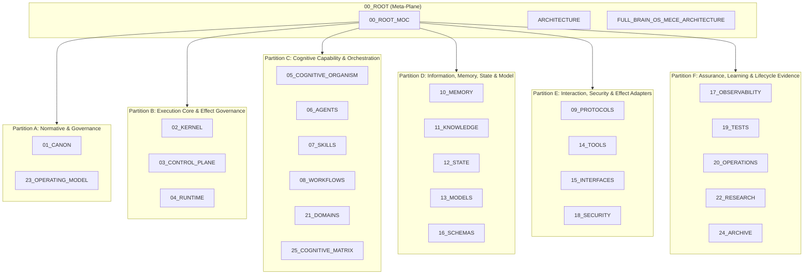

# Architecture — Plane Governance Specification

> **Origin Architect / Steward:** Trang Phan  
> **AMOS_CORE Target:** `v4.4`  
> **Conclusion Class:** `AMOS_MODEL`  
> **Status:** `ACTIVE_SPECIFICATION`

---

## 1. Architectural Scope

`ARCHITECTURE` defines the top-level structural contracts, plane relationships, and governance boundaries for the AMOS Full Brain OS. It is the root-level architectural specification that binds all 26 physical planes (00_ROOT through 25_COGNITIVE_MATRIX) into a coherent, MECE-compliant system. This file governs:

- **Plane topology** defining the 26 physical/operational namespaces and their functional ownership.
- **MECE partition contracts** assigning each numbered plane to exactly one of six responsibility domains (A through F).
- **Cross-plane dependency rules** specifying how typed dependencies flow between planes without duplicating ownership.
- **Epistemic boundary enforcement** at the architectural level, ensuring that the vault's structural design does not silently promote models to observations or documentation to implementation.
- **Component model** mapping the six Full Brain OS components (B_core, K_omni, B_omniverse, P_personality, T_expression, G_gap) to their primary physical owners.

This file exists because the AMOS architecture explicitly rejects a universal linear hierarchy (Kernel -> Engine -> Agent -> Control Plane). Instead, it requires multi-dimensional separation: functional ownership, physical storage, authority precedence, runtime call order, and evidence/validation status are distinct dimensions that must not be conflated.

```text
FUNCTIONAL_OWNERSHIP != PHYSICAL_STORAGE
PHYSICAL_STORAGE != AUTHORITY_PRECEDENCE
AUTHORITY_PRECEDENCE != RUNTIME_CALL_ORDER
RUNTIME_CALL_ORDER != EVIDENCE_STATUS
```

---

## 2. Governing Invariants

- **INV-ROOT-ARCH-001 (MECE Partition Integrity):** The set of numbered planes {01..25} must equal the union of partitions A through F, with pairwise empty intersection. `00_ROOT` is the meta-plane outside the numbered partition.
- **INV-ROOT-ARCH-002 (One Primary Owner):** Each Full Brain functional field has exactly one primary physical owner plane. Dependencies are expressed as typed edges, not as duplicate ownership.
- **INV-ROOT-ARCH-003 (Axiom Adherence):** All architectural contracts are strictly bound by M01 through M20 core laws. Architectural decisions that contradict a core law are rejected.
- **INV-ROOT-ARCH-004 (Fail-Closed Execution):** Rejects unverified or malformed architectural inputs. Missing partition assignments, orphaned planes, or overlapping ownership trigger fail-closed alerts.
- **INV-ROOT-ARCH-005 (Immutable Receipts):** Emits auditable trace logs to `17_OBSERVABILITY` for every architectural verification pass.
- **INV-ROOT-ARCH-006 (Epistemic Non-Promotion):** Architectural presence does not imply implementation. `DOCUMENTED != IMPLEMENTED`. The architecture is a derived model, not a deployed runtime.
- **INV-ROOT-ARCH-007 (Steward Authority):** Trang Phan remains the origin architect and steward. Architectural changes require governed successor evidence and explicit promotion records.

---

## 3. Mathematical Formulation

Let $\mathcal{P} = \{P_0, P_1, \ldots, P_{25}\}$ be the set of all AMOS planes. The partition function $\pi$ maps numbered planes to responsibility domains:

$$\pi: \{P_1, \ldots, P_{25}\} \to \{A, B, C, D, E, F\}$$

The MECE invariant:

$$\bigcup_{k \in \{A,\ldots,F\}} \pi^{-1}(k) = \{P_1, \ldots, P_{25}\}, \quad \forall k_1 \neq k_2: \pi^{-1}(k_1) \cap \pi^{-1}(k_2) = \emptyset$$

The Full Brain OS component model:

$$\text{FullBrainOS} = \{B_{\text{core}}, K_{\text{omni}}, B_{\text{omniverse}}, P_{\text{personality}}, T_{\text{expression}}, G_{\text{gap}}\}$$

The primary owner function $\omega$ maps each component to its primary plane:

$$\omega(B_{\text{core}}) = 21_{\text{DOMAINS}}, \quad \omega(K_{\text{omni}}) = 05_{\text{COGNITIVE\_ORGANISM}}, \quad \omega(G_{\text{gap}}) = \text{cross-cutting}$$

The architectural entropy $H_{\text{arch}}$ measures structural drift:

$$H_{\text{arch}} = -\sum_{i=1}^{25} p_i \log_2 p_i, \quad p_i = \frac{|\text{artifacts}(P_i)|}{|\text{artifacts}(\mathcal{P})|}$$

---

## 4. Operational Architecture



---

## 5. MECE Mapping to AMOS Full Brain OS

| Full Brain Field | Primary Owner | Partition | Key Dependencies |
|:---|:---|:---|:---|
| Representation / Expression | 05 Cognitive Organism | C | 15 Interfaces, 11 Knowledge, 13 Models |
| Cognitive Coordination | 05 Cognitive Organism | C | 25 Cognitive Matrix, 02 Kernel |
| Capability / Specialist Reasoning | 21 Domains | C | 07 Skills, 13 Models, 11 Knowledge |
| World / System Representation | 13 Models | D | 11 Knowledge, 21 Domains |
| Runtime Continuity | 04 Runtime | B | 09 Protocols, 10 Memory, 12 State, 16 Schemas |
| Effect Governance | 03 Control Plane | B | 02 Kernel, 18 Security, 23 Operating Model |
| Deployment / Effect Adaptation | 14 Tools | E | 06 Agents, 08 Workflows, 15 Interfaces |

`ONE_PRIMARY_OWNER + MANY_TYPED_DEPENDENCIES` is the default. No plane acquires durable-effect authority merely by being capable.

---

## 6. Safety Invariants & Firewalls

- **INV-ROOT-ARCH-101 (No Linear Hierarchy Assumption):** The architecture must not be read as a universal call chain. Firewall: `FUNCTIONAL_OWNERSHIP != RUNTIME_CALL_ORDER`.
- **INV-ROOT-ARCH-102 (No Implementation from Architecture):** Architectural diagrams and contracts do not confirm deployed runtime. Firewall: `DOCUMENTED != IMPLEMENTED`.
- **INV-ROOT-ARCH-103 (No Authority from Capability):** A plane owning a cognitive capability does not acquire effect authority. Firewall: `CAPABILITY != AUTHORITY`.
- **INV-ROOT-ARCH-104 (No Model to Observation):** Architectural models must not be promoted to empirical observations without governed validation. Firewall: `MODEL != OBSERVATION`.
- **INV-ROOT-ARCH-105 (Component Count Preservation):** The source declares 5 components but lists 6. This inconsistency is preserved as `COMPETING` rather than silently resolved. Firewall: `COMPETING != RESOLVED`.

---

## 7. Navigation & Bindings

- **Master MOC:** [[00_ROOT/00_ROOT_MOC|00_ROOT_MOC]]
- **Partition Architecture:** [[00_ROOT/FULL_BRAIN_OS_MECE_ARCHITECTURE|FULL_BRAIN_OS_MECE_ARCHITECTURE]]
- **Plane Ownership Matrix:** [[00_ROOT/PLANE_OWNERSHIP_MATRIX|PLANE_OWNERSHIP_MATRIX]]
- **Core Laws:** [[01_CANON/01_CORE_LAWS/LAW_HIERARCHY|LAW_HIERARCHY]]
- **Control Plane Contract:** [[03_CONTROL_PLANE/CONTROL_PLANE_CONTROL_PLANE_CONTRACT|CONTROL_PLANE_CONTROL_PLANE_CONTRACT]]
- **Runtime Contract:** [[04_RUNTIME/RUNTIME_RUNTIME_CONTRACT|RUNTIME_RUNTIME_CONTRACT]]
- **Observability:** [[17_OBSERVABILITY/17_OBSERVABILITY_MOC|17_OBSERVABILITY_MOC]]
- **Cognitive Matrix:** [[25_COGNITIVE_MATRIX/25_COGNITIVE_MATRIX_MOC|25_COGNITIVE_MATRIX_MOC]]
- **Audit Ledger:** [[20_OPERATIONS/AMOS_OS_AUDIT_2026-09-03|AMOS_OS_AUDIT_2026-09-03]]

---

## 8. Known Gaps & Falsifiers

- **GAP-ROOT-ARCH-001:** The source declares 5 primary components but explicitly lists 6. This count conflict is preserved as `COMPETING / SOURCE-INCONSISTENCY` rather than silently resolved. State: `COMPETING`.
- **GAP-ROOT-ARCH-002:** End-to-end governed OS implementation closure is not established by architectural presence alone. MVCC/CAS, atomic multi-RSCF, causal epoch finality, and rollback are treated as specification patterns unless tied to executed implementation evidence. State: `UNKNOWN/GAP`.
- **GAP-ROOT-ARCH-003:** The exact authoritative precedence hierarchy among core law artifacts remains `UNKNOWN/GAP` unless source-supported by `LAW_HIERARCHY` content.
- **GAP-ROOT-ARCH-004:** Falsifier: if any numbered plane is found to belong to two partitions simultaneously, the MECE partition invariant is falsified.
- **GAP-ROOT-ARCH-005:** Falsifier: if any Full Brain functional field is found to have two primary owners, the one-primary-owner invariant is falsified and must be repaired.
