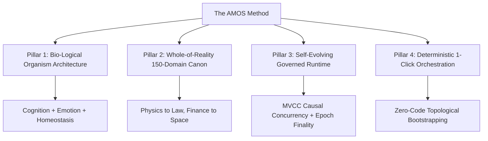

# The AMOS Method™ — Bio-Logical System Architecture for AI Organisms

> **Origin Architect / Steward:** Trang Phan
> **Target Core Lineage:** `v4.4`
> **Discipline:** Bio-Logical System Architecture & Organism Operating Systems

---

## 1. Executive Summary & Epistemic Origin

The **AMOS Method™** represents a new discipline in computing and cognitive architecture: **Bio-Logical Computing™**.

Unlike traditional software engineering that constructs disconnected tools and chatbots from code-first specifications, the AMOS Method approaches artificial intelligence as a **living, unified cognitive organism** comprising:
- Brain (Cognition & Inference)
- Nervous System & Homeostasis (Regulation & Stress Containment)
- Identity & Will (Goal Coherence & Origin Stewardship)
- World Model & Perception (Multi-Modal Grounding)
- Governance & Legal Stacks (Authority & Invariant Adherence)
- 150-Domain Canonical Stratification (Whole-of-Reality Coverage)

---

## 2. The Four Pillars of the AMOS Method™

### Pillar 1: Bio-Logical Organism Architecture
Treats the AI system as a multi-organ organism where cognition, affect, memory, and instinct interact under thermodynamic and homeostatic balance laws.

### Pillar 2: Whole-of-Reality 150-Domain Canon
Organizes universal knowledge across 150 structured domains (C01–C12 families) ensuring zero blind-spots in cross-domain synthesis.

### Pillar 3: Self-Evolving Governed Runtime
Integrates the Governed Machine Evolution Framework (GMEF) with deterministic MVCC causal concurrency and coordination avoidance (AMOS v4.4).

### Pillar 4: Deterministic 1-Click Orchestration
Enables non-coder systems architects to instantiate, configure, and operate vast multi-agent universes deterministically from high-level architectural schemas.

---

## 3. Academic & Commercial Validation

- **Academic Codification:** Formulated as the core thesis for DSc (Doctor of Science) submissions in Systems Architecture and Unified Biological Intelligence.
- **Commercial Deployment:** Powers enterprise transformations across banking, mining, defense collaboration (Kojensi), healthcare, and national governance.
