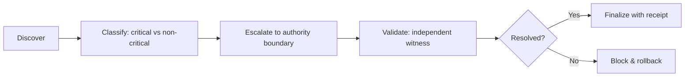

# L28 Critical Gap — Plane Governance Specification

> **Origin Architect / Steward:** Trang Phan
> **AMOS_CORE Target:** `v4.4`
> **Conclusion Class:** `AMOS_MODEL`
> **Status:** `PROPOSED_SPECIFICATION` · **Canonical Status:** `CONDITIONAL`

---

## 1. Architectural Scope

`L28_CRITICAL_GAP` defines the typed contracts, invariants, and operational procedures for identifying, classifying, and governing critical gaps within the AMOS Full OS MECE architecture. A **critical gap** is a missing load-bearing premise, authority, provenance, or executable evidence that, if left unresolved, would prevent a safe, canonical, or reversible decision.

---

## 2. Governing Invariants

- **CG-1 Critical Classification:** A gap is marked `CRITICAL` only when it bears on safety, authority, finality, or irreversibility. Cosmetic, cosmetic, or low-burden gaps remain `NON_CRITICAL` and are routed to the ordinary backlog.
- **CG-2 Fail-Closed Execution:** Any action whose critical gap is unresolved is rejected into the rollback basin (`ROLLBACK_AND_RECOVERY_BASINS`) rather than executed with degraded confidence.
- **CG-3 Immutable Receipts:** Every critical gap classification, escalation, and resolution emits an auditable trace log to `17_OBSERVABILITY` with timestamp, actor, evidence, and confidence ceiling.
- **CG-4 Authority Separation:** The agent or subsystem that discovers a critical gap may not unilaterally resolve it if the gap concerns authority, identity, or provenance; resolution requires an independent validation witness.
- **CG-5 Axiom Adherence:** Critical gap governance is strictly bound by M01–M20 core laws and the `LAW_HIERARCHY` precedence order.

---

## 3. Critical Gap Lifecycle

1. **Discover:** A missing premise, `UNKNOWN/GAP` label, stale source, or integrity mismatch is detected.
2. **Classify:** Apply `CG-1` to determine whether the gap is load-bearing. Record the gap class (`AUTHORITY_GAP`, `PROVENANCE_GAP`, `FRESHNESS_GAP`, `IMPLEMENTATION_GAP`, `SCOPE_GAP`).
3. **Escalate:** Route the classified gap to the appropriate authority boundary (`L7_AUTHORITY`, `L5_SCOPE_REGIME`, or `L24_CAUSAL_EPOCH` as applicable).
4. **Validate:** An independent witness (second source, test evidence, or authority signature) corroborates the resolution.
5. **Finalize / Block:** If validated, emit a resolution receipt and lower the gap status. If not, block the action and enter rollback recovery.

---

## 4. MECE Mapping to AMOS Full Brain OS

| Gap Class | Affected AMOS Stage | Canonical Gate |
|-----------|--------------------|----------------|
| Authority gap | Perceive / Route / Execute | `L7_AUTHORITY` |
| Provenance gap | Admit / Plan / Audit | `L17_RSCF` |
| Freshness gap | Observe / Repair | `L6_UNCERTAINTY` |
| Implementation gap | Schedule / Execute | `04_RUNTIME` contract |
| Scope gap | Perceive / Route | `L5_SCOPE_REGIME` |

---

## 5. Safety Invariants & Firewalls

- `INV-CG-001` (**No Bypass:**) A critical gap cannot be bypassed by reclassifying it as non-critical without a documented authority witness.
- `INV-CG-002` (**Confidence Ceiling:**) The confidence of any derived claim is capped at the weakest unresolved critical gap affecting it.
- `INV-CG-003` (**No Silent Repair:**) Critical gaps are never repaired by deleting or overwriting the record that exposed them; repair must be additive and auditable.
- `INV-CG-004` (**Human Escalation:**) Critical gaps that affect M0-M2 mutations or irreversible effects escalate to the origin steward or designated human authority.

---

## 6. Navigation & Bindings

- **Master MOC:** [[00_ROOT/00_ROOT_MOC|00_ROOT_MOC]]
- **Partition Architecture:** [[00_ROOT/FULL_BRAIN_OS_MECE_ARCHITECTURE|FULL_BRAIN_OS_MECE_ARCHITECTURE]]
- **Law Hierarchy:** [[01_CANON/01_CORE_LAWS/LAW_HIERARCHY|LAW_HIERARCHY]]
- **Rollback Basins:** [[01_CANON/01_CORE_LAWS/ROLLBACK_AND_RECOVERY_BASINS|ROLLBACK_AND_RECOVERY_BASINS]]
- **Related Laws:** [[01_CANON/01_CORE_LAWS/L5_SCOPE_REGIME|L5_SCOPE_REGIME]] · [[01_CANON/01_CORE_LAWS/L7_AUTHORITY|L7_AUTHORITY]] · [[01_CANON/01_CORE_LAWS/L17_RSCF|L17_RSCF]]

---

## 7. Known Gaps & Falsifiers

- `GAP-CG-001`: Automated classification of critical vs non-critical gaps depends on context and burden models; misclassification is a known failure mode requiring human audit sampling.
- `GAP-CG-002`: The independent-witness requirement assumes a supply of trustworthy validators; in low-trust or single-source regimes, `CRITICAL` gaps default to `BLOCK`.
- `GAP-CG-003`: `L28` is a `PROPOSED_SPECIFICATION` with `CONDITIONAL` canonical status; it does not by itself establish final AMOS canon.

**Parent:** [[01_CANON/01_CORE_LAWS/01_CORE_LAWS_MOC|01_CORE_LAWS_MOC]] · [[00_ROOT/00_HOME|00_HOME]]
