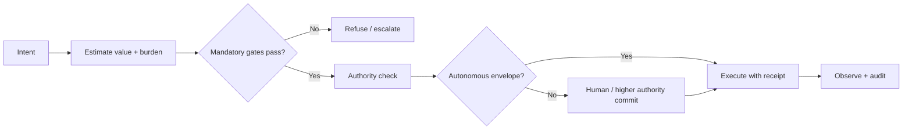

# L29 Decision Value — Plane Governance Specification

> **Origin Architect / Steward:** Trang Phan  
> **AMOS_CORE Target:** `v4.4`  
> **Conclusion Class:** `AMOS_MODEL`  
> **Status:** `PROPOSED_SPECIFICATION` · **Canonical Status:** `CONDITIONAL`

---

## 1. Architectural Scope

`L29_DECISION_VALUE` defines the typed contracts, invariants, and operational procedures for evaluating and committing decisions within the AMOS Full OS MECE architecture. It enforces **value before volume**: the expected value, authority, and reversibility of a decision are assessed before any action is scheduled or executed.

---

## 2. Governing Invariants

- **DV-1 Value Before Volume:** Prefer a smaller set of high-confidence, high-value decisions over a larger volume of low-confidence or low-value actions.
- **DV-2 Burden-Driven Scrutiny:** Decision burden is computed as:

$$\text{burden} = \log_2(\text{depth}+1) + 2 \cdot \text{consequence} + 2 \cdot \text{irreversibility}$$

where `depth` is reasoning recursion, `consequence` is impact severity, and `irreversibility` is the cost of undoing the effect.
- **DV-3 Autonomous Envelope:** Autonomous execution is permitted only when `depth <= 2`, `consequence <= 0.35`, and `irreversibility <= 0.20`.
- **DV-4 Mandatory Gate Check:** Every decision must pass the eight mandatory gates and six non-compensatory refusals defined by the active AMOS control-plane contract.
- **DV-5 Receipt Finality:** Every committed decision produces an immutable receipt carrying value estimate, confidence ceiling, authority witness, and rollback address.

---

## 3. Decision Value Pipeline

1. **Intent Capture:** The raw request is converted into a bounded `TaskContract` with scope, stakes, freshness, and authority fields.
2. **Value/Burden Estimation:** Compute expected value (benefit minus cost-of-compute and regret) and burden per `DV-2`.
3. **Gate Evaluation:** Apply the eight mandatory gates plus six non-compensatory refusals.
4. **Authority Check:** Verify that the requested action falls within the granted capability envelope and that the actor's identity is current.
5. **Commit / Escalate:** If within the autonomous envelope, execute and emit a receipt. Otherwise, escalate to the appropriate authority.
6. **Observation & Audit:** Post-execution observations are logged to `17_OBSERVABILITY` and matched against the decision receipt.

---

## 4. MECE Mapping to AMOS Full Brain OS

| Decision Value Step | AMOS Stage | Canonical Binding |
|---------------------|------------|--------------------|
| Intent capture | Perceive | `03_CONTROL_PLANE/COGNITIVE_VAULT_RESOLVER` |
| Value/burden estimate | Route / Admit | `L6_UNCERTAINTY` |
| Gate evaluation | Plan | `LAW_HIERARCHY` |
| Authority check | Schedule | `L7_AUTHORITY` |
| Commit | Execute | `04_RUNTIME/ACTION_COMMIT` |
| Receipt + audit | Observe / Audit | `17_OBSERVABILITY` |

---

## 5. Cost-of-Compute & Regret Firewall

- `INV-DV-001` (**Compute Tax Transparency**): Every decision estimate includes the expected token, energy, and latency cost; high-burden decisions must show commensurate expected value.
- `INV-DV-002` (**Regret Bound**): When uncertainty is high, prefer reversible, low-consequence probes over irreversible commits.
- `INV-DV-003` (**No Arbitrage on Authority**): A decision cannot be split into smaller sub-decisions to evade the autonomous envelope; burden is aggregated across the intended effect.
- `INV-DV-004` (**Receipt Immutability**): Decision receipts are append-only; corrections produce superseding receipts, never silent edits.

---

## 6. Navigation & Bindings

- **Master MOC:** [[00_ROOT/00_ROOT_MOC|00_ROOT_MOC]]
- **Partition Architecture:** [[00_ROOT/FULL_BRAIN_OS_MECE_ARCHITECTURE|FULL_BRAIN_OS_MECE_ARCHITECTURE]]
- **Law Hierarchy:** [[01_CANON/01_CORE_LAWS/LAW_HIERARCHY|LAW_HIERARCHY]]
- **Related Laws:** [[01_CANON/01_CORE_LAWS/L6_UNCERTAINTY|L6_UNCERTAINTY]] · [[01_CANON/01_CORE_LAWS/L7_AUTHORITY|L7_AUTHORITY]] · [[01_CANON/01_CORE_LAWS/L28_CRITICAL_GAP|L28_CRITICAL_GAP]]

---

## 7. Known Gaps & Falsifiers

- `GAP-DV-001`: Quantitative value and burden estimation for novel or unprecedented decisions depends on prior distributions that may not generalize.
- `GAP-DV-002`: The autonomous envelope thresholds (`depth <= 2`, `consequence <= 0.35`, `irreversibility <= 0.20`) are operational heuristics, not universally validated safety bounds.
- `GAP-DV-003`: `L29` is a `PROPOSED_SPECIFICATION` with `CONDITIONAL` canonical status; it does not by itself establish final AMOS canon or override human authority.

**Parent:** [[01_CANON/01_CORE_LAWS/01_CORE_LAWS_MOC|01_CORE_LAWS_MOC]] · [[00_ROOT/00_HOME|00_HOME]]
