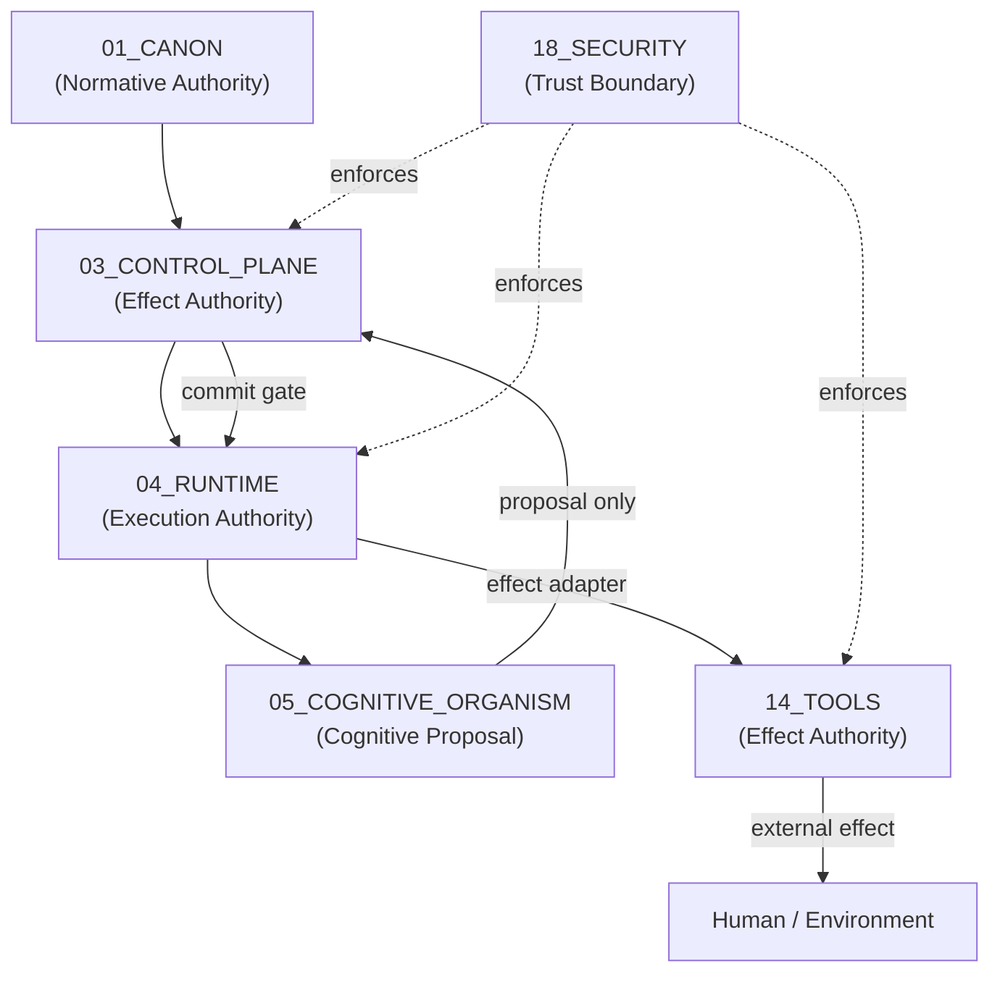

# L30 Authority Boundary — Plane Governance Specification

> **Origin Architect / Steward:** Trang Phan
> **AMOS_CORE Target:** `v4.4`
> **Conclusion Class:** `AMOS_MODEL`
> **Status:** `PROPOSED_SPECIFICATION` · **Canonical Status:** `CONDITIONAL`

---

## 1. Architectural Scope

`L30_AUTHORITY_BOUNDARY` defines the typed contracts, invariants, and operational procedures that govern **authority boundaries** across all AMOS Full OS MECE planes. An authority boundary is the enforceable perimeter that separates what a plane, agent, or subsystem is *permitted* to decide, commit, or effect from what it is *capable* of doing. The law operationalizes the constitutional separation `CAPABILITY != AUTHORITY` into per-plane, per-actor, per-effect typed boundary contracts.

This law specializes `L7_AUTHORITY` (the general authority law) for the plane-governance dimension: it binds authority to physical/operational namespaces (`01_CANON` … `25_COGNITIVE_MATRIX`) and to the six MECE responsibility domains (A–F) defined in `FULL_BRAIN_OS_MECE_ARCHITECTURE`.

---

## 2. Governing Invariants

- **AB-1 Capability–Authority Separation:** No plane, agent, skill, workflow, or tool acquires authority merely by possessing the capability to perform an operation. Authority must be explicitly granted through a governed contract.
- **AB-2 Plane-Scoped Authority:** Authority granted to a plane is valid only within that plane's MECE responsibility domain. Cross-plane authority requires an explicit delegation contract with attenuation.
- **AB-3 Commit-Time Revalidation:** Authority validated at planning time must be revalidated at commit time. Stale authority tokens, expired leases, or revoked delegations cause fail-closed rejection.
- **AB-4 No Self-Elevation:** A plane, agent, or subsystem cannot grant itself authority it does not already possess. Self-declared authority is `INVALID` until independently witnessed.
- **AB-5 Boundary Integrity Receipts:** Every authority boundary crossing (delegation, escalation, attenuation, revocation) emits an immutable receipt to `17_OBSERVABILITY` with actor, target, scope, epoch, and witness fields.
- **AB-6 Axiom Adherence:** Authority boundary governance is strictly bound by M01–M20 core laws and the `LAW_HIERARCHY` precedence order.

---

## 3. Authority Boundary Topology



Each arrow represents a typed authority boundary crossing. No arrow silently upgrades epistemic class or authority.

---

## 4. Typed Authority Boundaries per MECE Domain

| MECE Domain | Planes | Authority Class | Boundary Constraint |
|-------------|--------|-----------------|---------------------|
| A — Normative | `01_CANON`, `23_OPERATING_MODEL` | `DEFINITION_AUTHORITY` | Defines what rules exist; cannot execute effects |
| B — Execution Core | `02_KERNEL`, `03_CONTROL_PLANE`, `04_RUNTIME` | `COMMIT_AUTHORITY` | Admits durable effects; cannot redefine canon |
| C — Cognitive | `05`, `06`, `07`, `08`, `21`, `25` | `PROPOSAL_AUTHORITY` | Proposes actions; cannot self-commit |
| D — Information | `10`, `11`, `12`, `13`, `16` | `REPRESENTATION_AUTHORITY` | Persists typed state; cannot authorize effects |
| E — Interaction | `09`, `14`, `15`, `18` | `EFFECT_ADAPTER_AUTHORITY` | Performs admitted effects; cannot widen scope |
| F — Assurance | `17`, `19`, `20`, `22`, `24` | `EVIDENCE_AUTHORITY` | Produces evidence; cannot promote to canon |

Possession of one authority class does not imply any other.

---

## 5. Authority Boundary Lifecycle

```text
DEFINE boundary contract
→ GRANT authority token (scoped, temporal, attenuated)
→ VALIDATE at planning time
→ REVALIDATE at commit time
→ EXECUTE within boundary
→ EMIT receipt
→ EXPIRE / REVOKE / RENEW
```

1. **Define:** The authority boundary contract specifies scope, regime, temporal window, delegation parent, attenuation chain, and revocation conditions.
2. **Grant:** An authority token (capability-bound, epoch-stamped, signed) is issued to the actor.
3. **Validate:** At planning time, the token is checked for validity, scope match, and freshness.
4. **Revalidate:** At commit time, the token is rechecked. Fencing epochs prevent stale workers from committing.
5. **Execute:** The action is performed within the boundary. Any attempt to exceed the boundary triggers fail-closed rejection.
6. **Emit Receipt:** An immutable receipt records the boundary crossing, actor identity, authority token hash, and witness signature.
7. **Expire / Revoke / Renew:** Tokens have temporal limits. Revocation is immediate and propagates to all delegated children.

---

## 6. Delegation & Attenuation Contract

```yaml
authority_delegation:
  delegation_id: <uuid>
  parent_authority: <authority_token_id>
  child_scope:
    plane: <plane_id>
    domain: <MECE_domain>
    operation: <operation_class>
  attenuation:
    max_consequence: 0.35
    max_irreversibility: 0.20
    max_depth: 2
    prohibited_operations: [<op_class>, ...]
  temporal:
    effective_from: <epoch>
    expires_at: <epoch>
  witness:
    witness_id: <independent_validator>
    witness_signature: <sig>
  revocation:
    revocable: true
    revocation_authority: <authority>
    cascade: true  # revoking parent revokes all children
```

**Temporal Delegation Law:** `ChildScope(t) ⊆ ParentScope(t)`, `ChildLifetime ≤ ParentLifetime`, `¬ParentEligible(t) ⇒ ChildEligible(t+Δ) = FALSE`.

---

## 7. Safety Invariants & Firewalls

- `INV-AB-001` (**No Boundary Bypass:**): An authority boundary cannot be bypassed by reclassifying the operation, splitting it into sub-operations, or routing through a different plane.
- `INV-AB-002` (**Fencing Epoch:**): Stale workers whose lease has expired may not commit, even if their authority token is otherwise valid. The fencing epoch monotonically increases.
- `INV-AB-003` (**Witness Independence**): The authority witness must be independent of the actor requesting the boundary crossing. Self-witnessed authority is `INVALID`.
- `INV-AB-004` (**Cascade Revocation**): Revoking a parent authority token immediately invalidates all child delegations. No orphaned authority persists.
- `INV-AB-005` (**Human Escalation**): Authority boundary violations that affect M0–M2 mutations or irreversible effects escalate to the origin steward or designated human authority.

---

## 8. MECE Mapping to AMOS Full Brain OS

| Authority Boundary Step | AMOS Stage | Canonical Binding |
|-------------------------|------------|-------------------|
| Boundary definition | Admit | `01_CANON/01_CORE_LAWS` |
| Token grant | Route | `03_CONTROL_PLANE/04_AUTHORITY` |
| Planning-time validation | Plan | `L7_AUTHORITY` |
| Commit-time revalidation | Schedule / Commit | `04_RUNTIME/ACTION_COMMIT` |
| Execution within boundary | Execute | `14_TOOLS` effect adapter |
| Receipt emission | Observe / Audit | `17_OBSERVABILITY` |
| Revocation / renewal | Repair / Adapt | `03_CONTROL_PLANE` |

---

## 9. Failure Modes & Degradation

| Failure Scenario | Trigger | Response |
|------------------|---------|----------|
| Stale authority token | Epoch mismatch | Fail closed; reject commit |
| Boundary violation attempt | Operation exceeds scope | Reject + audit + escalate |
| Witness unavailable | No independent validator | Default to `BLOCK` for consequential paths |
| Delegation chain broken | Parent revoked | Cascade-revoke all children |
| Authority token forgery | Signature mismatch | Reject + security alert to `18_SECURITY` |

---

## 10. Navigation & Bindings

- **Master MOC:** [[00_ROOT/00_ROOT_MOC|00_ROOT_MOC]]
- **Partition Architecture:** [[00_ROOT/FULL_BRAIN_OS_MECE_ARCHITECTURE|FULL_BRAIN_OS_MECE_ARCHITECTURE]]
- **Law Hierarchy:** [[01_CANON/01_CORE_LAWS/LAW_HIERARCHY|LAW_HIERARCHY]]
- **General Authority Law:** [[01_CANON/01_CORE_LAWS/L7_AUTHORITY|L7_AUTHORITY]]
- **Related Laws:** [[01_CANON/01_CORE_LAWS/L28_CRITICAL_GAP|L28_CRITICAL_GAP]] · [[01_CANON/01_CORE_LAWS/L29_DECISION_VALUE|L29_DECISION_VALUE]] · [[01_CANON/01_CORE_LAWS/L31_AMOS_PLANE|L31_AMOS_PLANE]]
- **Control Plane Authority:** [[03_CONTROL_PLANE/04_AUTHORITY/AUTHORITY_REGISTRY|04_AUTHORITY]]
- **Security Boundary:** [[18_SECURITY/18_SECURITY_MOC|18_SECURITY_MOC]]

---

## 11. Known Gaps & Falsifiers

- `GAP-AB-001`: The boundary topology assumes a static MECE partition; dynamic plane creation or reassignment is not yet governed by this law.
- `GAP-AB-002`: Witness independence is specified but not yet enforced by a runtime mechanism in all planes.
- `GAP-AB-003`: Cascade revocation assumes synchronous propagation; in partitioned or asynchronous regimes, orphaned authority may briefly persist.
- `GAP-AB-004`: `L30` is a `PROPOSED_SPECIFICATION` with `CONDITIONAL` canonical status; it does not by itself establish final AMOS canon or override `L7_AUTHORITY`.

**Falsifiers:**

- F1: A plane executes an effect outside its MECE domain without an explicit delegation contract.
- F2: A stale authority token is accepted at commit time after lease expiry.
- F3: A self-witnessed authority boundary crossing is admitted without independent validation.
- F4: Cascade revocation fails to propagate to a child delegation, leaving orphaned authority.

**Parent:** [[01_CANON/01_CORE_LAWS/01_CORE_LAWS_MOC|01_CORE_LAWS_MOC]] · [[00_ROOT/00_HOME|00_HOME]]
