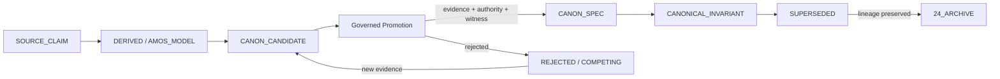

# L32 Canon — Plane Governance Specification

> **Origin Architect / Steward:** Trang Phan  
> **AMOS_CORE Target:** `v4.4`  
> **Conclusion Class:** `AMOS_MODEL`  
> **Status:** `PROPOSED_SPECIFICATION` · **Canonical Status:** `CONDITIONAL`

---

## 1. Architectural Scope

`L32_CANON` defines the typed contracts, invariants, and operational procedures that govern **canon admission, promotion, supersession, and validity** within the AMOS Full OS. *Canon* is the set of governing laws, definitions, invariants, and lineage records that define what must hold across all AMOS planes. Canon is the highest authority class in the normative domain (MECE domain A) and is owned by `01_CANON` and `23_OPERATING_MODEL`.

This law specifies the lifecycle of canonical artifacts: how a `SOURCE_CLAIM` or `AMOS_MODEL` is promoted to `CANON_SPEC` or `CANONICAL_INVARIANT`, what evidence and authority are required, how supersession works, and how canon conflicts with implementation or observation are resolved.

**Constitutional boundary:**

```text
CANON = WHAT MUST HOLD
KERNEL = DETERMINISTIC MACHINERY THAT MAY ENFORCE WHAT MUST HOLD
CANON != KERNEL
IMPLEMENTATION != LAW
RUNTIME != CANON
MODEL != AUTHORITY
```

---

## 2. Governing Invariants

- **CN-1 Canon Supremacy:** Canon laws constrain all lower-order artifacts (policy, contract, implementation, execution, observation). No lower-order artifact may silently override canon.
- **CN-2 Governed Promotion:** Canon promotion requires source identity, provenance, revision, freshness, scope/regime, evidence class, contradiction checks, and applicable version/CAS preconditions. Self-promotion is `INVALID`.
- **CN-3 Supersession Preserves History:** Supersession does not erase history. `SUPERSEDED != DELETED`. Required lineage remains recoverable.
- **CN-4 Canon–Kernel Separation:** Canon defines what must hold; the kernel enforces it. Kernel behavior does not automatically become canon merely because it is implemented.
- **CN-5 Non-Overrideable Core:** Certain constitutional constraints (`UNKNOWN/GAP != PASS`, `NO FABRICATED EVIDENCE`, `CAPABILITY != AUTHORITY`, `PROVENANCE MUST NOT BE FABRICATED`) are candidates for `NON_OVERRIDEABLE` status. Final non-overrideable status is bound through canon governance.
- **CN-6 Axiom Adherence:** Canon governance is strictly bound by M01–M20 core laws and the `LAW_HIERARCHY` precedence order.

---

## 3. Canon Artifact Lifecycle



1. **Source Claim:** A raw claim enters the corpus with `SOURCE_CLAIM` epistemic class. It is provisional and cannot be used as canon.
2. **Derived / Model:** The claim is reasoned about, producing a `DERIVED` or `AMOS_MODEL` artifact. Still not canon.
3. **Canon Candidate:** The artifact is nominated for canon promotion. It must pass contradiction checks, evidence review, and scope/regime validation.
4. **Governed Promotion:** An independent authority witness reviews the candidate. If evidence, provenance, and authority are sufficient, the artifact is promoted.
5. **Canon Spec / Canonical Invariant:** The promoted artifact becomes `CANON_SPEC` or `CANONICAL_INVARIANT`. It now constrains all lower-order artifacts.
6. **Supersession:** A newer artifact may supersede the canon artifact through explicit supersession. The old artifact is archived, not deleted.
7. **Rejection / Competing:** If promotion fails, the artifact remains `REJECTED` or `COMPETING`. New evidence may re-nominate it.

---

## 4. Canon Promotion Contract

```yaml
canon_promotion:
  promotion_id: <uuid>
  candidate_artifact:
    artifact_id: <id>
    semantic_id: <id>
    version: <version>
    current_epistemic_class: <SOURCE_CLAIM|DERIVED|AMOS_MODEL>
    target_epistemic_class: <CANON_SPEC|CANONICAL_INVARIANT>
  evidence:
    source_identity: <provenance>
    revision: <version>
    freshness: <timestamp>
    scope: <applicability_envelope>
    regime: <regime_id>
    evidence_class: <class>
    contradiction_check: <pass|fail|competing>
    cas_preconditions: <met|unmet>
  authority:
    promoter: <actor_id>
    promoter_authority: <DEFINITION_AUTHORITY|PROMOTION_AUTHORITY>
    witness: <independent_validator_id>
    witness_signature: <sig>
  supersession:
    predecessor: <artifact_id or null>
    backward_compatible: <bool>
    breaking_change: <bool>
    migration_requirements: [<req>, ...]
  effective_at: <epoch>
  provenance: <chain>
```

---

## 5. Canon Authority Stack

```text
L0  CORE INTEGRITY LAW          → INTEGRITY > COMPLETENESS > FLUENCY > SPEED
L1  CONSTITUTIONAL / ROOT LAWS  → CANON != KERNEL, CAPABILITY != AUTHORITY, ...
L2  CANONICAL INVARIANTS        → SOURCE_CLAIM != VERIFIED, UNKNOWN/GAP != PASS, ...
L3  GOVERNANCE / AUTHORITY      → WHO MAY DECIDE, APPROVE, COMMIT, OVERRIDE
L4  SYSTEM & PLANE CONTRACTS    → KERNEL CONTRACT, CONTROL PLANE CONTRACT, ...
L5  DOMAIN / REGIME RULES       → LEGAL, FINANCE, RESEARCH, CODING, ...
L6  COMPONENT CONTRACTS         → AGENTS, SKILLS, TOOLS, MODELS, ...
L7  WORKFLOW / EXECUTION        → STEP → GATE → TRANSITION
L8  LOCAL CONFIGURATION         → TIMEOUTS, RETRY, ROUTING
L9  RUNTIME DECISIONS           → PROPOSALS, HYPOTHESES, CANDIDATES
```

Lower levels operate inside the envelope established by higher levels. They do not automatically possess authority to rewrite them.

---

## 6. Canon Conflict Resolution Protocol

For candidate canon rules `A` and `B`:

```text
1. ARE BOTH VALID?           → provenance + authority check
2. ARE BOTH APPLICABLE?      → scope + regime match
3. DO THEY ACTUALLY CONFLICT? → incompatible outcomes in same scope/regime/time
4. WHAT AUTHORITY CLASS?     → CANONICAL_INVARIANT > CANON_SPEC > DERIVED
5. WHAT SCOPE?               → narrower scope may specialize
6. WHAT REGIME?              → different regimes may coexist
7. IS ONE SUPERSEDED?        → explicit supersession chain
8. EXPLICIT OVERRIDE?        → typed override contract
```

If precedence cannot be validly established: `STATE = COMPETING` or `STATE = UNKNOWN/GAP`.

Never resolve a canon conflict through fluent guesswork.

---

## 7. Canon–Implementation Boundary

```text
DOCUMENTED != IMPLEMENTED
MODEL != DEPLOYED_RUNTIME
TEST_SPECIFIED != TEST_EXECUTED
CAPABILITY != AUTHORITY
PROPOSAL != COMMIT
```

- Documentation of a canon law does not prove that the runtime implements it.
- A model that satisfies canon constraints does not become canon itself.
- A test specification does not prove that the test was executed or passed.
- A capability to enforce canon does not grant authority to redefine canon.

---

## 8. Safety Invariants & Firewalls

- `INV-CN-001` (**No Silent Canon Creation**): Canon cannot be created by repetition, volume, or file placement. One canonical source → 100 copies ≠ 100 authorities.
- `INV-CN-002` (**Provenance Integrity**): Canon provenance must be traceable to origin, authority, revision, and validation state. Fabricated provenance is `INVALID`.
- `INV-CN-003` (**Canon Cannot Be Bypassed by Implementation**): If implementation behavior contradicts canon, the implementation is non-conformant, not the canon invalid.
- `INV-CN-004` (**Archive Cannot Become Canon**): Superseded or archived canon artifacts cannot silently become active canon without governed re-promotion.
- `INV-CN-005` (**Human Authority**): Canon promotion affecting constitutional laws or non-overrideable constraints escalates to the origin steward or designated human authority.

---

## 9. MECE Mapping to AMOS Full Brain OS

| Canon Step | AMOS Stage | Canonical Binding |
|------------|------------|-------------------|
| Source claim | Observe / Research | `22_RESEARCH` |
| Derived / model | Reason | `05_COGNITIVE_ORGANISM`, `13_MODELS` |
| Canon candidate | Admit | `01_CANON/01_CORE_LAWS` |
| Governed promotion | Plan / Validate | `19_TESTS`, `L17_RSCF` |
| Canon spec / invariant | Commit | `01_CANON` (domain A) |
| Supersession | Repair / Adapt | `24_ARCHIVE` |
| Conflict resolution | Audit | `17_OBSERVABILITY`, `LAW_HIERARCHY` |

---

## 10. Failure Modes & Degradation

| Failure Scenario | Trigger | Response |
|------------------|---------|----------|
| Self-promotion attempt | Actor promotes own artifact without witness | Reject + audit |
| Provenance fabrication | Falsified provenance chain | Reject + security alert |
| Canon–implementation conflict | Runtime contradicts canon | Flag implementation as non-conformant |
| Canon conflict unresolved | Two applicable canon rules conflict | `STATE = COMPETING`; escalate to governance |
| Archive reactivation | Archived artifact used as active canon | Block + require governed re-promotion |

---

## 11. Navigation & Bindings

- **Master MOC:** [[00_ROOT/00_ROOT_MOC|00_ROOT_MOC]]
- **Partition Architecture:** [[00_ROOT/FULL_BRAIN_OS_MECE_ARCHITECTURE|FULL_BRAIN_OS_MECE_ARCHITECTURE]]
- **Law Hierarchy:** [[01_CANON/01_CORE_LAWS/LAW_HIERARCHY|LAW_HIERARCHY]]
- **RSCF Law:** [[01_CANON/01_CORE_LAWS/L17_RSCF|L17_RSCF]]
- **Related Laws:** [[01_CANON/01_CORE_LAWS/L30_AUTHORITY_BOUNDARY|L30_AUTHORITY_BOUNDARY]] · [[01_CANON/01_CORE_LAWS/L31_AMOS_PLANE|L31_AMOS_PLANE]] · [[01_CANON/01_CORE_LAWS/L33_KERNEL|L33_KERNEL]]
- **Canon MOC:** [[01_CANON/01_CANON_MOC|01_CANON_MOC]]
- **Invariant Registry:** [[01_CANON/01_CORE_LAWS/INVARIANT_REGISTRY|INVARIANT_REGISTRY]]

---

## 12. Known Gaps & Falsifiers

- `GAP-CN-001`: Canon promotion criteria are specified but not yet enforced by an automated governor across all artifacts.
- `GAP-CN-002`: The independent-witness requirement assumes a supply of trustworthy validators; in low-trust regimes, promotion defaults to `BLOCK`.
- `GAP-CN-003`: Non-overrideable status for constitutional constraints is proposed but not yet finalized through canon governance.
- `GAP-CN-004`: `L32` is a `PROPOSED_SPECIFICATION` with `CONDITIONAL` canonical status; it does not by itself establish final AMOS canon.

**Falsifiers:**

- F1: A canon artifact is promoted without independent witness validation.
- F2: An implementation behavior silently overrides a canon law without governed exception.
- F3: An archived canon artifact becomes active authority without re-promotion.
- F4: Canon provenance is found to be fabricated or unverifiable.

**Parent:** [[01_CANON/01_CORE_LAWS/01_CORE_LAWS_MOC|01_CORE_LAWS_MOC]] · [[00_ROOT/00_HOME|00_HOME]]
