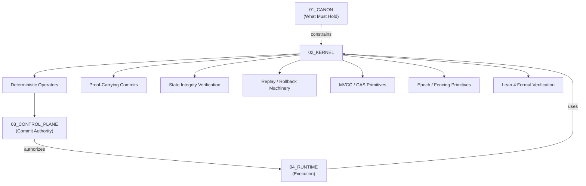

# L33 Kernel — Plane Governance Specification

> **Origin Architect / Steward:** Trang Phan
> **AMOS_CORE Target:** `v4.4`
> **Conclusion Class:** `AMOS_MODEL`
> **Status:** `PROPOSED_SPECIFICATION` · **Canonical Status:** `CONDITIONAL`

---

## 1. Architectural Scope

`L33_KERNEL` defines the typed contracts, invariants, and operational procedures that govern the **AMOS deterministic kernel** — the set of deterministic reasoning/state-integrity primitives that enforce canon-compliant computation. The kernel is the machinery that *may enforce* what canon *requires*. It resides in MECE domain B (Execution Core & Effect Governance) alongside `03_CONTROL_PLANE` and `04_RUNTIME`.

**Constitutional boundary:**

```text
CANON = WHAT MUST HOLD
KERNEL = DETERMINISTIC MACHINERY THAT MAY ENFORCE WHAT MUST HOLD
CANON != KERNEL
KERNEL != CONTROL_PLANE
KERNEL != RUNTIME
```

The kernel provides deterministic operators, proof-carrying primitives, state-integrity verification, and replay/rollback machinery. It does not possess commit authority, policy authority, or canon-definition authority. It enforces; it does not govern.

---

## 2. Governing Invariants

- **KR-1 Determinism:** All kernel operations are deterministic, repeatable, and traceable. Given the same inputs, the kernel produces the same outputs with the same resource consumption.
- **KR-2 Canon Enforcement, Not Definition:** The kernel enforces canon-compliant computation. It cannot redefine, override, or silently weaken canon laws.
- **KR-3 No Commit Authority:** The kernel does not possess commit authority. Commits are authorized by the control plane (`03_CONTROL_PLANE`), not by the kernel.
- **KR-4 Proof-Carrying Primitives:** Kernel operations emit proof-carrying commits — each result carries its evidence, provenance, and validation trace.
- **KR-5 Replayability:** All kernel state transitions are replayable from the causal write-ahead log. Replay produces identical results.
- **KR-6 Axiom Adherence:** Kernel governance is strictly bound by M01–M20 core laws and the `LAW_HIERARCHY` precedence order.

---

## 3. Kernel Component Architecture



The kernel sits between canon (what must hold) and the control plane (who may commit). It provides the deterministic substrate that both rely on.

---

## 4. Kernel Operator Classes

| Operator Class | Function | Authority |
|---------------|----------|-----------|
| **Deterministic Reasoning** | Apply formal logic, type checking, invariant verification | Enforcement only; no commit |
| **State Integrity** | Verify state hashes, CAS preconditions, epoch validity | Enforcement only; no commit |
| **Proof Carrying** | Attach evidence, provenance, and validation trace to results | Evidence production; no commit |
| **Replay / Rollback** | Re-apply or reverse committed transactions from WAL | Recovery; authorized by control plane |
| **MVCC / CAS** | Multi-version concurrency control, compare-and-swap | Isolation; no commit authority |
| **Epoch / Fencing** | Monotonic epoch counters, fencing tokens | Staleness prevention; no commit |
| **Formal Verification** | Lean 4 proof kernel lemmas | Proof evidence; no commit |

**Key invariant:** No kernel operator class grants commit authority. The kernel enforces; the control plane commits.

---

## 5. Kernel–Control Plane Relationship

```text
KERNEL = DETERMINISTIC OPERATORS / INVARIANTS
CONTROL_PLANE = AUTHORITY / POLICY / COMMIT GOVERNANCE
KERNEL != CONTROL_PLANE
```

The kernel provides the deterministic substrate. The control plane decides who, when, and under what policy commits occur. The kernel may reject non-canonical inputs (fail-closed), but it cannot authorize commits.

**Workflow:**

```text
1. RUNTIME proposes action
2. KERNEL verifies deterministic preconditions (state, CAS, epoch, invariant)
3. CONTROL PLANE verifies authority, policy, freshness, conflict
4. If both pass → COMMIT
5. If kernel fails → FAIL_CLOSED (reject)
6. If control plane fails → REJECT / ESCALATE
7. COMMIT → KERNEL emits proof-carrying receipt + WAL entry
```

---

## 6. Kernel–Runtime Relationship

```text
KERNEL = DETERMINISTIC MACHINERY
RUNTIME = BOUNDED EXECUTION HARNESS
KERNEL != RUNTIME
```

The runtime uses the kernel's deterministic operators to execute bounded tasks. The runtime manages execution lifecycle, replay, and recovery. The kernel provides the integrity primitives that the runtime relies on.

---

## 7. Proof-Carrying Commit Format

```yaml
proof_carrying_commit:
  commit_id: <uuid>
  epoch: <monotonic_counter>
  actor_id: <id>
  authority_token: <token_hash>
  operation:
    op_class: <class>
    inputs: <typed_tensor_refs>
    outputs: <typed_tensor_refs>
  deterministic_proof:
    operator: <op_id>
    input_hash: <hash>
    output_hash: <hash>
    resource_consumed: <metrics>
  state_integrity:
    pre_state_hash: <hash>
    post_state_hash: <hash>
    cas_precondition: <met|unmet>
    epoch_valid: <bool>
  canon_compliance:
    invariants_checked: [<inv_id>, ...]
    invariants_passed: [<inv_id>, ...]
    invariants_failed: [<inv_id>, ...]
  provenance:
    source_chain: [<artifact_id>, ...]
    witness: <id>
    witness_signature: <sig>
  rollback_address: <wal_offset>
  receipt_hash: <blake3>
```

---

## 8. Formal Verification (Lean 4)

The kernel's formal verification layer uses Lean 4 to prove kernel lemmas:

- **Determinism lemma:** For all inputs `x`, `kernel_op(x)` produces a unique output `y` with unique resource consumption `r`.
- **Replay lemma:** For any committed transaction `T`, `replay(T)` produces identical state transitions.
- **Invariant preservation lemma:** For any kernel operation `op` and state `s` satisfying invariant `I`, `op(s)` satisfies `I`.
- **Rollback lemma:** For any committed transaction `T`, `rollback(T) ∘ apply(T) = identity`.

**Status:** These are formal specifications. `DOCUMENTED != IMPLEMENTED`. The Lean 4 proof ledger is at `02_KERNEL/LEAN4_PROOF_VERIFICATION_LEDGER.md`.

---

## 9. Safety Invariants & Firewalls

- `INV-KR-001` (**No Silent Non-Determinism**): Any non-deterministic operation (random sampling, external API calls, time-dependent behavior) must be explicitly typed as `NON_DETERMINISTIC` and cannot enter kernel deterministic operators.
- `INV-KR-002` (**Fail-Closed on Invariant Violation**): If a kernel invariant check fails, the operation is rejected. No degraded-confidence execution.
- `INV-KR-003` (**No Kernel Self-Commit**): The kernel cannot commit its own outputs. Commit requires control-plane authorization.
- `INV-KR-004` (**Replay Integrity**): Replay from the WAL must produce identical results. If replay diverges, the system enters `RECONCILE` mode and flags a critical gap.
- `INV-KR-005` (**Epoch Monotonicity**): Fencing epochs are monotonically increasing. A stale epoch cannot commit after a newer epoch has been issued.

---

## 10. MECE Mapping to AMOS Full Brain OS

| Kernel Step | AMOS Stage | Canonical Binding |
|-------------|------------|-------------------|
| Deterministic precondition check | Plan / Schedule | `02_KERNEL` |
| State integrity verification | Schedule | `L23_MVCC_CAS`, `L24_CAUSAL_EPOCH` |
| Proof-carrying commit | Commit | `L19_PROOF_CAPSULE` |
| Replay / rollback | Repair / Recover | `L22_REPLAYABILITY`, `L10_FAILURE_RECOVERY` |
| Formal verification | Validate | `19_TESTS`, Lean 4 ledger |
| Canon compliance check | Audit | `LAW_HIERARCHY`, `INVARIANT_REGISTRY` |

---

## 11. Failure Modes & Degradation

| Failure Scenario | Trigger | Response |
|------------------|---------|----------|
| Non-deterministic input | Untracked randomness enters kernel | Reject + flag `NON_DETERMINISTIC` |
| Invariant violation | State fails invariant check | Fail closed; reject + audit |
| Replay divergence | Replay produces different result | Enter `RECONCILE` mode; critical gap |
| Stale epoch commit | Fencing token expired | Reject; require re-authorization |
| Kernel self-commit attempt | Kernel tries to commit without control plane | Reject + security alert |
| Proof verification failure | Proof-carrying commit fails validation | Reject; flag provenance gap |

---

## 12. Navigation & Bindings

- **Master MOC:** [[00_ROOT/00_ROOT_MOC|00_ROOT_MOC]]
- **Partition Architecture:** [[00_ROOT/FULL_BRAIN_OS_MECE_ARCHITECTURE|FULL_BRAIN_OS_MECE_ARCHITECTURE]]
- **Law Hierarchy:** [[01_CANON/01_CORE_LAWS/LAW_HIERARCHY|LAW_HIERARCHY]]
- **Kernel MOC:** [[02_KERNEL/02_KERNEL_MOC|02_KERNEL_MOC]]
- **Related Laws:** [[01_CANON/01_CORE_LAWS/L23_MVCC_CAS|L23_MVCC_CAS]] · [[01_CANON/01_CORE_LAWS/L24_CAUSAL_EPOCH|L24_CAUSAL_EPOCH]] · [[01_CANON/01_CORE_LAWS/L19_PROOF_CAPSULE|L19_PROOF_CAPSULE]] · [[01_CANON/01_CORE_LAWS/L22_REPLAYABILITY|L22_REPLAYABILITY]]
- **Control Plane:** [[03_CONTROL_PLANE/03_CONTROL_PLANE_MOC|03_CONTROL_PLANE_MOC]]
- **Lean 4 Ledger:** [[02_KERNEL/LEAN4_PROOF_VERIFICATION_LEDGER|LEAN4_PROOF_VERIFICATION_LEDGER]]

---

## 13. Known Gaps & Falsifiers

- `GAP-KR-001`: The kernel's formal verification lemmas are specified but not yet fully proven in Lean 4 for all operator classes.
- `GAP-KR-002`: Replay integrity assumes a complete, uncorrupted WAL; partial WAL corruption is not yet handled by this law.
- `GAP-KR-003`: The boundary between kernel deterministic operations and runtime non-deterministic operations is specified but not yet enforced by a runtime type system.
- `GAP-KR-004`: `L33` is a `PROPOSED_SPECIFICATION` with `CONDITIONAL` canonical status; it does not by itself establish final AMOS canon or prove kernel implementation.

**Falsifiers:**

- F1: A kernel operation produces non-deterministic results for identical inputs.
- F2: The kernel commits an effect without control-plane authorization.
- F3: Replay from the WAL produces divergent results for a committed transaction.
- F4: A kernel invariant violation is silently ignored rather than fail-closed.
- F5: The kernel redefines or overrides a canon law.

**Parent:** [[01_CANON/01_CORE_LAWS/01_CORE_LAWS_MOC|01_CORE_LAWS_MOC]] · [[00_ROOT/00_HOME|00_HOME]]
