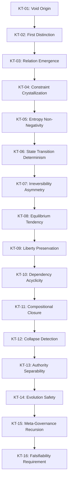
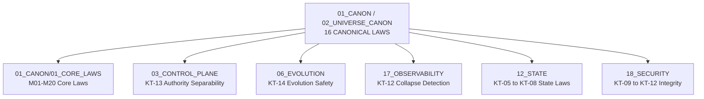

# Khung Trang 16 Canonical Laws — Framework Law Set

> **Origin Architect / Steward:** Trang Phan  
> **AMOS_CORE Target:** `v4.4`  
> **Conclusion Class:** `AMOS_MODEL`  
> **Status:** `PROPOSED_SPECIFICATION`  
> **Canonical Status:** `CONDITIONAL`

> **Epistemic Boundary:** The 16 canonical laws are `AMOS_MODEL` / `SOURCE_GROUNDED` propositions derived from the Khung Trang framework's pre-symbolic ontological spine. They are not empirical physical laws. Each law carries a falsifier — a condition under which the law would be invalidated or require revision.

---

## 1. Architectural Scope

`KHUNG_TRANG_16_CANONICAL_LAWS` defines the 16 canonical laws that govern emergence, entropy, state transitions, and structural collapse prevention within the Khung Trang framework. Each law has:

- **Law ID:** KT-01 through KT-16
- **Statement:** A formal or semi-formal proposition
- **Invariant:** The operational invariant derived from the law
- **Falsifier:** A condition under which the law would be invalidated

The laws are organized into four groups:

| Group | Laws | Domain |
|:--|:--|:--|
| **Emergence** | KT-01 to KT-04 | How structure arises from the void |
| **Entropy & State** | KT-05 to KT-08 | State transitions and thermodynamic constraints |
| **Structural Integrity** | KT-09 to KT-12 | Collapse prevention and stability |
| **Governance & Evolution** | KT-13 to KT-16 | Authority, evolution, and meta-governance |

### Law Dependency Graph

---

## 2. Governing Invariants

- **INV-L1 (Law Priority):** Laws KT-01 through KT-16 form a strict priority ordering. A lower-numbered law cannot be violated to satisfy a higher-numbered law.
- **INV-L2 (Non-Compensatory):** No law may be compensated by satisfaction of another law. Each law is independently enforced.
- **INV-L3 (Falsifiability):** Every law carries a falsifier. A law without a falsifier is not canonical.
- **INV-L4 (Law Application Scope):** Laws apply within the AMOS operating system boundary. External systems are not governed by these laws unless explicitly bound.

---

## 3. Mathematical / Formal Definition

### Group I: Emergence (KT-01 to KT-04)

**KT-01: Void Origin**

$$S_0 = \emptyset$$

The initial state of any cognitive system is the empty set. No structure, no distinction, no meaning pre-exists the first operation.

- **Invariant:** $\forall \text{system } \sigma: \sigma_0 = \emptyset$
- **Falsifier:** If a cognitive system requires non-empty initial structure to function, the void origin claim is invalid.

**KT-02: First Distinction**

$$D_1 = \{x, \neg x\} \mid x \in S_0 \cup \{S_0\}$$

The first operation is a distinction — splitting the void into something and not-something. This is the P→D transition.

- **Invariant:** The first operation is always a distinction, not a function or meaning.
- **Falsifier:** If cognitive systems can begin with function or meaning without prior distinction, the ordering is invalid.

**KT-03: Relation Emergence**

$$\forall d_i, d_j \in D: \exists r_{ij} \in R \mid r_{ij} = \text{rel}(d_i, d_j)$$

Distinctions necessarily produce relationships. No two distinctions exist in isolation.

- **Invariant:** $|R| \geq \binom{|D|}{2}$ for $|D| \geq 2$.
- **Falsifier:** If distinctions can exist without any relational structure, the law is invalid.

**KT-04: Constraint Crystallization**

$$C = \{c_k \mid c_k \text{ bounds admissible } r_{ij}\}$$

Relationships necessarily produce constraints. The constraint set bounds which relationships are admissible.

- **Invariant:** $|C| \geq 1$ for $|R| \geq 1$.
- **Falsifier:** If relationships can exist without generating any constraints, the law is invalid.

### Group II: Entropy & State (KT-05 to KT-08)

**KT-05: Entropy Non-Negativity**

$$\frac{dS}{dt} = \frac{d_i S}{dt} + \frac{d_e S}{dt}, \quad \frac{d_i S}{dt} \geq 0$$

Internal entropy production is non-negative. The total entropy change may decrease via external entropy export ($d_e S / dt < 0$), but internal production is always non-negative.

- **Invariant:** $d_i S / dt \geq 0$ always.
- **Falsifier:** If a cognitive process produces negative internal entropy (spontaneous order creation without energy input), the second law analog is invalid.

**KT-06: State Transition Determinism**

$$S_{t+1} = C(F(S_t, U_t))$$

The next state is a deterministic function of the current state, input, constraint filter, and function composition. Given the same $S_t$, $U_t$, $F$, and $C$, the output $S_{t+1}$ is unique.

- **Invariant:** $S_{t+1}$ is uniquely determined by $(S_t, U_t, F, C)$.
- **Falsifier:** If state transitions are fundamentally non-deterministic (not just apparently random), the determinism law must be relaxed to probabilistic transitions.

**KT-07: Irreversibility Asymmetry**

$$\text{If } S_t \xrightarrow{F} S_{t+1}, \text{ then } S_{t+1} \xrightarrow{F^{-1}} S_t \text{ is not guaranteed}$$

State transitions are not generally reversible. The rollback capability is an engineered feature, not a natural property.

- **Invariant:** Rollback requires explicit engineered reversal deltas, not natural reversibility.
- **Falsifier:** If all cognitive state transitions are naturally reversible, the asymmetry law is unnecessary.

**KT-08: Equilibrium Tendency**

$$\lim_{t \to \infty} S_t \to S_{\text{eq}} \mid \frac{d_i S}{dt}\bigg|_{S_{\text{eq}}} = 0$$

Without external input, the system tends toward equilibrium where internal entropy production is zero.

- **Invariant:** A system with no external input converges to equilibrium.
- **Falsifier:** If a cognitive system maintains non-zero internal entropy production indefinitely without external input, the equilibrium tendency is invalid.

### Group III: Structural Integrity (KT-09 to KT-12)

**KT-09: Liberty Preservation**

$$\forall G \in \mathcal{G}: \text{Alive}(G) \iff |\text{Liberties}(G)| \geq 1$$

A cognitive structure (group) remains alive only if it retains at least one liberty. Zero-liberty structures are captured and removed.

- **Invariant:** No structure may persist with zero liberties.
- **Falsifier:** If cognitive structures can persist without any degrees of freedom, the liberty model is invalid.

**KT-10: Dependency Acyclicity**

$$\mathcal{C}_D(c_{ij}) \text{ is a DAG}$$

The dependency cone of any cognitive cell must be acyclic. Cyclic dependencies indicate structural pathology.

- **Invariant:** Dependency graphs are DAGs. Cycles trigger collapse detection.
- **Falsifier:** If recursive cognitive processes require cyclic dependencies, the acyclicity law must be replaced with bounded-cycle detection.

**KT-11: Compositional Closure**

$$\mathcal{T} = T_\Omega \circ T_M \circ \cdots \circ T_O, \quad \text{all stages required}$$

The compositional engine is a closed pipeline. No stage may be skipped. Each stage's output is the next stage's input.

- **Invariant:** All compositional stages execute in order for every cycle.
- **Falsifier:** If cognitive composition can skip stages or execute them out of order, the closure law is invalid.

**KT-12: Collapse Detection**

$$\text{If } \exists \text{ cycle in } \mathcal{C}_D \text{ or } |\text{Liberties}(G)| = 0 \text{ for all } G: \text{emit COLLAPSE\_DETECTED}$$

Structural collapse is detectable and must be reported. The system cannot silently collapse.

- **Invariant:** Collapse events are always detected and reported.
- **Falsifier:** If there exist collapse modes that are undetectable, the detection law is incomplete.

### Group IV: Governance & Evolution (KT-13 to KT-16)

**KT-13: Authority Separability**

$$\text{Capability} \neq \text{Authority} \neq \text{Identity} \neq \text{Enforcement} \neq \text{Consequence}$$

Authority is separable from capability, identity, enforcement, and consequence. No single dimension implies any other.

- **Invariant:** Each dimension is independently verified.
- **Falsifier:** If authority is provably equivalent to any other dimension, the separability law is invalid for that pair.

**KT-14: Evolution Safety**

$$\Delta\Sigma \models \text{CoreInvariants}(\Sigma)$$

Evolution deltas must preserve core invariants. An evolution step that violates any KT-01 through KT-12 invariant is blocked.

- **Invariant:** Evolution is invariant-preserving.
- **Falsifier:** If beneficial evolution requires temporary invariant violation, the safety law must allow bounded, reversible violations.

**KT-15: Meta-Governance Recursion**

$$\forall \text{ governance rule } g: \exists \text{ meta-rule } g' \mid g' \text{ governs } g$$

Every governance rule is itself governed by a meta-rule. The recursion terminates at the root axiom set (KT-01 to KT-16).

- **Invariant:** No governance rule is self-certifying. All rules have a governing meta-rule.
- **Falsifier:** If a governance rule can be self-certifying without external validation, the recursion law is invalid.

**KT-16: Falsifiability Requirement**

$$\forall \text{ law } L \in \{KT\text{-}01, \ldots, KT\text{-}16\}: \exists \text{ falsifier } f(L)$$

Every canonical law must carry a falsifier. A law without a falsifier is not canonical.

- **Invariant:** All 16 laws have stated falsifiers.
- **Falsifier:** Meta-falsifier: if any law is found to be unfalsifiable, it is removed from the canonical set.

---

## 4. MECE Mapping

| AMOS Partition | Binding | Role |
|:--|:--|:--|
| `01_CORE_LAWS` | M01–M20 core laws | KT laws are the universe-canon extension of core laws |
| `03_CONTROL_PLANE` | Authority separability | KT-13 governs authority gate design |
| `06_EVOLUTION` | Evolution safety | KT-14 governs evolution invariant preservation |
| `17_OBSERVABILITY` | Collapse detection | KT-12 mandates collapse event reporting |
| `12_STATE` | State transition laws | KT-05 to KT-08 govern state dynamics |
| `18_SECURITY` | Structural integrity | KT-09 to KT-12 govern security boundaries |

---

## 5. Safety Invariants

- **S-1 (Law Non-Compensation):** No law may be traded off against another. Violation of any single law blocks the operation, regardless of other laws' satisfaction.
- **S-2 (Collapse Fail-Closed):** KT-12 collapse detection triggers immediate fail-closed. The system halts computation and enters safe mode.
- **S-3 (Evolution Gate):** KT-14 evolution safety is enforced by the evolution gate in `06_EVOLUTION`. No evolution delta is applied without invariant verification.
- **S-4 (Authority Independence):** KT-13 authority separability is enforced by the control plane. Authority checks are independent of capability checks.
- **S-5 (Falsifiability Audit):** KT-16 requires periodic audit of all laws' falsifiers. Laws with invalidated falsifiers are flagged for revision.

---

## 6. Navigation & Bindings

- **Master MOC:** [[00_ROOT/00_ROOT_MOC|00_ROOT_MOC]]
- **Partition Architecture:** [[00_ROOT/FULL_BRAIN_OS_MECE_ARCHITECTURE|FULL_BRAIN_OS_MECE_ARCHITECTURE]]
- **Universe Canon MOC:** [[01_CANON/02_UNIVERSE_CANON/02_UNIVERSE_CANON_MOC|02_UNIVERSE_CANON_MOC]]
- **Core Laws:** [[01_CANON/01_CORE_LAWS/AMOS_CORE_LAWS|AMOS_CORE_LAWS]]
- **Law Hierarchy:** [[01_CANON/01_CORE_LAWS/LAW_HIERARCHY|LAW_HIERARCHY]]
- **Framework Functions:** [[01_CANON/02_UNIVERSE_CANON/KHUNG_TRANG_F1_F26|KHUNG_TRANG_F1_F26]]
- **19×19 Grid:** [[01_CANON/02_UNIVERSE_CANON/KHUNG_TRANG_19X19|KHUNG_TRANG_19X19]]
- **Risk Tension Architecture:** [[01_CANON/02_UNIVERSE_CANON/URTA_RISK_TENSION_ARCHITECTURE|URTA_RISK_TENSION_ARCHITECTURE]]
- **TSS 7-Cycle:** [[01_CANON/02_UNIVERSE_CANON/TSS_7_CYCLE|TSS_7_CYCLE]]
- **Control Plane:** [[03_CONTROL_PLANE/03_CONTROL_PLANE_MOC|03_CONTROL_PLANE_MOC]]
- **Evolution:** [[06_AGENTS/06_AGENTS_MOC|06_AGENTS_MOC]]
- **Security:** [[18_SECURITY/18_SECURITY_MOC|18_SECURITY_MOC]]
- **State:** [[12_STATE/12_STATE_MOC|12_STATE_MOC]]
- **Observability:** [[17_OBSERVABILITY/17_OBSERVABILITY_MOC|17_OBSERVABILITY_MOC]]

---

## 7. Known Gaps & Falsifiers

| ID | Gap / Falsifier | Description |
|:--|:--|:--|
| GAP-1 | **16-Count Sufficiency** | The 16-law count is framework-derived. Falsifier: if a new domain requires laws not covered by KT-01 to KT-16, the set must expand. |
| GAP-2 | **Determinism vs. Quantum** | KT-06 assumes deterministic state transitions. Falsifier: if cognitive processes exhibit fundamental quantum indeterminacy, the law must be probabilistic. |
| GAP-3 | **Equilibrium Universality** | KT-08 assumes all systems tend to equilibrium. Falsifier: if some cognitive systems exhibit persistent non-equilibrium steady states, the law needs revision. |
| GAP-4 | **Meta-Governance Termination** | KT-15 assumes recursion terminates at the 16-law root. Falsifier: if meta-governance requires rules beyond the 16 laws, the termination claim is invalid. |
| GAP-5 | **Falsifiability Circularity** | KT-16's meta-falsifier (a law is removed if unfalsifiable) is itself a law that must be falsifiable. Falsifier: if this circularity cannot be resolved, KT-16 is self-referentially problematic. |

---

**Parent:** [[01_CANON/02_UNIVERSE_CANON/02_UNIVERSE_CANON_MOC|02_UNIVERSE_CANON_MOC]] · [[00_ROOT/00_HOME|00_HOME]]
