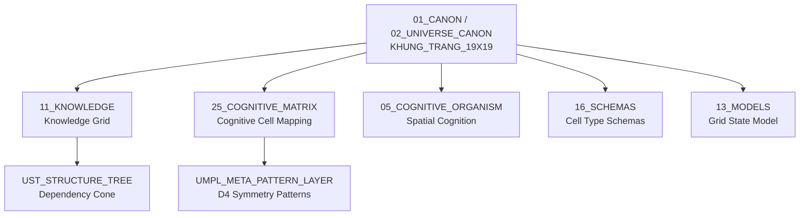

# Khung Trang 19×19 — Cognitive Grid Formalization

> **Origin Architect / Steward:** Trang Phan
> **AMOS_CORE Target:** `v4.4`
> **Conclusion Class:** `AMOS_MODEL`
> **Status:** `PROPOSED_SPECIFICATION`
> **Canonical Status:** `CONDITIONAL`

> **Epistemic Boundary:** This specification is `AMOS_MODEL` / `SOURCE_GROUNDED`. The 19×19 grid is a pre-symbolic ontological formalization, not an empirically proven neural topology. The Go board analogy provides structural constraints for cognitive cell composition; it does not claim biological isomorphism.

---

## 1. Architectural Scope

`KHUNG_TRANG_19X19` defines the 19×19 cognitive grid formalization that serves as the spatial substrate for the Khung Trang framework's compositional engine. Drawing on the structural analogy of the Go board — a 361-cell lattice with D4 dihedral symmetry — this specification defines how cognitive cells are placed, connected, given liberties, and composed into higher-order structures.

The grid is not a literal board but a **typed coordinate space** in which the P→D→R→C→F→M ontological spine is instantiated cell-by-cell. Each cell $(i,j)$ where $i,j \in \{1, \ldots, 19\}$ carries a typed payload that may represent a perception, distinction, relationship, constraint, function, or meaning token.

### Core Components

| Component | Symbol | Description |
|:--|:--|:--|
| **Grid Lattice** | $\mathcal{G}_{19}$ | 19×19 coordinate space, 361 cells |
| **Cognitive Cell** | $c_{ij}$ | Atomic unit at position $(i,j)$ |
| **Dependency Cone** | $\mathcal{C}_R / \mathcal{C}_D$ | Reachable / dependency cone from a cell |
| **Liberty Graph** | $\mathcal{L}$ | Independence graph over cells |
| **Compositional Engine** | $\mathcal{T}$ | Nine-stage transform pipeline |
| **Eye Topology** | $\mathcal{E}$ | Stable structural patterns with quality metrics |

### Reference Implementation

The executable Go Board 19×19 implementation resides at:
`/Users/mac/Downloads/stitch_project_cosmo/cosmo-brain/AMOS_GO_BOARD_19X19.py`

This implementation covers 62+ sections from the 75-section formal spec (83%+), including the full compositional engine, dependency cone, liberty independence graph, eye topology, aji system, territory debt, and 226 self-tests.

---

## 2. Governing Invariants

- **INV-G1 (Grid Closure):** The grid is a closed 19×19 toroidal-adjacency space. No cell exists outside $\mathcal{G}_{19}$. All cognitive placements must map to a valid $(i,j) \in \{1,\ldots,19\}^2$.
- **INV-G2 (D4 Symmetry):** The grid admits the dihedral group $D_4$ of order 8 (rotations by 0°, 90°, 180°, 270° and reflections). Cognitive structures are invariant under $D_4$ action up to relabeling.
- **INV-G3 (Liberty Independence):** A cell $c_{ij}$ is **alive** if and only if it retains at least one liberty in $\mathcal{L}$. A cell with zero liberties is **captured** and removed from active computation.
- **INV-G4 (Compositional Closure):** The compositional engine $\mathcal{T}$ is a closed pipeline: $T = T_\Omega \circ T_M \circ T_\Phi \circ T_K \circ T_A \circ T_E \circ T_L \circ T_G \circ T_O$. No stage may be skipped; each stage's output is the next stage's input.
- **INV-G5 (Dependency Cone Acyclicity):** The dependency cone $\mathcal{C}_D(c_{ij})$ forms a DAG. Cyclic dependencies trigger structural collapse detection.
- **INV-G6 (Cell Typing):** Each cell carries exactly one type from $\{P, D, R, C, F, M, \emptyset\}$. Untyped cells are void ($\emptyset$) and do not participate in composition.

---

## 3. Mathematical / Formal Definition

### 3.1 Grid Definition

$$\mathcal{G}_{19} = \{(i, j) \mid i, j \in \{1, 2, \ldots, 19\}\}, \quad |\mathcal{G}_{19}| = 361$$

Each cell $c_{ij}$ is a typed record:

$$c_{ij} = \langle \text{type} \in \{P,D,R,C,F,M,\emptyset\},\; \text{payload},\; \text{liberties},\; \text{group\_id},\; \text{age} \rangle$$

### 3.2 D4 Symmetry Group

The grid's symmetry group is the dihedral group $D_4$ of order 8:

$$D_4 = \{e, r, r^2, r^3, s, sr, sr^2, sr^3\}$$

where $r$ is 90° rotation and $s$ is reflection. For any cognitive structure $S \subset \mathcal{G}_{19}$:

$$\forall g \in D_4: \quad g(S) \cong S \quad \text{(structural isomorphism)}$$

### 3.3 Liberty Independence

The liberty graph $\mathcal{L}$ connects each cell to its orthogonal neighbors:

$$\text{Liberties}(c_{ij}) = \{c_{i'j'} \in \mathcal{G}_{19} \mid |i-i'| + |j-j'| = 1,\; c_{i'j'} = \emptyset\}$$

A **group** $G$ is a maximal connected set of same-typed cells. The group is alive iff:

$$|\text{Liberties}(G)| = \left|\bigcup_{c \in G} \text{Liberties}(c)\right| \geq 1$$

### 3.4 Dependency Cone

For a cell $c_{ij}$, the **dependency cone** $\mathcal{C}_D$ and **reachable cone** $\mathcal{C}_R$ are:

$$\mathcal{C}_D(c_{ij}) = \{c_{kl} \mid c_{kl} \to c_{ij} \in \text{DAG}\}, \quad \mathcal{C}_R(c_{ij}) = \{c_{kl} \mid c_{ij} \to c_{kl} \in \text{DAG}\}$$

### 3.5 Compositional Engine

The master update equation for the grid state:

$$\mathcal{G}_{t+1} = \mathcal{T}(\mathcal{G}_t, U_t) = T_\Omega(T_M(T_\Phi(T_K(T_A(T_E(T_L(T_G(T_O(\mathcal{G}_t, U_t)))))))))$$

where $U_t$ is the external input at time $t$ and the nine stages are:

| Stage | Symbol | Function |
|:--|:--|:--|
| 1 | $T_O$ | Origin anchoring |
| 2 | $T_G$ | Group formation |
| 3 | $T_L$ | Liberty computation |
| 4 | $T_E$ | Eye detection |
| 5 | $T_A$ | Aji (latent potential) update |
| 6 | $T_K$ | Ko (repetition) check |
| 7 | $T_\Phi$ | Territory/influence evaluation |
| 8 | $T_M$ | Memory decay/update |
| 9 | $T_\Omega$ | Omega (final) consolidation |

### 3.6 Eye Topology

An **eye** is an empty cell $c_{ij} = \emptyset$ surrounded by same-group cells. Eye quality is measured by:

$$Q_{\text{eye}}(c_{ij}) = \text{PVR}(c_{ij}) \times \text{Robustness}(c_{ij})$$

where PVR (Peripheral Value Rating) and Robustness are computed from the surrounding group's liberty count, group size, and influence radius.

---

## 4. MECE Mapping

| AMOS Partition | Binding | Role |
|:--|:--|:--|
| `11_KNOWLEDGE` | Knowledge grid substrate | Cells store knowledge artifacts |
| `25_COGNITIVE_MATRIX` | Cognitive cell mapping | P→D→R→C→F→M typed onto cells |
| `05_COGNITIVE_ORGANISM` | Spatial cognition | Grid as cognitive spatial substrate |
| `16_SCHEMAS` | Cell type schemas | Typed cell payload contracts |
| `13_MODELS` | Grid state model | $\mathcal{G}_t$ as model state |
| `17_OBSERVABILITY` | Grid telemetry | Cell placement/capture events |

---

## 5. Safety Invariants

- **S-1 (Capture Prevention):** A cell placement that would result in self-capture (zero liberties for the placing group) is rejected unless it captures an opponent group first.
- **S-2 (Ko Repetition):** A move that recreates a prior grid state is blocked by the ko rule. The ko history is maintained as a bounded ring buffer.
- **S-3 (Structural Collapse Detection):** If the dependency cone $\mathcal{C}_D$ develops a cycle, the compositional engine halts and emits a `COLLAPSE_DETECTED` event to `17_OBSERVABILITY`.
- **S-4 (Scale Consistency):** The scale tensor enforces that cognitive structures maintain consistent scale across the grid. Scale betrayal (mixed-scale groups) triggers a warning.
- **S-5 (Fail-Closed Placement):** Any cell placement that fails type validation, liberty check, or ko check is rejected with an auditable receipt.

---

## 6. Navigation & Bindings

- **Master MOC:** [[00_ROOT/00_ROOT_MOC|00_ROOT_MOC]]
- **Partition Architecture:** [[00_ROOT/FULL_BRAIN_OS_MECE_ARCHITECTURE|FULL_BRAIN_OS_MECE_ARCHITECTURE]]
- **Universe Canon MOC:** [[01_CANON/02_UNIVERSE_CANON/02_UNIVERSE_CANON_MOC|02_UNIVERSE_CANON_MOC]]
- **Core Laws:** [[01_CANON/01_CORE_LAWS/AMOS_CORE_LAWS|AMOS_CORE_LAWS]]
- **Canonical Laws:** [[01_CANON/02_UNIVERSE_CANON/KHUNG_TRANG_16_CANONICAL_LAWS|KHUNG_TRANG_16_CANONICAL_LAWS]]
- **Framework Functions:** [[01_CANON/02_UNIVERSE_CANON/KHUNG_TRANG_F1_F26|KHUNG_TRANG_F1_F26]]
- **Structure Tree:** [[01_CANON/02_UNIVERSE_CANON/UST_STRUCTURE_TREE|UST_STRUCTURE_TREE]]
- **Meta-Pattern Layer:** [[01_CANON/02_UNIVERSE_CANON/UMPL_META_PATTERN_LAYER|UMPL_META_PATTERN_LAYER]]
- **Knowledge Partition:** [[11_KNOWLEDGE/11_KNOWLEDGE_MOC|11_KNOWLEDGE_MOC]]
- **Cognitive Matrix:** [[25_COGNITIVE_MATRIX/25_COGNITIVE_MATRIX_MOC|25_COGNITIVE_MATRIX_MOC]]
- **Schemas:** [[16_SCHEMAS/16_SCHEMAS_MOC|16_SCHEMAS_MOC]]
- **Observability:** [[17_OBSERVABILITY/17_OBSERVABILITY_MOC|17_OBSERVABILITY_MOC]]

---

## 7. Known Gaps & Falsifiers

| ID | Gap / Falsifier | Description |
|:--|:--|:--|
| GAP-1 | **Biological Isomorphism** | The Go board analogy is structural, not biological. Falsifier: if neural topology research demonstrates that cognitive cells do not follow grid-like adjacency, the spatial substrate claim is weakened. |
| GAP-2 | **Scale Generalization** | The 19×19 size is derived from the Go board tradition. Falsifier: if cognitive load studies show that 361 cells is insufficient or excessive for a given domain, the grid size should be parameterized. |
| GAP-3 | **Compositional Engine Completeness** | 62/75 sections implemented (83%). Falsifier: the remaining 13 sections may introduce invariants that contradict current assumptions. |
| GAP-4 | **D4 Symmetry Necessity** | D4 symmetry is assumed but not proven necessary for cognitive computation. Falsifier: if asymmetric grids produce equivalent or better cognitive outcomes, the symmetry requirement is relaxed. |
| GAP-5 | **Dependency Cone Acyclicity** | DAG assumption may not hold for recursive cognitive processes. Falsifier: if feedback loops are essential to cognition, the acyclicity invariant must be replaced with bounded-cycle detection. |

---

**Parent:** [[01_CANON/02_UNIVERSE_CANON/02_UNIVERSE_CANON_MOC|02_UNIVERSE_CANON_MOC]] · [[00_ROOT/00_HOME|00_HOME]]
