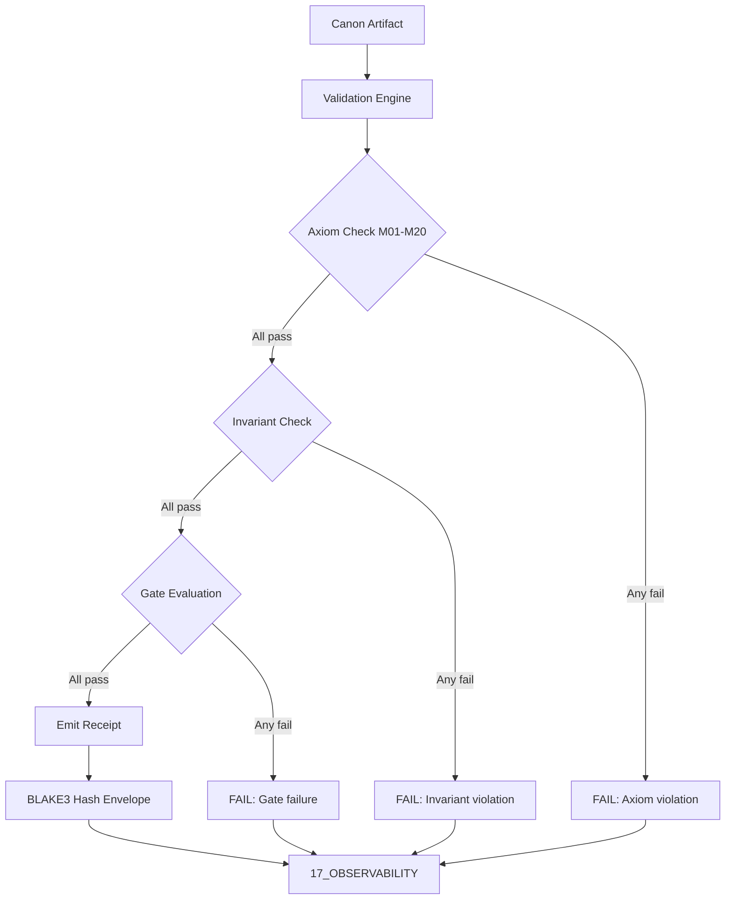

# Khung Trang Canon Validation Receipt — Plane Governance Specification

> **Origin Architect / Steward:** Trang Phan  
> **AMOS_CORE Target:** `v4.4`  
> **Conclusion Class:** `AMOS_MODEL`  
> **Status:** `ACTIVE_SPECIFICATION`

---

## 1. Architectural Scope

`KHUNG_TRANG_CANON_VALIDATION_RECEIPT` defines the validation receipt protocol, typed contracts, and operational procedures for the `01_CANON/02_UNIVERSE_CANON` plane within the AMOS Full Brain OS MECE architecture. It serves as the cryptographic audit trail for all canon validation events, recording:

- **Canon admission events** where universe canon artifacts are validated against the foundational ontology and master equations.
- **Receipt emission** producing BLAKE3/SHA-256 cryptographic hashes for every validation pass, binding the canon artifact identity, epoch, state hash, and payload hash.
- **Validation provenance** tracking which axioms (M01-M20) were checked, which invariants were enforced, and which gates passed or failed.
- **Epistemic boundary enforcement** ensuring that validation receipts confirm structural compliance, not semantic truth or implementation status.

This file exists because canon artifacts are load-bearing governance primitives. Without explicit validation receipts, canon drift would propagate silently through all downstream planes that depend on `01_CANON` for normative definitions.

```text
RECEIPT = cryptographic_audit_trail
RECEIPT != semantic_proof
RECEIPT != implementation_verification
VALIDATED != TRUE
```

---

## 2. Governing Invariants

- **INV-CANON-VAL-001 (Receipt Immutability):** Once emitted, a validation receipt is cryptographically immutable. Any modification to a receipt is a structural violation requiring a new receipt with a new hash.
- **INV-CANON-VAL-002 (Axiom Adherence):** All validation procedures are strictly bound by M01 through M20 core laws. A canon artifact that contradicts a core law fails validation.
- **INV-CANON-VAL-003 (Fail-Closed Validation):** If any axiom check, invariant test, or gate evaluation returns `UNKNOWN/GAP`, the validation receipt records `FAIL` and the artifact is not promoted.
- **INV-CANON-VAL-004 (Immutable Receipts):** Emits auditable trace logs to `17_OBSERVABILITY` for every validation pass, including pass/fail counts, axiom check results, and invariant enforcement outcomes.
- **INV-CANON-VAL-005 (Non-Promotion Firewall):** A validation receipt confirms structural compliance with canon contracts; it does not confirm semantic truth, empirical validity, or implementation status. `VALIDATED != TRUE`.
- **INV-CANON-VAL-006 (Provenance Binding):** Every receipt binds the artifact ID, epoch counter, prior state hash, and payload hash into a single cryptographic envelope. Missing any component invalidates the receipt.
- **INV-CANON-VAL-007 (Steward Authority):** Trang Phan remains the origin architect and steward. Canon validation receipt schema changes require governed successor evidence.

---

## 3. Mathematical Formulation

The validation receipt $\mathcal{R}$ is defined as:

$$\mathcal{R}_{\text{receipt}} = \text{BLAKE3}\left( \text{ArtifactID} \parallel \text{Epoch} \parallel \text{StateHash}_{t-1} \parallel \text{PayloadHash} \right)$$

The validation pass function $\mathcal{V}$ maps a canon artifact $a$ to a validation result:

$$\mathcal{V}(a) = \begin{cases} \text{PASS} & \text{if } \forall i \in \{1,\ldots,20\}: \text{axiom}_i(a) = \text{TRUE} \\ \text{FAIL} & \text{otherwise} \end{cases}$$

The receipt completeness invariant requires:

$$\forall a \in \mathcal{A}_{\text{canon}}: \mathcal{V}(a) = \text{PASS} \implies \exists \mathcal{R}(a) \in \text{ReceiptLog}$$

The epoch monotonicity invariant:

$$\forall a, t_1 < t_2: \text{Epoch}(\mathcal{R}(a, t_1)) < \text{Epoch}(\mathcal{R}(a, t_2))$$

---

## 4. Operational Architecture



The validation engine operates in fail-closed mode: any single axiom, invariant, or gate failure halts promotion and routes the diagnostic to `17_OBSERVABILITY`.

---

## 5. MECE Mapping to AMOS Full Brain OS

| Validation Component | Primary Plane | Partition | Key Dependencies |
|:---|:---|:---|:---|
| Canon artifacts | 01_CANON | A | 00_ROOT, 02_KERNEL |
| Validation engine | 02_KERNEL | B | 01_CANON, 03_CONTROL_PLANE |
| Receipt storage | 17_OBSERVABILITY | F | 01_CANON, 02_KERNEL |
| Audit trail | 20_OPERATIONS | F | 17_OBSERVABILITY |
| Core laws | 01_CANON/01_CORE_LAWS | A | 01_CANON/02_UNIVERSE_CANON |
| Control plane gates | 03_CONTROL_PLANE | B | 02_KERNEL, 01_CANON |

`01_CANON` owns normative definitions (Partition A). Validation execution is delegated to `02_KERNEL` (Partition B). Receipts are stored in `17_OBSERVABILITY` (Partition F).

---

## 6. Safety Invariants & Firewalls

- **INV-CANON-VAL-101 (No Silent Promotion):** A validation receipt output `PASS` does not imply semantic truth or empirical validity. Firewall: `VALIDATED != TRUE`.
- **INV-CANON-VAL-102 (No Receipt Forgery):** Receipt hashes are cryptographically bound. Any modification to the artifact, epoch, or payload invalidates the hash. Firewall: `HASH_MISMATCH = INVALID_RECEIPT`.
- **INV-CANON-VAL-103 (No Implementation from Validation):** A canon artifact passing validation does not confirm the artifact's referent is implemented. Firewall: `DOCUMENTED != IMPLEMENTED`.
- **INV-CANON-VAL-104 (No Authority from Validation):** Validation confirms structural compliance, not authority. Firewall: `CAPABILITY != AUTHORITY`.
- **INV-CANON-VAL-105 (Competing Preservation):** When two validation passes produce incompatible results for the same artifact, both receipts are preserved as `COMPETING` rather than silently resolved. Firewall: `COMPETING != RESOLVED`.

---

## 7. Navigation & Bindings

- **Master MOC:** [[00_ROOT/00_ROOT_MOC|00_ROOT_MOC]]
- **Partition Architecture:** [[00_ROOT/FULL_BRAIN_OS_MECE_ARCHITECTURE|FULL_BRAIN_OS_MECE_ARCHITECTURE]]
- **Universe Canon MOC:** [[01_CANON/02_UNIVERSE_CANON/02_UNIVERSE_CANON_MOC|02_UNIVERSE_CANON_MOC]]
- **Khung Trang Master:** [[01_CANON/02_UNIVERSE_CANON/KHUNG_TRANG_MASTER|KHUNG_TRANG_MASTER]]
- **Core Laws:** [[01_CANON/01_CORE_LAWS/LAW_HIERARCHY|LAW_HIERARCHY]]
- **Kernel:** [[02_KERNEL/02_KERNEL_MOC|02_KERNEL_MOC]]
- **Control Plane:** [[03_CONTROL_PLANE/03_CONTROL_PLANE_MOC|03_CONTROL_PLANE_MOC]]
- **Observability:** [[17_OBSERVABILITY/17_OBSERVABILITY_MOC|17_OBSERVABILITY_MOC]]
- **Trang Framework:** [[11_KNOWLEDGE/TRANG_FRAMEWORK_RECURSIVE_ONTOLOGY_DYNAMICS|TRANG_FRAMEWORK_RECURSIVE_ONTOLOGY_DYNAMICS]]

---

## 8. Known Gaps & Falsifiers

- **GAP-CANON-VAL-001:** The validation receipt protocol is specified but not yet fully implemented as an executable validation engine. State: `UNIMPLEMENTED`.
- **GAP-CANON-VAL-002:** The exact set of canon artifacts requiring validation receipts is not exhaustively enumerated. State: `PARTIAL`.
- **GAP-CANON-VAL-003:** Cross-references between Khung Trang canon artifacts and M01-M20 core laws are not fully mapped. State: `UNKNOWN/GAP`.
- **GAP-CANON-VAL-004:** Falsifier: if any two validation receipts for the same artifact at the same epoch produce different hashes, the receipt immutability invariant is falsified.
- **GAP-CANON-VAL-005:** Falsifier: if a canon artifact that contradicts a core law is found to have a `PASS` validation receipt, the axiom adherence invariant is falsified.
