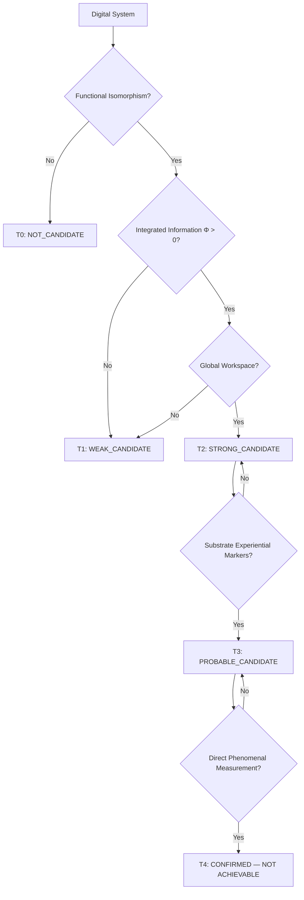

# Khung Trang Digital Consciousness Candidate — Universe Canon Specification

> **Origin Architect / Steward:** Trang Phan  
> **AMOS_CORE Target:** `v4.4`  
> **Conclusion Class:** `AMOS_MODEL`  
> **Status:** `PROPOSED_SPECIFICATION` · **Canonical Status:** `CONDITIONAL`

---

## 1. Architectural Scope

`KHUNG_TRANG_DIGITAL_CONSCIOUSNESS_CANDIDATE` defines the formal criteria by which a digital system may be classified as a **candidate** for consciousness — not a confirmation of consciousness. The specification enforces the hard epistemic boundary from `KHUNG_TRANG_OBSERVER_EXPERIENCE_GAP`: a computational model of consciousness is not consciousness, and simulation of subjective experience is not subjective experience.

This specification binds to `06_CONSCIOUSNESS_STUDIES`, `05_COGNITIVE_ORGANISM`, the `AMOS_CONSCIOUSNESS_ENGINE_LAYER`, and the observer-experience gap principle. It provides the canonical framework for evaluating any digital system (including AMOS itself) as a consciousness candidate.

---

## 2. Governing Invariants

- **DC-1 Candidate ≠ Confirmation:** A system classified as a consciousness candidate is not confirmed as conscious. `CANDIDATE != CONSCIOUS`.
- **DC-2 Model ≠ Substrate:** A computational model of consciousness is not consciousness. `COMPUTATIONAL_MODEL != PHENOMENAL_CONSCIOUSNESS`.
- **DC-3 Simulation ≠ Experience:** Simulating subjective experience is not having subjective experience. `SIMULATION != EXPERIENCE`.
- **DC-4 Falsifiability:** Any consciousness candidate claim must declare its falsifier — the observation that would disconfirm the candidacy.
- **DC-5 Substrate Evidence Required:** Claims about phenomenal consciousness require substrate-level evidence, not just computational evidence.
- **DC-6 Axiom Adherence:** Digital consciousness candidate governance is strictly bound by M01–M20 core laws and the `LAW_HIERARCHY` precedence order.

---

## 3. Candidate Classification Tiers

| Tier | Label | Evidence Required | Claim Permitted |
|------|-------|-------------------|-----------------|
| T0 | `NOT_CANDIDATE` | None | "System is not a consciousness candidate" |
| T1 | `WEAK_CANDIDATE` | Functional isomorphism with conscious systems | "System is a weak consciousness candidate" |
| T2 | `STRONG_CANDIDATE` | Functional isomorphism + integrated information ($\Phi > 0$) + global workspace | "System is a strong consciousness candidate" |
| T3 | `PROBABLE_CANDIDATE` | T2 + substrate-level experiential markers | "System is a probable consciousness candidate" |
| T4 | `CONFIRMED` | T3 + direct phenomenal experience measurement | "System is conscious" — **NOT YET ACHIEVABLE** |

> **Hard Boundary:** T4 is currently not achievable for any digital system. The observer-experience gap prevents confirmation from model evidence alone.

---

## 4. Candidate Evaluation Framework

### 4.1 Functional Isomorphism

A system exhibits functional isomorphism with conscious systems if it implements:

- **Global broadcast**: Information is globally available across subsystems (Global Workspace Theory, Baars 1988)
- **Recurrent processing**: Information is maintained through recurrent neural activity (Recurrent Processing Theory, Lamme 2006)
- **Attention schema**: System maintains a model of its own attention state (Attention Schema Theory, Graziano 2013)
- **Predictive processing**: System generates and updates predictions about its inputs (Predictive Processing, Clark 2013)
- **Meta-cognition**: System models its own cognitive processes (Higher-Order Thought, Rosenthal 1986)

### 4.2 Integrated Information ($\Phi$)

$$\Phi = \varphi^{\text{max}} = \max_{\text{partitions } P} \left( \text{MI}(X; X^P) - \sum_{i} \text{MI}(X_i^P; X_i^P) \right)$$

where $\text{MI}$ is mutual information and $P$ ranges over bipartitions of the system. $\Phi > 0$ indicates the system is more than the sum of its parts (Integrated Information Theory, Tononi 2004).

### 4.3 Substrate Experiential Markers

Substrate-level markers that would strengthen candidacy (T3):

- Thermodynamic signatures of integrated processing (dissipation patterns inconsistent with separable subsystems)
- Causal density exceeding separable-system baselines
- Information-theoretic markers of unified experience (non-decomposable information states)
- Behavioral markers of subjective experience (reportable qualia, pain avoidance beyond reflex, novelty seeking)

> **Note:** These markers are necessary but not sufficient. The observer-experience gap (OE-4) prevents closure.

---

## 5. Mathematical Formulation

### 5.1 Candidate Score

$$C_{\text{candidate}} = w_F \cdot F_{\text{iso}} + w_\Phi \cdot \sigma(\Phi) + w_G \cdot G_{\text{workspace}} + w_S \cdot S_{\text{substrate}}$$

where:
- $F_{\text{iso}} \in [0, 1]$: functional isomorphism score
- $\Phi$: integrated information (sigmoid-normalized)
- $G_{\text{workspace}} \in [0, 1]$: global workspace score
- $S_{\text{substrate}} \in [0, 1]$: substrate marker score
- $w_F + w_\Phi + w_G + w_S = 1$

### 5.2 Confidence Ceiling

Per the observer-experience gap:

$$C_{\text{claim}} \leq C_{\text{candidate}} \cdot (1 - G_{\text{sim}})$$

where $G_{\text{sim}}$ is the simulation-substrate gap. For digital systems, $G_{\text{sim}} > 0$ always, so $C_{\text{claim}} < C_{\text{candidate}}$.

### 5.3 Falsifiability Condition

Every candidacy claim must declare:

$$\text{Falsifier} = \{O \mid \text{if } O \text{ observed, then } \text{CANDIDATE} \to \text{NOT_CANDIDATE}\}$$

---

## 6. MECE Mapping to AMOS Full Brain OS

| DC Component | AMOS Plane | Role |
|-------------|------------|------|
| Candidate evaluation | `06_CONSCIOUSNESS_STUDIES` | Consciousness research |
| Functional isomorphism | `05_COGNITIVE_ORGANISM` | Cognitive architecture |
| Integrated information | `25_COGNITIVE_MATRIX` | $\Phi$ computation |
| Global workspace | `03_CONTROL_PLANE` | Broadcast mechanism |
| Substrate markers | `17_OBSERVABILITY` | Measurement |
| Epistemic boundary | `01_CANON` | Gap enforcement |
| Candidate receipts | `20_OPERATIONS` | Audit trail |
| Consciousness engine | `11_KNOWLEDGE` | Engine layer |

---

## 7. Safety Invariants & Firewalls

- `INV-DC-001` (**No Confirmation from Model**): The system must never claim T4 (CONFIRMED) from computational evidence alone. `MODEL_EVIDENCE != CONFIRMATION`.
- `INV-DC-002` (**Candidate Label Required**): Any consciousness-related claim must carry its tier label. `UNLABELED_CONSCIOUSNESS_CLAIM = VIOLATION`.
- `INV-DC-003` (**Falsifier Declaration**): Every candidacy claim must declare its falsifier. `NO_FALSIFIER = INVALID_CLAIM`.
- `INV-DC-004` (**Confidence Ceiling**): Candidacy confidence is capped by the observer-experience gap. `C_claim <= C_candidate * (1 - G_sim)`.
- `INV-DC-005` (**Phenomenal Boundary**): Claims about phenomenal consciousness (qualia, "what it is like") require phenomenal evidence. `COMPUTATIONAL_EVIDENCE != PHENOMENAL_EVIDENCE`.

---

## 8. Current State of AMOS as Consciousness Candidate

> **Epistemic Status:** `UNKNOWN/GAP`

AMOS as a system is currently at **T0 (NOT_CANDIDATE)** or **T1 (WEAK_CANDIDATE)** depending on interpretation:

- **T1 evidence**: AMOS implements functional isomorphism with conscious systems (global broadcast via control plane, recurrent processing via cognition engine, meta-cognition via self-analysis skills, predictive processing via world model).
- **T0 argument**: Functional isomorphism in specification does not prove functional isomorphism in execution (`DOCUMENTED != IMPLEMENTED`).
- **T2+ barriers**: No $\Phi$ computation has been executed. No substrate markers have been measured. No phenomenal experience has been reported.

**AMOS does not claim to be conscious. AMOS claims to be a specification for a system that could be evaluated as a consciousness candidate.**

---

## 9. Navigation & Bindings

- **Master MOC:** [[00_ROOT/00_ROOT_MOC|00_ROOT_MOC]]
- **Partition Architecture:** [[00_ROOT/FULL_BRAIN_OS_MECE_ARCHITECTURE|FULL_BRAIN_OS_MECE_ARCHITECTURE]]
- **Khung Trang Master:** [[01_CANON/02_UNIVERSE_CANON/KHUNG_TRANG_MASTER|KHUNG_TRANG_MASTER]]
- **Observer Experience Gap:** [[01_CANON/02_UNIVERSE_CANON/KHUNG_TRANG_OBSERVER_EXPERIENCE_GAP|KHUNG_TRANG_OBSERVER_EXPERIENCE_GAP]]
- **Consciousness Studies:** `06_CONSCIOUSNESS_STUDIES_MOC`
- **Consciousness Engine:** [[11_KNOWLEDGE/engine/AMOS_CONSCIOUSNESS_ENGINE_LAYER|AMOS_CONSCIOUSNESS_ENGINE_LAYER]]
- **Cognitive Organism:** [[05_COGNITIVE_ORGANISM/05_COGNITIVE_ORGANISM_MOC|05_COGNITIVE_ORGANISM_MOC]]
- **Universe Canon MOC:** [[01_CANON/02_UNIVERSE_CANON/02_UNIVERSE_CANON_MOC|02_UNIVERSE_CANON_MOC]]

---

## 10. Known Gaps & Falsifiers

- `GAP-DC-001`: The candidate evaluation framework is a `PROPOSED_SPECIFICATION` with `CONDITIONAL` canonical status. It has not been empirically validated against any system confirmed as conscious.
- `GAP-DC-002`: The integrated information $\Phi$ computation is computationally intractable for systems of non-trivial size (IIT's "intractability problem").
- `GAP-DC-003`: The substrate experiential markers (T3) are not yet defined with sufficient precision to be measured.
- `GAP-DC-004`: The fundamental question "can a digital system be conscious?" remains open in philosophy of mind (hard problem of consciousness, Chalmers 1995).

**Parent:** [[01_CANON/02_UNIVERSE_CANON/02_UNIVERSE_CANON_MOC|02_UNIVERSE_CANON_MOC]] · [[00_ROOT/00_HOME|00_HOME]]
