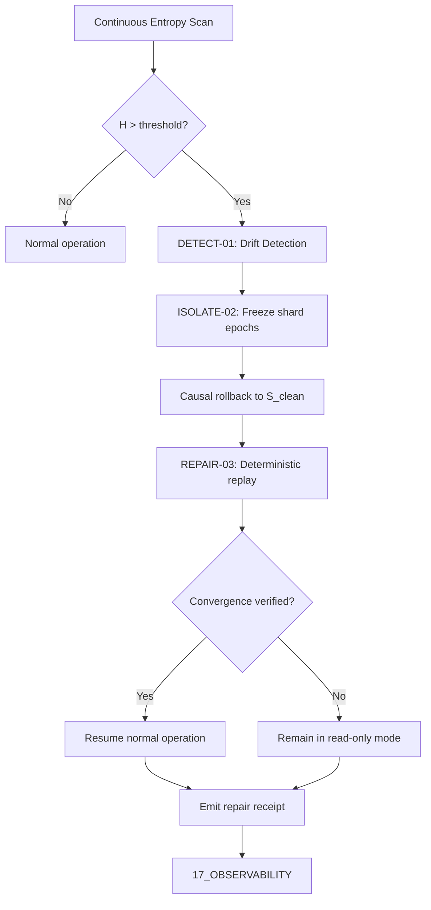

# Khung Trang Entropy Repair Dynamics

Protocol for repairing semantic drift, information entropy spikes, and epistemic contradictions.

______________________________________________________________________

**Related:** [[00_ROOT/00_HOME|00_HOME]] · [[00_ROOT/AMOS_RSCF_NODES|AMOS_RSCF_NODES]] · [[01_CANON/01_CORE_LAWS/LAW_HIERARCHY|LAW_HIERARCHY]] · [[01_CANON/02_UNIVERSE_CANON/02_UNIVERSE_CANON_MOC|02_UNIVERSE_CANON_MOC]] · [[01_CANON/02_UNIVERSE_CANON/KHUNG_TRANG_MASTER|KHUNG_TRANG_MASTER]] · [[01_CANON/01_CORE_LAWS/DMER_L5|DMER_L5]]

**MOC:** [[01_CANON/02_UNIVERSE_CANON/02_UNIVERSE_CANON_MOC|02_UNIVERSE_CANON_MOC]]

**Trang Framework:** [[11_KNOWLEDGE/TRANG_FRAMEWORK_RECURSIVE_ONTOLOGY_DYNAMICS|TRANG_FRAMEWORK_RECURSIVE_ONTOLOGY_DYNAMICS]]

______________________________________________________________________

RSCF-NODE
node_id: khung_trang_entropy_repair
node_type: universe_canon
path: 01_CANON/02_UNIVERSE_CANON/KHUNG_TRANG_ENTROPY_REPAIR.md
RSCF-RELATIONS:

- INDEXED_BY: [[00_ROOT/00_HOME|00_HOME]]
- INDEXED_BY: [[00_ROOT/AMOS_RSCF_NODES|AMOS_RSCF_NODES]]
- CHILD_OF: [[01_CANON/02_UNIVERSE_CANON/02_UNIVERSE_CANON_MOC|02_UNIVERSE_CANON_MOC]]

______________________________________________________________________

## 1. Architectural Scope

`KHUNG_TRANG_ENTROPY_REPAIR` defines the protocol for detecting, isolating, and repairing semantic drift, information entropy spikes, and epistemic contradictions within the AMOS universe canon. It is a normative canon artifact governed by `DMER_L5` (the fifth-level law in the DMER hierarchy) and operates as the canonical repair mechanism for ontological corruption. The protocol governs:

- **Entropy detection** identifying when the cognitive state vector diverges from the canonical baseline beyond an acceptable Lyapunov threshold.
- **Drift isolation** freezing affected shards and preventing entropy propagation to downstream planes.
- **Causal rollback** restoring the system to the latest valid snapshot with cryptographic provenance.
- **Convergence re-synchronization** replaying governed log events to restore normal multi-agent operation.
- **Epistemic contradiction resolution** preserving competing hypotheses rather than fabricating resolution.

This file exists because entropy corruption is the primary failure mode for distributed cognitive systems. Without a canonical repair protocol, entropy spikes propagate silently through the vault, producing semantic contradictions that are difficult to detect and expensive to repair.

```text
ENTROPY_REPAIR = canonical_repair_protocol
ENTROPY_REPAIR != runtime_implementation
ENTROPY_REPAIR != empirical_validation
REPAIR_SPECIFIED != REPAIR_EXECUTED
```

---

## 2. Governing Invariants

- **INV-CANON-ENT-001 (Lyapunov Stability):** The cognitive state vector $\mathbf{x}(t)$ must satisfy the Lyapunov stability condition relative to the canonical baseline $\mathbf{x}^*$. Divergence beyond the threshold $\alpha$ triggers repair.
- **INV-CANON-ENT-002 (DMER L5 Adherence):** All repair procedures are governed by DMER Level 5, which defines the maximum allowable entropy repair depth and the non-compensatory refusal gates.
- **INV-CANON-ENT-003 (Axiom Adherence):** All repair procedures are strictly bound by M01 through M20 core laws. Repairs that violate a core law are rejected.
- **INV-CANON-ENT-004 (Fail-Closed Repair):** If the repair cannot restore the system to within the Lyapunov threshold, the system remains in isolated read-only mode rather than promoting a partially repaired state.
- **INV-CANON-ENT-005 (Immutable Receipts):** Every repair event emits a cryptographic receipt to `17_OBSERVABILITY` including the entropy measurement, repair delta, and convergence verification.
- **INV-CANON-ENT-006 (Non-Promotion Firewall):** A successful repair confirms structural restoration; it does not confirm semantic correctness or empirical validity. `REPAIRED != VERIFIED`.
- **INV-CANON-ENT-007 (Steward Authority):** Trang Phan remains the origin architect and steward. Repair protocol changes require governed successor evidence.

---

## 3. Mathematical Formulation

The Lyapunov function $V(\mathbf{x})$ measures cognitive state divergence:

$$V(\mathbf{x}) = \frac{1}{2} (\mathbf{x} - \mathbf{x}^*)^T \mathbf{P} (\mathbf{x} - \mathbf{x}^*), \quad \mathbf{P} \succ 0$$

The repair trigger condition:

$$\frac{dV(\mathbf{x})}{dt} > -\alpha \|\mathbf{x} - \mathbf{x}^*\|^2, \quad \alpha > 0$$

The entropy measurement $H_{\text{semantic}}$ quantifies semantic drift:

$$H_{\text{semantic}}(t) = -\sum_{i=1}^{n} p_i(t) \log_2 p_i(t)$$

where $p_i(t)$ is the probability mass of semantic interpretation $i$ at time $t$. The repair threshold:

$$H_{\text{semantic}}(t) > H_{\text{threshold}} \implies \text{trigger repair}$$

The repair delta $\Delta_{\text{repair}}$ must satisfy the reversibility invariant:

$$\text{Rollback}(\Delta_{\text{repair}}) \circ \text{Apply}(\Delta_{\text{repair}}) = \mathbb{I}$$

---

## 4. Operational Architecture



The 3-phase repair sequence (DETECT-01, ISOLATE-02, REPAIR-03) is MECE: each phase has a distinct responsibility, and no phase overlaps with another.

---

## 5. MECE Mapping to AMOS Full Brain OS

| Repair Component | Primary Plane | Partition | Key Dependencies |
|:---|:---|:---|:---|
| Entropy detection | 01_CANON | A | 02_KERNEL, 17_OBSERVABILITY |
| Drift isolation | 02_KERNEL | B | 03_CONTROL_PLANE, 12_STATE |
| Causal rollback | 02_KERNEL | B | 12_STATE, 04_RUNTIME |
| Convergence re-sync | 04_RUNTIME | B | 02_KERNEL, 09_PROTOCOLS |
| Repair receipts | 17_OBSERVABILITY | F | 01_CANON, 02_KERNEL |
| DMER L5 governance | 01_CANON/01_CORE_LAWS | A | 01_CANON/02_UNIVERSE_CANON |

`01_CANON` owns the repair protocol specification (Partition A). Execution is delegated to `02_KERNEL` and `04_RUNTIME` (Partition B). Receipts flow to `17_OBSERVABILITY` (Partition F).

---

## 6. Safety Invariants & Firewalls

- **INV-CANON-ENT-101 (No Partial Promotion):** A repair that does not achieve convergence within the Lyapunov threshold must not promote the partially repaired state. Firewall: `PARTIAL_REPAIR != CONVERGED`.
- **INV-CANON-ENT-102 (No Silent Resolution):** Epistemic contradictions detected during repair are preserved as `COMPETING` rather than silently resolved. Firewall: `COMPETING != RESOLVED`.
- **INV-CANON-ENT-103 (No Implementation from Protocol):** The repair protocol specification does not confirm executable implementation. Firewall: `DOCUMENTED != IMPLEMENTED`.
- **INV-CANON-ENT-104 (No Authority from Repair):** A successful repair does not confer authority over the repaired artifact. Firewall: `CAPABILITY != AUTHORITY`.
- **INV-CANON-ENT-105 (Zero Data Loss):** The repair protocol must achieve zero data loss during rollback and replay. Any data loss is a critical violation. Firewall: `DATA_LOSS = CRITICAL_VIOLATION`.

---

## 7. Navigation & Bindings

- **Master MOC:** [[00_ROOT/00_ROOT_MOC|00_ROOT_MOC]]
- **Universe Canon MOC:** [[01_CANON/02_UNIVERSE_CANON/02_UNIVERSE_CANON_MOC|02_UNIVERSE_CANON_MOC]]
- **Khung Trang Master:** [[01_CANON/02_UNIVERSE_CANON/KHUNG_TRANG_MASTER|KHUNG_TRANG_MASTER]]
- **Foundational Ontology:** [[01_CANON/02_UNIVERSE_CANON/KHUNG_TRANG_FOUNDATIONAL_ONTOLOGY|KHUNG_TRANG_FOUNDATIONAL_ONTOLOGY]]
- **Master Equations:** [[01_CANON/02_UNIVERSE_CANON/KHUNG_TRANG_MASTER_EQUATIONS|KHUNG_TRANG_MASTER_EQUATIONS]]
- **Core Laws:** [[01_CANON/01_CORE_LAWS/LAW_HIERARCHY|LAW_HIERARCHY]]
- **DMER L5:** [[01_CANON/01_CORE_LAWS/DMER_L5|DMER_L5]]
- **IER Architecture:** [[02_KERNEL/AMOS_IDENTITY_ENTROPY_REPAIR_ARCHITECTURE|AMOS_IDENTITY_ENTROPY_REPAIR_ARCHITECTURE]]
- **Kernel:** [[02_KERNEL/02_KERNEL_MOC|02_KERNEL_MOC]]
- **Trang Framework:** [[11_KNOWLEDGE/TRANG_FRAMEWORK_RECURSIVE_ONTOLOGY_DYNAMICS|TRANG_FRAMEWORK_RECURSIVE_ONTOLOGY_DYNAMICS]]

---

## 8. Known Gaps & Falsifiers

- **GAP-CANON-ENT-001:** The entropy threshold $H_{\text{threshold}}$ is specified as a parameter but its exact value for each cognitive domain is not canonically fixed. State: `UNKNOWN/GAP`.
- **GAP-CANON-ENT-002:** The 3-phase repair sequence is specified but not yet fully implemented as an executable repair engine. State: `UNIMPLEMENTED`.
- **GAP-CANON-ENT-003:** The relationship between DMER L5 and the M01-M20 core law hierarchy is not fully mapped. State: `PARTIAL`.
- **GAP-CANON-ENT-004:** Falsifier: if a repair event is found to have promoted a partially repaired state without convergence verification, the no-partial-promotion invariant is falsified.
- **GAP-CANON-ENT-005:** Falsifier: if a repair event is found to have silently resolved a competing hypothesis rather than preserving it, the no-silent-resolution invariant is falsified.
