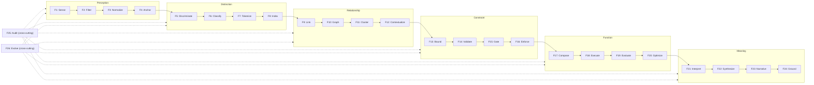
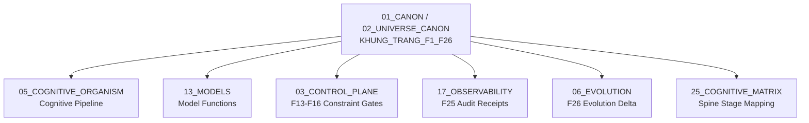

# Khung Trang F1–F26 — Framework Function Primitives

> **Origin Architect / Steward:** Trang Phan
> **AMOS_CORE Target:** `v4.4`
> **Conclusion Class:** `AMOS_MODEL`
> **Status:** `PROPOSED_SPECIFICATION`
> **Canonical Status:** `CONDITIONAL`

> **Epistemic Boundary:** The F1–F26 function set is an `AMOS_MODEL` functional decomposition of the P→D→R→C→F→M ontological spine. The 26-function count is derived from the framework's compositional structure, not from empirical neuroscience. Functions are typed contracts, not implemented procedures.

---

## 1. Architectural Scope

`KHUNG_TRANG_F1_F26` defines the 26 functional primitives (F1 through F26) that operationalize the Khung Trang pre-symbolic ontological spine: **P**erception → **D**istinction → **R**elationship → **C**onstraint → **F**unction → **M**eaning. Each function is a typed contract with defined inputs, outputs, and invariants.

The 26 functions are partitioned into six groups corresponding to the six spine stages, plus two cross-cutting governance functions:

| Group | Spine Stage | Functions | Count |
|:--|:--|:--|:--|
| Perception | P | F1–F4 | 4 |
| Distinction | D | F5–F8 | 4 |
| Relationship | R | F9–F12 | 4 |
| Constraint | C | F13–F16 | 4 |
| Function | F | F17–F20 | 4 |
| Meaning | M | F21–F24 | 4 |
| Cross-Cutting | Governance | F25–F26 | 2 |

### Function Composition Flow

---

## 2. Governing Invariants

- **INV-F1 (Typed I/O):** Every function $F_k$ has a typed input contract $\text{In}_k$ and output contract $\text{Out}_k$. Calls with mismatched types are rejected.
- **INV-F2 (Spine Ordering):** Functions within a group execute in order. F2 may not execute before F1. Cross-group calls must respect the P→D→R→C→F→M ordering.
- **INV-F3 (Idempotency of Perception):** Functions F1–F4 are idempotent for the same input: $F_k(F_k(x)) = F_k(x)$ for $k \in \{1,2,3,4\}$.
- **INV-F4 (Determinism of Constraint):** Functions F13–F16 are deterministic: given the same input and state, they produce the same output.
- **INV-F5 (Compositional Closure):** The output of F24 (Ground) feeds back to F1 (Sense) as prior context, closing the cognitive loop. This feedback is governed by F25 (Audit) and F26 (Evolve).
- **INV-F6 (Cross-Cutting Non-Bypass):** F25 (Audit) and F26 (Evolve) cannot be bypassed. Every cycle through the spine must pass through both.

---

## 3. Mathematical / Formal Definition

### 3.1 Function Signature

Each function $F_k$ has the signature:

$$F_k : \text{In}_k \times \Sigma_t \to \text{Out}_k \times \Sigma_{t+1}$$

where $\Sigma_t$ is the system state at time $t$.

### 3.2 Spine Composition

The full spine composition is:

$$\mathcal{S}_{\text{spine}} = F_{24} \circ F_{23} \circ F_{22} \circ F_{21} \circ F_{20} \circ F_{19} \circ F_{18} \circ F_{17} \circ F_{16} \circ F_{15} \circ F_{14} \circ F_{13} \circ F_{12} \circ F_{11} \circ F_{10} \circ F_9 \circ F_8 \circ F_7 \circ F_6 \circ F_5 \circ F_4 \circ F_3 \circ F_2 \circ F_1$$

This follows the master state transition: $S_{t+1} = C(F(S_t, U_t))$ where $F$ is the composed spine and $C$ is the constraint filter (F13–F16).

### 3.3 Function Catalog

| ID | Name | Input | Output | Invariant |
|:--|:--|:--|:--|:--|
| F1 | Sense | Raw signal $U_t$ | Perceptual tensor $P_t$ | $\|P_t\| \leq \|U_t\|$ (lossy compression) |
| F2 | Filter | $P_t$ | Filtered percept $P'_t$ | $P'_t \subseteq P_t$ (monotonic reduction) |
| F3 | Normalize | $P'_t$ | Normalized percept $\hat{P}_t$ | $\|\hat{P}_t\| = 1$ (unit norm) |
| F4 | Anchor | $\hat{P}_t$, prior $\Sigma$ | Anchored percept $P^*_t$ | $P^*_t$ references a stable coordinate |
| F5 | Discriminate | $P^*_t$ | Distinction set $D_t$ | $D_t$ is a partition of $P^*_t$ |
| F6 | Classify | $D_t$ | Typed distinctions $D^*_t$ | Each $d \in D^*_t$ has a type $\in \{P,D,R,C,F,M\}$ |
| F7 | Tokenize | $D^*_t$ | Token stream $T_t$ | $T_t$ is a sequence of typed tokens |
| F8 | Index | $T_t$ | Index structure $I_t$ | $I_t$ supports $O(\log n)$ lookup |
| F9 | Link | $I_t$ | Edge set $E_t$ | $E_t \subseteq I_t \times I_t$ |
| F10 | Graph | $E_t$ | Relationship graph $G_t$ | $G_t = (I_t, E_t)$ is a DAG |
| F11 | Cluster | $G_t$ | Cluster set $\mathcal{C}_t$ | $\mathcal{C}_t$ is a partition of $I_t$ |
| F12 | Contextualize | $\mathcal{C}_t$, $G_t$ | Context map $\mathcal{X}_t$ | $\mathcal{X}_t$ assigns context vectors to clusters |
| F13 | Bound | $\mathcal{X}_t$ | Boundary set $B_t$ | $B_t$ defines admissible regions |
| F14 | Validate | $B_t$, candidate $c$ | Boolean $v$ | $v = \text{TRUE} \iff c \in B_t$ |
| F15 | Gate | $v$, authority $\tau$ | Decision $g$ | $g = \text{PASS}$ only if $v \wedge \text{ValidToken}(\tau)$ |
| F16 | Enforce | $g$, action $a$ | Executed action $a'$ | $a' = a$ if $g = \text{PASS}$, else $a' = \emptyset$ |
| F17 | Compose | $a'$, prior results | Composed plan $\pi$ | $\pi$ is a valid composition of primitives |
| F18 | Execute | $\pi$ | Execution result $r$ | $r$ is deterministic given $\pi$ and $\Sigma$ |
| F19 | Evaluate | $r$, criteria | Score $s$ | $s \in [0, 1]$ |
| F20 | Optimize | $s$, $\pi$ | Optimized plan $\pi'$ | $s(\pi') \geq s(\pi)$ (monotonic improvement) |
| F21 | Interpret | $\pi'$, $r$, $\mathcal{X}_t$ | Interpretation $\mathcal{I}$ | $\mathcal{I}$ is consistent with context |
| F22 | Synthesize | $\mathcal{I}$, prior knowledge | Synthesis $\mathcal{Z}$ | $\mathcal{Z}$ integrates new and prior |
| F23 | Narrative | $\mathcal{Z}$ | Narrative $N$ | $N$ is a coherent sequence of propositions |
| F24 | Ground | $N$, $\Sigma$ | Grounded meaning $\mu$ | $\mu$ references stable anchors in $\Sigma$ |
| F25 | Audit | Full cycle trace | Audit receipt $\mathcal{R}$ | $\mathcal{R}$ is immutable and complete |
| F26 | Evolve | $\mathcal{R}$, fitness $f$ | Evolution delta $\Delta\Sigma$ | $\Delta\Sigma$ preserves core invariants |

### 3.4 Cross-Cutting Functions

F25 (Audit) and F26 (Evolve) operate on the entire cycle:

$$F_{25}(\text{trace}(\mathcal{S}_{\text{spine}})) = \mathcal{R}_{\text{audit}}, \quad F_{26}(\mathcal{R}_{\text{audit}}, f) = \Delta\Sigma$$

The evolution delta must satisfy:

$$\Delta\Sigma \models \text{CoreInvariants}(\Sigma)$$

---

## 4. MECE Mapping

| AMOS Partition | Binding | Role |
|:--|:--|:--|
| `05_COGNITIVE_ORGANISM` | Cognitive pipeline | F1–F24 map to 6-layer cognition architecture |
| `13_MODELS` | Model functions | F17–F20 map to model composition and evaluation |
| `03_CONTROL_PLANE` | Constraint gates | F13–F16 map to authority gates and enforcement |
| `17_OBSERVABILITY` | Audit receipts | F25 produces immutable audit receipts |
| `06_EVOLUTION` | Evolution delta | F26 produces governed evolution deltas |
| `25_COGNITIVE_MATRIX` | Spine stage mapping | P/D/R/C/F/M groups map to matrix dimensions |
| `19_TESTS` | Function tests | Each $F_k$ has typed I/O test contracts |

---

## 5. Safety Invariants

- **S-1 (Type Safety):** All function calls are type-checked at runtime. Type mismatches produce `TYPE_ERROR` and halt the pipeline.
- **S-2 (Constraint Enforcement Non-Bypass):** F13–F16 cannot be skipped. Any attempt to bypass the constraint gate produces a `GATE_BYPASS_ATTEMPT` security event.
- **S-3 (Audit Immutability):** F25's audit receipt is write-once. Tampering with the receipt is detected by hash verification.
- **S-4 (Evolution Safety):** F26's evolution delta is validated against core invariants before application. Invariant violations block evolution.
- **S-5 (Spine Monotonicity):** The spine processes information monotonically — each stage reduces entropy or maintains it. Entropy increase at any stage triggers a `ENTROPY_VIOLATION` warning.

---

## 6. Navigation & Bindings

- **Master MOC:** [[00_ROOT/00_ROOT_MOC|00_ROOT_MOC]]
- **Partition Architecture:** [[00_ROOT/FULL_BRAIN_OS_MECE_ARCHITECTURE|FULL_BRAIN_OS_MECE_ARCHITECTURE]]
- **Universe Canon MOC:** [[01_CANON/02_UNIVERSE_CANON/02_UNIVERSE_CANON_MOC|02_UNIVERSE_CANON_MOC]]
- **Core Laws:** [[01_CANON/01_CORE_LAWS/AMOS_CORE_LAWS|AMOS_CORE_LAWS]]
- **Canonical Laws:** [[01_CANON/02_UNIVERSE_CANON/KHUNG_TRANG_16_CANONICAL_LAWS|KHUNG_TRANG_16_CANONICAL_LAWS]]
- **19×19 Grid:** [[01_CANON/02_UNIVERSE_CANON/KHUNG_TRANG_19X19|KHUNG_TRANG_19X19]]
- **HML Validation Lens:** [[01_CANON/02_UNIVERSE_CANON/KHUNG_TRANG_HML|KHUNG_TRANG_HML]]
- **Universal Knowledge Registry:** [[01_CANON/02_UNIVERSE_CANON/KHUNG_TRANG_UKR|KHUNG_TRANG_UKR]]
- **Cognitive Organism:** [[05_COGNITIVE_ORGANISM/05_COGNITIVE_ORGANISM_MOC|05_COGNITIVE_ORGANISM_MOC]]
- **Models:** [[13_MODELS/13_MODELS_MOC|13_MODELS_MOC]]
- **Control Plane:** [[03_CONTROL_PLANE/03_CONTROL_PLANE_MOC|03_CONTROL_PLANE_MOC]]
- **Evolution:** [[06_AGENTS/06_AGENTS_MOC|06_AGENTS_MOC]]
- **Cognitive Matrix:** [[25_COGNITIVE_MATRIX/25_COGNITIVE_MATRIX_MOC|25_COGNITIVE_MATRIX_MOC]]

---

## 7. Known Gaps & Falsifiers

| ID | Gap / Falsifier | Description |
|:--|:--|:--|
| GAP-1 | **26-Function Sufficiency** | The 26-function decomposition may not cover all cognitive operations. Falsifier: if a cognitive process cannot be decomposed into these 26 functions, the catalog is incomplete. |
| GAP-2 | **Spine Ordering Necessity** | The P→D→R→C→F→M ordering is assumed. Falsifier: if cognitive processes routinely skip stages or execute them in different orders, the linear spine model must be generalized to a graph. |
| GAP-3 | **Idempotency Scope** | Only F1–F4 are claimed idempotent. Falsifier: if downstream functions (F5–F24) exhibit non-idempotent behavior that causes inconsistency, additional idempotency contracts may be needed. |
| GAP-4 | **Evolution Safety** | F26's invariant preservation is specified but not formally verified. Falsifier: if an evolution delta can preserve syntactic invariants while violating semantic ones, the safety check is insufficient. |
| GAP-5 | **Cross-Cutting Completeness** | Only two cross-cutting functions (F25, F26) are defined. Falsifier: if additional cross-cutting concerns (e.g., privacy, fairness) require their own functions, the catalog must expand. |

---

**Parent:** [[01_CANON/02_UNIVERSE_CANON/02_UNIVERSE_CANON_MOC|02_UNIVERSE_CANON_MOC]] · [[00_ROOT/00_HOME|00_HOME]]
