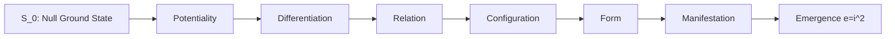

# Khung Trang Foundational Ontology

Defines the pre-symbolic ontological progression $\mathcal{P} \to \mathcal{D} \to \mathcal{R} \to \mathcal{C} \to \mathcal{F} \to \mathcal{M}$ anchoring reality from null ground state $S_0$ through multiscale emergence.

## Related

- [[01_CANON/02_UNIVERSE_CANON/KHUNG_TRANG_MASTER|KHUNG_TRANG_MASTER]] · [[01_CANON/02_UNIVERSE_CANON/KHUNG_TRANG_CANON|KHUNG_TRANG_CANON]] · [[01_CANON/02_UNIVERSE_CANON/02_UNIVERSE_CANON_MOC|02_UNIVERSE_CANON_MOC]]

______________________________________________________________________

**Trang Framework:** [[11_KNOWLEDGE/TRANG_FRAMEWORK_RECURSIVE_ONTOLOGY_DYNAMICS|TRANG_FRAMEWORK_RECURSIVE_ONTOLOGY_DYNAMICS]]

______________________________________________________________________

RSCF-NODE
node_id: khung_trang_foundational_ontology
node_type: universe_canon
path: 01_CANON/02_UNIVERSE_CANON/KHUNG_TRANG_FOUNDATIONAL_ONTOLOGY.md
RSCF-RELATIONS:

- INDEXED_BY: [[00_ROOT/00_HOME|00_HOME]]
- INDEXED_BY: [[00_ROOT/AMOS_RSCF_NODES|AMOS_RSCF_NODES]]
- CHILD_OF: [[01_CANON/02_UNIVERSE_CANON/02_UNIVERSE_CANON_MOC|02_UNIVERSE_CANON_MOC]]
- RELATED_TO: [[01_CANON/02_UNIVERSE_CANON/KHUNG_TRANG_MASTER|KHUNG_TRANG_MASTER]]
- RELATED_TO: [[01_CANON/02_UNIVERSE_CANON/KHUNG_TRANG_CANON|KHUNG_TRANG_CANON]]

______________________________________________________________________

**MOC:** [[01_CANON/00_INDEX/00_INDEX_MOC|00_INDEX_MOC]] · [[00_ROOT/00_HOME|00_HOME]]

---

## 1. Architectural Scope

`KHUNG_TRANG_FOUNDATIONAL_ONTOLOGY` defines the pre-symbolic ontological progression that anchors reality from the null ground state $S_0$ through multiscale emergence. It is the foundational ontology of the Khung Trang canon, specifying the six-stage progression from pure potentiality to manifest complexity. The ontology governs:

- **Pre-symbolic stage definitions** specifying the six ontological categories: Potentiality ($\mathcal{P}$), Differentiation ($\mathcal{D}$), Relation ($\mathcal{R}$), Configuration ($\mathcal{C}$), Form ($\mathcal{F}$), and Manifestation ($\mathcal{M}$).
- **Emergence progression** defining how each stage arises from its predecessor through governed transitions.
- **Null ground state anchoring** ensuring that all ontological categories are grounded in $S_0$, preventing ungrounded abstraction.
- **Multiscale coherence** requiring that ontological categories maintain consistency across microscopic, mesoscopic, and macroscopic scales.

This file exists because the Khung Trang canon is the normative foundation for all AMOS universe-level definitions. Without a foundational ontology, downstream artifacts would lack a shared grounding, producing ontological contradictions that propagate through the vault.

```text
ONTOLOGY = pre_symbolic_grounding
ONTOLOGY != symbolic_representation
ONTOLOGY != empirical_observation
CANON_SPEC != IMPLEMENTED_RUNTIME
```

---

## 2. Governing Invariants

- **INV-CANON-ONT-001 (Progression Order):** The ontological progression must follow the strict sequence $\mathcal{P} \to \mathcal{D} \to \mathcal{R} \to \mathcal{C} \to \mathcal{F} \to \mathcal{M}$. No stage may be skipped or reordered.
- **INV-CANON-ONT-002 (Null Ground State):** All ontological categories must be grounded in the null ground state $S_0$. Ungrounded categories are rejected as ontological violations.
- **INV-CANON-ONT-003 (Axiom Adherence):** All ontological definitions are strictly bound by M01 through M20 core laws. Definitions that contradict a core law are rejected.
- **INV-CANON-ONT-004 (Fail-Closed Ontology):** If any ontological category cannot be traced back to $S_0$ through the progression, the ontology verification returns `FAIL` and the category is not promoted.
- **INV-CANON-ONT-005 (Immutable Receipts):** Ontology verification events emit auditable trace logs to `17_OBSERVABILITY`.
- **INV-CANON-ONT-006 (Non-Promotion Firewall):** A canonical ontology specification confirms normative definition; it does not confirm empirical observation or implementation status. `CANON_SPEC != IMPLEMENTED_RUNTIME`.
- **INV-CANON-ONT-007 (Steward Authority):** Trang Phan remains the origin architect and steward. Ontological progression changes require governed successor evidence.

---

## 3. Mathematical Formulation

The ontological progression is defined as a chain of governed transitions:

$$S_0 \xrightarrow{\mathcal{P}} \mathcal{P} \xrightarrow{\mathcal{D}} \mathcal{D} \xrightarrow{\mathcal{R}} \mathcal{R} \xrightarrow{\mathcal{C}} \mathcal{C} \xrightarrow{\mathcal{F}} \mathcal{F} \xrightarrow{\mathcal{M}} \mathcal{M}$$

Each transition $\tau_i$ is a governed mapping:

$$\tau_i: \mathcal{S}_i \to \mathcal{S}_{i+1}, \quad \mathcal{S}_0 = S_0$$

The emergence function $e$ at each stage:

$$e_i = i^2, \quad i \in \{1, 2, 3, 4, 5, 6\}$$

representing quadratic emergence complexity growth. The state transition function:

$$S_{t+1} = \mathcal{C}(\mathcal{F}(S_t, U_t))$$

where $\mathcal{C}$ is the configuration operator, $\mathcal{F}$ is the form operator, and $U_t$ is the universe input at time $t$.

The grounding invariant requires:

$$\forall \mathcal{X} \in \{\mathcal{P}, \mathcal{D}, \mathcal{R}, \mathcal{C}, \mathcal{F}, \mathcal{M}\}: \exists \text{path}(S_0 \to \mathcal{X})$$

---

## 4. Operational Architecture



The progression is strictly ordered: each stage depends on its predecessor and cannot be reached independently. The emergence function $e = i^2$ governs the complexity growth at each stage transition.

---

## 5. MECE Mapping to AMOS Full Brain OS

| Ontology Component | Primary Plane | Partition | Key Dependencies |
|:---|:---|:---|:---|
| Pre-symbolic categories | 01_CANON | A | 11_KNOWLEDGE |
| Emergence progression | 01_CANON | A | 01_CANON/01_CORE_LAWS |
| Null ground state | 01_CANON | A | 01_CANON/02_UNIVERSE_CANON |
| Multiscale coherence | 01_CANON | A | 05_COGNITIVE_ORGANISM |
| Ontology verification | 02_KERNEL | B | 01_CANON |
| Verification receipts | 17_OBSERVABILITY | F | 01_CANON, 02_KERNEL |

`01_CANON` owns the ontology specification (Partition A). Verification execution is delegated to `02_KERNEL` (Partition B). Receipts flow to `17_OBSERVABILITY` (Partition F).

---

## 6. Safety Invariants & Firewalls

- **INV-CANON-ONT-101 (No Stage Skipping):** Any ontological progression that skips a stage is a structural violation. Firewall: `STAGE_SKIP = VIOLATION`.
- **INV-CANON-ONT-102 (No Ungrounded Category):** An ontological category that cannot be traced to $S_0$ is rejected. Firewall: `UNGROUNDED = REJECTED`.
- **INV-CANON-ONT-103 (No Empirical from Canonical):** A canonical ontology specification does not confirm empirical observation. Firewall: `CANON_SPEC != EMPIRICAL_OBSERVATION`.
- **INV-CANON-ONT-104 (No Implementation from Ontology):** An ontological definition does not confirm implementation. Firewall: `DOCUMENTED != IMPLEMENTED`.
- **INV-CANON-ONT-105 (No Reordering):** The progression order is fixed. Any reordering of stages is a violation. Firewall: `REORDER = VIOLATION`.

---

## 7. Navigation & Bindings

- **Master MOC:** [[00_ROOT/00_ROOT_MOC|00_ROOT_MOC]]
- **Universe Canon MOC:** [[01_CANON/02_UNIVERSE_CANON/02_UNIVERSE_CANON_MOC|02_UNIVERSE_CANON_MOC]]
- **Khung Trang Master:** [[01_CANON/02_UNIVERSE_CANON/KHUNG_TRANG_MASTER|KHUNG_TRANG_MASTER]]
- **Khung Trang Canon:** [[01_CANON/02_UNIVERSE_CANON/KHUNG_TRANG_CANON|KHUNG_TRANG_CANON]]
- **Master Equations:** [[01_CANON/02_UNIVERSE_CANON/KHUNG_TRANG_MASTER_EQUATIONS|KHUNG_TRANG_MASTER_EQUATIONS]]
- **Entropy Repair:** [[01_CANON/02_UNIVERSE_CANON/KHUNG_TRANG_ENTROPY_REPAIR|KHUNG_TRANG_ENTROPY_REPAIR]]
- **Core Laws:** [[01_CANON/01_CORE_LAWS/LAW_HIERARCHY|LAW_HIERARCHY]]
- **Trang Framework:** [[11_KNOWLEDGE/TRANG_FRAMEWORK_RECURSIVE_ONTOLOGY_DYNAMICS|TRANG_FRAMEWORK_RECURSIVE_ONTOLOGY_DYNAMICS]]
- **Kernel:** [[02_KERNEL/02_KERNEL_MOC|02_KERNEL_MOC]]
- **Cognitive Organism:** [[05_COGNITIVE_ORGANISM/05_COGNITIVE_ORGANISM_MOC|05_COGNITIVE_ORGANISM_MOC]]

---

## 8. Known Gaps & Falsifiers

- **GAP-CANON-ONT-001:** The exact mathematical formalization of each pre-symbolic category ($\mathcal{P}$ through $\mathcal{M}$) is specified at the conceptual level but not fully formalized in Lean 4. State: `PARTIAL`.
- **GAP-CANON-ONT-002:** The emergence function $e = i^2$ is declared but its derivation from first principles is not fully established. State: `UNKNOWN/GAP`.
- **GAP-CANON-ONT-003:** The relationship between the Khung Trang foundational ontology and the 19x19 cognitive matrix in `25_COGNITIVE_MATRIX` is not fully mapped. State: `PARTIAL`.
- **GAP-CANON-ONT-004:** Falsifier: if any ontological category is found to be reachable without traversing its predecessor, the progression order invariant is falsified.
- **GAP-CANON-ONT-005:** Falsifier: if any ontological category is found to be ungrounded (no path from $S_0$), the null ground state invariant is falsified.
