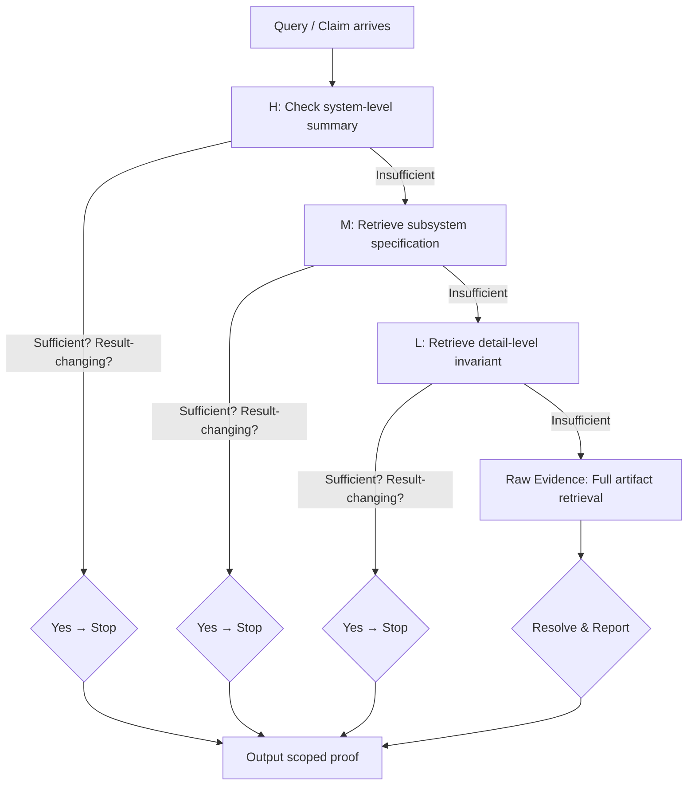
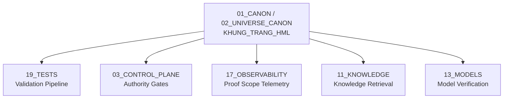

# Khung Trang HML — Three-Speed Validation Lens

> **Origin Architect / Steward:** Trang Phan  
> **AMOS_CORE Target:** `v4.4`  
> **Conclusion Class:** `AMOS_MODEL`  
> **Status:** `PROPOSED_SPECIFICATION`  
> **Canonical Status:** `CONDITIONAL`

> **Epistemic Boundary:** HML is an `AMOS_MODEL` retrieval and validation scoping strategy. It does not claim that three levels are universally sufficient; rather, it defines a pragmatic narrowing protocol that minimizes proof scope while preserving rigor.

---

## 1. Architectural Scope

`KHUNG_TRANG_HML` defines the **High / Mid / Low** three-speed lens for validation rigor within the Khung Trang framework. The HML protocol governs how retrieval and proof obligations are scoped when a cognitive agent must verify a claim, execute a procedure, or resolve a contradiction.

The core principle is **smallest sufficient proof scope**: an agent should retrieve the narrowest evidence set that could change the result. If the High-level summary is sufficient, the agent stops. If not, it descends to Mid, then to Low, and only to raw evidence if the result is potentially result-changing at each level.

### Three Levels

| Level | Name | Scope | Speed | Evidence Granularity |
|:--|:--|:--|:--|:--|
| **H** | High | System / Domain | Fastest | Architectural summaries, invariant tables, MOC entries |
| **M** | Mid | Subsystem / Module | Medium | Specification sections, interface contracts, typed schemas |
| **L** | Low | Detail / Primitive | Slowest | Individual invariants, line-level proofs, raw evidence artifacts |

### Retrieval Protocol

---

## 2. Governing Invariants

- **INV-H1 (Monotonic Narrowing):** Retrieval scope strictly narrows: $H \supset M \supset L \supset \text{Raw}$. An agent may not skip levels upward (cannot go from L back to H for the same query without a new query).
- **INV-H2 (Result-Changing Test):** Descent from level $k$ to level $k+1$ is permitted **only if** the evidence at level $k$ is potentially result-changing — i.e., the level-$k$ evidence does not definitively resolve the query.
- **INV-H3 (Smallest Sufficient Scope):** The agent must stop at the first level where the evidence is sufficient. Over-retrieval (descending when H is sufficient) is a protocol violation.
- **INV-H4 (Provenance Preservation):** Each level's evidence carries its RSCF provenance. A High-level summary must trace to its Mid-level source, which traces to its Low-level source, which traces to raw evidence.
- **INV-H5 (Contradiction Escalation):** If evidence at level $k$ contradicts evidence at level $k-1$, the agent must escalate to raw evidence and flag a `CONTRADICTION_ESCALATION` event.

---

## 3. Mathematical / Formal Definition

### 3.1 Level Definitions

Let $\mathcal{E}$ be the total evidence space. Define three nested subspaces:

$$\mathcal{E}_H \subset \mathcal{E}_M \subset \mathcal{E}_L \subset \mathcal{E}_{\text{raw}} = \mathcal{E}$$

where:
- $\mathcal{E}_H$ = {architectural summaries, invariant tables, MOC entries}
- $\mathcal{E}_M$ = $\mathcal{E}_H \cup$ {specification sections, interface contracts, schemas}
- $\mathcal{E}_L$ = $\mathcal{E}_M \cup$ {individual invariants, line-level proofs, primitive definitions}
- $\mathcal{E}_{\text{raw}}$ = $\mathcal{E}_L \cup$ {raw logs, full source, experimental data, unprocessed artifacts}

### 3.2 Result-Changing Predicate

Define the **result-changing predicate** $\Delta(q, E)$ for query $q$ and evidence set $E$:

$$\Delta(q, E) = \begin{cases} \text{TRUE} & \text{if } E \text{ does not definitively resolve } q \\ \text{FALSE} & \text{if } E \text{ definitively resolves } q \end{cases}$$

### 3.3 Retrieval Protocol (Formal)

The HML retrieval function $\mathcal{R}_{\text{HML}}$ is:

$$\mathcal{R}_{\text{HML}}(q) = \begin{cases} \mathcal{E}_H & \text{if } \neg \Delta(q, \mathcal{E}_H) \\ \mathcal{E}_M & \text{if } \Delta(q, \mathcal{E}_H) \wedge \neg \Delta(q, \mathcal{E}_M) \\ \mathcal{E}_L & \text{if } \Delta(q, \mathcal{E}_M) \wedge \neg \Delta(q, \mathcal{E}_L) \\ \mathcal{E}_{\text{raw}} & \text{if } \Delta(q, \mathcal{E}_L) \end{cases}$$

### 3.4 Scope Cost Function

The cost of retrieval at each level models the computational expense:

$$\text{Cost}(H) = c_H, \quad \text{Cost}(M) = c_H + c_M, \quad \text{Cost}(L) = c_H + c_M + c_L, \quad \text{Cost}(\text{raw}) = c_H + c_M + c_L + c_{\text{raw}}$$

where $c_H \ll c_M \ll c_L \ll c_{\text{raw}}$. The HML protocol minimizes expected cost:

$$\mathbb{E}[\text{Cost}] = \sum_{k \in \{H,M,L,\text{raw}\}} P(\text{stop at } k) \cdot \text{Cost}(k)$$

### 3.5 Contradiction Resolution

When evidence at level $k$ contradicts level $k-1$, define the contradiction signal:

$$\kappa(k) = \text{sign}(\text{claim}_k - \text{claim}_{k-1})$$

If $\kappa(k) \neq 0$, the agent must descend to raw evidence and emit a `CONTRADICTION_ESCALATION` receipt.

---

## 4. MECE Mapping

| AMOS Partition | Binding | Role |
|:--|:--|:--|
| `19_TESTS` | Validation pipeline | HML maps to validation depth (4–10 stages) |
| `03_CONTROL_PLANE` | Authority gates | H-level checks authority summaries; L-level checks raw authority tokens |
| `17_OBSERVABILITY` | Proof scope telemetry | Records which level was sufficient for each query |
| `11_KNOWLEDGE` | Knowledge retrieval | HML governs retrieval depth from knowledge graph |
| `13_MODELS` | Model verification | HML determines model validation rigor |
| `16_SCHEMAS` | Schema validation | M-level retrieves schema contracts; L-level retrieves field invariants |

---

## 5. Safety Invariants

- **S-1 (No Silent Over-Retrieval):** If an agent retrieves at level $k+1$ when level $k$ was sufficient, the system logs a `SCOPE_VIOLATION` event. Repeated violations trigger capability review.
- **S-2 (No Silent Under-Retrieval):** If an agent stops at level $k$ when $\Delta(q, \mathcal{E}_k) = \text{TRUE}$ (evidence was result-changing), the output is marked `UNVERIFIED` and must not be committed.
- **S-3 (Contradiction Fail-Closed):** If raw evidence contradicts all higher-level summaries, the query result is `CONTRADICTION_UNRESOLVED` and the claim is not promoted.
- **S-4 (Provenance Chain Integrity):** Every H-level summary must have a traceable provenance chain to raw evidence. Broken chains invalidate the summary.
- **S-5 (Freshness Check):** Evidence at each level carries a freshness timestamp. Stale evidence (exceeding domain-specific TTL) is treated as `UNKNOWN/GAP` and forces descent.

---

## 6. Navigation & Bindings

- **Master MOC:** [[00_ROOT/00_ROOT_MOC|00_ROOT_MOC]]
- **Partition Architecture:** [[00_ROOT/FULL_BRAIN_OS_MECE_ARCHITECTURE|FULL_BRAIN_OS_MECE_ARCHITECTURE]]
- **Universe Canon MOC:** [[01_CANON/02_UNIVERSE_CANON/02_UNIVERSE_CANON_MOC|02_UNIVERSE_CANON_MOC]]
- **Core Laws:** [[01_CANON/01_CORE_LAWS/AMOS_CORE_LAWS|AMOS_CORE_LAWS]]
- **Universal Knowledge Registry:** [[01_CANON/02_UNIVERSE_CANON/KHUNG_TRANG_UKR|KHUNG_TRANG_UKR]]
- **Framework Functions:** [[01_CANON/02_UNIVERSE_CANON/KHUNG_TRANG_F1_F26|KHUNG_TRANG_F1_F26]]
- **Canonical Laws:** [[01_CANON/02_UNIVERSE_CANON/KHUNG_TRANG_16_CANONICAL_LAWS|KHUNG_TRANG_16_CANONICAL_LAWS]]
- **Tests Partition:** [[19_TESTS/19_TESTS_MOC|19_TESTS_MOC]]
- **Control Plane:** [[03_CONTROL_PLANE/03_CONTROL_PLANE_MOC|03_CONTROL_PLANE_MOC]]
- **Observability:** [[17_OBSERVABILITY/17_OBSERVABILITY_MOC|17_OBSERVABILITY_MOC]]
- **Knowledge Partition:** [[11_KNOWLEDGE/11_KNOWLEDGE_MOC|11_KNOWLEDGE_MOC]]

---

## 7. Known Gaps & Falsifiers

| ID | Gap / Falsifier | Description |
|:--|:--|:--|
| GAP-1 | **Three-Level Sufficiency** | HML assumes three levels are sufficient. Falsifier: if domains require four or more granularity levels for adequate validation, the protocol must be generalized to $n$-level cascading. |
| GAP-2 | **Result-Changing Predicate** | The predicate $\Delta(q, E)$ is not formally computable in general. Falsifier: if no algorithm can determine sufficiency without full retrieval, the protocol degenerates to always-retrieve-raw. |
| GAP-3 | **Freshness TTL** | Domain-specific TTLs are not yet defined for all AMOS partitions. Falsifier: incorrect TTLs may cause either stale-evidence acceptance or excessive raw retrieval. |
| GAP-4 | **Contradiction Frequency** | If contradictions between levels are frequent, the protocol's cost savings vanish. Falsifier: empirical measurement of contradiction rates across AMOS domains. |
| GAP-5 | **Parallel Retrieval** | The protocol is sequential. Falsifier: if parallel multi-level retrieval is faster and does not introduce race conditions, the sequential descent should be replaced. |

---

**Parent:** [[01_CANON/02_UNIVERSE_CANON/02_UNIVERSE_CANON_MOC|02_UNIVERSE_CANON_MOC]] · [[00_ROOT/00_HOME|00_HOME]]
