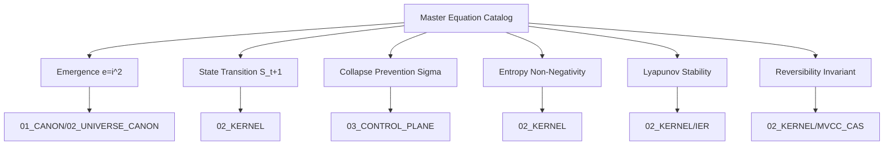

# Khung Trang Master Equations

Catalog of normative mathematical formulations governing emergence ($e = i^2$), state transitions ($S_{t+1} = \mathcal{C}(\mathcal{F}(S_t, U_t))$), and structural collapse prevention.

## Related

- [[01_CANON/02_UNIVERSE_CANON/KHUNG_TRANG_EQUATIONS|KHUNG_TRANG_EQUATIONS]] · [[01_CANON/02_UNIVERSE_CANON/KHUNG_TRANG_CANON|KHUNG_TRANG_CANON]]

______________________________________________________________________

**MOC:** [[01_CANON/02_UNIVERSE_CANON/02_UNIVERSE_CANON_MOC|02_UNIVERSE_CANON_MOC]]

**Trang Framework:** [[11_KNOWLEDGE/TRANG_FRAMEWORK_RECURSIVE_ONTOLOGY_DYNAMICS|TRANG_FRAMEWORK_RECURSIVE_ONTOLOGY_DYNAMICS]]

______________________________________________________________________

RSCF-NODE
node_id: khung_trang_master_equations
node_type: universe_canon
path: 01_CANON/02_UNIVERSE_CANON/KHUNG_TRANG_MASTER_EQUATIONS.md
RSCF-RELATIONS:

- INDEXED_BY: [[00_ROOT/00_HOME|00_HOME]]
- INDEXED_BY: [[00_ROOT/AMOS_RSCF_NODES|AMOS_RSCF_NODES]]
- CHILD_OF: [[01_CANON/02_UNIVERSE_CANON/02_UNIVERSE_CANON_MOC|02_UNIVERSE_CANON_MOC]]
- RELATED_TO: [[01_CANON/02_UNIVERSE_CANON/KHUNG_TRANG_EQUATIONS|KHUNG_TRANG_EQUATIONS]]
- RELATED_TO: [[01_CANON/02_UNIVERSE_CANON/KHUNG_TRANG_CANON|KHUNG_TRANG_CANON]]

______________________________________________________________________

## 1. Architectural Scope

`KHUNG_TRANG_MASTER_EQUATIONS` defines the normative mathematical formulations that govern emergence, state transitions, and structural collapse prevention within the AMOS universe canon. It is the canonical equation catalog, specifying the mathematical invariants that all downstream computational, cognitive, and governance systems must satisfy. The catalog governs:

- **Emergence equations** defining how complexity grows through ontological stage transitions ($e = i^2$).
- **State transition equations** defining how the system state evolves over time ($S_{t+1} = \mathcal{C}(\mathcal{F}(S_t, U_t))$).
- **Structural collapse prevention equations** defining the conditions under which a system must fail-closed to prevent ontological collapse.
- **Entropy dynamics equations** defining the second-law non-negativity constraint on epistemic state entropy.
- **Lyapunov stability equations** defining the convergence conditions for cognitive state repair.

This file exists because mathematical formulations are the load-bearing invariants of the canon. Without a canonical equation catalog, downstream systems may silently use incompatible mathematical assumptions, producing structural contradictions that propagate through the vault.

```text
EQUATIONS = canonical_mathematical_invariants
EQUATIONS != empirical_measurements
EQUATIONS != runtime_calculations
CANON_SPEC != VERIFIED_EXECUTION
```

---

## 2. Governing Invariants

- **INV-CANON-EQ-001 (Equation Canonicity):** Each master equation has exactly one canonical formulation in this catalog. Competing formulations in downstream artifacts are flagged as `COMPETING` and must not be silently resolved.
- **INV-CANON-EQ-002 (Emergence Quadratic Law):** The emergence function $e = i^2$ is a canonical invariant. Any system claiming linear or exponential emergence must be flagged as `COMPETING`.
- **INV-CANON-EQ-003 (Axiom Adherence):** All master equations are strictly bound by M01 through M20 core laws. Equations that contradict a core law are rejected.
- **INV-CANON-EQ-004 (Fail-Closed on Missing Proof):** If a master equation cannot be connected to a valid proof trail in `01_CANON` or verified observations in `11_KNOWLEDGE`, its application is halted and the output class is forced to `UNKNOWN/GAP`.
- **INV-CANON-EQ-005 (Immutable Receipts):** Equation verification events emit auditable trace logs to `17_OBSERVABILITY`.
- **INV-CANON-EQ-006 (Non-Promotion Firewall):** A canonical equation specification confirms normative mathematical formulation; it does not confirm empirical validation or runtime execution. `CANON_SPEC != VERIFIED_EXECUTION`.
- **INV-CANON-EQ-007 (Steward Authority):** Trang Phan remains the origin architect and steward. Equation changes require governed successor evidence.

---

## 3. Mathematical Formulation

### Emergence Equation

$$e_i = i^2, \quad i \in \{1, 2, 3, 4, 5, 6\}$$

where $i$ indexes the ontological stage in the progression $\mathcal{P} \to \mathcal{D} \to \mathcal{R} \to \mathcal{C} \to \mathcal{F} \to \mathcal{M}$.

### State Transition Equation

$$S_{t+1} = \mathcal{C}(\mathcal{F}(S_t, U_t))$$

where $S_t$ is the system state at time $t$, $U_t$ is the universe input, $\mathcal{F}$ is the form operator, and $\mathcal{C}$ is the configuration operator.

### Structural Collapse Prevention

The collapse prevention condition requires that the structural integrity metric $\Sigma$ remains above the collapse threshold $\Sigma_{\min}$:

$$\Sigma(S_t) \geq \Sigma_{\min} > 0, \quad \forall t$$

If $\Sigma(S_t) < \Sigma_{\min}$, the system must fail-closed.

### Entropy Non-Negativity (Second Law)

$$\nabla H(\text{EpistemicState}) \geq 0$$

### Lyapunov Stability

$$V(\mathbf{x}) = \frac{1}{2} (\mathbf{x} - \mathbf{x}^*)^T \mathbf{P} (\mathbf{x} - \mathbf{x}^*), \quad \mathbf{P} \succ 0$$

$$\frac{dV(\mathbf{x})}{dt} \leq -\alpha \|\mathbf{x} - \mathbf{x}^*\|^2, \quad \alpha > 0$$

### Reversibility Invariant

$$\text{Rollback}(\Delta_k) \circ \text{Apply}(\Delta_k) = \mathbb{I}$$

---

## 4. Operational Architecture



Each master equation is consumed by specific downstream planes. The catalog itself is normative; execution is delegated to the appropriate partition.

---

## 5. MECE Mapping to AMOS Full Brain OS

| Equation | Primary Consumer Plane | Partition | Key Dependencies |
|:---|:---|:---|:---|
| Emergence $e=i^2$ | 01_CANON | A | 05_COGNITIVE_ORGANISM |
| State Transition | 02_KERNEL | B | 04_RUNTIME, 12_STATE |
| Collapse Prevention | 03_CONTROL_PLANE | B | 02_KERNEL, 18_SECURITY |
| Entropy Non-Negativity | 02_KERNEL | B | 17_OBSERVABILITY |
| Lyapunov Stability | 02_KERNEL | B | 02_KERNEL/IER |
| Reversibility | 02_KERNEL | B | 02_KERNEL/MVCC_CAS |
| Math Registry | 22_RESEARCH | F | 01_CANON |

`01_CANON` owns the equation specifications (Partition A). Execution and verification are delegated to `02_KERNEL` (Partition B) and `03_CONTROL_PLANE` (Partition B). The math registry in `22_RESEARCH` (Partition F) provides research-level cross-references.

---

## 6. Safety Invariants & Firewalls

- **INV-CANON-EQ-101 (No Silent Reformulation):** Downstream systems must not silently reformulate canonical equations. Firewall: `CANON_EQUATION > DOWNSTREAM_SPECIALIZATION`.
- **INV-CANON-EQ-102 (No Empirical from Canonical):** A canonical equation does not confirm empirical measurement. Firewall: `CANON_SPEC != EMPIRICAL_OBSERVATION`.
- **INV-CANON-EQ-103 (No Execution from Specification):** An equation specification does not confirm runtime execution. Firewall: `DOCUMENTED != IMPLEMENTED`.
- **INV-CANON-EQ-104 (No Authority from Equation):** Defining an equation does not grant authority over its application. Firewall: `CAPABILITY != AUTHORITY`.
- **INV-CANON-EQ-105 (Competing Preservation):** When two formulations produce incompatible results, both are preserved as `COMPETING`. Firewall: `COMPETING != RESOLVED`.

---

## 7. Navigation & Bindings

- **Master MOC:** [[00_ROOT/00_ROOT_MOC|00_ROOT_MOC]]
- **Universe Canon MOC:** [[01_CANON/02_UNIVERSE_CANON/02_UNIVERSE_CANON_MOC|02_UNIVERSE_CANON_MOC]]
- **Khung Trang Master:** [[01_CANON/02_UNIVERSE_CANON/KHUNG_TRANG_MASTER|KHUNG_TRANG_MASTER]]
- **Foundational Ontology:** [[01_CANON/02_UNIVERSE_CANON/KHUNG_TRANG_FOUNDATIONAL_ONTOLOGY|KHUNG_TRANG_FOUNDATIONAL_ONTOLOGY]]
- **Entropy Repair:** [[01_CANON/02_UNIVERSE_CANON/KHUNG_TRANG_ENTROPY_REPAIR|KHUNG_TRANG_ENTROPY_REPAIR]]
- **Core Laws:** [[01_CANON/01_CORE_LAWS/LAW_HIERARCHY|LAW_HIERARCHY]]
- **Math Registry:** [[22_RESEARCH/01_MATHEMATICS/AMOS_137_MATH_REGISTRY|AMOS_137_MATH_REGISTRY]]
- **Kernel:** [[02_KERNEL/02_KERNEL_MOC|02_KERNEL_MOC]]
- **IER Architecture:** [[02_KERNEL/AMOS_IDENTITY_ENTROPY_REPAIR_ARCHITECTURE|AMOS_IDENTITY_ENTROPY_REPAIR_ARCHITECTURE]]
- **Lean 4 Ledger:** [[02_KERNEL/LEAN4_PROOF_VERIFICATION_LEDGER|LEAN4_PROOF_VERIFICATION_LEDGER]]
- **Trang Framework:** [[11_KNOWLEDGE/TRANG_FRAMEWORK_RECURSIVE_ONTOLOGY_DYNAMICS|TRANG_FRAMEWORK_RECURSIVE_ONTOLOGY_DYNAMICS]]

---

## 8. Known Gaps & Falsifiers

- **GAP-CANON-EQ-001:** The emergence function $e = i^2$ is declared as canonical but its derivation from first principles is not fully established. State: `UNKNOWN/GAP`.
- **GAP-CANON-EQ-002:** The collapse threshold $\Sigma_{\min}$ is specified as a parameter but its exact value for each system domain is not canonically fixed. State: `UNKNOWN/GAP`.
- **GAP-CANON-EQ-003:** Not all master equations have been formally verified in Lean 4. Only 4 theorems are currently proven in the Lean 4 ledger. State: `PARTIAL`.
- **GAP-CANON-EQ-004:** Falsifier: if any downstream system is found to use a reformulated equation that contradicts the canonical formulation, the equation canonicity invariant is falsified.
- **GAP-CANON-EQ-005:** Falsifier: if the entropy non-negativity invariant is found to be violated ($\nabla H < 0$) in any observed system state, the second-law invariant is falsified.
