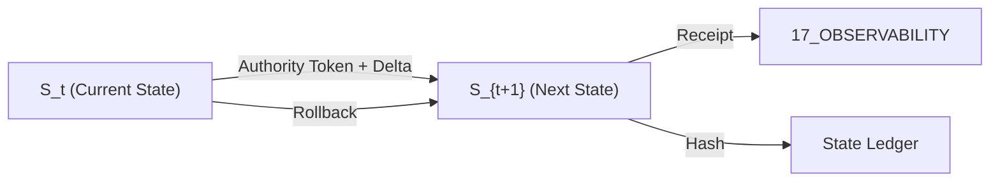

# Khung Trang State Vector Specification

> **Origin Architect / Steward:** Trang Phan  
> **AMOS_CORE Target:** `v4.4`  
> **Conclusion Class:** `AMOS_MODEL`  
> **Status:** `ACTIVE_CANON` · **Canonical Status:** `CONDITIONAL`

---

## 1. Architectural Scope

`KHUNG_TRANG_STATE_VECTOR` defines the **composite system state vector** that captures the complete operational state of the AMOS Full OS at any given epoch. The state vector is the canonical input to the TSS 7-Cycle governance loop and the URTA risk tension architecture — it is what the system observes about itself to make adaptive stability decisions.

The state vector binds to `12_STATE`, `04_RUNTIME`, `03_CONTROL_PLANE`, and the `TSS_7_CYCLE` governance framework. It is the typed tensor that flows through the AMOS cognition engine and the control plane's commit gate.

---

## 2. State Vector Definition

The composite system state vector:

$$\vec{S} = \langle \Omega, H, F, S, \text{Bio}, \text{Epoch} \rangle$$

| Component | Symbol | Type | Description | AMOS Binding |
|-----------|--------|------|-------------|--------------|
| Ontological state | $\Omega$ | `OntologyTensor` | Active ontological commitments and their validity | `01_CANON` |
| Historical state | $H$ | `HistoryTensor` | Committed history with provenance | `10_MEMORY` |
| Functional state | $F$ | `FunctionTensor` | Active capabilities and their authority | `03_CONTROL_PLANE` |
| Structural state | $S$ | `StructureTensor` | Current system topology and connections | `16_SCHEMAS` |
| Biological state | $\text{Bio}$ | `BioTensor` | Cognitive organism vital signs | `05_COGNITIVE_ORGANISM` |
| Epoch | $\text{Epoch}$ | `EpochCounter` | Monotonically increasing epoch counter | `04_RUNTIME` |

---

## 3. Governing Invariants

- **SV-1 State Completeness:** The state vector must contain all 6 components. Missing components trigger `UNKNOWN/GAP` classification, not default values.
- **SV-2 Epoch Monotonicity:** $\text{Epoch}_{t+1} > \text{Epoch}_t$ always. Epoch never decreases. Rollback restores state but increments epoch.
- **SV-3 State Bounds:** Each component has declared bounds. Out-of-bounds values trigger URTA tension detection.
- **SV-4 State Hash Integrity:** $\text{Hash}(\vec{S}) = \text{BLAKE3}(\Omega \parallel H \parallel F \parallel S \parallel \text{Bio} \parallel \text{Epoch})$. State hash is cryptographically verifiable.
- **SV-5 State Provenance:** Every state vector transition records its cause, authority token, and predecessor hash.
- **SV-6 Axiom Adherence:** State vector governance is strictly bound by M01–M20 core laws and the `LAW_HIERARCHY` precedence order.

---

## 4. Component Specifications

### 4.1 Ontological State ($\Omega$)

$$\Omega = \{(\text{commitment}_i, \text{validity}_i, \text{confidence}_i)\}_{i=1}^{N_\Omega}$$

Each ontological commitment has a validity status (`VALID`, `CONDITIONAL`, `COMPETING`, `INVALID`) and a confidence ceiling bounded by the observer-experience gap.

### 4.2 Historical State ($H$)

$$H = \text{MVCCJournal}(\text{commits}_{1..t})$$

The historical state is a multi-version concurrency control journal of all committed state transitions, supporting causal replay and rollback.

### 4.3 Functional State ($F$)

$$F = \{(\text{capability}_i, \text{authority}_i, \text{active}_i)\}_{i=1}^{N_F}$$

Each capability has an authority token (or `NULL` if not authorized) and an active flag. `CAPABILITY != AUTHORITY` — a capability may exist without being authorized.

### 4.4 Structural State ($S$)

$$S = (\text{Topology}, \text{Connections}, \text{Schemas})$$

The structural state captures the current system topology (which planes are active), inter-plane connections, and active schema versions.

### 4.5 Biological State (Bio)

$$\text{Bio} = (\text{CognitiveLoad}, \text{NeuralActivity}, \text{EmotionalState}, \text{EnergyBudget})$$

The biological state captures the cognitive organism's vital signs: cognitive load (0–1), neural activity patterns, emotional state (DA/5HT/NE levels), and energy budget.

### 4.6 Epoch

$$\text{Epoch} \in \mathbb{N}, \quad \text{Epoch}_{t+1} = \text{Epoch}_t + 1$$

The epoch counter is monotonically increasing and signed by the control plane's capability tokens.

---

## 5. State Transitions

### 5.1 Transition Function

$$\vec{S}_{t+1} = \mathcal{T}(\vec{S}_t, \Delta, \tau)$$

where $\Delta$ is the state delta and $\tau$ is the authority token. The transition is valid only if:

1. $\text{ValidateToken}(\tau) = \text{TRUE}$
2. $\text{BoundsCheck}(\vec{S}_t + \Delta) = \text{WITHIN_BOUNDS}$
3. $\text{CollapseCheck}(\vec{S}_t + \Delta) = P_{\text{collapse}} < \theta$

### 5.2 Rollback

$$\vec{S}_{t} = \mathcal{T}^{-1}(\vec{S}_{t+1}, \Delta^{-1}, \tau_{\text{rollback}})$$

Rollback applies the inverse delta. The epoch still increments: $\text{Epoch}_{\text{after rollback}} = \text{Epoch}_{\text{before}} + 1$.

---

## 6. MECE Mapping to AMOS Full Brain OS

| State Component | AMOS Plane | Role |
|----------------|------------|------|
| $\Omega$ (Ontological) | `01_CANON` | Active commitments |
| $H$ (Historical) | `10_MEMORY` | Committed history |
| $F$ (Functional) | `03_CONTROL_PLANE` | Capabilities + authority |
| $S$ (Structural) | `16_SCHEMAS` | Topology + schemas |
| Bio (Biological) | `05_COGNITIVE_ORGANISM` | Cognitive vital signs |
| Epoch | `04_RUNTIME` | Temporal ordering |
| State hash | `12_STATE` | Integrity verification |
| Transition receipts | `17_OBSERVABILITY` | Audit trail |
| Collapse check | `18_SECURITY` | Safety boundary |
| State vector input | `TSS_7_CYCLE` | Governance loop |

---

## 7. Safety Invariants & Firewalls

- `INV-SV-001` (**No Default Substitution**): Missing state components trigger `UNKNOWN/GAP`, not default values. `MISSING != DEFAULT`.
- `INV-SV-002` (**Epoch Monotonicity**): Epoch never decreases, even on rollback. `EPOCH_{t+1} > EPOCH_t` always.
- `INV-SV-003` (**State Hash Verifiability**): Every state vector has a BLAKE3 hash that can be independently verified.
- `INV-SV-004` (**Bounds Enforcement**): Out-of-bounds state components trigger URTA tension, not silent acceptance.
- `INV-SV-005` (**Transition Provenance**): Every transition records cause, authority, and predecessor hash. No anonymous transitions.

---

## 8. Navigation & Bindings

- **Master MOC:** [[00_ROOT/00_ROOT_MOC|00_ROOT_MOC]]
- **Partition Architecture:** [[00_ROOT/FULL_BRAIN_OS_MECE_ARCHITECTURE|FULL_BRAIN_OS_MECE_ARCHITECTURE]]
- **Khung Trang Master:** [[01_CANON/02_UNIVERSE_CANON/KHUNG_TRANG_MASTER|KHUNG_TRANG_MASTER]]
- **TSS 7-Cycle:** [[01_CANON/02_UNIVERSE_CANON/TSS_7_CYCLE|TSS_7_CYCLE]]
- **URTA Risk Tension:** [[01_CANON/02_UNIVERSE_CANON/URTA_RISK_TENSION_ARCHITECTURE|URTA_RISK_TENSION_ARCHITECTURE]]
- **State Plane:** [[12_STATE/12_STATE_MOC|12_STATE_MOC]]
- **Runtime Plane:** [[04_RUNTIME/04_RUNTIME_MOC|04_RUNTIME_MOC]]
- **Universe Canon MOC:** [[01_CANON/02_UNIVERSE_CANON/02_UNIVERSE_CANON_MOC|02_UNIVERSE_CANON_MOC]]

---

## 9. Known Gaps & Falsifiers

- `GAP-SV-001`: The biological state component (Bio) is a model, not a measurement of actual substrate experience (per `KHUNG_TRANG_OBSERVER_EXPERIENCE_GAP`).
- `GAP-SV-002`: The state vector's completeness depends on all planes reporting their state; unresponsive planes create partial state vectors.
- `GAP-SV-003`: The transition function $\mathcal{T}$ is a specification pattern; executable closure is `UNKNOWN/GAP` without implementation evidence.

**Parent:** [[01_CANON/02_UNIVERSE_CANON/02_UNIVERSE_CANON_MOC|02_UNIVERSE_CANON_MOC]] · [[00_ROOT/00_HOME|00_HOME]]
