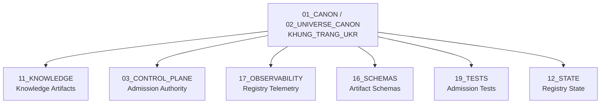

# Khung Trang UKR — Universal Knowledge Registry

> **Origin Architect / Steward:** Trang Phan
> **AMOS_CORE Target:** `v4.4`
> **Conclusion Class:** `AMOS_MODEL`
> **Status:** `PROPOSED_SPECIFICATION`
> **Canonical Status:** `CONDITIONAL`

> **Epistemic Boundary:** The UKR is an `AMOS_MODEL` knowledge governance specification. It defines admission and provenance contracts for knowledge artifacts within the AMOS vault. It does not claim universal knowledge completeness or empirical ground-truth status for registered artifacts.

---

## 1. Architectural Scope

`KHUNG_TRANG_UKR` defines the **Universal Knowledge Registry** — the canonical catalog of all knowledge artifacts admitted into the AMOS operating system. The UKR is the single source of truth for what the system "knows," where each knowledge artifact came from, what scope it claims, what regime it operates under, and how fresh it is.

The UKR is not a knowledge base itself; it is a **registry** — a typed index with provenance metadata that governs admission, lookup, contradiction detection, and eviction of knowledge artifacts. The actual knowledge content lives in the AMOS vault partitions (`11_KNOWLEDGE`, `01_CANON`, `13_MODELS`, etc.); the UKR provides the governance layer above them.

### Registry Entry Structure

Each UKR entry is a typed record:

| Field | Type | Description |
|:--|:--|:--|
| `artifact_id` | `string` | Globally unique identifier (e.g., `AMOS-KT-19X19`) |
| `source_identity` | `enum` | Origin: `SOURCE_CLAIM`, `OBSERVATION`, `DERIVED`, `MODEL`, `DECISION` |
| `provenance` | `list[string]` | Chain of artifact IDs that produced this artifact |
| `scope` | `string` | Domain/scope tag (e.g., `cognitive_grid`, `governance`) |
| `regime` | `enum` | Operational regime: `CANON`, `SPECIFICATION`, `MODEL`, `OBSERVATION` |
| `freshness` | `timestamp + TTL` | Creation time + time-to-live |
| `revision` | `integer` | Monotonically increasing revision number |
| `contradictions` | `list[contradiction_record]` | Known contradictions with other artifacts |
| `admission_status` | `enum` | `PENDING`, `ADMITTED`, `REJECTED`, `DEPRECATED` |

### Knowledge Admission Pipeline

```mermaid
flowchart TD
    A["New Knowledge Artifact"] --> B["Source Identity Check"]
    B -->|"Pass"| C["Provenance Chain Validation"]
    B -->|"Fail"| R1["REJECTED: No source identity"]
    C -->|"Pass"| D["Revision Check"]
    C -->|"Fail"| R2["REJECTED: Broken provenance"]
    D -->|"Pass"| E["Contradiction Check"]
    D -->|"Fail"| R3["REJECTED: Stale revision"]
    E -->|"No contradiction"| F["Freshness Assignment"]
    E -->"Contradiction found"| G["Contradiction Review"]
    G -->|"Resolvable"| F
    G -->|"Unresolvable"| R4["REJECTED: Unresolvable contradiction"]
    F --> H["ADMITTED to UKR"]
```

---

## 2. Governing Invariants

- **INV-U1 (Unique Identity):** Every artifact in the UKR has a globally unique `artifact_id`. No two entries may share an ID. ID collisions are rejected at admission.
- **INV-U2 (Source Identity Required):** An artifact without a valid `source_identity` from $\{$`SOURCE_CLAIM`, `OBSERVATION`, `DERIVED`, `MODEL`, `DECISION`$\}$ is rejected. `UNKNOWN` is not a valid source identity for admission.
- **INV-U3 (Provenance Chain Completeness):** Every `provenance` entry must reference an artifact that exists (or existed) in the UKR. Broken provenance chains block admission.
- **INV-U4 (Monotonic Revision):** For a given `artifact_id`, revisions are monotonically increasing. A new revision supersedes the previous; the previous is marked `DEPRECATED` but not deleted.
- **INV-U5 (Contradiction Detection):** At admission, the new artifact is checked against all existing artifacts in the same `scope`. Contradictions are recorded in both artifacts' `contradictions` fields.
- **INV-U6 (Freshness Expiry):** An artifact whose freshness TTL has expired is marked `STALE`. Stale artifacts cannot be cited as authoritative evidence without revalidation.

---

## 3. Mathematical / Formal Definition

### 3.1 Registry as Typed Map

The UKR is a partial function from artifact IDs to typed records:

$$\text{UKR}: \text{ArtifactID} \rightharpoonup \text{ArtifactRecord}$$

where:

$$\text{ArtifactRecord} = \langle \text{id},\; \text{source},\; \text{provenance},\; \text{scope},\; \text{regime},\; \text{freshness},\; \text{revision},\; \text{contradictions},\; \text{status} \rangle$$

### 3.2 Admission Function

The admission function $\mathcal{A}$ takes a candidate artifact $a$ and the current registry $\text{UKR}_t$:

$$\mathcal{A}(a, \text{UKR}_t) = \begin{cases} \text{ADMITTED} & \text{if } \text{ValidSource}(a) \wedge \text{ValidProvenance}(a, \text{UKR}_t) \wedge \text{ValidRevision}(a, \text{UKR}_t) \wedge \text{NoUnresolvableContradiction}(a, \text{UKR}_t) \\ \text{REJECTED} & \text{otherwise} \end{cases}$$

### 3.3 Contradiction Detection

Two artifacts $a_1, a_2$ in the same scope $s$ are contradictory if:

$$\text{Contradicts}(a_1, a_2) = \text{True} \iff \text{scope}(a_1) = \text{scope}(a_2) = s \wedge \text{claim}(a_1) \cap \text{claim}(a_2) = \emptyset \wedge \text{regime}(a_1) = \text{regime}(a_2)$$

### 3.4 Freshness Model

Each artifact has a freshness tuple:

$$\text{Freshness}(a) = (t_{\text{created}}, \; \text{TTL}_{\text{scope}})$$

The artifact is stale at time $t$ iff:

$$t - t_{\text{created}} > \text{TTL}_{\text{scope}}$$

### 3.5 Registry State Transition

The registry evolves via admission and deprecation:

$$\text{UKR}_{t+1} = \text{UKR}_t \setminus \text{Deprecated}(\text{UKR}_t) \cup \{a \mid \mathcal{A}(a, \text{UKR}_t) = \text{ADMITTED}\}$$

This follows the Khung Trang master state transition: $S_{t+1} = C(F(S_t, U_t))$ where $F$ is the admission function, $U_t$ is the candidate artifact, and $C$ is the contradiction/constraint filter.

---

## 4. MECE Mapping



| AMOS Partition | Binding | Role |
|:--|:--|:--|
| `11_KNOWLEDGE` | Knowledge artifacts | UKR indexes all knowledge partition artifacts |
| `03_CONTROL_PLANE` | Admission authority | Control plane grants admission tokens |
| `17_OBSERVABILITY` | Registry telemetry | Admission/rejection/contradiction events logged |
| `16_SCHEMAS` | Artifact schemas | Typed schemas for each artifact record |
| `19_TESTS` | Admission tests | Validation pipeline for admission candidates |
| `12_STATE` | Registry state | UKR state persisted as versioned state |
| `13_MODELS` | Model artifacts | Models registered as `MODEL` source identity |

---

## 5. Safety Invariants

- **S-1 (No Anonymous Admission):** Artifacts without source identity are rejected. No artifact enters the UKR anonymously.
- **S-2 (No Broken Provenance):** Provenance chains are validated recursively. Any broken link blocks admission and emits a `PROVENANCE_BREAK` event.
- **S-3 (Contradiction Non-Suppression):** Contradictions are recorded, not suppressed. Both artifacts carry the contradiction record. The system does not silently resolve contradictions.
- **S-4 (No Silent Eviction):** Artifacts are deprecated, not deleted. Deprecated artifacts remain queryable for audit but are not cited as authoritative.
- **S-5 (Revision Immutability):** Past revisions are immutable. A new revision creates a new record; the old record is marked `DEPRECATED` with a supersession link.
- **S-6 (Scope Isolation):** Contradiction checks are scoped. An artifact in scope `cognitive_grid` is not checked against artifacts in scope `governance` unless cross-scope contradiction rules are explicitly enabled.

---

## 6. Navigation & Bindings

- **Master MOC:** [[00_ROOT/00_ROOT_MOC|00_ROOT_MOC]]
- **Partition Architecture:** [[00_ROOT/FULL_BRAIN_OS_MECE_ARCHITECTURE|FULL_BRAIN_OS_MECE_ARCHITECTURE]]
- **Universe Canon MOC:** [[01_CANON/02_UNIVERSE_CANON/02_UNIVERSE_CANON_MOC|02_UNIVERSE_CANON_MOC]]
- **Core Laws:** [[01_CANON/01_CORE_LAWS/AMOS_CORE_LAWS|AMOS_CORE_LAWS]]
- **HML Validation Lens:** [[01_CANON/02_UNIVERSE_CANON/KHUNG_TRANG_HML|KHUNG_TRANG_HML]]
- **Framework Functions:** [[01_CANON/02_UNIVERSE_CANON/KHUNG_TRANG_F1_F26|KHUNG_TRANG_F1_F26]]
- **Canonical Laws:** [[01_CANON/02_UNIVERSE_CANON/KHUNG_TRANG_16_CANONICAL_LAWS|KHUNG_TRANG_16_CANONICAL_LAWS]]
- **Structure Tree:** [[01_CANON/02_UNIVERSE_CANON/UST_STRUCTURE_TREE|UST_STRUCTURE_TREE]]
- **Knowledge Partition:** [[11_KNOWLEDGE/11_KNOWLEDGE_MOC|11_KNOWLEDGE_MOC]]
- **Control Plane:** [[03_CONTROL_PLANE/03_CONTROL_PLANE_MOC|03_CONTROL_PLANE_MOC]]
- **Schemas:** [[16_SCHEMAS/16_SCHEMAS_MOC|16_SCHEMAS_MOC]]
- **State:** [[12_STATE/12_STATE_MOC|12_STATE_MOC]]
- **Observability:** [[17_OBSERVABILITY/17_OBSERVABILITY_MOC|17_OBSERVABILITY_MOC]]

---

## 7. Known Gaps & Falsifiers

| ID | Gap / Falsifier | Description |
|:--|:--|:--|
| GAP-1 | **Contradiction Detection Computability** | The contradiction predicate assumes claims can be compared for logical incompatibility. Falsifier: if claims are expressed in natural language or semi-formal notation, automated contradiction detection may produce false positives or miss real contradictions. |
| GAP-2 | **TTL Scope Assignment** | Freshness TTLs are scope-dependent but not yet defined for all AMOS scopes. Falsifier: incorrect TTLs cause either premature staleness or stale-evidence acceptance. |
| GAP-3 | **Cross-Scope Contradiction** | The current model checks contradictions within the same scope only. Falsifier: if cross-scope contradictions are common, the scope isolation invariant must be relaxed with explicit cross-scope rules. |
| GAP-4 | **Registry Scalability** | The UKR is designed as a single registry. Falsifier: at scale (millions of artifacts), a single registry may become a bottleneck; sharding or federated registries may be required. |
| GAP-5 | **Provenance Chain Depth** | Deep provenance chains may be expensive to validate. Falsifier: if average chain depth exceeds practical limits, provenance validation must be probabilistic or cached. |

---

**Parent:** [[01_CANON/02_UNIVERSE_CANON/02_UNIVERSE_CANON_MOC|02_UNIVERSE_CANON_MOC]] · [[00_ROOT/00_HOME|00_HOME]]
