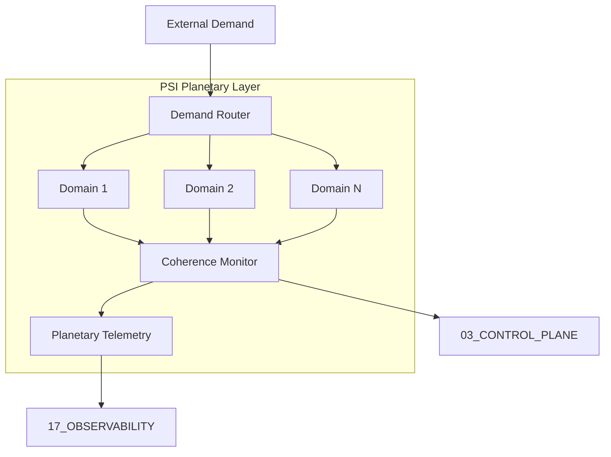
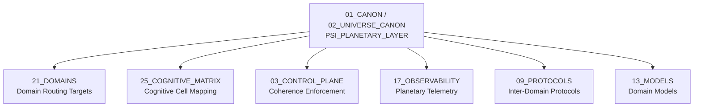

# PSI Planetary Layer — Planetary-Scale Intelligence Coordination

> **Origin Architect / Steward:** Trang Phan
> **AMOS_CORE Target:** `v4.4`
> **Conclusion Class:** `AMOS_MODEL`
> **Status:** `PROPOSED_SPECIFICATION`
> **Canonical Status:** `CONDITIONAL`

> **Epistemic Boundary:** PSI is an `AMOS_MODEL` specification for planetary-scale cognitive coordination. It does not claim deployment at planetary scale. The routing protocols and domain mappings are specification-level contracts, not verified distributed systems implementations.

---

## 1. Architectural Scope

`PSI_PLANETARY_LAYER` defines the **Planetary-Scale Intelligence (PSI)** layer — the topmost coordination tier in the Khung Trang universe canon. PSI governs how cognitive work is routed, distributed, and coordinated across the full AMOS domain spectrum at a scale that transcends single-agent or single-node cognition.

PSI is not a single agent or a centralized brain. It is a **routing and coordination fabric** that maps cognitive demands to the appropriate domains, manages inter-domain knowledge flow, and maintains coherence across the 21-domain AMOS architecture.

### Core Responsibilities

| Responsibility | Description |
|:--|:--|
| **Domain Routing** | Map incoming cognitive demands to the correct AMOS domain(s) |
| **Inter-Domain Coordination** | Manage knowledge flow and dependency resolution across domains |
| **Scale Management** | Handle cognitive load distribution across available processing nodes |
| **Coherence Maintenance** | Ensure cross-domain invariants are not violated |
| **Planetary Telemetry** | Aggregate observability data across all domains |

### PSI Architecture

### 21-Domain Mapping

PSI routes cognitive work across the 21 AMOS domains:

| Domain ID | Domain Name | PSI Role |
|:--|:--|:--|
| D01 | Core Laws | Canonical constraint source |
| D02 | Universe Canon | Ontological framework |
| D03 | Control Plane | Authority and governance |
| D04 | Runtime | Execution environment |
| D05 | Cognitive Organism | Biological intelligence |
| D06 | Evolution | Self-improvement |
| D07 | Knowledge | Knowledge storage |
| D08 | Memory | State persistence |
| D09 | Protocols | Communication contracts |
| D10 | Interfaces | User/system interaction |
| D11 | Knowledge (Advanced) | Advanced knowledge structures |
| D12 | State | State management |
| D13 | Models | Predictive models |
| D14 | Skills | Skill registry |
| D15 | Interfaces (Advanced) | Advanced interface contracts |
| D16 | Schemas | Type schemas |
| D17 | Observability | Telemetry and audit |
| D18 | Security | Authority and risk |
| D19 | Tests | Validation |
| D20 | Operations | Operational procedures |
| D21 | Research | Research and exploration |
| D22 | Governance | Governance economy |
| D23 | Operating Model | Operating procedures |
| D24 | Archive | Historical preservation |
| D25 | Cognitive Matrix | Cognitive pattern mapping |

---

## 2. Governing Invariants

- **INV-P1 (Domain MECE Coverage):** The 21 domains are mutually exclusive and collectively exhaustive for AMOS cognitive work. Every cognitive demand maps to at least one domain.
- **INV-P2 (Routing Determinism):** Given the same demand and domain state, the router produces the same domain assignment. Routing is deterministic, not stochastic.
- **INV-P3 (Coherence Non-Violation):** Inter-domain knowledge flow must not violate cross-domain invariants. The coherence monitor blocks flows that would violate invariants.
- **INV-P4 (Telemetry Completeness):** All domain-level events are aggregated to planetary telemetry. No domain may silently omit events from the telemetry stream.
- **INV-P5 (Scale Boundedness):** The PSI layer enforces cognitive load bounds per domain. Domains exceeding their load bound trigger redistribution.

---

## 3. Mathematical / Formal Definition

### 3.1 Demand Router

The demand router $\mathcal{R}_{\text{PSI}}$ maps a cognitive demand $q$ to a set of target domains:

$$\mathcal{R}_{\text{PSI}}(q, \Sigma_t) = \{d_k \in \mathcal{D} \mid \text{match}(q, d_k, \Sigma_t) > \theta_{\text{route}}\}$$

where $\mathcal{D}$ is the 21-domain set, $\text{match}$ is a relevance scoring function, and $\theta_{\text{route}}$ is the routing threshold.

### 3.2 Coherence Monitor

The coherence monitor checks inter-domain flows:

$$\text{Coherent}(\Delta_{d_i \to d_j}) = \bigwedge_{k} \text{Invariant}_k(d_j, \Delta_{d_i \to d_j})$$

where $\Delta_{d_i \to d_j}$ is the knowledge delta flowing from domain $d_i$ to domain $d_j$.

### 3.3 Load Distribution

The load on each domain is bounded:

$$\forall d_k \in \mathcal{D}: \quad L(d_k) \leq L_{\max}(d_k)$$

When $L(d_k) > L_{\max}(d_k)$, redistribution triggers:

$$\text{Redistribute}(d_k) = \{q \in Q(d_k) \mid \exists d_j \neq d_k: \text{match}(q, d_j) > \theta_{\text{route}} \wedge L(d_j) < L_{\max}(d_j)\}$$

### 3.4 Planetary State

The planetary state is the aggregate of all domain states:

$$\Sigma_{\text{PSI}} = \bigoplus_{k=1}^{21} \Sigma_{d_k}$$

where $\oplus$ is the domain state composition operator, respecting cross-domain invariants.

### 3.5 Cognitive Matrix Integration

PSI integrates with the 25_COGNITIVE_MATRIX by mapping domain outputs to cognitive matrix cells:

$$\text{Map}_{\text{CM}}: \mathcal{D} \times \text{Output} \to \mathcal{G}_{19}$$

This follows the Khung Trang state transition: $S_{t+1} = C(F(S_t, U_t))$ where $F$ is the domain function and $U_t$ is the routed demand.

---

## 4. MECE Mapping

| AMOS Partition | Binding | Role |
|:--|:--|:--|
| `21_DOMAINS` | Domain routing targets | PSI routes demands to these 21 domains |
| `25_COGNITIVE_MATRIX` | Cognitive cell mapping | Domain outputs mapped to matrix cells |
| `03_CONTROL_PLANE` | Coherence enforcement | Control plane enforces cross-domain invariants |
| `17_OBSERVABILITY` | Planetary telemetry | All domain events aggregated here |
| `09_PROTOCOLS` | Inter-domain protocols | Communication contracts between domains |
| `13_MODELS` | Domain models | Each domain has predictive models |
| `23_OPERATING_MODEL` | Operating procedures | PSI follows operating model procedures |

---

## 5. Safety Invariants

- **S-1 (No Unrouted Demand):** Every cognitive demand must be routed to at least one domain. Unrouted demands trigger a `ROUTING_FAILURE` event and fail-closed.
- **S-2 (Coherence Fail-Closed):** If the coherence monitor detects an invariant violation, the inter-domain flow is blocked and a `COHERENCE_VIOLATION` event is emitted.
- **S-3 (No Silent Domain Failure):** If a domain becomes unresponsive, the PSI layer marks it `DEGRADED` and reroutes its demands. Silent failures are not permitted.
- **S-4 (Telemetry Integrity):** Planetary telemetry is append-only. Domains cannot retroactively modify their emitted events.
- **S-5 (Load Redistribution Safety):** Redistribution only moves demands to domains with spare capacity. No domain is overloaded by redistribution.

---

## 6. Navigation & Bindings

- **Master MOC:** [[00_ROOT/00_ROOT_MOC|00_ROOT_MOC]]
- **Partition Architecture:** [[00_ROOT/FULL_BRAIN_OS_MECE_ARCHITECTURE|FULL_BRAIN_OS_MECE_ARCHITECTURE]]
- **Universe Canon MOC:** [[01_CANON/02_UNIVERSE_CANON/02_UNIVERSE_CANON_MOC|02_UNIVERSE_CANON_MOC]]
- **Core Laws:** [[01_CANON/01_CORE_LAWS/AMOS_CORE_LAWS|AMOS_CORE_LAWS]]
- **Canonical Laws:** [[01_CANON/02_UNIVERSE_CANON/KHUNG_TRANG_16_CANONICAL_LAWS|KHUNG_TRANG_16_CANONICAL_LAWS]]
- **Framework Functions:** [[01_CANON/02_UNIVERSE_CANON/KHUNG_TRANG_F1_F26|KHUNG_TRANG_F1_F26]]
- **TPE Prediction Layer:** [[01_CANON/02_UNIVERSE_CANON/TPE_PREDICTION_LAYER|TPE_PREDICTION_LAYER]]
- **TSS 7-Cycle:** [[01_CANON/02_UNIVERSE_CANON/TSS_7_CYCLE|TSS_7_CYCLE]]
- **Meta-Pattern Layer:** [[01_CANON/02_UNIVERSE_CANON/UMPL_META_PATTERN_LAYER|UMPL_META_PATTERN_LAYER]]
- **Cognitive Matrix:** [[25_COGNITIVE_MATRIX/25_COGNITIVE_MATRIX_MOC|25_COGNITIVE_MATRIX_MOC]]
- **Control Plane:** [[03_CONTROL_PLANE/03_CONTROL_PLANE_MOC|03_CONTROL_PLANE_MOC]]
- **Observability:** [[17_OBSERVABILITY/17_OBSERVABILITY_MOC|17_OBSERVABILITY_MOC]]
- **Protocols:** [[09_PROTOCOLS/09_PROTOCOLS_MOC|09_PROTOCOLS_MOC]]
- **Operating Model:** [[23_OPERATING_MODEL/23_OPERATING_MODEL_MOC|23_OPERATING_MODEL_MOC]]

---

## 7. Known Gaps & Falsifiers

| ID | Gap / Falsifier | Description |
|:--|:--|:--|
| GAP-1 | **Planetary Scale Validation** | PSI is specified for planetary scale but has not been tested at scale. Falsifier: if routing or coherence monitoring fails at >1000 domains, the architecture requires sharding. |
| GAP-2 | **Routing Threshold** | The routing threshold $\theta_{\text{route}}$ is not yet calibrated. Falsifier: incorrect thresholds cause either over-routing (all domains) or under-routing (no domain). |
| GAP-3 | **Coherence Computability** | Cross-domain invariant checking may be computationally expensive. Falsifier: if coherence checks are NP-hard for realistic domain counts, approximate methods are needed. |
| GAP-4 | **Domain Count Stability** | The 21-domain count is current but may change. Falsifier: if domain reorganization occurs, the MECE coverage invariant must be re-validated. |
| GAP-5 | **Redistribution Latency** | Load redistribution may introduce latency. Falsifier: if redistribution latency exceeds cognitive loop deadlines, the system must pre-allocate capacity. |

---

**Parent:** [[01_CANON/02_UNIVERSE_CANON/02_UNIVERSE_CANON_MOC|02_UNIVERSE_CANON_MOC]] · [[00_ROOT/00_HOME|00_HOME]]
