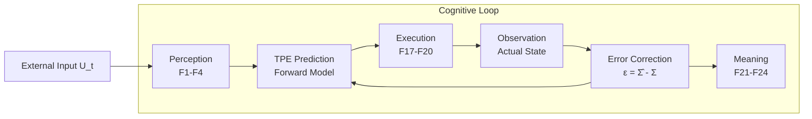
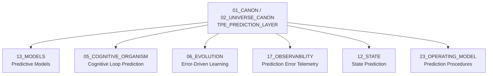

# TPE Prediction Layer — Trang Prediction Engine

> **Origin Architect / Steward:** Trang Phan  
> **AMOS_CORE Target:** `v4.4`  
> **Conclusion Class:** `AMOS_MODEL`  
> **Status:** `PROPOSED_SPECIFICATION`  
> **Canonical Status:** `CONDITIONAL`

> **Epistemic Boundary:** TPE is an `AMOS_MODEL` predictive coding specification. It defines forward-model and error-correction contracts within the cognitive loop. It does not claim neurobiological accuracy; the predictive coding paradigm is used as a structural analogy for state prediction and error-driven learning.

---

## 1. Architectural Scope

`TPE_PREDICTION_LAYER` defines the **Trang Prediction Engine (TPE)** — the predictive coding and forward-modeling layer within the Khung Trang cognitive loop. TPE generates state predictions, compares them against observed outcomes, and produces prediction errors that drive learning, adaptation, and model refinement.

TPE occupies the prediction stage of the cognitive loop, sitting between the perception stage (F1–F4) and the constraint/enforcement stage (F13–F16). It consumes the current state $\Sigma_t$ and generates a predicted next state $\hat{\Sigma}_{t+1}$, which is then compared to the actual observed state $\Sigma_{t+1}$.

### Core Components

| Component | Symbol | Description |
|:--|:--|:--|
| **Forward Model** | $\mathcal{M}_f$ | Generates predicted state from current state and input |
| **Prediction Error** | $\epsilon$ | Difference between predicted and observed state |
| **Error Correction** | $\mathcal{E}_c$ | Updates model based on prediction error |
| **Confidence Estimator** | $\kappa$ | Estimates prediction confidence |
| **Prediction Memory** | $\mathcal{M}_p$ | Stores past predictions for calibration |

### TPE Cognitive Loop Position

---

## 2. Governing Invariants

- **INV-T1 (Prediction Before Action):** The forward model generates $\hat{\Sigma}_{t+1}$ before the system acts. Actions are conditioned on predictions, not solely on current state.
- **INV-T2 (Error Non-Suppression):** Prediction errors $\epsilon$ are never suppressed or hidden. All errors are recorded in prediction memory and emitted to observability.
- **INV-T3 (Model Determinism):** Given the same state $\Sigma_t$ and input $U_t$, the forward model produces the same prediction $\hat{\Sigma}_{t+1}$. Predictions are deterministic.
- **INV-T4 (Confidence Calibration):** The confidence estimator $\kappa$ is calibrated against historical prediction accuracy. Systematically overconfident or underconfident models trigger recalibration.
- **INV-T5 (Error-Driven Learning):** Model updates are driven by prediction errors. Zero error means no update. Large errors produce proportionally larger updates, bounded by evolution safety (KT-14).

---

## 3. Mathematical / Formal Definition

### 3.1 Forward Model

The forward model generates a predicted next state:

$$\hat{\Sigma}_{t+1} = \mathcal{M}_f(\Sigma_t, U_t, \theta_t)$$

where $\theta_t$ are the model parameters at time $t$.

### 3.2 Prediction Error

The prediction error is the divergence between predicted and observed state:

$$\epsilon_{t+1} = \Sigma_{t+1} - \hat{\Sigma}_{t+1} = \Sigma_{t+1} - \mathcal{M}_f(\Sigma_t, U_t, \theta_t)$$

The error magnitude is measured by a domain-appropriate metric $d$:

$$|\epsilon_{t+1}| = d(\Sigma_{t+1}, \hat{\Sigma}_{t+1})$$

### 3.3 Error Correction

The error correction function updates model parameters:

$$\theta_{t+1} = \theta_t + \alpha \cdot \nabla_\theta L(\epsilon_{t+1})$$

where $\alpha$ is the learning rate and $L$ is the loss function:

$$L(\epsilon) = \frac{1}{2} |\epsilon|^2$$

The update is bounded by evolution safety (KT-14):

$$\|\theta_{t+1} - \theta_t\| \leq \Delta_{\max}$$

### 3.4 Confidence Estimation

Prediction confidence is estimated from historical accuracy:

$$\kappa_{t+1} = 1 - \frac{|\epsilon_{t+1}|}{|\Sigma_{t+1}| + \delta}$$

where $\delta$ is a smoothing constant. Confidence is calibrated via:

$$\text{Calibration error} = |\kappa_{t+1} - \text{empirical accuracy over window } W|$$

### 3.5 Connection to Master Equations

TPE implements the state transition prediction:

$$\hat{S}_{t+1} = \mathcal{M}_f(S_t, U_t) \approx C(F(S_t, U_t))$$

The prediction approximates the actual state transition $S_{t+1} = C(F(S_t, U_t))$. The error $\epsilon = S_{t+1} - \hat{S}_{t+1}$ measures the model's deviation from the true dynamics.

### 3.6 Entropy Connection

The prediction error relates to entropy production:

$$\frac{d_i S}{dt} \propto \mathbb{E}[|\epsilon|^2]$$

High prediction error correlates with high internal entropy production, consistent with KT-05.

---

## 4. MECE Mapping

| AMOS Partition | Binding | Role |
|:--|:--|:--|
| `13_MODELS` | Predictive models | TPE forward models are registered here |
| `05_COGNITIVE_ORGANISM` | Cognitive loop | TPE occupies the prediction stage of the cognitive loop |
| `06_EVOLUTION` | Error-driven learning | Prediction errors drive model evolution |
| `17_OBSERVABILITY` | Error telemetry | All prediction errors are logged for calibration |
| `12_STATE` | State prediction | TPE predicts state transitions |
| `23_OPERATING_MODEL` | Prediction procedures | Operating model defines prediction cadence |
| `25_COGNITIVE_MATRIX` | Matrix prediction | TPE predicts cognitive matrix cell changes |

---

## 5. Safety Invariants

- **S-1 (No Silent Prediction Failure):** If the forward model cannot generate a prediction (e.g., insufficient state), a `PREDICTION_FAILURE` event is emitted and the system falls back to reactive mode (no prediction, direct perception-to-action).
- **S-2 (Error Bound):** If prediction error exceeds a domain-specific threshold $|\epsilon| > \epsilon_{\max}$, the model is flagged as `DEGRADED` and recalibration is triggered.
- **S-3 (Update Safety):** Model parameter updates are bounded by $\Delta_{\max}$ to prevent catastrophic forgetting. Updates exceeding the bound are clipped and logged.
- **S-4 (Confidence Floor):** Predictions with confidence $\kappa < \kappa_{\min}$ are marked `LOW_CONFIDENCE` and not used for consequential decisions without human or authority escalation.
- **S-5 (Prediction Memory Integrity):** Prediction memory is append-only. Past predictions cannot be retroactively modified. Calibration uses the immutable history.

---

## 6. Navigation & Bindings

- **Master MOC:** [[00_ROOT/00_ROOT_MOC|00_ROOT_MOC]]
- **Partition Architecture:** [[00_ROOT/FULL_BRAIN_OS_MECE_ARCHITECTURE|FULL_BRAIN_OS_MECE_ARCHITECTURE]]
- **Universe Canon MOC:** [[01_CANON/02_UNIVERSE_CANON/02_UNIVERSE_CANON_MOC|02_UNIVERSE_CANON_MOC]]
- **Core Laws:** [[01_CANON/01_CORE_LAWS/AMOS_CORE_LAWS|AMOS_CORE_LAWS]]
- **Canonical Laws:** [[01_CANON/02_UNIVERSE_CANON/KHUNG_TRANG_16_CANONICAL_LAWS|KHUNG_TRANG_16_CANONICAL_LAWS]]
- **Framework Functions:** [[01_CANON/02_UNIVERSE_CANON/KHUNG_TRANG_F1_F26|KHUNG_TRANG_F1_F26]]
- **PSI Planetary Layer:** [[01_CANON/02_UNIVERSE_CANON/PSI_PLANETARY_LAYER|PSI_PLANETARY_LAYER]]
- **TSS 7-Cycle:** [[01_CANON/02_UNIVERSE_CANON/TSS_7_CYCLE|TSS_7_CYCLE]]
- **Risk Tension Architecture:** [[01_CANON/02_UNIVERSE_CANON/URTA_RISK_TENSION_ARCHITECTURE|URTA_RISK_TENSION_ARCHITECTURE]]
- **Models:** [[13_MODELS/13_MODELS_MOC|13_MODELS_MOC]]
- **Cognitive Organism:** [[05_COGNITIVE_ORGANISM/05_COGNITIVE_ORGANISM_MOC|05_COGNITIVE_ORGANISM_MOC]]
- **Evolution:** [[06_AGENTS/06_AGENTS_MOC|06_AGENTS_MOC]]
- **State:** [[12_STATE/12_STATE_MOC|12_STATE_MOC]]
- **Observability:** [[17_OBSERVABILITY/17_OBSERVABILITY_MOC|17_OBSERVABILITY_MOC]]
- **Operating Model:** [[23_OPERATING_MODEL/23_OPERATING_MODEL_MOC|23_OPERATING_MODEL_MOC]]

---

## 7. Known Gaps & Falsifiers

| ID | Gap / Falsifier | Description |
|:--|:--|:--|
| GAP-1 | **Forward Model Accuracy** | The forward model's accuracy depends on training data and model capacity. Falsifier: if prediction error does not decrease with more data, the model class is insufficient. |
| GAP-2 | **Learning Rate Stability** | The learning rate $\alpha$ must be tuned per domain. Falsifier: if a fixed $\alpha$ causes oscillation or divergence in some domains, adaptive learning rates are required. |
| GAP-3 | **Confidence Calibration** | Confidence estimation assumes historical accuracy predicts future accuracy. Falsifier: in non-stationary environments, past accuracy may not predict future performance. |
| GAP-4 | **Reactive Fallback Safety** | When the forward model fails and the system falls back to reactive mode, safety guarantees may be weaker. Falsifier: if reactive mode produces unsafe actions, the fallback needs additional constraints. |
| GAP-5 | **Multi-Step Prediction** | TPE is specified for single-step prediction ($t \to t+1$). Falsifier: if multi-step horizons are needed, error accumulation may require trajectory-level correction. |

---

**Parent:** [[01_CANON/02_UNIVERSE_CANON/02_UNIVERSE_CANON_MOC|02_UNIVERSE_CANON_MOC]] · [[00_ROOT/00_HOME|00_HOME]]
