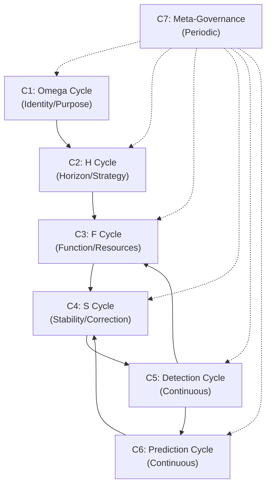
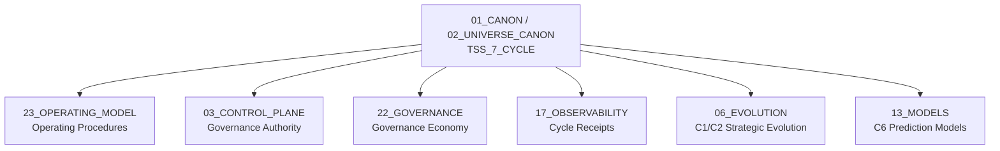

# TSS 7-Cycle — Governance Cycle System

> **Origin Architect / Steward:** Trang Phan
> **AMOS_CORE Target:** `v4.4`
> **Conclusion Class:** `AMOS_MODEL`
> **Status:** `PROPOSED_SPECIFICATION`
> **Canonical Status:** `CONDITIONAL`

> **Epistemic Boundary:** TSS is an `AMOS_MODEL` governance cycle specification. The 7-cycle structure is derived from the Khung Trang framework's governance economy model. It does not claim empirical validation as a political or economic system; it is a specification for AMOS internal governance.

---

## 1. Architectural Scope

`TSS_7_CYCLE` defines the **Trang Governance System (TSS)** — a 7-cycle governance framework that manages detection, prediction, and response across the AMOS operating system. The TSS cycles operate at different time scales and govern different aspects of system behavior, from long-term strategic alignment to short-term tactical correction.

The 7 cycles are organized into four tiers:

| Tier | Cycle | Name | Time Scale | Function |
|:--|:--|:--|:--|:--|
| **Strategic** | C1 | Omega Cycle | Long-term | System identity and purpose alignment |
| **Strategic** | C2 | H Cycle | Seasonal | Horizon scanning and strategic adaptation |
| **Operational** | C3 | F Cycle | Tactical | Function execution and resource allocation |
| **Operational** | C4 | S Cycle | Short-term | Stability maintenance and correction |
| **Detection** | C5 | Detection Cycle | Continuous | Anomaly and pattern detection |
| **Prediction** | C6 | Prediction Cycle | Continuous | Forward prediction via TPE |
| **Meta** | C7 | Meta-Governance Cycle | Periodic | Governance of governance itself |

### Cycle Interaction Diagram

### Cycle Detail

**C1: Omega Cycle (Strategic)**
- Governs system identity, core purpose, and long-term alignment
- Activated when: system identity drift detected, major evolution proposed
- Output: Updated identity statement, purpose alignment score

**C2: H Cycle (Strategic)**
- Governs horizon scanning, strategic adaptation, and environmental response
- Activated when: environmental change detected, strategic review due
- Output: Updated strategy, adaptation directives

**C3: F Cycle (Operational)**
- Governs function execution, resource allocation, and task management
- Activated when: tasks pending, resource reallocation needed
- Output: Execution plan, resource allocation map

**C4: S Cycle (Operational)**
- Governs stability maintenance, correction, and rollback
- Activated when: instability detected, correction needed
- Output: Correction action, stability restoration plan

**C5: Detection Cycle (Continuous)**
- Governs anomaly detection, pattern recognition, and signal processing
- Activated: continuously running
- Output: Detection events, anomaly flags

**C6: Prediction Cycle (Continuous)**
- Governs forward prediction via TPE, outcome forecasting
- Activated: continuously running
- Output: Predicted states, prediction errors

**C7: Meta-Governance Cycle (Periodic)**
- Governs the governance system itself — cycle health, governance rule updates
- Activated when: governance review due, cycle degradation detected
- Output: Governance updates, cycle recalibration

---

## 2. Governing Invariants

- **INV-T1 (Cycle Non-Bypass):** No cycle may be permanently disabled. A disabled cycle triggers a `GOVERNANCE_DEGRADATION` event.
- **INV-T2 (Hierarchical Precedence):** Strategic cycles (C1, C2) take precedence over operational cycles (C3, C4). Operational cycles cannot override strategic directives.
- **INV-T3 (Detection-Prediction Coupling):** C5 (Detection) and C6 (Prediction) are coupled. Detection events feed prediction; prediction errors feed detection recalibration.
- **INV-T4 (Meta-Governance Bound):** C7 can modify governance rules but cannot modify the core axioms (KT-01 to KT-16). Meta-governance is bounded by the canonical law set.
- **INV-T5 (Cycle Receipt):** Every cycle activation produces an immutable governance receipt logged to `17_OBSERVABILITY`.

---

## 3. Mathematical / Formal Definition

### 3.1 Cycle State Machine

Each cycle $C_k$ is a state machine with states $\{DORMANT, ACTIVE, PROCESSING, COMPLETE\}$:

$$C_k : \text{State}_k \times \text{Trigger}_k \to \text{State}_k \times \text{Output}_k$$

### 3.2 Cycle Activation

Cycle $C_k$ activates when its trigger condition is met:

$$\text{Activate}(C_k) \iff \text{Trigger}_k(\Sigma_t, \text{events}_t) = \text{TRUE}$$

### 3.3 Cycle Output

Each cycle produces a typed output:

$$\text{Output}_k = \mathcal{F}_k(\Sigma_t, \text{Input}_k)$$

where $\mathcal{F}_k$ is the cycle's processing function.

### 3.4 Hierarchical Precedence

Strategic cycles constrain operational cycles:

$$\text{Directive}(C_1) \succ \text{Directive}(C_2) \succ \text{Directive}(C_3) \succ \text{Directive}(C_4)$$

An operational cycle cannot produce output that violates a strategic directive:

$$\text{Output}(C_k) \models \text{Directive}(C_j) \quad \forall j < k$$

### 3.5 Detection-Prediction Loop

The detection-prediction coupling forms a feedback loop:

$$\text{Detection}(C_5) \to \text{Prediction}(C_6) \to \text{Correction}(C_4) \to \text{Detection}(C_5)$$

This implements the Khung Trang state transition with prediction:

$$S_{t+1} = C(F(S_t, U_t)), \quad \hat{S}_{t+1} = \mathcal{M}_f(S_t, U_t), \quad \epsilon = S_{t+1} - \hat{S}_{t+1}$$

The correction cycle C4 uses $\epsilon$ to determine if correction is needed.

### 3.6 Meta-Governance Update

C7 updates governance rules subject to axiom bounds:

$$\text{Update}_{C7} = \{r \in \text{Rules} \mid r \notin \text{CoreAxioms}\}$$

No update from C7 may violate KT-01 through KT-16.

---

## 4. MECE Mapping

| AMOS Partition | Binding | Role |
|:--|:--|:--|
| `23_OPERATING_MODEL` | Operating procedures | TSS cycles define operating cadence |
| `03_CONTROL_PLANE` | Governance authority | Control plane enforces cycle directives |
| `22_GOVERNANCE` | Governance economy | TSS is the governance economy's cycle system |
| `17_OBSERVABILITY` | Cycle receipts | All cycle activations logged here |
| `06_EVOLUTION` | Strategic evolution | C1/C2 govern strategic evolution direction |
| `13_MODELS` | Prediction models | C6 uses TPE forward models |
| `18_SECURITY` | Stability enforcement | C4 enforces stability and correction |

---

## 5. Safety Invariants

- **S-1 (No Silent Cycle Skip):** If a cycle is skipped (not activated when its trigger fires), a `CYCLE_SKIP` event is emitted. Repeated skips trigger governance review via C7.
- **S-2 (Directive Enforcement):** Operational cycles cannot override strategic directives. Violations are blocked by the control plane and logged.
- **S-3 (Meta-Governance Axiom Bound):** C7 updates are validated against KT-01 to KT-16. Axiom-violating updates are rejected.
- **S-4 (Cycle Receipt Immutability):** Cycle receipts are write-once. Tampering is detected by hash verification.
- **S-5 (Correction Safety):** C4 correction actions are bounded by the risk tension architecture (URTA). Corrections that exceed risk tolerance are escalated.

---

## 6. Navigation & Bindings

- **Master MOC:** [[00_ROOT/00_ROOT_MOC|00_ROOT_MOC]]
- **Partition Architecture:** [[00_ROOT/FULL_BRAIN_OS_MECE_ARCHITECTURE|FULL_BRAIN_OS_MECE_ARCHITECTURE]]
- **Universe Canon MOC:** [[01_CANON/02_UNIVERSE_CANON/02_UNIVERSE_CANON_MOC|02_UNIVERSE_CANON_MOC]]
- **Core Laws:** [[01_CANON/01_CORE_LAWS/AMOS_CORE_LAWS|AMOS_CORE_LAWS]]
- **Canonical Laws:** [[01_CANON/02_UNIVERSE_CANON/KHUNG_TRANG_16_CANONICAL_LAWS|KHUNG_TRANG_16_CANONICAL_LAWS]]
- **TPE Prediction Layer:** [[01_CANON/02_UNIVERSE_CANON/TPE_PREDICTION_LAYER|TPE_PREDICTION_LAYER]]
- **Risk Tension Architecture:** [[01_CANON/02_UNIVERSE_CANON/URTA_RISK_TENSION_ARCHITECTURE|URTA_RISK_TENSION_ARCHITECTURE]]
- **PSI Planetary Layer:** [[01_CANON/02_UNIVERSE_CANON/PSI_PLANETARY_LAYER|PSI_PLANETARY_LAYER]]
- **UAI Alignment Interface:** [[01_CANON/02_UNIVERSE_CANON/UAI_ALIGNMENT_INTERFACE|UAI_ALIGNMENT_INTERFACE]]
- **Operating Model:** [[23_OPERATING_MODEL/23_OPERATING_MODEL_MOC|23_OPERATING_MODEL_MOC]]
- **Control Plane:** [[03_CONTROL_PLANE/03_CONTROL_PLANE_MOC|03_CONTROL_PLANE_MOC]]
- **Governance:** [[23_OPERATING_MODEL/23_OPERATING_MODEL_MOC|23_OPERATING_MODEL_MOC]]
- **Observability:** [[17_OBSERVABILITY/17_OBSERVABILITY_MOC|17_OBSERVABILITY_MOC]]
- **Evolution:** [[06_AGENTS/06_AGENTS_MOC|06_AGENTS_MOC]]
- **Security:** [[18_SECURITY/18_SECURITY_MOC|18_SECURITY_MOC]]

---

## 7. Known Gaps & Falsifiers

| ID | Gap / Falsifier | Description |
|:--|:--|:--|
| GAP-1 | **7-Cycle Sufficiency** | The 7-cycle count is framework-derived. Falsifier: if governance requires additional cycles (e.g., a dedicated ethics cycle), the set must expand. |
| GAP-2 | **Cycle Time Scale Calibration** | Time scales for each cycle are not yet precisely defined. Falsifier: if cycle activation frequency is too high or too low, the system either over-governs or under-governs. |
| GAP-3 | **Meta-Governance Recursion Depth** | C7 governs governance, but what governs C7? Falsifier: if C7 requires its own meta-cycle, the recursion may not terminate (related to KT-15). |
| GAP-4 | **Continuous Cycle Overhead** | C5 and C6 run continuously. Falsifier: if continuous operation consumes excessive resources, duty-cycling or event-driven activation may be needed. |
| GAP-5 | **Cross-Cycle Conflict** | Multiple cycles may produce conflicting directives. Falsifier: if the precedence hierarchy does not resolve all conflicts, additional conflict resolution rules are needed. |

---

**Parent:** [[01_CANON/02_UNIVERSE_CANON/02_UNIVERSE_CANON_MOC|02_UNIVERSE_CANON_MOC]] · [[00_ROOT/00_HOME|00_HOME]]
