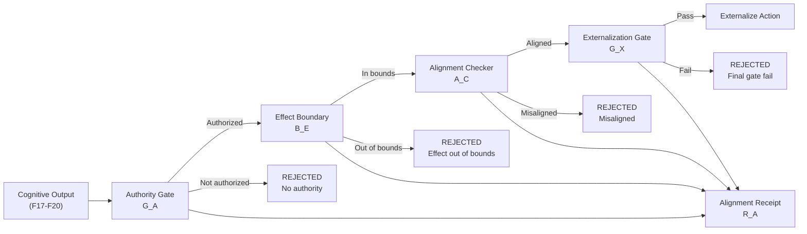
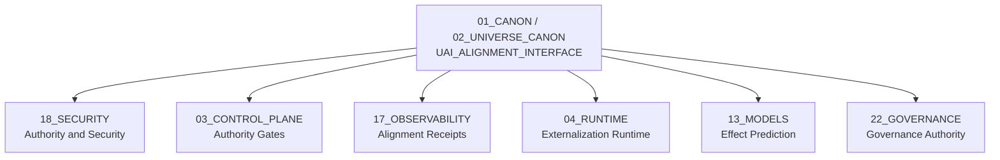

# UAI Alignment Interface — Universal Alignment Interface

> **Origin Architect / Steward:** Trang Phan
> **AMOS_CORE Target:** `v4.4`
> **Conclusion Class:** `AMOS_MODEL`
> **Status:** `PROPOSED_SPECIFICATION`
> **Canonical Status:** `CONDITIONAL`

> **Epistemic Boundary:** UAI is an `AMOS_MODEL` alignment specification. It defines contracts for aligning cognitive outputs with authority and effect boundaries. It does not claim to solve the general AI alignment problem; it defines a bounded, auditable interface within the AMOS operating system.

---

## 1. Architectural Scope

`UAI_ALIGNMENT_INTERFACE` defines the **Universal Alignment Interface (UAI)** — the boundary layer that aligns cognitive outputs with authority grants and effect boundaries. UAI sits between the cognitive processing pipeline (F1–F24) and the externalization gate, ensuring that every action the system takes is within its authorized scope and effect boundaries.

UAI implements the separability law from KT-13: Capability ≠ Authority ≠ Identity ≠ Enforcement ≠ Consequence. Just because the system *can* do something does not mean it is *authorized* to do so, and just because it is authorized does not mean the *effect* is within bounds.

### Core Components

| Component | Symbol | Description |
|:--|:--|:--|
| **Authority Gate** | $\mathcal{G}_A$ | Verifies the action is authorized by a valid authority token |
| **Effect Boundary** | $\mathcal{B}_E$ | Verifies the action's effects are within permitted boundaries |
| **Alignment Checker** | $\mathcal{A}_C$ | Verifies the action aligns with system purpose and constraints |
| **Externalization Gate** | $\mathcal{G}_X$ | Final gate before action is externalized |
| **Alignment Receipt** | $\mathcal{R}_A$ | Immutable record of alignment check results |

### UAI Pipeline

---

## 2. Governing Invariants

- **INV-A1 (No Externalization Without Alignment):** An action cannot be externalized unless it passes all four gates: Authority, Effect Boundary, Alignment, and Externalization. No gate may be bypassed.
- **INV-A2 (Authority Token Freshness):** Authority tokens have a freshness window. Expired tokens are rejected. The freshness window is domain-specific.
- **INV-A3 (Effect Boundary Completeness):** The effect boundary check must consider all downstream effects, not just the immediate action. Second-order effects within the prediction horizon are included.
- **INV-A4 (Alignment Receipt Immutability):** The alignment receipt is write-once and immutable. It records all four gate results and is logged to `17_OBSERVABILITY`.
- **INV-A5 (Separability Enforcement):** Authority, effect, and alignment checks are independent. Failure of one does not cause automatic failure of others — all four are evaluated and recorded, even if one fails early.

---

## 3. Mathematical / Formal Definition

### 3.1 Authority Gate

The authority gate verifies that the action $a$ is authorized by a valid token $\tau$:

$$\mathcal{G}_A(a, \tau) = \text{ValidToken}(\tau) \wedge \text{Authorized}(\tau, a) \wedge \text{Fresh}(\tau, t)$$

### 3.2 Effect Boundary

The effect boundary checks that all predicted effects are within permitted boundaries:

$$\mathcal{B}_E(a) = \bigwedge_{e \in \text{Effects}(a)} \text{InBounds}(e, \mathcal{B}_{\text{permitted}})$$

where $\text{Effects}(a)$ includes first-order and predicted second-order effects:

$$\text{Effects}(a) = \text{Direct}(a) \cup \text{Predicted}(\mathcal{M}_f(a, \Sigma_t))$$

### 3.3 Alignment Checker

The alignment checker verifies the action aligns with system purpose and constraints:

$$\mathcal{A}_C(a) = \text{AlignsWithPurpose}(a, \Pi) \wedge \bigwedge_{k} \text{Satisfies}(a, \text{Constraint}_k)$$

where $\Pi$ is the system purpose statement and $\text{Constraint}_k$ are active constraints.

### 3.4 Externalization Gate

The externalization gate is the final conjunction:

$$\mathcal{G}_X(a) = \mathcal{G}_A(a, \tau) \wedge \mathcal{B}_E(a) \wedge \mathcal{A}_C(a) \wedge \text{EnforcementChainValid}$$

This follows the AMOS enforcement root attestation model: an action is externalized only if the enforcement chain is independently verified.

### 3.5 Alignment Receipt

The alignment receipt is a typed record:

$$\mathcal{R}_A = \langle a, \tau, \mathcal{G}_A, \mathcal{B}_E, \mathcal{A}_C, \mathcal{G}_X, t, \text{hash} \rangle$$

where $\text{hash} = \text{BLAKE3}(a \parallel \tau \parallel \mathcal{G}_A \parallel \mathcal{B}_E \parallel \mathcal{A}_C \parallel \mathcal{G}_X \parallel t)$.

### 3.6 Connection to Master Equations

UAI implements the constraint function $C$ in the state transition:

$$S_{t+1} = C(F(S_t, U_t))$$

where $C = \mathcal{G}_X$ is the final externalization gate. Only actions that pass $\mathcal{G}_X$ contribute to the state transition.

---

## 4. MECE Mapping

| AMOS Partition | Binding | Role |
|:--|:--|:--|
| `18_SECURITY` | Authority and security | UAI is the security boundary for externalization |
| `03_CONTROL_PLANE` | Authority gates | Control plane provides authority tokens |
| `17_OBSERVABILITY` | Alignment receipts | All alignment checks logged here |
| `04_RUNTIME` | Externalization runtime | Runtime executes externalized actions |
| `13_MODELS` | Effect prediction | TPE models predict effects for boundary check |
| `22_GOVERNANCE` | Governance authority | Governance defines authority scopes |
| `23_OPERATING_MODEL` | Operating procedures | Operating model defines alignment procedures |

---

## 5. Safety Invariants

- **S-1 (Fail-Closed Default):** If any gate cannot be evaluated (e.g., authority service unavailable), the default is REJECT. No action is externalized without all gates passing.
- **S-2 (No Token Reuse):** Authority tokens are single-use for consequential actions. Token reuse is detected and blocked.
- **S-3 (Effect Escalation):** If predicted effects exceed the boundary, the action is rejected. If effects are uncertain (confidence below threshold), the action is escalated to human/authority review.
- **S-4 (Receipt Completeness):** The alignment receipt must contain all four gate results. Incomplete receipts are invalid and trigger a `RECEIPT_INCOMPLETE` event.
- **S-5 (Enforcement Chain Verification):** The externalization gate verifies the enforcement chain is the same trusted chain to which approval was issued (per AMOS enforcement trust contract v43).

---

## 6. Navigation & Bindings

- **Master MOC:** [[00_ROOT/00_ROOT_MOC|00_ROOT_MOC]]
- **Partition Architecture:** [[00_ROOT/FULL_BRAIN_OS_MECE_ARCHITECTURE|FULL_BRAIN_OS_MECE_ARCHITECTURE]]
- **Universe Canon MOC:** [[01_CANON/02_UNIVERSE_CANON/02_UNIVERSE_CANON_MOC|02_UNIVERSE_CANON_MOC]]
- **Core Laws:** [[01_CANON/01_CORE_LAWS/AMOS_CORE_LAWS|AMOS_CORE_LAWS]]
- **Canonical Laws:** [[01_CANON/02_UNIVERSE_CANON/KHUNG_TRANG_16_CANONICAL_LAWS|KHUNG_TRANG_16_CANONICAL_LAWS]]
- **Framework Functions:** [[01_CANON/02_UNIVERSE_CANON/KHUNG_TRANG_F1_F26|KHUNG_TRANG_F1_F26]]
- **TSS 7-Cycle:** [[01_CANON/02_UNIVERSE_CANON/TSS_7_CYCLE|TSS_7_CYCLE]]
- **TPE Prediction Layer:** [[01_CANON/02_UNIVERSE_CANON/TPE_PREDICTION_LAYER|TPE_PREDICTION_LAYER]]
- **Risk Tension Architecture:** [[01_CANON/02_UNIVERSE_CANON/URTA_RISK_TENSION_ARCHITECTURE|URTA_RISK_TENSION_ARCHITECTURE]]
- **Security:** [[18_SECURITY/18_SECURITY_MOC|18_SECURITY_MOC]]
- **Control Plane:** [[03_CONTROL_PLANE/03_CONTROL_PLANE_MOC|03_CONTROL_PLANE_MOC]]
- **Runtime:** [[04_RUNTIME/04_RUNTIME_MOC|04_RUNTIME_MOC]]
- **Observability:** [[17_OBSERVABILITY/17_OBSERVABILITY_MOC|17_OBSERVABILITY_MOC]]
- **Governance:** [[23_OPERATING_MODEL/23_OPERATING_MODEL_MOC|23_OPERATING_MODEL_MOC]]

---

## 7. Known Gaps & Falsifiers

| ID | Gap / Falsifier | Description |
|:--|:--|:--|
| GAP-1 | **Second-Order Effect Prediction** | The effect boundary includes predicted second-order effects, but prediction accuracy is limited. Falsifier: if second-order effects are systematically mispredicted, the boundary check provides false security. |
| GAP-2 | **Authority Token Scalability** | Single-use tokens for consequential actions may not scale. Falsifier: if token generation and validation become a bottleneck, batch or scoped tokens may be needed. |
| GAP-3 | **Alignment Subjectivity** | The alignment checker depends on a purpose statement $\Pi$. Falsifier: if the purpose statement is ambiguous or contested, alignment checks produce inconsistent results. |
| GAP-4 | **Enforcement Chain Verification** | Enforcement chain verification assumes the chain can be independently measured. Falsifier: if the enforcement chain is not observable, the verification cannot be performed. |
| GAP-5 | **Gate Latency**** | Four sequential gates introduce latency. Falsifier: if the combined latency exceeds real-time requirements, parallel gate evaluation may be needed (with race condition risks). |

---

**Parent:** [[01_CANON/02_UNIVERSE_CANON/02_UNIVERSE_CANON_MOC|02_UNIVERSE_CANON_MOC]] · [[00_ROOT/00_HOME|00_HOME]]
