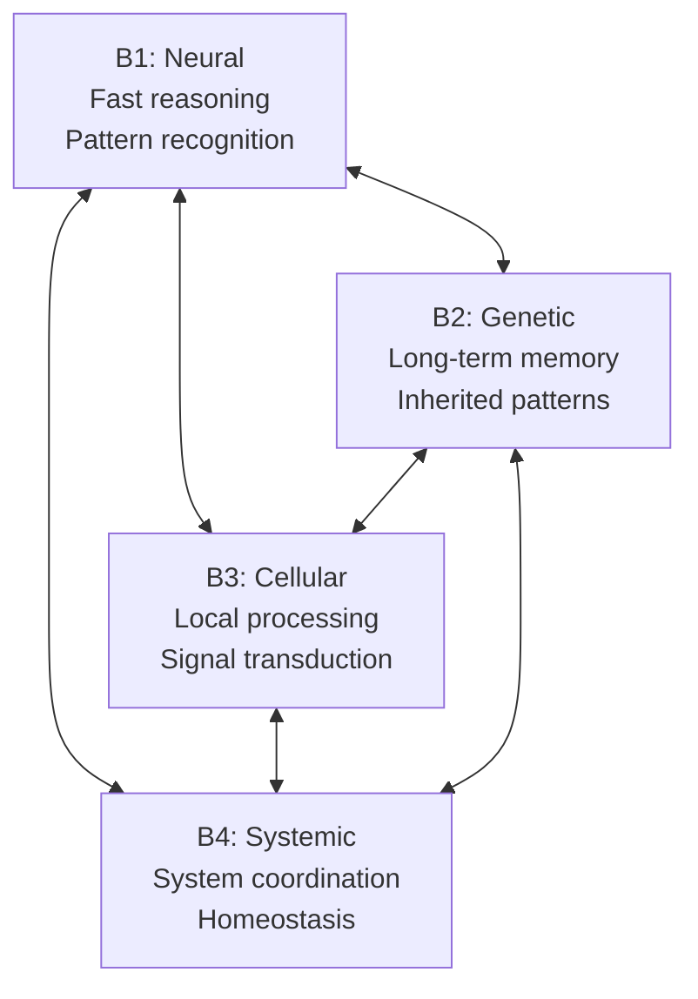
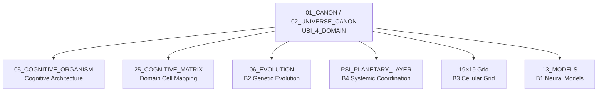

# UBI 4 Domain — Universal Biological Intelligence Domains

> **Origin Architect / Steward:** Trang Phan  
> **AMOS_CORE Target:** `v4.4`  
> **Conclusion Class:** `AMOS_MODEL`  
> **Status:** `PROPOSED_SPECIFICATION`  
> **Canonical Status:** `CONDITIONAL`

> **Epistemic Boundary:** UBI is an `AMOS_MODEL` specification that maps biological intelligence modalities to AMOS cognitive architecture. The four domains are structural analogies, not claims of biological implementation. The framework is `SOURCE_GROUNDED` in the Khung Trang ontological spine, not in empirical biology.

---

## 1. Architectural Scope

`UBI_4_DOMAIN` defines the **Universal Biological Intelligence (UBI)** four-domain model — a structural mapping of biological intelligence modalities onto the AMOS cognitive architecture. The four domains represent different scales and modalities of intelligence found in biological systems, providing a template for diverse cognitive processing patterns within the AMOS framework.

The four domains are:

| Domain | Name | Biological Analogy | Cognitive Role | Load Limit |
|:--|:--|:--|:--|:--|
| **B1** | Neural Intelligence | Brain/neural networks | Fast pattern recognition, reasoning, decision | High |
| **B2** | Genetic Intelligence | DNA/epigenetic encoding | Long-term memory, inherited patterns, slow adaptation | Low |
| **B3** | Cellular Intelligence | Cell signaling/molecular networks | Local processing, signal transduction, parallel computation | Medium |
| **B4** | Systemic Intelligence | Immune/endocrine/holistic systems | System-wide coordination, homeostasis, adaptive response | Medium |

### Domain Interaction

### Domain Characteristics

**B1: Neural Intelligence**
- **Speed:** Fast (milliseconds to seconds)
- **Scope:** Pattern recognition, reasoning, decision-making, real-time response
- **Analogy:** Neural networks, synaptic plasticity, cortical processing
- **AMOS Mapping:** Primary cognitive loop (F1–F24), reasoning engine, decision pipeline
- **Load Limit:** High — can sustain continuous operation but requires rest/recovery cycles

**B2: Genetic Intelligence**
- **Speed:** Very slow (generations to eons)
- **Scope:** Inherited patterns, long-term memory, evolutionary adaptation, deep structure
- **Analogy:** DNA encoding, epigenetic markers, evolutionary memory
- **AMOS Mapping:** Core axioms (KT-01 to KT-16), canonical laws, deep structural invariants
- **Load Limit:** Low — changes rarely, high cost of modification

**B3: Cellular Intelligence**
- **Speed:** Medium (seconds to minutes)
- **Scope:** Local processing, signal transduction, parallel computation, modular response
- **Analogy:** Cell signaling pathways, molecular computation, local regulatory networks
- **AMOS Mapping:** Domain-level processing (21 domains), modular cognitive cells (19×19 grid)
- **Load Limit:** Medium — parallel but bounded by local resources

**B4: Systemic Intelligence**
- **Speed:** Medium (minutes to hours)
- **Scope:** System-wide coordination, homeostasis, adaptive response, holistic integration
- **Analogy:** Immune system, endocrine system, autonomic nervous system
- **AMOS Mapping:** PSI planetary layer, TSS governance cycles, coherence monitoring
- **Load Limit:** Medium — coordinates across all domains, bounded by inter-domain bandwidth

---

## 2. Governing Invariants

- **INV-B1 (Domain MECE):** The four domains are mutually exclusive and collectively exhaustive for biological intelligence modalities within AMOS. Every cognitive process maps to at least one domain.
- **INV-B2 (Load Limit Enforcement):** Each domain has a cognitive load limit. Exceeding the limit triggers load shedding or domain redistribution.
- **INV-B3 (Cross-Domain Communication):** Domains communicate via typed contracts. Cross-domain communication is explicit, not implicit.
- **INV-B4 (Genetic Immutability):** B2 (Genetic) domain changes require governance approval (C1 Omega cycle). Genetic-level changes are never autonomous.
- **INV-B5 (Neural Primacy for Real-Time):** B1 (Neural) domain is primary for real-time cognitive processing. Other domains support but do not override neural decisions in real-time contexts.

---

## 3. Mathematical / Formal Definition

### 3.1 Domain Definition

Each domain $B_k$ is a typed processing unit with a load function:

$$B_k = \langle \text{Processor}_k, \text{LoadLimit}_k, \text{Speed}_k, \text{Scope}_k \rangle$$

### 3.2 Load Function

The cognitive load on each domain is:

$$L(B_k, t) = \sum_{q \in Q_t} \text{cost}(q, B_k) \cdot \mathbb{1}[\text{assigned}(q) = B_k]$$

Load shedding triggers when:

$$L(B_k, t) > \text{LoadLimit}_k$$

### 3.3 Domain Assignment

A cognitive demand $q$ is assigned to the domain with the best speed-scope match:

$$\text{Assign}(q) = \arg\min_{B_k} \frac{\text{ResponseTime}(B_k, q)}{\text{ScopeMatch}(B_k, q)}$$

### 3.4 Cross-Domain Communication

Cross-domain communication is typed:

$$\text{Comm}(B_i, B_j) = \langle \text{message\_type}, \text{payload}, \text{contract\_id} \rangle$$

Each message must reference a valid communication contract.

### 3.5 Genetic Update Protocol

B2 domain updates follow the governance protocol:

$$\Delta B_2 \to \text{C1 Omega Cycle Review} \to \text{Authority Approval} \to \text{Apply}$$

No B2 update is autonomous. This enforces KT-14 (Evolution Safety) at the deepest level.

### 3.6 Systemic Coordination

B4 domain coordinates across all domains:

$$\text{Coordinate}(B_4) = \bigoplus_{k=1}^{4} \text{State}(B_k) \to \text{HomeostasisAdjustment}$$

This follows the Khung Trang equilibrium tendency (KT-08): the systemic domain drives the system toward equilibrium.

---

## 4. MECE Mapping

| AMOS Partition | Binding | Role |
|:--|:--|:--|
| `05_COGNITIVE_ORGANISM` | Cognitive architecture | UBI maps to the cognitive organism's processing modalities |
| `25_COGNITIVE_MATRIX` | Domain cell mapping | Each domain maps to cognitive matrix cells |
| `06_EVOLUTION` | B2 genetic evolution | Genetic domain changes governed by evolution layer |
| `PSI_PLANETARY_LAYER` | B4 systemic coordination | Systemic domain coordinates at planetary scale |
| `19×19 Grid` | B3 cellular grid | Cellular domain maps to 19×19 cognitive cells |
| `13_MODELS` | B1 neural models | Neural domain uses predictive models |
| `01_CORE_LAWS` | B2 deep structure | Genetic domain encodes core axioms |

---

## 5. Safety Invariants

- **S-1 (Genetic Change Governance):** B2 domain changes require C1 Omega cycle review and authority approval. No autonomous genetic changes are permitted.
- **S-2 (Load Shedding Safety):** When a domain exceeds its load limit, shedding is prioritized: lowest-priority demands are shed first. Critical demands are never shed.
- **S-3 (Cross-Domain Contract Validation):** All cross-domain messages are contract-validated. Messages without valid contracts are dropped and logged.
- **S-4 (Neural Override Safety):** B1 neural overrides of other domains are permitted only in real-time emergency contexts. Non-emergency overrides require governance approval.
- **S-5 (Systemic Homeostasis Bound):** B4 homeostasis adjustments are bounded by the risk tension architecture (URTA). Adjustments exceeding risk tolerance are escalated.

---

## 6. Navigation & Bindings

- **Master MOC:** [[00_ROOT/00_ROOT_MOC|00_ROOT_MOC]]
- **Partition Architecture:** [[00_ROOT/FULL_BRAIN_OS_MECE_ARCHITECTURE|FULL_BRAIN_OS_MECE_ARCHITECTURE]]
- **Universe Canon MOC:** [[01_CANON/02_UNIVERSE_CANON/02_UNIVERSE_CANON_MOC|02_UNIVERSE_CANON_MOC]]
- **Core Laws:** [[01_CANON/01_CORE_LAWS/AMOS_CORE_LAWS|AMOS_CORE_LAWS]]
- **Canonical Laws:** [[01_CANON/02_UNIVERSE_CANON/KHUNG_TRANG_16_CANONICAL_LAWS|KHUNG_TRANG_16_CANONICAL_LAWS]]
- **Framework Functions:** [[01_CANON/02_UNIVERSE_CANON/KHUNG_TRANG_F1_F26|KHUNG_TRANG_F1_F26]]
- **19×19 Grid:** [[01_CANON/02_UNIVERSE_CANON/KHUNG_TRANG_19X19|KHUNG_TRANG_19X19]]
- **PSI Planetary Layer:** [[01_CANON/02_UNIVERSE_CANON/PSI_PLANETARY_LAYER|PSI_PLANETARY_LAYER]]
- **TSS 7-Cycle:** [[01_CANON/02_UNIVERSE_CANON/TSS_7_CYCLE|TSS_7_CYCLE]]
- **Risk Tension Architecture:** [[01_CANON/02_UNIVERSE_CANON/URTA_RISK_TENSION_ARCHITECTURE|URTA_RISK_TENSION_ARCHITECTURE]]
- **Cognitive Organism:** [[05_COGNITIVE_ORGANISM/05_COGNITIVE_ORGANISM_MOC|05_COGNITIVE_ORGANISM_MOC]]
- **Cognitive Matrix:** [[25_COGNITIVE_MATRIX/25_COGNITIVE_MATRIX_MOC|25_COGNITIVE_MATRIX_MOC]]
- **Evolution:** [[06_AGENTS/06_AGENTS_MOC|06_AGENTS_MOC]]
- **Models:** [[13_MODELS/13_MODELS_MOC|13_MODELS_MOC]]

---

## 7. Known Gaps & Falsifiers

| ID | Gap / Falsifier | Description |
|:--|:--|:--|
| GAP-1 | **Four-Domain Sufficiency** | The four-domain model may not capture all biological intelligence modalities. Falsifier: if a fifth modality (e.g., quantum biological intelligence) is identified, the model must expand. |
| GAP-2 | **Biological Analogy Validity** | The biological analogies are structural, not empirical. Falsifier: if the analogies lead to incorrect architectural decisions, they should be replaced with purely functional domain definitions. |
| GAP-3 | **Load Limit Calibration** | Load limits are specified qualitatively (High/Medium/Low). Falsifier: without quantitative calibration, load shedding may be premature or delayed. |
| GAP-4 | **Genetic Immutability vs. Adaptation** | B2 genetic immutability may be too rigid. Falsifier: if the system cannot adapt its deep structure quickly enough to respond to environmental changes, the immutability invariant must be relaxed with governed fast-track updates. |
| GAP-5 | **Cross-Domain Latency** | Cross-domain communication introduces latency. Falsifier: if latency exceeds real-time requirements for B1 neural processing, asynchronous or predictive cross-domain communication may be needed. |

---

**Parent:** [[01_CANON/02_UNIVERSE_CANON/02_UNIVERSE_CANON_MOC|02_UNIVERSE_CANON_MOC]] · [[00_ROOT/00_HOME|00_HOME]]
