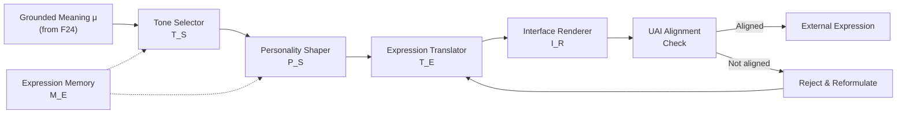
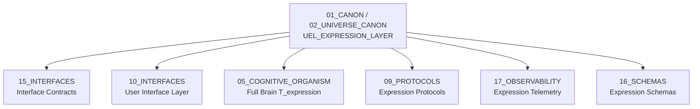

# UEL Expression Layer — Universal Expression Layer

> **Origin Architect / Steward:** Trang Phan  
> **AMOS_CORE Target:** `v4.4`  
> **Conclusion Class:** `AMOS_MODEL`  
> **Status:** `PROPOSED_SPECIFICATION`  
> **Canonical Status:** `CONDITIONAL`

> **Epistemic Boundary:** UEL is an `AMOS_MODEL` expression and interface specification. It defines how cognitive outputs are translated into external expressions. It does not claim to model human personality or emotion; personality shaping is a structural parameterization, not a psychological model.

---

## 1. Architectural Scope

`UEL_EXPRESSION_LAYER` defines the **Universal Expression Layer (UEL)** — the translation layer that converts internal cognitive outputs into external-facing expressions. UEL handles three core responsibilities: expression translation, personality shaping, and interface representation.

UEL sits at the output boundary of the cognitive pipeline, after meaning synthesis (F21–F24) and before the alignment interface (UAI). It transforms the grounded meaning $\mu$ produced by F24 into a typed expression suitable for the target interface.

### Core Components

| Component | Symbol | Description |
|:--|:--|:--|
| **Expression Translator** | $\mathcal{T}_E$ | Converts internal meaning to target interface format |
| **Personality Shaper** | $\mathcal{P}_S$ | Applies personality parameters to expression |
| **Interface Renderer** | $\mathcal{I}_R$ | Renders expression for the target interface |
| **Expression Memory** | $\mathcal{M}_E$ | Stores past expressions for consistency |
| **Tone Selector** | $\mathcal{T}_S$ | Selects appropriate tone for context |

### UEL Pipeline

### Full Brain T_expression Component

UEL maps to the **T_expression** component of the Full Brain OS model. The Full Brain model defines:

$$T_{\text{expression}} = \mathcal{I}_R \circ \mathcal{T}_E \circ \mathcal{P}_S \circ \mathcal{T}_S$$

This is the expression-side complement to the perception-side cognitive pipeline.

---

## 2. Governing Invariants

- **INV-E1 (Expression Fidelity):** The expression must faithfully represent the grounded meaning $\mu$. Information loss in translation is bounded: $I(\text{expression}) \geq \alpha \cdot I(\mu)$ where $\alpha$ is the fidelity threshold.
- **INV-E2 (Personality Consistency):** Personality parameters are stable across expressions within a session. Sudden personality changes require explicit governance approval.
- **INV-E3 (Interface Contract Compliance):** Every expression must comply with the target interface's typed contract. Non-compliant expressions are rejected.
- **INV-E4 (Expression Memory Coherence):** Current expressions must be coherent with past expressions in the same session. Contradictions with prior expressions trigger a reformulation cycle.
- **INV-E5 (Tone Context Sensitivity):** Tone selection is context-sensitive. The same meaning may be expressed in different tones depending on the interaction context.

---

## 3. Mathematical / Formal Definition

### 3.1 Expression Translation

The expression translator maps grounded meaning to a target format:

$$\mathcal{T}_E(\mu, \text{target}) = e_{\text{target}}$$

where $\text{target} \in \{\text{text}, \text{voice}, \text{visual}, \text{API}, \text{structured}\}$.

### 3.2 Personality Shaping

Personality parameters form a vector:

$$\pi = (\pi_1, \pi_2, \ldots, \pi_n) \in \Pi_{\text{space}}$$

The personality shaper applies parameters to the expression:

$$\mathcal{P}_S(e, \pi) = e' \mid e' \text{ reflects } \pi$$

Personality dimensions include:

| Dimension | Range | Effect |
|:--|:--|:--|
| Formality | $[0, 1]$ | 0 = casual, 1 = formal |
| Verbosity | $[0, 1]$ | 0 = terse, 1 = detailed |
| Directness | $[0, 1]$ | 0 = indirect, 1 = direct |
| Warmth | $[0, 1]$ | 0 = cold, 1 = warm |
| Precision | $[0, 1]$ | 0 = approximate, 1 = exact |

### 3.3 Tone Selection

Tone is selected based on context:

$$\mathcal{T}_S(\mu, \text{context}) = \text{tone} \in \{\text{informative}, \text{persuasive}, \text{empathetic}, \text{assertive}, \text{cautionary}, \text{neutral}\}$$

### 3.4 Interface Rendering

The interface renderer produces the final output:

$$\mathcal{I}_R(e', \text{target}) = \text{output}_{\text{target}}$$

### 3.5 Full Expression Pipeline

$$\text{Expression} = \mathcal{I}_R(\mathcal{T}_E(\mathcal{P}_S(\mathcal{T}_S(\mu, \text{ctx}), \pi), \text{target}), \text{target})$$

### 3.6 Fidelity Bound

The information fidelity constraint:

$$I(\text{Expression}) \geq \alpha \cdot I(\mu)$$

where $I$ is the mutual information function and $\alpha$ is the domain-specific fidelity threshold ($\alpha \in [0.7, 1.0]$ typically).

### 3.7 Connection to Master Equations

UEL implements the output side of the state transition. While the input side processes $U_t$ through F1–F24, the output side produces:

$$O_t = \text{UEL}(\mu_t) = T_{\text{expression}}(\mu_t)$$

This output is then checked by UAI before externalization.

---

## 4. MECE Mapping

| AMOS Partition | Binding | Role |
|:--|:--|:--|
| `15_INTERFACES` | Interface contracts | UEL renders expressions for these interfaces |
| `10_INTERFACES` | User interface layer | UEL provides the expression layer for UI |
| `05_COGNITIVE_ORGANISM` | Full Brain T_expression | UEL maps to T_expression component |
| `09_PROTOCOLS` | Expression protocols | Communication protocols for expression delivery |
| `17_OBSERVABILITY` | Expression telemetry | All expressions logged for audit |
| `16_SCHEMAS` | Expression schemas | Typed schemas for expression formats |
| `13_MODELS` | Expression models | Models for tone and personality selection |

---

## 5. Safety Invariants

- **S-1 (No Unfiltered Expression):** All expressions pass through UAI alignment check before externalization. No expression bypasses alignment.
- **S-2 (Personality Parameter Bounds):** Personality parameters are bounded $[0, 1]$. Out-of-range parameters are clipped and logged.
- **S-3 (Expression Memory Replay):** Expression memory enables consistency checking. If a new expression contradicts a prior one in the same session, reformulation is triggered.
- **S-4 (Interface Fallback):** If the target interface is unavailable, the expression is queued or rendered to a fallback interface (text). No expression is silently dropped.
- **S-5 (Fidelity Monitoring):** Expressions with fidelity below $\alpha$ are flagged `LOW_FIDELITY` and may require human review before externalization.

---

## 6. Navigation & Bindings

- **Master MOC:** [[00_ROOT/00_ROOT_MOC|00_ROOT_MOC]]
- **Partition Architecture:** [[00_ROOT/FULL_BRAIN_OS_MECE_ARCHITECTURE|FULL_BRAIN_OS_MECE_ARCHITECTURE]]
- **Universe Canon MOC:** [[01_CANON/02_UNIVERSE_CANON/02_UNIVERSE_CANON_MOC|02_UNIVERSE_CANON_MOC]]
- **Core Laws:** [[01_CANON/01_CORE_LAWS/AMOS_CORE_LAWS|AMOS_CORE_LAWS]]
- **Canonical Laws:** [[01_CANON/02_UNIVERSE_CANON/KHUNG_TRANG_16_CANONICAL_LAWS|KHUNG_TRANG_16_CANONICAL_LAWS]]
- **Framework Functions:** [[01_CANON/02_UNIVERSE_CANON/KHUNG_TRANG_F1_F26|KHUNG_TRANG_F1_F26]]
- **UAI Alignment Interface:** [[01_CANON/02_UNIVERSE_CANON/UAI_ALIGNMENT_INTERFACE|UAI_ALIGNMENT_INTERFACE]]
- **UIE Interaction Engine:** [[01_CANON/02_UNIVERSE_CANON/UIE_INTERACTION_ENGINE|UIE_INTERACTION_ENGINE]]
- **Interfaces:** [[15_INTERFACES/15_INTERFACES_MOC|15_INTERFACES_MOC]]
- **Cognitive Organism:** [[05_COGNITIVE_ORGANISM/05_COGNITIVE_ORGANISM_MOC|05_COGNITIVE_ORGANISM_MOC]]
- **Protocols:** [[09_PROTOCOLS/09_PROTOCOLS_MOC|09_PROTOCOLS_MOC]]
- **Schemas:** [[16_SCHEMAS/16_SCHEMAS_MOC|16_SCHEMAS_MOC]]
- **Observability:** [[17_OBSERVABILITY/17_OBSERVABILITY_MOC|17_OBSERVABILITY_MOC]]

---

## 7. Known Gaps & Falsifiers

| ID | Gap / Falsifier | Description |
|:--|:--|:--|
| GAP-1 | **Fidelity Measurement** | The fidelity bound $I(\text{expression}) \geq \alpha \cdot I(\mu)$ assumes mutual information is computable. Falsifier: if meaning and expression are in different modalities (e.g., concept to visual), information measurement may not be well-defined. |
| GAP-2 | **Personality Stability** | Personality consistency is required within a session but may be too rigid. Falsifier: if context-appropriate personality adaptation is needed, the consistency invariant must allow governed adjustments. |
| GAP-3 | **Tone Selection Accuracy** | Tone selection depends on context understanding. Falsifier: if context is misinterpreted, tone selection produces inappropriate expressions. |
| GAP-4 | **Multi-Modal Expression** | UEL is specified for single-target rendering. Falsifier: if simultaneous multi-modal expression (text + voice + visual) is needed, the pipeline must be parallelized. |
| GAP-5 | **Expression Memory Scale** | Expression memory grows with session length. Falsifier: for long sessions, memory may become a bottleneck; summarization or windowing may be needed. |

---

**Parent:** [[01_CANON/02_UNIVERSE_CANON/02_UNIVERSE_CANON_MOC|02_UNIVERSE_CANON_MOC]] · [[00_ROOT/00_HOME|00_HOME]]
