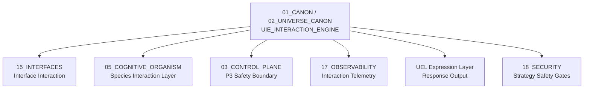

# UIE Interaction Engine — Universal Interaction Engine

> **Origin Architect / Steward:** Trang Phan
> **AMOS_CORE Target:** `v4.4`
> **Conclusion Class:** `AMOS_MODEL`
> **Status:** `PROPOSED_SPECIFICATION`
> **Canonical Status:** `CONDITIONAL`

> **Epistemic Boundary:** UIE is an `AMOS_MODEL` interaction specification. The 7 state layers, 9-step pipeline, 10 goals, and 8 strategy profiles are framework-derived structural contracts. They do not claim psychological or sociological empirical validity.

---

## 1. Architectural Scope

`UIE_INTERACTION_ENGINE` defines the **Universal Interaction Engine (UIE)** — the interaction management layer that governs how the AMOS system engages with external entities (humans, other agents, systems). UIE manages interaction state, goals, strategy selection, and the pipeline that processes each interaction turn.

UIE is the interaction-side complement to the cognitive pipeline. While F1–F24 process internal cognition, UIE manages the external engagement loop: perceiving the interaction partner's signals, selecting interaction goals and strategies, executing the interaction, and adapting based on feedback.

### Core Components

| Component | Count | Description |
|:--|:--|:--|
| **State Layers** | 7 | Hierarchical interaction state representation |
| **Pipeline Steps** | 9 | Sequential processing of each interaction turn |
| **Interaction Goals** | 10 | Typed goals the engine can pursue |
| **Strategy Profiles** | 8 | Pre-defined strategy templates for common scenarios |

### 7 State Layers

| Layer | Name | Description |
|:--|:--|:--|
| L1 | Signal Layer | Raw input signals from interaction partner |
| L2 | Perception Layer | Interpreted signals — intent, emotion, urgency |
| L3 | Context Layer | Interaction history, relationship, environment |
| L4 | State Layer | Current interaction state (engaging, negotiating, closing) |
| L5 | Goal Layer | Active interaction goals and priorities |
| L6 | Strategy Layer | Selected strategy profile and tactical adjustments |
| L7 | Output Layer | Formulated response ready for UEL expression |

### 9-Step Pipeline

```mermaid
flowchart LR
    S1["1. Signal Capture"] --> S2["2. Intent Parsing"]
    S2 --> S3["3. Context Retrieval"]
    S3 --> S4["4. State Assessment"]
    S4 --> S5["5. Goal Selection"]
    S5 --> S6["6. Strategy Matching"]
    S6 --> S7["7. Response Formulation"]
    S7 --> S8["8. Safety Check"]
    S8 --> S9["9. Output Dispatch"]
    S9 --> UEL["UEL Expression Layer"]
```

### 10 Interaction Goals

| ID | Goal | Description |
|:--|:--|:--|
| G1 | Inform | Provide information to the partner |
| G2 | Persuade | Change the partner's belief or position |
| G3 | Negotiate | Reach mutual agreement on terms |
| G4 | Collaborate | Work together toward a shared objective |
| G5 | Clarify | Resolve ambiguity or misunderstanding |
| G6 | De-escalate | Reduce tension or conflict |
| G7 | Probe | Gather information from the partner |
| G8 | Assert | Establish or maintain boundaries |
| G9 | Support | Provide emotional or practical assistance |
| G10 | Terminate | End the interaction gracefully |

### 8 Strategy Profiles

| ID | Profile | Trigger | Tone | Risk Level |
|:--|:--|:--|:--|:--|
| SP1 | Direct Informative | Information request, low ambiguity | Neutral, precise | Low |
| SP2 | Collaborative | Shared goal, cooperative partner | Warm, open | Low |
| SP3 | Negotiative | Conflicting interests, willing partner | Formal, balanced | Medium |
| SP4 | Cautionary | Risk detected, safety concern | Assertive, clear | Medium |
| SP5 | Empathetic | Emotional distress, support needed | Warm, gentle | Low |
| SP6 | Assertive Boundary | Boundary violation, adversarial | Firm, direct | Medium |
| SP7 | De-escalation | High tension, conflict | Calm, measured | High |
| SP8 | Emergency | Critical risk, immediate action | Urgent, directive | High |

---

## 2. Governing Invariants

- **INV-I1 (State Layer Monotonicity):** State layers are processed bottom-up: L1 before L2, L2 before L3, etc. Upper layers depend on lower layers; skipping layers is not permitted.
- **INV-I2 (Goal-Strategy Consistency):** The selected strategy must be compatible with the selected goal. Incompatible goal-strategy pairs are rejected at step 6.
- **INV-I3 (Safety Non-Bypass):** Step 8 (Safety Check) cannot be skipped. All responses pass through UAI alignment before dispatch.
- **INV-I4 (Strategy Profile Bounds):** Strategy profiles SP7 and SP8 (high risk) require additional authority approval before execution. They are not autonomous.
- **INV-I5 (Interaction Memory):** Each interaction turn is logged to interaction memory. Memory enables context retrieval (step 3) and consistency checking.

---

## 3. Mathematical / Formal Definition

### 3.1 State Layer Model

The interaction state is a 7-tuple:

$$\Sigma_{\text{UIE}} = (L_1, L_2, L_3, L_4, L_5, L_6, L_7)$$

where each $L_k$ is the state at layer $k$.

### 3.2 Pipeline as Function Composition

The 9-step pipeline is a composed function:

$$\text{UIE}_{\text{pipeline}} = S_9 \circ S_8 \circ S_7 \circ S_6 \circ S_5 \circ S_4 \circ S_3 \circ S_2 \circ S_1$$

where each $S_k$ is a step function:

$$S_k : \text{Input}_k \times \Sigma_{\text{UIE}} \to \text{Output}_k \times \Sigma'_{\text{UIE}}$$

### 3.3 Goal Selection

Goal selection maps the assessed state to a goal:

$$S_5(\Sigma_{\text{UIE}}) = G_k \mid \text{priority}(G_k, \Sigma_{\text{UIE}}) = \max_{j} \text{priority}(G_j, \Sigma_{\text{UIE}})$$

### 3.4 Strategy Matching

Strategy matching selects the best profile for the goal and state:

$$S_6(G_k, \Sigma_{\text{UIE}}) = SP_j \mid \text{compatibility}(G_k, SP_j) \wedge \text{fit}(SP_j, \Sigma_{\text{UIE}}) = \max$$

### 3.5 Threat-Stability-Engagement Indices

UIE maintains three indices:

$$\text{Threat}(t) = f_T(L_2, L_3, L_4) \in [0, 1]$$
$$\text{Stability}(t) = f_S(L_3, L_4, L_5) \in [0, 1]$$
$$\text{Engagement}(t) = f_E(L_2, L_4, L_6) \in [0, 1]$$

Strategy selection is constrained by these indices:

- If $\text{Threat} > 0.7$, only SP4, SP6, SP7, or SP8 are permitted
- If $\text{Stability} < 0.3$, de-escalation (SP7) is prioritized
- If $\text{Engagement} < 0.2$, termination (G10) is considered

### 3.6 Safety Boundary (P3)

The P3 safety boundary constrains strategy execution:

$$\text{Allowed}(SP_j) = \begin{cases} \text{TRUE} & \text{if } j \in \{1,2,3,5\} \\ \text{AuthorityApproved} & \text{if } j \in \{4,6\} \\ \text{AuthorityApproved} \wedge \text{Threat} > 0.7 & \text{if } j \in \{7,8\} \end{cases}$$

### 3.7 Connection to Master Equations

UIE processes the interaction loop:

$$\Sigma_{\text{UIE}, t+1} = \text{UIE}_{\text{pipeline}}(\Sigma_{\text{UIE}, t}, U_t^{\text{interaction}})$$

This follows the master state transition $S_{t+1} = C(F(S_t, U_t))$ where $F$ is the UIE pipeline and $C$ is the safety check (step 8).

---

## 4. MECE Mapping

| AMOS Partition | Binding | Role |
|:--|:--|:--|
| `15_INTERFACES` | Interface interaction | UIE manages interaction at interfaces |
| `05_COGNITIVE_ORGANISM` | Species interaction layer | UIE maps to 7-layer species interaction model |
| `03_CONTROL_PLANE` | P3 safety boundary | Control plane enforces strategy profile authority |
| `17_OBSERVABILITY` | Interaction telemetry | All interaction turns logged |
| `UEL Expression Layer` | Response output | UIE dispatches responses through UEL |
| `18_SECURITY` | Strategy safety gates | High-risk strategies require security approval |
| `13_MODELS` | Interaction models | Models for intent parsing and state assessment |

---

## 5. Safety Invariants

- **S-1 (Safety Check Non-Bypass):** Step 8 (Safety Check) is mandatory. No response is dispatched without passing safety check and UAI alignment.
- **S-2 (High-Risk Strategy Authority):** SP7 and SP8 require explicit authority approval. They cannot be selected autonomously, even if threat indices are high.
- **S-3 (Threat-Driven De-escalation):** When threat exceeds 0.7, the system must either de-escalate (SP7) or escalate to authority. Silent continuation is not permitted.
- **S-4 (Interaction Memory Integrity):** Interaction memory is append-only. Past turns cannot be modified. Context retrieval uses the immutable history.
- **S-5 (Goal-Strategy Rejection Logging):** When a goal-strategy pair is rejected for incompatibility, the rejection is logged with the reason. Repeated rejections trigger strategy recalibration.

---

## 6. Navigation & Bindings

- **Master MOC:** [[00_ROOT/00_ROOT_MOC|00_ROOT_MOC]]
- **Partition Architecture:** [[00_ROOT/FULL_BRAIN_OS_MECE_ARCHITECTURE|FULL_BRAIN_OS_MECE_ARCHITECTURE]]
- **Universe Canon MOC:** [[01_CANON/02_UNIVERSE_CANON/02_UNIVERSE_CANON_MOC|02_UNIVERSE_CANON_MOC]]
- **Core Laws:** [[01_CANON/01_CORE_LAWS/AMOS_CORE_LAWS|AMOS_CORE_LAWS]]
- **Canonical Laws:** [[01_CANON/02_UNIVERSE_CANON/KHUNG_TRANG_16_CANONICAL_LAWS|KHUNG_TRANG_16_CANONICAL_LAWS]]
- **Framework Functions:** [[01_CANON/02_UNIVERSE_CANON/KHUNG_TRANG_F1_F26|KHUNG_TRANG_F1_F26]]
- **UEL Expression Layer:** [[01_CANON/02_UNIVERSE_CANON/UEL_EXPRESSION_LAYER|UEL_EXPRESSION_LAYER]]
- **UAI Alignment Interface:** [[01_CANON/02_UNIVERSE_CANON/UAI_ALIGNMENT_INTERFACE|UAI_ALIGNMENT_INTERFACE]]
- **Risk Tension Architecture:** [[01_CANON/02_UNIVERSE_CANON/URTA_RISK_TENSION_ARCHITECTURE|URTA_RISK_TENSION_ARCHITECTURE]]
- **TSS 7-Cycle:** [[01_CANON/02_UNIVERSE_CANON/TSS_7_CYCLE|TSS_7_CYCLE]]
- **Interfaces:** [[15_INTERFACES/15_INTERFACES_MOC|15_INTERFACES_MOC]]
- **Cognitive Organism:** [[05_COGNITIVE_ORGANISM/05_COGNITIVE_ORGANISM_MOC|05_COGNITIVE_ORGANISM_MOC]]
- **Control Plane:** [[03_CONTROL_PLANE/03_CONTROL_PLANE_MOC|03_CONTROL_PLANE_MOC]]
- **Security:** [[18_SECURITY/18_SECURITY_MOC|18_SECURITY_MOC]]
- **Observability:** [[17_OBSERVABILITY/17_OBSERVABILITY_MOC|17_OBSERVABILITY_MOC]]

---

## 7. Known Gaps & Falsifiers

| ID | Gap / Falsifier | Description |
|:--|:--|:--|
| GAP-1 | **Intent Parsing Accuracy** | Step 2 (Intent Parsing) depends on natural language understanding. Falsifier: if intent is systematically misparsed, strategy selection produces inappropriate responses. |
| GAP-2 | **10-Goal Sufficiency** | The 10 goals may not cover all interaction types. Falsifier: if an interaction requires a goal not in the set (e.g., "entertain"), the goal catalog must expand. |
| GAP-3 | **8-Strategy Coverage** | The 8 strategy profiles may not cover all situations. Falsifier: if a situation requires a hybrid strategy not covered by any profile, dynamic strategy composition may be needed. |
| GAP-4 | **Threat Index Calibration** | Threat, stability, and engagement indices use thresholds (0.7, 0.3, 0.2). Falsifier: if thresholds are miscalibrated, the system either over-reacts or under-reacts to threats. |
| GAP-5 | **Multi-Party Interaction** | UIE is specified for dyadic (two-party) interaction. Falsifier: if multi-party interaction is needed, the state model and pipeline must be generalized. |

---

**Parent:** [[01_CANON/02_UNIVERSE_CANON/02_UNIVERSE_CANON_MOC|02_UNIVERSE_CANON_MOC]] · [[00_ROOT/00_HOME|00_HOME]]
