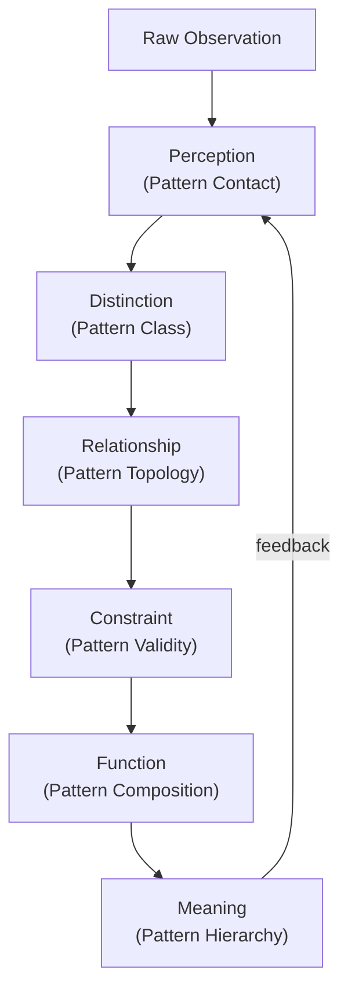

# UMPL Meta Pattern Layer — Universe Canon Specification

> **Origin Architect / Steward:** Trang Phan  
> **AMOS_CORE Target:** `v4.4`  
> **Conclusion Class:** `AMOS_MODEL`  
> **Status:** `PROPOSED_SPECIFICATION` · **Canonical Status:** `CONDITIONAL`

---

## 1. Architectural Scope

`UMPL_META_PATTERN_LAYER` defines the **Universal Meta-Pattern Layer** — the canonical framework for pattern recognition, abstraction, and self-similar structure detection across scales within the AMOS Full OS. The meta-pattern layer governs how patterns are identified, classified, abstracted, and composed into higher-order structures, providing the fractal substrate that connects the cognitive matrix (`25_COGNITIVE_MATRIX`) to the knowledge network (`11_KNOWLEDGE`) and the fractal knowledge law (`L15_FRACTAL_KNOWLEDGE`).

The UMPL operationalizes the Khung Trang framework's pre-symbolic ontological spine ($\mathcal{P} \to \mathcal{D} \to \mathcal{R} \to \mathcal{C} \to \mathcal{F} \to \mathcal{M}$) at the meta-pattern level: perception of raw patterns, distinction of pattern classes, relationship between patterns, constraint of pattern validity, function of pattern composition, and meaning of pattern hierarchies.

---

## 2. Governing Invariants

- **MP-1 Pattern Before Abstraction:** A pattern must be observed and distinguished before it is abstracted. Abstraction without observation is fabrication.
- **MP-2 Scale Invariance:** Meta-patterns are valid across scales (micro, meso, macro) only when scale consistency is demonstrated. `SCALE_INVARIANCE != ASSUMED`.
- **MP-3 Self-Similarity Boundary:** Structural self-similarity does not imply functional identity. A pattern that looks the same at two scales may serve different functions.
- **MP-4 Pattern Composition:** Higher-order patterns are composed from lower-order patterns through typed composition operators. Composition is not unstructured aggregation.
- **MP-5 Pattern Falsifiability:** Every meta-pattern must declare its falsifier — the observation that would invalidate the pattern classification.
- **MP-6 Axiom Adherence:** Meta-pattern governance is strictly bound by M01–M20 core laws and the `LAW_HIERARCHY` precedence order.

---

## 3. Meta-Pattern Taxonomy

| Meta-Pattern Class | Symbol | Description | AMOS Binding |
|-------------------|--------|-------------|--------------|
| Atomic Pattern | $\pi_0$ | Minimal observable pattern unit | `10_MEMORY` |
| Composed Pattern | $\pi_n$ | Pattern composed from $n$ atomic patterns | `11_KNOWLEDGE` |
| Recursive Pattern | $\pi_\infty$ | Self-referential pattern with fractal structure | `25_COGNITIVE_MATRIX` |
| Cross-Domain Pattern | $\pi_{\times}$ | Pattern observed across multiple domains | `21_DOMAINS` |
| Temporal Pattern | $\pi_t$ | Pattern evolving over time | `04_RUNTIME` |
| Structural Pattern | $\pi_S$ | Pattern in spatial/topological arrangement | `16_SCHEMAS` |

---

## 4. Mathematical Formulation

### 4.1 Pattern Detection

A pattern $\pi$ is detected when the observation sequence $O = \{o_1, o_2, \ldots, o_n\}$ satisfies:

$$\pi = \arg\min_{\pi' \in \Pi} \mathcal{D}(O, \pi')$$

where $\mathcal{D}$ is the pattern distance metric and $\Pi$ is the pattern library.

### 4.2 Pattern Composition

Higher-order pattern composition:

$$\pi_{n+1} = \mathcal{C}(\pi_n^1, \pi_n^2, \ldots, \pi_n^k)$$

where $\mathcal{C}$ is a typed composition operator and $\pi_n^i$ are $k$ patterns of order $n$.

### 4.3 Fractal Self-Similarity

The fractal dimension $D_F$ of a meta-pattern hierarchy:

$$D_F = \lim_{\epsilon \to 0} \frac{\log N(\epsilon)}{\log(1/\epsilon)}$$

where $N(\epsilon)$ is the number of pattern units at resolution $\epsilon$.

### 4.4 Pattern Entropy

Pattern classification entropy:

$$H(\Pi) = -\sum_{i} p(\pi_i) \log_2 p(\pi_i)$$

High entropy indicates diverse pattern library; low entropy indicates dominance of few patterns.

---

## 5. MECE Mapping to AMOS Full Brain OS

| UMPL Component | AMOS Plane | Role |
|---------------|------------|------|
| Pattern perception | `05_COGNITIVE_ORGANISM` | Input/representation stage |
| Pattern distinction | `25_COGNITIVE_MATRIX` | Cognitive coordinate decomposition |
| Pattern relationship | `11_KNOWLEDGE` | Knowledge graph edges |
| Pattern constraint | `01_CANON` | Validity bounds |
| Pattern composition | `13_MODELS` | Model construction |
| Pattern hierarchy | `16_SCHEMAS` | Typed schema hierarchy |
| Pattern evolution | `04_RUNTIME` | Temporal pattern dynamics |
| Pattern evidence | `17_OBSERVABILITY` | Pattern detection receipts |

---

## 6. Safety Invariants & Firewalls

- `INV-MP-001` (**No Pattern Fabrication**): Patterns cannot be invented without observation. `PATTERN != HALLUCINATION`.
- `INV-MP-002` (**Scale Consistency**): Cross-scale pattern claims require scale consistency verification. `STRUCTURAL_SIMILARITY != FUNCTIONAL_IDENTITY`.
- `INV-MP-003` (**Pattern Decay**): Patterns have temporal validity. Stale patterns must be revalidated. `PATTERN_EXISTS != PATTERN_VALID`.
- `INV-MP-004` (**Pattern Conflict**): When two patterns conflict, preserve both as `COMPETING` until discriminating evidence exists.
- `INV-MP-005` (**Pattern Provenance**): Every pattern classification records its observation source, detection method, and confidence ceiling.

---

## 7. Navigation & Bindings

- **Master MOC:** [[00_ROOT/00_ROOT_MOC|00_ROOT_MOC]]
- **Partition Architecture:** [[00_ROOT/FULL_BRAIN_OS_MECE_ARCHITECTURE|FULL_BRAIN_OS_MECE_ARCHITECTURE]]
- **Khung Trang Master:** [[01_CANON/02_UNIVERSE_CANON/KHUNG_TRANG_MASTER|KHUNG_TRANG_MASTER]]
- **Fractal Knowledge Law:** [[01_CANON/01_CORE_LAWS/L15_FRACTAL_KNOWLEDGE|L15_FRACTAL_KNOWLEDGE]]
- **Cognitive Matrix:** [[25_COGNITIVE_MATRIX/25_COGNITIVE_MATRIX_MOC|25_COGNITIVE_MATRIX_MOC]]
- **Universe Canon MOC:** [[01_CANON/02_UNIVERSE_CANON/02_UNIVERSE_CANON_MOC|02_UNIVERSE_CANON_MOC]]

---

## 8. Known Gaps & Falsifiers

- `GAP-MP-001`: The pattern distance metric $\mathcal{D}$ is domain-dependent; no universal metric is established.
- `GAP-MP-002`: Fractal self-similarity detection at scale requires computational resources that may exceed runtime budgets.
- `GAP-MP-003`: `UMPL` is a `PROPOSED_SPECIFICATION` with `CONDITIONAL` canonical status; it does not establish empirical pattern recognition validity.

**Parent:** [[01_CANON/02_UNIVERSE_CANON/02_UNIVERSE_CANON_MOC|02_UNIVERSE_CANON_MOC]] · [[00_ROOT/00_HOME|00_HOME]]
