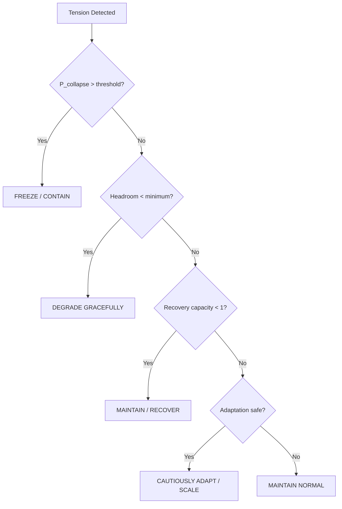

# URTA Risk Tension Architecture

> **Origin Architect / Steward:** Trang Phan
> **AMOS_CORE Target:** `v4.4`
> **Conclusion Class:** `AMOS_MODEL`
> **Status:** `PROPOSED_SPECIFICATION` · **Canonical Status:** `CONDITIONAL`

---

## 1. Architectural Scope

`URTA_RISK_TENSION_ARCHITECTURE` defines the **Universal Risk Tension Architecture** — the formal framework for evaluating dynamic tension between stability-preserving operation and adaptation/scaling/exploration within the AMOS Full OS. Risk tension is the force that arises when a system must balance maintaining its current valid state against the pressure to adapt, scale, mutate, or recover.

The URTA maps to the AMOS adaptive stability balancer and the `18_SECURITY` plane, providing the mathematical and operational substrate for deciding whether to freeze, contain, degrade gracefully, maintain, recover, cautiously adapt, scale, or resume normal operation.

---

## 2. Governing Invariants

- **RT-1 Stability–Adaptation Tension:** Every adaptive action creates a stability risk. Every stability-preserving action creates an adaptation debt. The tension is irreducible; it can only be balanced, not eliminated.
- **RT-2 Collapse Probability Bound:** For any operation, the collapse probability $P_{\text{collapse}}$ must remain below the collapse threshold $\theta_{\text{collapse}}$.
- **RT-3 Safety Boundary Preservation:** Adaptation is never allowed to consume the safety boundary. The safety boundary is non-negotiable.
- **RT-4 Reversibility Preference:** Under high uncertainty, prefer reversible, low-consequence probes over irreversible commits.
- **RT-5 Tension Visibility:** Risk tension must be visible as a measured quantity, not hidden or implicit. Hidden tension is unmanaged tension.
- **RT-6 Axiom Adherence:** Risk tension governance is strictly bound by M01–M20 core laws and the `LAW_HIERARCHY` precedence order.

---

## 3. Risk Tension Dimensions

| Dimension | Symbol | Description | Stability Side | Adaptation Side |
|-----------|--------|-------------|----------------|-----------------|
| Load | $\lambda$ | Resource utilization pressure | Shed load | Scale resources |
| Recursion | $\rho$ | Recursive depth pressure | Limit depth | Explore deeper |
| Concurrency | $\kappa$ | Concurrent operation pressure | Serialize | Parallelize |
| Memory | $\mu$ | Memory pressure | Evict/reclaim | Allocate more |
| Dependency | $\delta$ | Dependency degradation pressure | Pin versions | Upgrade |
| Operational | $\omega$ | Operational pressure | Maintain SOP | Adapt procedure |
| Oscillation | $\psi$ | Oscillation/instability pressure | Dampen | Tune |
| Rigidity | $\phi$ | Excessive rigidity pressure | Maintain structure | Refactor |

---

## 4. Mathematical Formulation

### 4.1 Collapse Probability

$$P_{\text{collapse}} = \sigma\left(\sum_{i} w_i \cdot T_i - \theta_{\text{collapse}}\right)$$

where $T_i$ is the tension in dimension $i$, $w_i$ is the dimension weight, $\theta_{\text{collapse}}$ is the collapse threshold, and $\sigma$ is the sigmoid function.

### 4.2 Stability–Adaptation Balance

The optimal balance point minimizes total risk:

$$R_{\text{total}} = R_{\text{stability}}(\alpha) + R_{\text{adaptation}}(\alpha)$$

$$\alpha^* = \arg\min_\alpha R_{\text{total}}(\alpha)$$

where $\alpha \in [0, 1]$ is the adaptation dial (0 = full stability, 1 = full adaptation).

### 4.3 Resource Headroom

$$H = \frac{C_{\text{max}} - C_{\text{used}}}{C_{\text{max}}}$$

where $C_{\text{max}}$ is maximum capacity and $C_{\text{used}}$ is current usage. Operations requiring $> H$ of headroom are deferred.

### 4.4 Recovery Capacity

$$R_{\text{capacity}} = \frac{E_{\text{recovery}}}{E_{\text{required}}}$$

where $E_{\text{recovery}}$ is available recovery energy and $E_{\text{required}}$ is energy needed for full recovery. $R_{\text{capacity}} < 1$ triggers degradation.

---

## 5. Operational Decision Matrix

| State | Trigger | Response | Reversibility |
|-------|---------|----------|---------------|
| FREEZE | $P_{\text{collapse}} > \theta$ | Halt all non-critical operations | Fully reversible |
| CONTAIN | $P_{\text{collapse}} > \theta$, partial | Isolate affected subsystem | Reversible |
| DEGRADE GRACEFUL | $H < H_{\min}$ | Shed non-critical load | Reversible |
| MAINTAIN | $R_{\text{capacity}} < 1$ | Hold state, build recovery | Reversible |
| RECOVER | Failure detected | Execute recovery protocol | Reversible |
| CAUTIOUSLY ADAPT | Safe, headroom OK | Small reversible adaptation | Reversible |
| SCALE | Safe, headroom OK, demand high | Add capacity | Reversible |
| NORMAL | No tension | Standard operation | N/A |

---

## 6. MECE Mapping to AMOS Full Brain OS

| URTA Component | AMOS Plane | Role |
|---------------|------------|------|
| Tension detection | `17_OBSERVABILITY` | Telemetry/metrics |
| Collapse probability | `18_SECURITY` | Safety boundary |
| Decision matrix | `03_CONTROL_PLANE` | Authority gate |
| Freeze/contain | `04_RUNTIME` | Execution control |
| Recovery | `12_STATE` | State restoration |
| Adaptation | `05_COGNITIVE_ORGANISM` | Cognitive adaptation |
| Tension receipts | `20_OPERATIONS` | Audit trail |

---

## 7. Safety Invariants & Firewalls

- `INV-RT-001` (**Safety Boundary Non-Negotiable**): No adaptation may consume the safety boundary. `ADAPTATION < SAFETY_BOUNDARY`.
- `INV-RT-002` (**Collapse Fail-Closed**): If $P_{\text{collapse}} > \theta$, the system fails closed. No degraded-confidence operation under collapse risk.
- `INV-RT-003` (**Tension Receipts**): Every tension measurement and decision emits an immutable receipt to `17_OBSERVABILITY`.
- `INV-RT-004` (**Reversibility Preference**): Under high uncertainty ($H_{\text{uncertainty}} > 0.5$), prefer reversible operations. `IRREVERSIBLE_COMMIT requires H_uncertainty < 0.2`.
- `INV-RT-005` (**Hidden Tension Prohibited**): All tension dimensions must be measured and visible. Hidden tension is a violation.

---

## 8. Navigation & Bindings

- **Master MOC:** [[00_ROOT/00_ROOT_MOC|00_ROOT_MOC]]
- **Partition Architecture:** [[00_ROOT/FULL_BRAIN_OS_MECE_ARCHITECTURE|FULL_BRAIN_OS_MECE_ARCHITECTURE]]
- **TSS 7-Cycle:** [[01_CANON/02_UNIVERSE_CANON/TSS_7_CYCLE|TSS_7_CYCLE]]
- **Security Plane:** [[18_SECURITY/18_SECURITY_MOC|18_SECURITY_MOC]]
- **Control Plane:** [[03_CONTROL_PLANE/03_CONTROL_PLANE_MOC|03_CONTROL_PLANE_MOC]]
- **Universe Canon MOC:** [[01_CANON/02_UNIVERSE_CANON/02_UNIVERSE_CANON_MOC|02_UNIVERSE_CANON_MOC]]

---

## 9. Known Gaps & Falsifiers

- `GAP-RT-001`: Collapse probability estimation depends on prior distributions that may not generalize to novel failure modes.
- `GAP-RT-002`: The 8 tension dimensions may not be exhaustive for all operational regimes.
- `GAP-RT-003`: `URTA` is a `PROPOSED_SPECIFICATION` with `CONDITIONAL` canonical status; collapse thresholds are operational heuristics, not universally validated safety bounds.

**Parent:** [[01_CANON/02_UNIVERSE_CANON/02_UNIVERSE_CANON_MOC|02_UNIVERSE_CANON_MOC]] · [[00_ROOT/00_HOME|00_HOME]]
