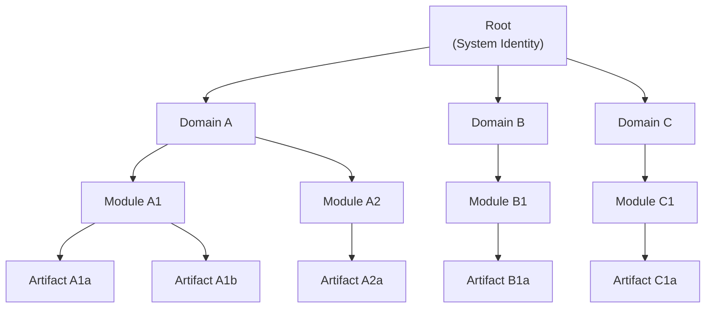
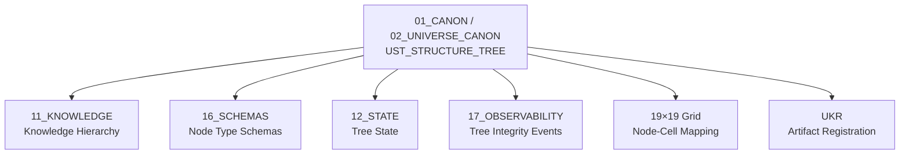

# UST Structure Tree — Universal Structure Tree

> **Origin Architect / Steward:** Trang Phan
> **AMOS_CORE Target:** `v4.4`
> **Conclusion Class:** `AMOS_MODEL`
> **Status:** `PROPOSED_SPECIFICATION`
> **Canonical Status:** `CONDITIONAL`

> **Epistemic Boundary:** UST is an `AMOS_MODEL` structural representation specification. It defines hierarchical knowledge organization with dependency cones and compositional engines. It does not claim to be a universal ontology; it is a framework-specific structure tree for AMOS knowledge management.

---

## 1. Architectural Scope

`UST_STRUCTURE_TREE` defines the **Universal Structure Tree (UST)** — the hierarchical representation system for knowledge and cognitive structures within the Khung Trang framework. UST organizes knowledge artifacts into a typed tree with dependency cones, compositional relationships, and integrity constraints.

UST is the structural backbone that connects the 19×19 cognitive grid (spatial representation) to the knowledge registry (temporal/provenance representation). While the grid provides spatial coordinates, UST provides hierarchical relationships — what depends on what, what composes what, and what is derived from what.

### Core Components

| Component | Symbol | Description |
|:--|:--|:--|
| **Tree Structure** | $\mathcal{T}_{\text{UST}}$ | Typed tree of knowledge nodes |
| **Dependency Cone** | $\mathcal{C}_D / \mathcal{C}_R$ | Downward (dependency) and upward (reachable) cones |
| **Compositional Engine** | $\mathcal{E}_C$ | Composes child nodes into parent nodes |
| **Integrity Checker** | $\mathcal{I}_C$ | Verifies tree invariants |
| **Path Resolver** | $\mathcal{P}_R$ | Resolves paths from root to any node |

### UST Hierarchy

### Node Types

| Type | Level | Description | Example |
|:--|:--|:--|:--|
| **Root** | 0 | System identity | AMOS OS identity |
| **Domain** | 1 | Top-level knowledge domain | 01_CANON, 11_KNOWLEDGE |
| **Module** | 2 | Sub-domain module | 02_UNIVERSE_CANON, 01_CORE_LAWS |
| **Artifact** | 3 | Individual knowledge artifact | KHUNG_TRANG_19X19.md |
| **Primitive** | 4 | Atomic knowledge element | Individual invariant, axiom |

---

## 2. Governing Invariants

- **INV-T1 (Tree Acyclicity):** UST is a tree (not a general DAG). Each node has exactly one parent, except the root which has none. Cycles are structurally impossible.
- **INV-T2 (Dependency Cone Acyclicity):** The dependency cone $\mathcal{C}_D(n)$ of any node $n$ is a sub-DAG of the tree. This is consistent with KT-10.
- **INV-T3 (Compositional Closure):** A parent node is fully composed from its children. The compositional engine $\mathcal{E}_C$ is a total function over the children set.
- **INV-T4 (Type Consistency):** Node types follow a strict hierarchy: Root → Domain → Module → Artifact → Primitive. A node's type must be one level below its parent's type.
- **INV-T5 (Path Uniqueness):** There is exactly one path from the root to any node. Path uniqueness is guaranteed by the tree structure.

---

## 3. Mathematical / Formal Definition

### 3.1 Tree Definition

UST is a rooted tree:

$$\mathcal{T}_{\text{UST}} = (N, E, \text{root})$$

where $N$ is the node set, $E \subseteq N \times N$ is the edge set (parent → child), and $\text{root} \in N$ is the root node.

Each node $n \in N$ has a typed record:

$$n = \langle \text{id}, \text{type}, \text{parent}, \text{children}, \text{payload}, \text{depth} \rangle$$

### 3.2 Dependency Cone

For a node $n$, the dependency cone (all ancestors) and reachable cone (all descendants) are:

$$\mathcal{C}_D(n) = \{m \in N \mid m \text{ is an ancestor of } n\}$$
$$\mathcal{C}_R(n) = \{m \in N \mid m \text{ is a descendant of } n\}$$

### 3.3 Compositional Engine

The compositional engine computes a parent's payload from its children:

$$\text{payload}(\text{parent}) = \mathcal{E}_C(\{\text{payload}(c) \mid c \in \text{children}(\text{parent})\})$$

The composition is a fold over children:

$$\mathcal{E}_C(C) = \bigoplus_{c \in C} \text{payload}(c)$$

where $\oplus$ is the composition operator (domain-specific).

### 3.4 Path Resolution

The path from root to node $n$ is:

$$\text{Path}(n) = (\text{root}, n_1, n_2, \ldots, n_k, n)$$

where each $n_i$ is the parent of $n_{i+1}$.

### 3.5 Integrity Check

The integrity checker verifies:

$$\mathcal{I}_C(\mathcal{T}_{\text{UST}}) = \bigwedge_{n \in N} \left( \text{ValidType}(n) \wedge \text{ValidParent}(n) \wedge \text{ValidComposition}(n) \right)$$

### 3.6 Connection to 19×19 Grid

UST nodes can be mapped to 19×19 grid cells:

$$\text{Map}_{\text{grid}}: N \to \mathcal{G}_{19}$$

This mapping is injective (each node maps to at most one cell) but not necessarily surjective (not all cells have nodes).

### 3.7 Connection to Master Equations

The tree evolves via the state transition:

$$\mathcal{T}_{\text{UST}, t+1} = C(F(\mathcal{T}_{\text{UST}, t}, U_t))$$

where $F$ adds/removes/updates nodes and $C$ is the integrity checker that validates the result.

---

## 4. MECE Mapping

| AMOS Partition | Binding | Role |
|:--|:--|:--|
| `11_KNOWLEDGE` | Knowledge hierarchy | UST organizes knowledge partition artifacts |
| `16_SCHEMAS` | Node type schemas | Typed schemas for each node type |
| `12_STATE` | Tree state | UST state persisted as versioned state |
| `17_OBSERVABILITY` | Tree integrity | Integrity check events logged here |
| `19×19 Grid` | Node-cell mapping | UST nodes mapped to grid cells |
| `UKR` | Artifact registration | UST nodes reference UKR artifact IDs |
| `13_MODELS` | Structural models | Models for tree composition and integrity |

---

## 5. Safety Invariants

- **S-1 (Integrity Fail-Closed):** If the integrity checker detects a violation, the tree enters read-only mode. No structural modifications are permitted until integrity is restored.
- **S-2 (No Orphan Nodes):** Every node except the root must have a parent. Orphan nodes (parent deleted) are either re-parented or removed.
- **S-3 (Composition Validation):** When a child node is updated, the parent's composition is re-computed and validated. Invalid compositions block the update.
- **S-4 (Depth Limit):** Tree depth is bounded (typically 5 levels). Nodes exceeding the depth limit are restructured or split.
- **S-5 (Path Resolution Caching):** Path resolution results are cached for performance. Cache invalidation occurs on any structural modification.

---

## 6. Navigation & Bindings

- **Master MOC:** [[00_ROOT/00_ROOT_MOC|00_ROOT_MOC]]
- **Partition Architecture:** [[00_ROOT/FULL_BRAIN_OS_MECE_ARCHITECTURE|FULL_BRAIN_OS_MECE_ARCHITECTURE]]
- **Universe Canon MOC:** [[01_CANON/02_UNIVERSE_CANON/02_UNIVERSE_CANON_MOC|02_UNIVERSE_CANON_MOC]]
- **Core Laws:** [[01_CANON/01_CORE_LAWS/AMOS_CORE_LAWS|AMOS_CORE_LAWS]]
- **Canonical Laws:** [[01_CANON/02_UNIVERSE_CANON/KHUNG_TRANG_16_CANONICAL_LAWS|KHUNG_TRANG_16_CANONICAL_LAWS]]
- **Framework Functions:** [[01_CANON/02_UNIVERSE_CANON/KHUNG_TRANG_F1_F26|KHUNG_TRANG_F1_F26]]
- **19×19 Grid:** [[01_CANON/02_UNIVERSE_CANON/KHUNG_TRANG_19X19|KHUNG_TRANG_19X19]]
- **Universal Knowledge Registry:** [[01_CANON/02_UNIVERSE_CANON/KHUNG_TRANG_UKR|KHUNG_TRANG_UKR]]
- **Meta-Pattern Layer:** [[01_CANON/02_UNIVERSE_CANON/UMPL_META_PATTERN_LAYER|UMPL_META_PATTERN_LAYER]]
- **HML Validation Lens:** [[01_CANON/02_UNIVERSE_CANON/KHUNG_TRANG_HML|KHUNG_TRANG_HML]]
- **Knowledge:** [[11_KNOWLEDGE/11_KNOWLEDGE_MOC|11_KNOWLEDGE_MOC]]
- **Schemas:** [[16_SCHEMAS/16_SCHEMAS_MOC|16_SCHEMAS_MOC]]
- **State:** [[12_STATE/12_STATE_MOC|12_STATE_MOC]]
- **Observability:** [[17_OBSERVABILITY/17_OBSERVABILITY_MOC|17_OBSERVABILITY_MOC]]

---

## 7. Known Gaps & Falsifiers

| ID | Gap / Falsifier | Description |
|:--|:--|:--|
| GAP-1 | **Tree vs. DAG** | UST is strictly a tree, but knowledge relationships may require DAGs. Falsifier: if knowledge artifacts have multiple parents (cross-domain dependencies), the tree structure is too restrictive and must be generalized to a DAG. |
| GAP-2 | **Composition Operator** | The composition operator $\oplus$ is domain-specific but not defined for all domains. Falsifier: if composition is not well-defined for some node types, the compositional engine cannot compute parent payloads. |
| GAP-3 | **Depth Limit Adequacy** | The 5-level depth limit is arbitrary. Falsifier: if some knowledge structures require more levels, the limit must be parameterized. |
| GAP-4 | **Grid Mapping Injectivity** | The injective mapping to the 19×19 grid may waste cells. Falsifier: if the tree has more nodes than 361, the mapping cannot be injective. |
| GAP-5 | **Re-parenting Safety** | Re-parenting orphan nodes may introduce semantic errors. Falsifier: if re-parenting places a node under an incompatible parent, the integrity check may pass but the semantics are wrong. |

---

**Parent:** [[01_CANON/02_UNIVERSE_CANON/02_UNIVERSE_CANON_MOC|02_UNIVERSE_CANON_MOC]] · [[00_ROOT/00_HOME|00_HOME]]
