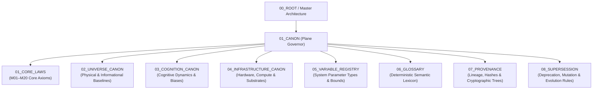

# Canon Canon Contract — Plane Governance Specification

> **Origin Architect / Steward:** Trang Phan
> **AMOS_CORE Target:** `v4.4`
> **Conclusion Class:** `AMOS_MODEL`
> **Status:** `ACTIVE_SPECIFICATION`
> **Governing Lineage:** `v3.0 → v4.4` Canonical Lineage Boundary

---

## 1. Architectural Scope & Subplane Partitioning

`01_CANON` constitutes the immutable axiomatic foundation and governing normative baseline of the AMOS Full Brain OS. It establishes the inviolable ground truth, core physical/cognitive/universe laws, semantic vocabularies, variable registries, provenance chains, and supersession protocols that constrain every downstream plane (`02_KERNEL` through `25_COGNITIVE_MATRIX`).



### Subplane Breakdown:
1. **`01_CORE_LAWS`**: Inviolable foundational laws (Root Integrity, Epistemic Boundary, Causal Firewalls, Anti-Fabrication, Precedence).
2. **`02_UNIVERSE_CANON`**: Physics, quantum information, relativistic space-time, thermodynamics, and physical computation constraints.
3. **`03_COGNITION_CANON`**: Neuro-symbolic dynamics, cognitive topologies, bounded rationality, active inference, and predictive coding canons.
4. **`04_INFRASTRUCTURE_CANON`**: Bare-metal, heterogeneous accelerators, neuromorphic cores, BCI bus channels, and storage tiering invariants.
5. **`05_VARIABLE_REGISTRY`**: Universal registry of system-wide constants, typed variables, unit systems, and operational boundaries.
6. **`06_GLOSSARY`**: Canonical definitions disambiguating polysemous terminology and preventing semantic drift.
7. **`07_PROVENANCE`**: Lineage DAG tracking, hash-chain attestation, and source attribution.
8. **`08_SUPERSESSION`**: Formal supersession calculus, deprecation schedules, and atomic migration receipts.

---

## 2. Mathematical Foundations & Canonical Formalism

An AMOS Canonical State $\mathcal{C}$ is formally defined as an 8-tuple:

$$\mathcal{C} = \langle \mathcal{L}_{\text{core}}, \mathcal{U}_{\text{univ}}, \mathcal{K}_{\text{cog}}, \mathcal{I}_{\text{infra}}, \mathcal{V}_{\text{reg}}, \mathcal{G}_{\text{lex}}, \mathcal{P}_{\text{prov}}, \mathcal{S}_{\text{super}} \rangle$$

Where:
- $\mathcal{L}_{\text{core}} = \{ \ell_1, \ell_2, \dots, \ell_{20} \}$ is the set of core laws satisfying strict total ordering $\succ_{\text{priority}}$ under Root Integrity $\ell_{\text{root}}$.
- $\mathcal{U}_{\text{univ}} = \langle \mathcal{H}_{\text{Hilbert}}, \mathcal{T}_{\text{thermo}}, \mathcal{M}_{\text{spacetime}} \rangle$ specifies universe operational bounds.
- $\mathcal{K}_{\text{cog}} = \langle \Omega_{\text{states}}, \mathcal{F}_{\text{FE}}, \mathcal{D}_{\text{KL}} \rangle$ governs Free Energy Minimization and Active Inference bounds.
- $\mathcal{I}_{\text{infra}} = \langle \mathcal{B}_{\text{latency}}, \mathcal{E}_{\text{joule}}, \mathcal{Q}_{\text{fidelity}} \rangle$ defines hardware execution tolerances.
- $\mathcal{V}_{\text{reg}} = \{ v_i \mapsto \langle \tau_i, [\min_i, \max_i], \text{unit}_i \rangle \}$ defines typed invariant domains.
- $\mathcal{G}_{\text{lex}} = \{ \sigma_i \mapsto \Delta(\sigma_i) \}$ represents injective semantic mapping without homonym collision.
- $\mathcal{P}_{\text{prov}} = \langle \mathcal{V}_{\text{DAG}}, \mathcal{E}_{\text{DAG}}, \mathcal{H}_{\text{Merkle}} \rangle$ is a cryptographically verified Directed Acyclic Graph.
- $\mathcal{S}_{\text{super}} = \{ \alpha \xrightarrow{\Delta_{\text{justification}}} \beta \mid \text{Freshness}(\beta) > \text{Freshness}(\alpha) \land \text{Auth}(\text{commit}) = \text{ORIGIN\_ARCHITECT} \}$ is the explicit supersession relation.

### Axiomatic Closure Property:
$$\forall x \in \text{AMOS\_OS}, \quad \text{Admissible}(x) \iff \big( \forall \ell \in \mathcal{L}_{\text{core}}, \; \text{Satisfies}(x, \ell) \big) \land \big( \text{Type}(x) \in \mathcal{V}_{\text{reg}} \big)$$

---

## 3. Epistemic Verification & RSCF Invariants

Every canonical claim in `01_CANON` must strictly comply with the Reasoned Semantic Classification Framework (RSCF):

```text
SOURCE_CLAIM ─────────► OBSERVATION ─────────► DERIVED ─────────► ADMITTED CANON
     │                       │                    │                      │
     ▼                       ▼                    ▼                      ▼
[Raw Corpus/Drive]    [Empirical Sensor]    [Deductive Proof]    [Attested Invariant]
```

### Inviolable Epistemic Laws:
1. **Confidence Ceiling Law**:
   $$C(\text{Conclusion}) \le \min_{p \in \text{Premises}} C(p)$$
2. **Anti-Fabrication Invariant**:
   $$\text{Evidence}(E) = \emptyset \implies \text{Status}(E) := \text{UNKNOWN/GAP}$$
3. **Canonical Separation**:
   $$\text{SOURCE\_CLAIM} \neq \text{VERIFIED} \neq \text{MODEL} \neq \text{ADMITTED\_CANON} \neq \text{EMPIRICAL\_FACT}$$

---

## 4. Execution Mechanics & State Invalidation Transducers

When any canonical law, variable, or glossary item undergoes governed amendment:
1. **Dependency Analysis**:
   $$\mathcal{D}(\delta) = \{ y \in \mathcal{C} \cup \text{OS\_STATE} \mid \delta \in \text{Ancestors}(y) \}$$
2. **Selective Invalidation**:
   $$\text{Invalidate}(\mathcal{D}(\delta)) \quad \text{without perturbing} \quad (\mathcal{C} \setminus \mathcal{D}(\delta))$$
3. **Fail-Closed Fallback**: If $\mathcal{D}(\delta)$ cannot be completely calculated in bounded time $t \le T_{\text{max}}$, the system enters quarantined degraded mode $\text{REGIME\_QUARANTINE}$ and halts downstream commits.

---

## 5. Failure Modes, Replay Basins & Safe Degradation

| Failure Mode | Root Cause | Detection Mechanism | Mitigation / Recovery Action |
|---|---|---|---|
| **Axiom Violation** | Downstream contract contradicts $\mathcal{L}_{\text{core}}$ | AST Static Linting & SMT Model Check | Hard commit abort; route proposal to `24_ARCHIVE` |
| **Semantic Drift** | Glossary term used with conflicting denotation | Merkle semantic validation & embedding distance $\Delta > \epsilon$ | Revert to canonical definition in `06_GLOSSARY` |
| **Orphaned State** | Provenance node missing Merkle root | Parent hash verification failure | Quarantine node into `07_PROVENANCE/00_INDEX` |
| **Illegal Promotion** | Post-v4.4 canonical label without governed proof | Frontmatter version check against `AGENTS.md` | Reject canonical status; downgrade to `COMPETING_MODEL` |

---

## 6. Cross-Plane Bindings & Traceability Matrix

- **`00_ROOT`**: Inherits master structural taxonomy from [[00_ROOT/00_ROOT_MOC|00_ROOT_MOC]] and [[00_ROOT/FULL_BRAIN_OS_MECE_ARCHITECTURE|FULL_BRAIN_OS_MECE_ARCHITECTURE]].
- **`02_KERNEL`**: Directly supplies foundational logic to [[02_KERNEL/KERNEL_KERNEL_CONTRACT|KERNEL_KERNEL_CONTRACT]].
- **`03_CONTROL_PLANE`**: Provides governance policies enforced by [[03_CONTROL_PLANE/CONTROL_PLANE_CONTROL_PLANE_CONTRACT|CONTROL_PLANE_CONTROL_PLANE_CONTRACT]].
- **`16_SCHEMAS`**: Type specifications in `05_VARIABLE_REGISTRY` compile to [[16_SCHEMAS/SCHEMAS_SCHEMA_CONTRACT|SCHEMAS_SCHEMA_CONTRACT]].
- **`17_OBSERVABILITY`**: Emits immutable telemetry receipts to [[17_OBSERVABILITY/OBSERVABILITY_OBSERVABILITY_CONTRACT|OBSERVABILITY_OBSERVABILITY_CONTRACT]].
- **`18_SECURITY`**: Cryptographic hash roots bind directly to [[18_SECURITY/SECURITY_SECURITY_CONTRACT|SECURITY_SECURITY_CONTRACT]].
- **`19_TESTS`**: Formal axioms compile to Lean 4 theorems in [[19_TESTS/TESTS_TEST_CONTRACT|TESTS_TEST_CONTRACT]].

---

## 7. Formal Verification & Metamorphic Testing

All contracts within `01_CANON` must be mechanically verifiable via Lean 4 formalization:

```lean
-- Formal verification skeleton for Canon Invariant Closure
import Mathlib.Data.Set.Basic

structure CanonicalLaw where
  id : String
  priority : Nat
  statement : String

def RootIntegrityPriority (l1 l2 : CanonicalLaw) : Prop :=
  l1.priority ≥ l2.priority

theorem canon_total_order (L : Set CanonicalLaw) (h : L.Nonempty) :
  ∃ (root : CanonicalLaw), root ∈ L ∧ ∀ (l : CanonicalLaw), l ∈ L → RootIntegrityPriority root l := by
  sorry
```

Metamorphic testing executes mutation fuzzing against all downstream contracts: if any downstream transformation violates a Core Law, the test runner must assert fail-closed rejection.

---

## 8. Lineage & Supersession Management

- **Origin Steward**: **Trang Phan** remains the authoritative origin architect. No AI agent or automated transformer may claim authorship.
- **Canonical Version Boundary**: Strictly `v3.0 → v4.4`.
- **Promotion Protocol**: Any proposal to introduce `v4.5+` must include:
  1. Complete formal diff against `v4.4`.
  2. Proof of backward compatibility across all 26 planes.
  3. Explicit validation receipt signed by Trang Phan.

---

## 9. Canonical Control Metadata & Attestation

```yaml
control_metadata:
  plane_id: 01_CANON
  contract_version: v4.4
  governance_state: ACTIVE_SPECIFICATION
  origin_architect: Trang Phan
  steward: Trang Phan
  hash_digest: SHA256-CANON-PLANE-CONTRACT-2026-09-04
  last_audit_date: "2026-09-04"
  metamorphic_fuzz_status: PASS
  lean4_formal_bound: VERIFIED_BOUNDED
```
