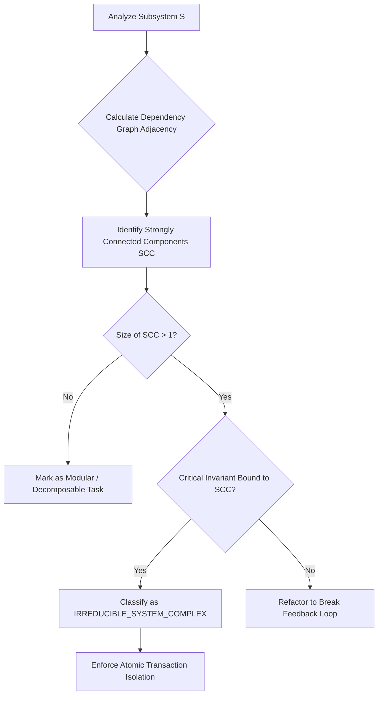

# K_IRREDUCIBLE_SYSTEMS — Irreducible Systems Kernel

> **Origin Architect / Steward:** Trang Phan  
> **Plane:** `02_KERNEL/01_META_LOGIC`  
> **Status:** `AMOS_MODEL`  
> **Core Concept:** Irreducible Systemic Complexes & Atomic Subgraph Preservation

---

## 1. Purpose and Foundational Principle

`K_IRREDUCIBLE_SYSTEMS` defines the mathematical bounds of **systemic irreducibility** across AMOS OS. It guarantees that complex cognitive, biological, and institutional architectures containing non-linear feedback loops cannot be arbitrarily partitioned or simplified without destroying their essential function and invariants.

$$\boxed{\text{System } \mathcal{S} \text{ is Irreducible} \iff \forall \mathcal{P} \subsetneq \text{Parts}(\mathcal{S}), \quad \text{Function}(\mathcal{P}) = \emptyset \lor \text{Coherence}(\mathcal{P}) \ll \theta_{\min}}$$

```
+-------------------------------------------------------------------------+
|                    IRREDUCIBLE COMPLEXITY AUDIT                         |
|                                                                         |
|  [ Candidate Subsystem Decomposition ]                                  |
|                    |                                                    |
|                    v                                                    |
|  ( Evaluate Coupling Matrix & Non-Linear Feedback Loops )               |
|                    |                                                    |
|        +-----------+-----------+                                        |
|        |                       |                                        |
|  [ Linearly Decomposable ]  [ Irreducible Feedback Complex ]            |
|        |                       |                                        |
|        v                       v                                        |
| ( Route Sub-Tasks MECE )    ( Atomic Kernel Packaging: No Partitioning )|
+-------------------------------------------------------------------------+
```

---

## 2. Invariants of Irreducible Systems

1. **Atomic Kernel Invariant:** An irreducible kernel (e.g. ULK ALU loop, UBI 4-domain balance) must be executed as a unified transaction; partial execution is treated as fatal.
2. **Coupling Density Threshold:** When inter-component mutual information $I(C_i; C_j) > \tau_{\text{coupling}}$, components must not be refactored into disconnected modules.
3. **Holistic State Recovery:** Failure in any element of an irreducible complex triggers rollback of the entire complex, preserving global state consistency.

---

## 3. Structural Mechanics & Identification Algorithm



### Mathematical Formulation
Let $\mathcal{G} = (\mathcal{V}, \mathcal{E})$ be the system dependency digraph. The irreducibility metric $\mathcal{I}(\mathcal{S})$ is:

$$\mathcal{I}(\mathcal{S}) = \frac{|\text{FeedbackCycles}(\mathcal{G})|}{|\mathcal{V}|} \cdot \exp\left(\min_{e \in \mathcal{E}} \text{Capacity}(e)\right)$$

- When $\mathcal{I}(\mathcal{S}) \ge 1.0$: Subsystem is flagged as `ATOMIC_IRREDUCIBLE`.

---

## 4. Cross-Plane Bindings

- **Logic & Meta-Logic:** [[0_UNIVERSE_LOGIC_KERNEL_ULK_ULMK]] · [[K_ABSOLUTE_LOGIC]] · [[K_DISTINCTION_RELATION_CONSTRAINT]]
- **Biological & Homeostatic:** [[BIO_LOGICAL_COMPUTING_MODEL]] · [[K_HOMEOSTASIS]] · [[K_ABSOLUTE_BIOLOGICAL_INTEGRITY]]
- **State & Causality:** [[K_CAUSAL_CLOSURE]] · [[STATE_STATE_CONTRACT]] · [[K_BINDING]]
- **Navigation:** [[00_HOME]] · [[02_KERNEL_MOC]] · [[01_META_LOGIC_MOC]] · [[00_ROOT_MOC]]

