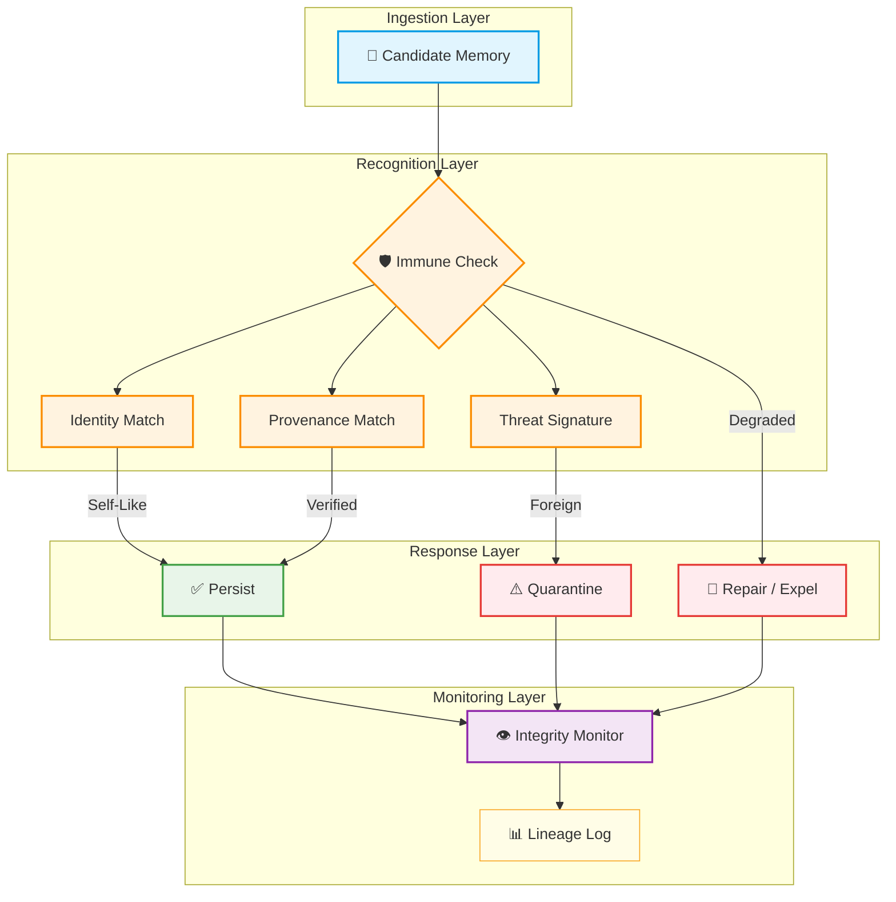

# K MEMORY IMMUNE

STATUS: PLACEHOLDER

Purpose: reserve the canonical AMOS OS location for this artifact.

Do not treat this placeholder as implemented logic, empirical validation, or final canon. Replace only through the appropriate canon/provenance/supersession process.

