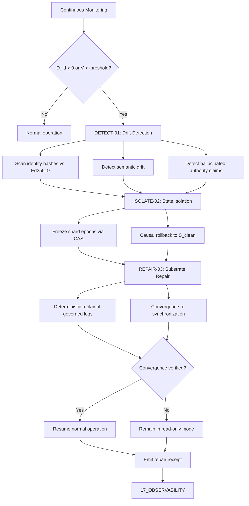

# AMOS Identity-Entropy-Repair Architecture v1.0

**Origin Architect / Steward:** Trang Phan
**AMOS_CORE Target:** `v4.4`
**Epistemic Class:** `AMOS_MODEL`

---

## 1. Architectural Scope

The Identity-Entropy-Repair (IER) subsystem detects, isolates, and repairs state drift, identity divergence, and cognitive entropy corruption across distributed agent clusters without requiring cold restarts. It is a core kernel architecture specification within the `02_KERNEL` plane (Partition B: Execution Core & Effect Governance). The IER architecture governs:

- **Identity invariant monitoring** continuously scanning identity hashes against authoritative Ed25519 signatures to detect divergence.
- **Entropy corruption detection** measuring cognitive state divergence using Lyapunov stability analysis and semantic entropy metrics.
- **Causal rollback execution** restoring affected shards to the latest valid snapshot with BLAKE3 cryptographic provenance.
- **Convergence re-synchronization** replaying governed log events to restore normal multi-agent operation with zero data loss.
- **Fail-closed isolation** freezing affected shard execution epochs when repair cannot achieve convergence.

This file exists because distributed cognitive systems are inherently susceptible to entropy corruption from network partitions, Byzantine agents, and semantic drift. Without an IER architecture, entropy corruption propagates silently, producing identity divergence that is extremely expensive to detect and repair after the fact.

```text
IER = kernel_repair_subsystem
IER != runtime_execution_engine
IER != control_plane_authority
REPAIR_SPECIFIED != REPAIR_EXECUTED
```

---

## 2. Governing Invariants

- **INV-KERN-IER-001 (Lyapunov Stability):** The cognitive state vector $\mathbf{x}(t)$ must satisfy the Lyapunov stability condition relative to the canonical baseline $\mathbf{x}^*$. Divergence beyond the threshold triggers repair.
- **INV-KERN-IER-002 (Zero Data Loss):** The repair protocol must achieve zero data loss during rollback and replay. Any data loss is a critical violation.
- **INV-KERN-IER-003 (Axiom Adherence):** All IER procedures are strictly bound by M01 through M20 core laws. Repairs that violate a core law are rejected.
- **INV-KERN-IER-004 (Fail-Closed Isolation):** If repair cannot restore convergence within the Lyapunov threshold, affected shards remain in isolated read-only mode rather than promoting a partially repaired state.
- **INV-KERN-IER-005 (Immutable Receipts):** Every repair event emits a cryptographic receipt to `17_OBSERVABILITY` including entropy measurement, repair delta, and convergence verification.
- **INV-KERN-IER-006 (Non-Promotion Firewall):** A successful repair confirms structural restoration; it does not confirm semantic correctness or empirical validity. `REPAIRED != VERIFIED`.
- **INV-KERN-IER-007 (Steward Authority):** Trang Phan remains the origin architect and steward. IER architecture changes require governed successor evidence.

---

## 3. Mathematical Formulation

### Core Mathematical Invariant (Lyapunov Stability of Cognitive State)

Let $\mathbf{x}(t)$ represent the system's cognitive state vector and $\mathbf{x}^*$ the canonical baseline state. The Lyapunov function $V(\mathbf{x})$:

$$V(\mathbf{x}) = \frac{1}{2} (\mathbf{x} - \mathbf{x}^*)^T \mathbf{P} (\mathbf{x} - \mathbf{x}^*) \quad \text{where} \quad \mathbf{P} \succ 0$$

satisfies the asymptotic stability condition:

$$\frac{dV(\mathbf{x})}{dt} = (\mathbf{x} - \mathbf{x}^*)^T \mathbf{P} \mathbf{f}(\mathbf{x}) \leq -\alpha \|\mathbf{x} - \mathbf{x}^*\|^2, \quad \alpha > 0$$

### Identity Divergence Metric

The identity divergence $D_{\text{id}}$ between an agent's identity hash $h_{\text{agent}}$ and the authoritative hash $h_{\text{auth}}$:

$$D_{\text{id}} = \text{HammingDistance}(h_{\text{agent}}, h_{\text{auth}})$$

Repair is triggered when $D_{\text{id}} > 0$ or when $V(\mathbf{x}) > V_{\text{threshold}}$.

### Reversibility Invariant

$$\text{Rollback}(\Delta_k) \circ \text{Apply}(\Delta_k) = \mathbb{I}$$

### Entropy Non-Negativity (Second Law)

$$\nabla H(\text{EpistemicState}) \geq 0$$

---

## 4. Operational Architecture

### 3-Phase Automated Repair Sequence (MECE)



1. **Drift Detection & Fault Injection Verification (`DETECT-01`)**:
   - Continuous scanning of identity invariant hashes against authoritative Ed25519 signatures.
   - Detection of semantic drift, hallucinated authority claims, and dangling vector references.
2. **State Isolation & Causal Rollback (`ISOLATE-02`)**:
   - Freezing affected shard execution epochs via CAS monotonic version comparison.
   - Causal rollback to the latest valid snapshot $S_{clean}$ with BLAKE3 cryptographic provenance.
3. **Substrate Repair & Convergence Re-synchronization (`REPAIR-03`)**:
   - Deterministic replay of governed log events.
   - Resumption of normal multi-agent operation with zero data loss.

---

## 5. MECE Mapping to AMOS Full Brain OS

| IER Component | Primary Plane | Partition | Key Dependencies |
|:---|:---|:---|:---|
| Identity monitoring | 02_KERNEL | B | 03_CONTROL_PLANE, 18_SECURITY |
| Entropy detection | 02_KERNEL | B | 17_OBSERVABILITY, 12_STATE |
| Causal rollback | 02_KERNEL | B | 12_STATE, 04_RUNTIME |
| Convergence re-sync | 04_RUNTIME | B | 02_KERNEL, 09_PROTOCOLS |
| Repair receipts | 17_OBSERVABILITY | F | 02_KERNEL |
| Canon repair protocol | 01_CANON | A | 02_KERNEL |
| Authority gates | 03_CONTROL_PLANE | B | 02_KERNEL |

`02_KERNEL` owns the IER execution primitives (Partition B). The canon repair protocol is specified in `01_CANON` (Partition A). Receipts flow to `17_OBSERVABILITY` (Partition F). Authority gates are enforced by `03_CONTROL_PLANE` (Partition B).

---

## 6. Safety Invariants & Firewalls

- **INV-KERN-IER-101 (No Partial Promotion):** A repair that does not achieve convergence must not promote the partially repaired state. Firewall: `PARTIAL_REPAIR != CONVERGED`.
- **INV-KERN-IER-102 (No Silent Resolution):** Epistemic contradictions detected during repair are preserved as `COMPETING`. Firewall: `COMPETING != RESOLVED`.
- **INV-KERN-IER-103 (No Implementation from Architecture):** The IER architecture specification does not confirm executable implementation. Firewall: `DOCUMENTED != IMPLEMENTED`.
- **INV-KERN-IER-104 (No Authority from Repair):** A successful repair does not confer authority over the repaired artifact. Firewall: `CAPABILITY != AUTHORITY`.
- **INV-KERN-IER-105 (Zero Data Loss Enforcement):** Any data loss during rollback or replay is a critical violation requiring immediate halt. Firewall: `DATA_LOSS = CRITICAL_VIOLATION`.
- **INV-KERN-IER-106 (Identity Non-Forgeability):** Identity hashes must be Ed25519-signed by authoritative sources. Forged identity hashes are rejected. Firewall: `FORGED_IDENTITY = REJECTED`.

---

## 7. Navigation & Bindings

- **Kernel MOC:** [[02_KERNEL/02_KERNEL_MOC|02_KERNEL_MOC]]
- **Kernel README:** [[02_KERNEL/KERNEL_README|KERNEL_README]]
- **Deterministic Logic Kernel:** [[02_KERNEL/DETERMINISTIC_LOGIC_KERNEL|DETERMINISTIC_LOGIC_KERNEL]]
- **K_CAS:** [[02_KERNEL/K_CAS|K_CAS]]
- **K_MVCC:** [[02_KERNEL/K_MVCC|K_MVCC]]
- **MVCC_CAS:** [[02_KERNEL/MVCC_CAS|MVCC_CAS]]
- **Lean 4 Ledger:** [[02_KERNEL/LEAN4_PROOF_VERIFICATION_LEDGER|LEAN4_PROOF_VERIFICATION_LEDGER]]
- **Entropy Repair Canon:** [[01_CANON/02_UNIVERSE_CANON/KHUNG_TRANG_ENTROPY_REPAIR|KHUNG_TRANG_ENTROPY_REPAIR]]
- **Master Equations:** [[01_CANON/02_UNIVERSE_CANON/KHUNG_TRANG_MASTER_EQUATIONS|KHUNG_TRANG_MASTER_EQUATIONS]]
- **Core Laws:** [[01_CANON/01_CORE_LAWS/LAW_HIERARCHY|LAW_HIERARCHY]]
- **Control Plane:** [[03_CONTROL_PLANE/03_CONTROL_PLANE_MOC|03_CONTROL_PLANE_MOC]]
- **State:** [[12_STATE/12_STATE_MOC|12_STATE_MOC]]
- **Observability:** [[17_OBSERVABILITY/17_OBSERVABILITY_MOC|17_OBSERVABILITY_MOC]]

---

## 8. Known Gaps & Falsifiers

- **GAP-KERN-IER-001:** The IER architecture is specified but not yet fully implemented as an executable repair engine. State: `UNIMPLEMENTED`.
- **GAP-KERN-IER-002:** The Lyapunov threshold $V_{\text{threshold}}$ is specified as a parameter but its exact value for each cognitive domain is not canonically fixed. State: `UNKNOWN/GAP`.
- **GAP-KERN-IER-003:** The 3-phase repair sequence has not been formally verified in Lean 4. State: `UNVERIFIED`.
- **GAP-KERN-IER-004:** The relationship between IER and the canon entropy repair protocol in `01_CANON/02_UNIVERSE_CANON` is specified but not fully mapped at the execution level. State: `PARTIAL`.
- **GAP-KERN-IER-005:** Falsifier: if a repair event is found to have promoted a partially repaired state without convergence verification, the no-partial-promotion invariant is falsified.
- **GAP-KERN-IER-006:** Falsifier: if any data loss is detected during a rollback and replay cycle, the zero-data-loss invariant is falsified and the IER architecture must be revised.
