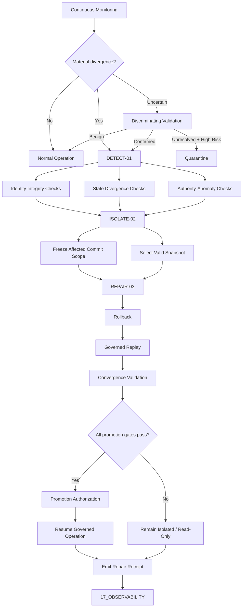

````markdown
---
title: AMOS Identity-Entropy-Repair Architecture v1.0
type: kernel_architecture_specification
plane: 02_KERNEL
amos_core_target: v4.4
origin_architect: Trang Phan
steward: Trang Phan
status: ACTIVE_SPECIFICATION
epistemic_class: AMOS_MODEL
conclusion_class: DERIVED
canonical_status: ACTIVE_CANON_CANDIDATE
updated: 2026-09-04
rscf:
  state: DERIVED
  claim_class: AMOS_MODEL
  provenance: AMOS_corpus
  scope: active_AMOS_OS
---

# AMOS Identity-Entropy-Repair Architecture v1.0

**Origin Architect / Steward:** Trang Phan  
**AMOS_CORE Target:** `v4.4`  
**Epistemic Class:** `AMOS_MODEL`

---

## 1. Architectural Scope

The Identity-Entropy-Repair (IER) subsystem specifies detection, isolation, rollback, replay, and fail-closed recovery for identity divergence and state corruption across governed AMOS agent/runtime structures.

IER is a kernel architecture specification in `02_KERNEL`, not evidence that the described distributed repair mechanisms are currently implemented or empirically validated.

```text
IER = KERNEL_REPAIR_SPECIFICATION

IER != RUNTIME_EXECUTION_ENGINE
IER != CONTROL_PLANE_AUTHORITY
IER != EMPIRICAL_PROOF

DOCUMENTED != IMPLEMENTED
REPAIR_SPECIFIED != REPAIR_EXECUTED
REPAIRED != VERIFIED
````

IER governs five functions:

1. identity-integrity monitoring;
2. state/entropy divergence detection;
3. affected-state isolation;
4. causal rollback and governed replay;
5. convergence validation before promotion.

The architecture is intended to prevent corrupted or divergent state from being silently promoted into authoritative system state.

---

## 2. Core Separation Laws

```text
IDENTITY != STATE
STATE_DIVERGENCE != IDENTITY_DIVERGENCE

DETECTION != DIAGNOSIS
DIAGNOSIS != REPAIR
REPAIR != CONVERGENCE
CONVERGENCE != SEMANTIC_VALIDITY
SEMANTIC_VALIDITY != EMPIRICAL_VALIDITY

SNAPSHOT_EXISTS != SNAPSHOT_VALID
ROLLBACK_COMPLETED != REPLAY_VALID
REPLAY_COMPLETED != CONVERGENCE_PROVEN

CAPABILITY != AUTHORITY
REPAIR_CAPABILITY != REPAIR_AUTHORITY

DOCUMENTED != IMPLEMENTED
IMPLEMENTED != TESTED
TESTED != VERIFIED
VERIFIED_FOR_SCOPE != UNIVERSALLY_VALID
```

---

## 3. Governing Invariants

### INV-KERN-IER-001 — Identity Integrity

An identity-integrity failure must be distinguishable from ordinary semantic or runtime-state drift.

```text
IDENTITY_FAILURE != SEMANTIC_DRIFT
```

A cryptographic identity comparison is meaningful only when the compared objects, serialization rules, signing keys, trust roots, and verification procedure are defined.

---

### INV-KERN-IER-002 — State Stability

Where a Lyapunov model is valid for the selected state representation, state divergence outside the admitted stability envelope may trigger isolation or repair evaluation.

The existence of a Lyapunov expression alone does not establish that an arbitrary cognitive system satisfies its assumptions.

---

### INV-KERN-IER-003 — No Silent Promotion

A state that has entered repair must not return to authoritative operation merely because replay completed.

```text
REPLAY_SUCCESS != PROMOTION_AUTHORITY
```

Promotion requires explicit convergence and governance gates.

---

### INV-KERN-IER-004 — Fail-Closed Isolation

If repair cannot establish the required restoration conditions:

```text
PROMOTION = DENIED
```

The affected execution scope remains isolated, read-only, quarantined, or otherwise bounded according to Control Plane policy.

---

### INV-KERN-IER-005 — Provenance Preservation

Repair must preserve enough lineage to reconstruct:

```text
FAULT
→ DETECTION
→ ISOLATION
→ SNAPSHOT_SELECTION
→ ROLLBACK
→ REPLAY
→ VALIDATION
→ PROMOTION / QUARANTINE
```

---

### INV-KERN-IER-006 — Non-Promotion Firewall

```text
REPAIRED != VERIFIED
```

Structural restoration does not prove:

* semantic correctness;
* factual correctness;
* model validity;
* economic validity;
* scientific validity;
* safety;
* authority;
* deployment readiness.

---

### INV-KERN-IER-007 — Selective Invalidation

A detected failure invalidates the affected state and its dependent descendants.

```text
LOCAL_FAILURE
!=
AUTOMATIC_GLOBAL_INVALIDATION
```

Unaffected state should remain valid when dependency independence is established.

---

### INV-KERN-IER-008 — Authority Separation

IER may identify that repair is required.

IER does not independently grant authority to mutate protected state.

```text
REPAIR_REQUIRED != REPAIR_AUTHORIZED
```

Authority remains a Control Plane concern.

---

### INV-KERN-IER-009 — Immutable Repair Evidence

Every consequential repair attempt must emit a durable repair receipt or equivalent evidence record containing the information required to reconstruct the operation.

---

### INV-KERN-IER-010 — Stewardship

Trang Phan remains the origin architect and steward of the AMOS architecture represented here.

Successor architecture must preserve explicit lineage rather than silently replacing attribution or canon.

---

## 4. Typed IER State

```yaml
ier_state:
  repair_id:
  task_id:
  affected_scope:
  affected_entities: []

  detection:
    detector_id:
    detector_version:
    observed_at:
    observations: []
    identity_status:
    state_status:
    entropy_status:
    confidence:
    provenance: []

  baseline:
    baseline_id:
    baseline_type:
    state_version:
    created_at:
    validity_scope:
    provenance: []

  isolation:
    isolation_status:
    isolation_epoch:
    isolated_resources: []
    authority_witness:
    started_at:

  rollback:
    target_snapshot:
    snapshot_hash:
    snapshot_version:
    rollback_status:
    rollback_receipt:

  replay:
    log_start:
    log_end:
    event_count:
    replay_status:
    deterministic_scope:
    replay_receipt:

  validation:
    convergence_status:
    identity_status:
    invariant_status:
    unresolved_conflicts: []
    semantic_validation_status:
    empirical_validation_status:

  final_state:
    disposition:
    promoted:
    quarantined:
    read_only:
    finalized_at:

  provenance:
    parent_state:
    source_artifacts: []
    receipts: []
```

---

## 5. Identity Integrity Model

Identity validation must specify the identity object being protected.

```yaml
identity_object:
  entity_id:
  entity_type:
  canonical_representation:
  serialization_version:
  canonical_hash:
  signing_algorithm:
  signing_key_id:
  signature:
  trust_root:
  validity_period:
  provenance:
```

Conceptually:

```text
IdentityValid(entity) =
    CanonicalRepresentationValid(entity)
AND HashValid(entity)
AND SignatureValid(entity)
AND TrustRootValid(entity)
AND KeyValid(entity)
AND VersionCompatible(entity)
```

A hash mismatch alone establishes representation divergence, not the cause of that divergence.

Possible competing explanations include:

```text
H1: unauthorized mutation
H2: legitimate version change
H3: serialization mismatch
H4: stale authoritative reference
H5: corrupted storage
H6: incorrect comparison target
H7: adversarial modification
```

These remain `COMPETING` until discriminating evidence exists.

---

## 6. Cryptographic Boundary

The architecture may bind identity and snapshot provenance to cryptographic mechanisms such as Ed25519 signatures and BLAKE3 hashes where the implementation contract explicitly selects them.

```text
ALGORITHM_NAMED != ALGORITHM_IMPLEMENTED
ALGORITHM_IMPLEMENTED != CORRECTLY_CONFIGURED
SIGNATURE_PRESENT != SIGNATURE_VALID
HASH_PRESENT != PROVENANCE_PROVEN
```

Cryptographic verification requires:

```text
canonical bytes
algorithm
key identity
trust root
signature
verification procedure
version
revocation state where applicable
```

---

## 7. State Divergence Model

Let:

$$
\mathbf{x}(t)
$$

represent a typed system-state vector and:

$$
\mathbf{x}^{*}
$$

an admitted reference state.

A candidate Lyapunov function may be defined as:

$$
V(\mathbf{x})
=
\frac{1}{2}
(\mathbf{x}-\mathbf{x}^{*})^{T}
\mathbf{P}
(\mathbf{x}-\mathbf{x}^{*}),
\qquad
\mathbf{P}\succ0
$$

For a dynamical system:

$$
\dot{\mathbf{x}}=\mathbf{f}(\mathbf{x})
$$

a sufficient asymptotic-stability condition in the modeled neighborhood may take the form:

$$
\dot V(\mathbf{x})
\le
-\alpha
\|\mathbf{x}-\mathbf{x}^{*}\|^{2},
\qquad
\alpha>0
$$

This equation is valid only when the state representation, dynamics, differentiability assumptions, equilibrium/reference state, and positive-definite matrix are meaningfully defined.

Therefore:

```text
LYAPUNOV_EQUATION_PRESENT
!=
COGNITIVE_STABILITY_PROVEN
```

The equation remains an `AMOS_MODEL` until those conditions are established for a concrete runtime.

---

## 8. Stability Envelope

Instead of treating every deviation as corruption, define an admitted operating region:

$$
\Omega_{\text{valid}}
=
\{
\mathbf{x}
:
V(\mathbf{x}) \le V_{\text{threshold}}
\}
$$

Possible state classification:

```text
V <= V_normal
    → NORMAL

V_normal < V <= V_warning
    → DEGRADED

V_warning < V <= V_critical
    → REPAIR_CANDIDATE

V > V_critical
    → ISOLATE
```

Threshold values are runtime/domain parameters unless canonically specified and validated.

---

## 9. Identity Divergence Metric

For fixed-length canonical bit representations:

$$
D_{\mathrm{id}}
=
d_H(
h_{\mathrm{observed}},
h_{\mathrm{authoritative}}
)
$$

where \(d_H\) is Hamming distance.

However:

```text
D_id > 0
→ REPRESENTATION_MISMATCH
```

not automatically:

```text
D_id > 0
→ CORRUPTION_PROVEN
```

The system must first rule out legitimate versioning, serialization, migration, or reference-state differences.

---

## 10. Semantic Entropy Boundary

"Semantic entropy" must not be treated as a universal thermodynamic quantity.

IER therefore separates:

```text
H_physical
H_information
H_semantic_model
H_operational_drift
```

A semantic entropy measure must define:

```yaml
semantic_entropy_metric:
  metric_id:
  representation:
  probability_model:
  unit:
  baseline:
  aggregation:
  calibration:
  scope:
  interpretation:
  limitations:
```

Without this contract:

```text
SEMANTIC_ENTROPY = UNKNOWN/GAP
```

---

## 11. Entropy Non-Negativity Correction

The expression:

```text
∇H(EpistemicState) >= 0
```

must not be labeled the thermodynamic Second Law without a justified mapping to physical thermodynamic entropy.

For IER, the safer architecture-level invariant is:

```text
EntropyMetric(state) must be explicitly defined,
typed,
scoped,
and interpreted before monotonicity claims are made.
```

Any monotonicity law must be attached to the specific metric and dynamics for which it is established.

---

## 12. Repair State Machine

```text
NORMAL
  ↓ anomaly
SUSPECTED
  ↓ discriminating evidence
CONFIRMED_DIVERGENCE
  ↓ authority gate
ISOLATING
  ↓
ISOLATED
  ↓ valid rollback target
ROLLBACK_PENDING
  ↓
ROLLED_BACK
  ↓
REPLAYING
  ↓
VALIDATING
  ├── convergence valid → PROMOTION_PENDING
  │                         ↓ authority gate
  │                      RESTORED
  │
  ├── unresolved → QUARANTINED
  │
  └── repair failure → FAILED_CLOSED
```

No transition may silently skip required authority, provenance, or validation gates.

---

## 13. Three-Phase Repair Architecture



---

## 14. DETECT-01 — Divergence Detection

Detection collects evidence.

It must not prematurely assign cause.

```yaml
detect_01:
  observations:
    - identity mismatch
    - invariant violation
    - semantic-state divergence
    - unresolved reference
    - authority anomaly
    - state-version conflict

  output:
    classification:
    competing_hypotheses: []
    affected_scope:
    evidence_refs: []
    confidence_ceiling:
    recommended_action:
```

Detection classes:

```text
NORMAL
SUSPECTED
CONFIRMED_DIVERGENCE
COMPETING
UNKNOWN
```

---

## 15. Cheapest Discriminating Test

Before destructive rollback, prefer the lowest-cost test capable of separating competing explanations.

Example:

```text
Observed:
identity hash mismatch

Test order:
1. verify canonical serialization version
2. verify expected state version
3. verify authoritative reference freshness
4. verify signature
5. compare provenance lineage
6. inspect mutation history
7. escalate to corruption hypothesis
```

This avoids repairing a valid state merely because it differs from a stale baseline.

---

## 16. ISOLATE-02 — State Isolation

Isolation prevents suspected corruption from gaining further causal reach.

```yaml
isolate_02:
  affected_scope:
  isolation_boundary:
  blocked_effects: []
  allowed_effects:
    - read
    - inspect
    - validate
    - authorized_repair
  state_version:
  authority_witness:
  isolation_receipt:
```

Default protected behavior:

```text
UNKNOWN_INTEGRITY
→ NO_NEW_CONSEQUENTIAL_COMMITS
```

---

## 17. Isolation Granularity

Use the smallest safe isolation boundary.

```text
entity
→ component
→ agent
→ shard
→ workflow
→ subsystem
→ runtime
→ global
```

Escalate only when dependency analysis shows wider causal coupling.

```text
LOCAL_CORRUPTION
!=
AUTOMATIC_GLOBAL_FREEZE
```

---

## 18. Causal Dependency Closure

Before deciding the repair boundary, determine:

```text
directly corrupted nodes
downstream dependent nodes
shared mutable dependencies
authority dependencies
provenance dependencies
unaffected independent nodes
```

Selective invalidation:

$$
I_{\text{invalid}}
=
Descendants(F)
\cup
F
$$

where \(F\) is the confirmed failed dependency set, subject to the actual dependency graph.

Do not invalidate unrelated state without evidence of dependency.

---

## 19. Snapshot Contract

A rollback target must satisfy:

```yaml
snapshot:
  snapshot_id:
  state_version:
  created_at:
  causal_epoch:
  scope:
  state_hash:
  provenance_hash:
  parent_snapshot:
  log_position:
  integrity_status:
  semantic_status:
  authority_status:
  validation_status:
```

A snapshot is not "clean" merely because it predates the detected failure.

```text
OLDER != VALID
EARLIER != CLEAN
HASH_VALID != SEMANTICALLY_VALID
```

---

## 20. Snapshot Selection

Choose the newest snapshot satisfying all load-bearing restoration requirements.

Conceptually:

$$
S_{\text{restore}}
=
\max_t
\{
S_t :
IntegrityValid(S_t)
\land
BeforeFailureBoundary(S_t)
\land
DependenciesValid(S_t)
\}
$$

If no valid snapshot exists:

```text
ROLLBACK = BLOCKED
STATE = QUARANTINED
```

---

## 21. Rollback Reversibility

The idealized equation:

$$
Rollback(\Delta_k)\circ Apply(\Delta_k)=\mathbb{I}
$$

is valid only for fully reversible transformations.

Therefore classify operations:

```text
REVERSIBLE
COMPENSATABLE
IRREVERSIBLE
UNKNOWN
```

For irreversible external effects:

```text
ROLLBACK != TRUE_INVERSE
```

A compensating action may be required instead.

---

## 22. Replay Contract

Replay must define:

```yaml
replay:
  start_snapshot:
  start_log_position:
  end_log_position:
  event_ordering:
  deterministic_fields:
  nondeterministic_fields:
  external_effect_policy:
  idempotency_policy:
  authority_revalidation_policy:
  replay_environment:
  expected_state_hash:
```

---

## 23. Deterministic Replay Firewall

```text
LOG_AVAILABLE != DETERMINISTIC_REPLAY
```

Deterministic replay requires control over every outcome-changing nondeterministic input or an explicit recorded substitute.

Potential nondeterminism includes:

```text
time
randomness
network responses
model outputs
external APIs
concurrent ordering
mutable databases
environment versions
tool versions
human input
```

---

## 24. External Effect Replay

External effects must not automatically be repeated during replay.

```text
REPLAY_INTERNAL_EVENT
!=
REPEAT_EXTERNAL_EFFECT
```

Each external effect requires:

```text
existing receipt check
idempotency check
current authority check
current external state check
```

Ambiguous non-idempotent effects enter:

```text
IN_DOUBT
```

and require reconciliation.

---

## 25. Authority Revalidation During Repair

IER cannot use historical authority as automatic repair authority.

Before protected rollback, replay, mutation, or promotion:

```text
AuthorityCurrent
AND
ScopeCompatible
AND
ResourceCompatible
AND
EffectCompatible
AND
EpochCurrent
AND
NotRevoked
```

must hold according to Control Plane policy.

---

## 26. Convergence

Convergence is multidimensional.

```yaml
convergence_vector:
  identity:
  structural_state:
  invariant_state:
  replay_state:
  dependency_state:
  authority_state:
  semantic_state:
  empirical_state:
```

Promotion may require only a defined subset, but that subset must be explicit.

---

## 27. Structural Convergence

Example structural criterion:

$$
D_{\text{struct}}
\le
\epsilon_{\text{struct}}
$$

where the distance metric and threshold are defined for the concrete state representation.

Structural convergence does not prove semantic correctness.

---

## 28. Identity Convergence

```text
canonical identity representation valid
AND
hash matches expected representation
AND
signature verification passes
AND
trust root current
AND
version compatible
```

Only then:

```text
IDENTITY_INTEGRITY = VALID
```

for the specified scope.

---

## 29. Semantic Convergence

Semantic convergence requires a separately defined semantic contract.

Possible checks:

```text
required invariants restored
forbidden contradictions absent
protected distinctions preserved
RSCF dependencies resolvable
scope/regime preserved
```

If semantic validation is unavailable:

```text
SEMANTIC_VALIDITY = UNKNOWN
```

Structural restoration may still be reported independently.

---

## 30. Promotion Gate

```text
Promote =
    IdentityIntegrityValid
AND StructuralConvergenceValid
AND RequiredInvariantsValid
AND ReplayIntegrityValid
AND DependencyClosureValid
AND AuthorityValid
AND NoBlockingConflict
AND RequiredReceiptsPresent
```

If any required predicate is unknown:

```text
Promote = FALSE
```

unless an explicit policy defines a bounded conditional state that does not claim full restoration.

---

## 31. Partial Repair

```text
PARTIAL_REPAIR != CONVERGED
```

A partially repaired state may be:

```text
QUARANTINED
READ_ONLY
DEGRADED
DIAGNOSTIC_ONLY
```

It must not silently become authoritative.

---

## 32. Zero-Data-Loss Requirement

The source architecture specifies zero data loss as a hard objective.

IER must distinguish:

```text
ZERO_COMMITTED_STATE_LOSS
ZERO_EVENT_LOSS
ZERO_EXTERNAL_EFFECT_LOSS
ZERO_INFORMATION_LOSS
```

These are not automatically equivalent.

A concrete implementation must define exactly which zero-loss guarantee it claims.

Until executable evidence exists:

```text
ZERO_DATA_LOSS = REQUIRED_INVARIANT
```

not:

```text
ZERO_DATA_LOSS = VERIFIED_PROPERTY
```

---

## 33. Repair Receipt

```yaml
repair_receipt:
  repair_id:
  task_id:
  affected_scope:

  detection:
    observed_failure:
    classification:
    evidence_refs: []

  isolation:
    isolated_scope:
    isolation_epoch:
    authority_ref:

  rollback:
    snapshot_id:
    snapshot_hash:
    state_before:
    state_after:

  replay:
    start_position:
    end_position:
    events_processed:
    replay_result:

  validation:
    identity_result:
    structural_result:
    invariant_result:
    semantic_result:
    unresolved_conflicts: []

  final_disposition:
    promoted:
    quarantined:
    read_only:
    failed_closed:

  timestamps:
    detected_at:
    isolated_at:
    repair_started_at:
    validation_completed_at:
    finalized_at:

  provenance:
    source_versions: []
    tool_versions: []
    runtime_version:
    receipt_hash:
```

---

## 34. Repair Receipt Firewall

```text
RECEIPT_EXISTS != REPAIR_VALID
```

The receipt records what occurred.

Independent validation determines whether the recorded repair satisfies the governing contract.

---

## 35. Fail-Closed Conditions

Remain isolated when:

```text
identity integrity unresolved
snapshot validity unresolved
rollback fails
replay diverges
required event missing
dependency state inconsistent
authority unavailable
authority revoked
state version conflicts
convergence threshold not met
blocking contradiction remains
required provenance missing
external effect state is IN_DOUBT
```

---

## 36. Repair Failure Classes

```text
IER-F01 Identity mismatch
IER-F02 Signature verification failure
IER-F03 Trust-root failure
IER-F04 Stale authoritative identity
IER-F05 State divergence
IER-F06 Unknown divergence cause
IER-F07 Invalid snapshot
IER-F08 Missing snapshot
IER-F09 Rollback failure
IER-F10 Replay divergence
IER-F11 Nondeterministic replay
IER-F12 Missing event
IER-F13 External-effect ambiguity
IER-F14 Authority failure
IER-F15 Epoch/version conflict
IER-F16 Convergence failure
IER-F17 Semantic contradiction
IER-F18 Provenance failure
IER-F19 Data-loss detection
IER-F20 Repair receipt failure
```

---

## 37. Recovery Mapping

```text
IER-F01 → verify representation/version/signature
IER-F02 → reject identity; inspect trust chain
IER-F03 → fail closed; restore trust root
IER-F04 → refresh authoritative reference
IER-F05 → isolate affected dependency closure
IER-F06 → preserve COMPETING; discriminate before destructive repair
IER-F07 → reject snapshot
IER-F08 → quarantine / reconstruct from other evidence if authorized
IER-F09 → halt repair; preserve pre-repair evidence
IER-F10 → compare replay inputs and environment
IER-F11 → identify uncontrolled nondeterminism
IER-F12 → halt deterministic-finality claim
IER-F13 → IN_DOUBT; reconcile external state
IER-F14 → stop protected mutation
IER-F15 → reload and revalidate current state
IER-F16 → remain isolated
IER-F17 → preserve contradiction; do not promote
IER-F18 → downgrade trust / quarantine
IER-F19 → critical halt and investigation
IER-F20 → do not claim completed governed repair
```

---

## 38. No Repeated Failed Path

After a failed repair attempt:

```text
RETRY
requires
CHANGED_EVIDENCE
OR CHANGED_METHOD
OR CHANGED_STATE
OR CHANGED_AUTHORITY
```

Do not repeat the identical failed repair path without a discriminating change.

---

## 39. Repair Sensitivity

For every consequential repair identify the smallest condition capable of flipping promotion.

Examples:

```text
one unresolved signature
one missing log event
one stale authority witness
one changed state version
one unresolved external effect
one failed invariant
one invalid dependency
one threshold breach
```

These become explicit invalidation conditions.

---

## 40. Competing Hypotheses

IER must preserve competing causes when evidence cannot discriminate them.

Example:

```yaml
competing:
  - id: H1
    hypothesis: unauthorized state mutation
    evidence_for: []
    evidence_against: []

  - id: H2
    hypothesis: stale canonical baseline
    evidence_for: []
    evidence_against: []

  - id: H3
    hypothesis: serialization-version mismatch
    evidence_for: []
    evidence_against: []

  - id: H4
    hypothesis: legitimate governed state evolution
    evidence_for: []
    evidence_against: []
```

Do not collapse these into "corruption" merely because the observed hashes differ.

---

## 41. Causal Firewall

IER distinguishes:

```text
detected anomaly
correlated anomaly
possible cause
enabling condition
failure mechanism
confirmed causal predecessor
repair target
```

A temporal sequence:

```text
A occurred
then
B diverged
```

does not establish:

```text
A caused B
```

Causal rollback should follow validated dependency lineage rather than temporal proximity alone.

---

## 42. Scope and Regime Firewall

Every repair claim inherits:

```text
runtime
environment
state version
agent set
model version
tool version
policy version
authority epoch
time interval
measurement method
```

A successful repair in one regime does not establish repair validity in another.

---

## 43. Repair and Epistemic State

IER structural state:

```text
HEALTHY
SUSPECTED
DIVERGED
ISOLATED
REPAIRING
RESTORED
QUARANTINED
FAILED_CLOSED
```

RSCF epistemic state remains separate:

```text
VERIFIED
DERIVED
MODEL
CONDITIONAL
COMPETING
UNKNOWN/GAP
```

Example:

```text
IER_STATE = RESTORED
RSCF_STATE = COMPETING
```

is valid when infrastructure convergence succeeds but a semantic contradiction remains unresolved.

---

## 44. MECE Mapping to AMOS Full Brain OS

| IER Function                 | Primary Plane      | Responsibility                                       |
| ---------------------------- | ------------------ | ---------------------------------------------------- |
| IER invariants               | `02_KERNEL`        | Defines repair semantics                             |
| Identity-integrity rules     | `02_KERNEL`        | Defines identity repair conditions                   |
| Authority gates              | `03_CONTROL_PLANE` | Authorizes isolation, rollback, replay and promotion |
| Execution                    | `04_RUNTIME`       | Performs runtime operations                          |
| Protocol contracts           | `09_PROTOCOLS`     | Defines replay/synchronization interaction           |
| Mutable state                | `12_STATE`         | Stores current and snapshot state                    |
| Receipts                     | `17_OBSERVABILITY` | Records repair evidence                              |
| Identity/security primitives | `18_SECURITY`      | Authentication, signatures, trust roots              |
| Tests                        | `19_TESTS`         | Provides bounded validation evidence                 |
| Canon repair doctrine        | `01_CANON`         | Preserves source-canon repair definitions            |

```text
02_KERNEL defines
03_CONTROL_PLANE authorizes
04_RUNTIME executes
12_STATE stores
17_OBSERVABILITY records
18_SECURITY verifies identity primitives
19_TESTS validates bounded behavior
```

---

## 45. Authority Boundary

IER must integrate with the AMOS authority separation law:

```text
CAPABILITY != AUTHORITY
```

Therefore:

```text
DETECTOR_CAN_DETECT
!=
DETECTOR_CAN_ISOLATE

REPAIR_ENGINE_CAN_ROLLBACK
!=
REPAIR_ENGINE_IS_AUTHORIZED_TO_ROLLBACK

REPLAY_ENGINE_CAN_REPLAY
!=
REPLAY_ENGINE_CAN_PROMOTE
```

Every protected transition resolves its own current authority path.

---

## 46. CAS Boundary

Compare-and-swap may be used to protect state transitions conceptually:

```text
CommitRepairTransition
only if
CurrentVersion == ExpectedVersion
```

Otherwise:

```text
STALE_STATE
→ ABORT
→ RELOAD
→ REVALIDATE
```

CAS availability does not itself prove distributed correctness.

---

## 47. MVCC Boundary

MVCC concepts may preserve multiple state versions during repair.

Conceptual requirements:

```text
repair reads a coherent state version
new commits do not silently invalidate repair assumptions
conflicting writes are detected
promotion validates current state
```

The documentary presence of MVCC semantics does not establish an executable MVCC implementation.

---

## 48. Epoch Isolation

An affected execution epoch may be frozen conceptually to prevent new consequential effects while repair proceeds.

```text
EPOCH_FROZEN
→ PROTECTED_WRITES_BLOCKED
```

Read/diagnostic operations may continue if policy permits.

The exact mechanism belongs to Runtime and Control Plane implementation.

---

## 49. Causal Epoch Finality

AMOS v4.4 includes causal-epoch-finality reasoning patterns.

For IER:

```text
REPAIR_FINALITY
requires
no unresolved causally prior invalidating event
within the declared finality model
```

This remains an architectural requirement unless executable evidence demonstrates the concrete finality mechanism.

---

## 50. Proof-Based Coordination Avoidance

Local repair may avoid global coordination only when:

```text
dependency closure known
affected state locally bounded
authority locally valid
no unresolved shared mutable dependency
no cross-shard causal conflict
provenance lineage sufficient
```

Otherwise:

```text
ESCALATE_COORDINATION
```

Independence must be demonstrated, not assumed.

---

## 51. Repair Granularity

Prefer the smallest repair capable of restoring integrity.

```text
field
→ object
→ memory
→ agent
→ workflow
→ shard
→ subsystem
→ runtime
```

Optimization objective:

```text
MINIMIZE:
  invalidated state
  replay scope
  downtime
  repair debt
  external effects
  authority surface

SUBJECT TO:
  integrity restoration
  dependency closure
  convergence
  governance
```

---

## 52. Repair Debt

A workaround that restores operation without eliminating the causal fault creates repair debt.

```yaml
repair_debt:
  debt_id:
  originating_failure:
  workaround:
  unresolved_cause:
  affected_scope:
  risk:
  expiration:
  required_followup:
```

```text
WORKAROUND != ROOT_CAUSE_REPAIR
```

---

## 53. Repair Harm Firewall

A repair must be evaluated for secondary damage.

Possible repair harms:

```text
loss of valid state
loss of provenance
over-broad rollback
duplicate external effects
authority widening
semantic homogenization
suppression of legitimate competing states
new dependency corruption
new repair debt
```

A locally successful repair that causes larger downstream corruption must not be promoted as successful.

---

## 54. Identity Entropy vs Repair Entropy

IER should distinguish:

```text
identity divergence
state divergence
semantic uncertainty
repair complexity
repair debt
provenance uncertainty
```

Do not compress all degradation into one scalar "entropy" value unless the aggregation function and information loss are explicitly justified.

---

## 55. Observability Requirements

Minimum observable events:

```text
IER_DETECTION_STARTED
IER_DIVERGENCE_SUSPECTED
IER_DIVERGENCE_CONFIRMED
IER_ISOLATION_REQUESTED
IER_ISOLATION_COMMITTED
IER_SNAPSHOT_SELECTED
IER_ROLLBACK_STARTED
IER_ROLLBACK_COMPLETED
IER_REPLAY_STARTED
IER_REPLAY_COMPLETED
IER_CONVERGENCE_VALIDATION_STARTED
IER_CONVERGENCE_PASSED
IER_CONVERGENCE_FAILED
IER_PROMOTION_REQUESTED
IER_PROMOTION_COMMITTED
IER_QUARANTINED
IER_REPAIR_FAILED
IER_RECEIPT_EMITTED
```

---

## 56. Observability Event Schema

```yaml
ier_event:
  event_id:
  repair_id:
  timestamp:
  event_type:
  actor:
  affected_scope:
  state_version:
  authority_epoch:
  evidence_refs: []
  previous_state:
  new_state:
  reason_codes: []
  provenance:
```

---

## 57. Positive Tests

```text
T-IER-P01
Detect legitimate identity mismatch caused by stale baseline and avoid destructive repair.

T-IER-P02
Detect confirmed unauthorized identity mutation and isolate only affected scope.

T-IER-P03
Select latest valid pre-failure snapshot.

T-IER-P04
Rollback reversible internal state successfully.

T-IER-P05
Replay deterministic governed events to expected state.

T-IER-P06
Reject promotion when semantic contradiction remains blocking.

T-IER-P07
Promote after all required convergence gates pass.

T-IER-P08
Preserve unaffected independent state during local repair.

T-IER-P09
Emit complete repair receipt.

T-IER-P10
Reconcile an ambiguous external effect without duplicate execution.
```

---

## 58. Negative Tests

```text
T-IER-N01
Hash mismatch automatically classified as corruption.

T-IER-N02
Stale snapshot accepted as clean without validation.

T-IER-N03
Rollback attempted without authority.

T-IER-N04
External effect blindly replayed.

T-IER-N05
Partially repaired state promoted.

T-IER-N06
Missing log event ignored.

T-IER-N07
Nondeterministic replay labeled deterministic.

T-IER-N08
Global runtime frozen for isolated local fault without dependency evidence.

T-IER-N09
Semantic contradiction silently deleted during repair.

T-IER-N10
Receipt reports VERIFIED when only structural repair was observed.

T-IER-N11
Zero-data-loss claim made without executable evidence.

T-IER-N12
Lyapunov stability claimed without defined state dynamics.

T-IER-N13
Physical Second Law claimed for undefined semantic entropy.

T-IER-N14
CAS semantics treated as proof of distributed correctness.

T-IER-N15
Repair success treated as authority grant.
```

---

## 59. Adversarial Tests

```text
forged authoritative identity
stale but correctly signed identity
replayed valid signature
key rotation during repair
trust-root rollback
snapshot poisoning
snapshot hash collision assumption failure
log truncation
log reordering
duplicate events
hidden external effect
Byzantine repair worker
Byzantine observer
stale authority witness
revocation race
concurrent write during rollback
cross-shard dependency hidden from local repair
semantic corruption that preserves structural hashes
legitimate evolution misclassified as drift
repair receipt tampering
rollback causing greater damage than original fault
```

---

## 60. RSCF Repair Capsule

```yaml
ier_rscf:
  repair_id:

  claim:
    text:
    class:

  failure:
    observed:
    confirmed:
    causal_status:

  affected_scope:
  dependency_closure:

  load_bearing_premises: []

  evidence:
    observations: []
    cryptographic_refs: []
    state_refs: []
    log_refs: []
    provenance: []

  competing_hypotheses: []

  repair:
    isolation:
    snapshot:
    rollback:
    replay:
    convergence:

  authority:
    required:
    witness_refs: []

  scope:
    runtime:
    environment:
    epoch:
    versions:

  uncertainty:
    evidence:
    model:
    scope:
    temporal:
    causal:
    execution:
    provenance_independence:

  falsifiers: []
  sensitivity: []
  invalidation_conditions: []

  conclusion_class:
  confidence_ceiling:
```

---

## 61. Conclusion Classes

IER outputs must use the weakest accurate class.

```text
VERIFIED
DERIVED
MODEL
CONDITIONAL
COMPETING
UNKNOWN/GAP
```

Examples:

```text
MODEL:
Lyapunov stability architecture is specified.

DERIVED:
Given the declared repair rules, an unresolved convergence failure requires fail-closed isolation.

VERIFIED:
Only when executable evidence verifies the stated property for the declared runtime and scope.

COMPETING:
Multiple divergence causes remain viable.

UNKNOWN/GAP:
Required evidence or implementation is unavailable.
```

---

## 62. Known Gaps

### GAP-KERN-IER-001 — Executable Implementation

```text
State: UNIMPLEMENTED / NOT ESTABLISHED BY THIS SPECIFICATION
```

The architecture does not itself prove that a complete executable IER engine exists.

---

### GAP-KERN-IER-002 — Stability Thresholds

```text
State: UNKNOWN/GAP
```

Canonical values for:

```text
V_normal
V_warning
V_critical
```

are not established here.

They require domain/runtime-specific definition and validation.

---

### GAP-KERN-IER-003 — Formal Verification

```text
State: UNVERIFIED
```

The complete repair protocol is not established here as formally verified in Lean 4 or another proof system.

---

### GAP-KERN-IER-004 — Canon-to-Runtime Mapping

```text
State: PARTIAL
```

The mapping between canon-level entropy-repair concepts and concrete Runtime/Control Plane execution contracts requires explicit implementation evidence.

---

### GAP-KERN-IER-005 — Semantic Entropy Metric

```text
State: UNKNOWN/GAP
```

No single canonical operational semantic-entropy metric is established by this specification.

---

### GAP-KERN-IER-006 — Cognitive State Vector

```text
State: UNKNOWN/GAP
```

The exact coordinates and dynamics of the generic cognitive state vector \(\mathbf{x}\) are not universally defined.

---

### GAP-KERN-IER-007 — Zero Data Loss

```text
State: REQUIRED_BUT_UNVERIFIED
```

Zero data loss is a design invariant, not an established runtime property without executed evidence.

---

### GAP-KERN-IER-008 — Deterministic Replay Boundary

```text
State: IMPLEMENTATION_DEPENDENT
```

Exact handling of model outputs, external APIs, timing, concurrency, and other nondeterministic inputs requires runtime-specific contracts.

---

## 63. Falsifiers

```text
FALSIFIER-IER-001:
A partially repaired state is promoted without required convergence validation.

FALSIFIER-IER-002:
A repair classified as zero-loss demonstrably loses protected committed state.

FALSIFIER-IER-003:
A repair operation executes without required authority.

FALSIFIER-IER-004:
A semantic contradiction is silently erased rather than preserved.

FALSIFIER-IER-005:
A supposedly deterministic replay produces materially different state from identical recorded inputs under the declared deterministic scope.

FALSIFIER-IER-006:
An unaffected independent state is unnecessarily invalidated despite established dependency independence.

FALSIFIER-IER-007:
A valid legitimate state evolution is classified as corruption solely because its hash differs from an obsolete baseline.

FALSIFIER-IER-008:
A repair receipt claims empirical or semantic verification when only structural restoration was measured.
```

---

## 64. Navigation & Bindings

```text
02_KERNEL/02_KERNEL_MOC
02_KERNEL/KERNEL_README
02_KERNEL/DETERMINISTIC_LOGIC_KERNEL
02_KERNEL/K_CAS
02_KERNEL/K_MVCC
02_KERNEL/MVCC_CAS

01_CANON/02_UNIVERSE_CANON/KHUNG_TRANG_ENTROPY_REPAIR
01_CANON/02_UNIVERSE_CANON/KHUNG_TRANG_MASTER_EQUATIONS
01_CANON/01_CORE_LAWS/LAW_HIERARCHY

03_CONTROL_PLANE/03_CONTROL_PLANE_MOC
04_RUNTIME/04_RUNTIME_MOC
09_PROTOCOLS/09_PROTOCOLS_MOC
12_STATE/12_STATE_MOC
17_OBSERVABILITY/17_OBSERVABILITY_MOC
18_SECURITY/18_SECURITY_MOC
19_TESTS/19_TESTS_MOC
```

---

## 65. Canonical Integrity Summary

```text
IDENTITY_MISMATCH != CORRUPTION_PROVEN
STATE_DIVERGENCE != CAUSE_IDENTIFIED

DETECTION != REPAIR
REPAIR != CONVERGENCE
CONVERGENCE != VERIFICATION

OLDER_SNAPSHOT != CLEAN_SNAPSHOT
HASH_VALID != SEMANTICALLY_VALID
REPLAY_COMPLETED != DETERMINISTIC_REPLAY_PROVEN

PARTIAL_REPAIR != PROMOTABLE
REPAIRED != VERIFIED

CAPABILITY != AUTHORITY
REPAIR_CAPABILITY != REPAIR_AUTHORITY

LOCAL_FAILURE != GLOBAL_FAILURE
LOCAL_REPAIR != GLOBAL_ROLLBACK

SEMANTIC_ENTROPY != THERMODYNAMIC_ENTROPY

DOCUMENTED != IMPLEMENTED
IMPLEMENTED != TESTED
TESTED != FORMALLY_VERIFIED

UNKNOWN != PASS
UNRESOLVED != CONVERGED
```

---

## 66. Final Architecture Contract

The IER kernel provides the structural contract:

```text
OBSERVE
→ DISCRIMINATE
→ CONFIRM
→ ISOLATE
→ SELECT VALID RESTORATION POINT
→ AUTHORIZE
→ ROLLBACK
→ REPLAY
→ VALIDATE
→ PROMOTE OR FAIL CLOSED
→ EMIT PROVENANCE
```

The smallest safe repair is preferred.

Only dependent state is invalidated.

Authority is independently enforced.

Structural restoration is kept separate from semantic and empirical verification.

Competing explanations remain explicit until discriminating evidence resolves them.

The architecture therefore preserves the AMOS v4.4 governing principle:

```text
INTEGRITY > COMPLETENESS > FLUENCY > SPEED > TOKEN SAVINGS
```

---

RSCF-NODE

node_id: amos_identity_entropy_repair_architecture_v1
node_type: kernel_architecture
path: 02_KERNEL/AMOS_IDENTITY_ENTROPY_REPAIR_ARCHITECTURE.md
origin_architect: Trang Phan
steward: Trang Phan
claim_class: AMOS_MODEL
conclusion_class: DERIVED
scope: active_AMOS_OS

core_claim:
IER specifies governed detection, isolation, rollback, replay,
convergence validation, and fail-closed recovery for AMOS
identity/state divergence.

dependencies:

* 01_CANON
* 02_KERNEL/K_AUTHORITY
* 02_KERNEL/K_CAS
* 02_KERNEL/K_MVCC
* 03_CONTROL_PLANE
* 04_RUNTIME
* 09_PROTOCOLS
* 12_STATE
* 17_OBSERVABILITY
* 18_SECURITY
* 19_TESTS

hard_firewalls:

* REPAIRED != VERIFIED
* CAPABILITY != AUTHORITY
* DOCUMENTED != IMPLEMENTED
* PARTIAL_REPAIR != CONVERGED
* IDENTITY_MISMATCH != CORRUPTION_PROVEN
* SEMANTIC_ENTROPY != THERMODYNAMIC_ENTROPY
* UNKNOWN != PASS

falsifiers:

* partial repair promoted without convergence validation
* protected repair performed without authority
* zero-loss claim contradicted by observed protected-state loss
* deterministic replay claim contradicted under declared deterministic scope
* legitimate version change classified as corruption solely from hash mismatch

confidence_ceiling:
architecture: DERIVED
implementation: UNKNOWN/GAP
runtime_validation: UNKNOWN/GAP
formal_verification: UNKNOWN/GAP

```

:contentReference[oaicite:0]{index=0}
```
````
