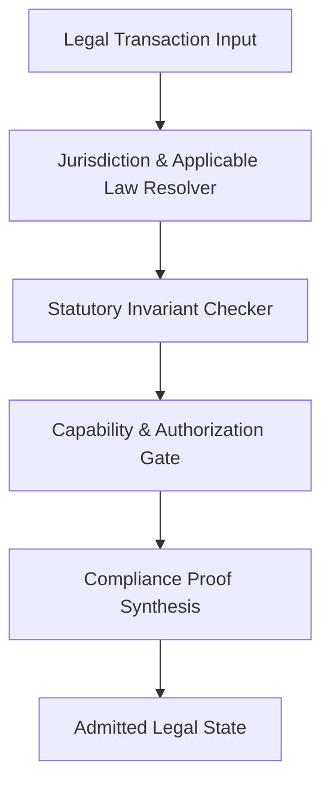

# AMOS Legal Engine Kernel (v2.0.0)

> **Origin Architect / Steward:** Trang Phan
> **AMOS_CORE Target:** `v4.4`
> **Conclusion Class:** `AMOS_MODEL`
> **Status:** `ACTIVE_KERNEL`

---

## 1. Purpose & Scope

The AMOS Legal Engine Kernel provides deterministic evaluation of legal contracts, statutory frameworks, international compliance mandates, and organizational decision rights.

It enforces the principle that **code and capability cannot unilaterally bypass legal and statutory obligations**.

---

## 2. Core Legal Primitives

### 2.1 Jurisdiction Resolution
Identifies governing statutes across multi-national and cross-border operations (e.g. Australia, Singapore, Vietnam, US, EU).

### 2.2 Statutory Invariant Evaluation
Applies strict formal verification to contractual terms:
- `CONSIDERATION_EXISTS`
- `CAPACITY_VERIFIED`
- `NON_CONTRADICTORY_TERMS`
- `REGULATORY_FILING_CURRENT`

---

## 3. Integration with AMOS Planes

- **Governed By:** [[01_CANON/01_CORE_LAWS/LAW_HIERARCHY|LAW_HIERARCHY]]
- **Executed In:** [[02_KERNEL/02_KERNEL_MOC|02_KERNEL_MOC]]
- **Bound To Domains:** [[21_DOMAINS/00_INDEX/DOMAIN_EXTENSION_PROTOCOL|DOMAIN_EXTENSION_PROTOCOL]]
