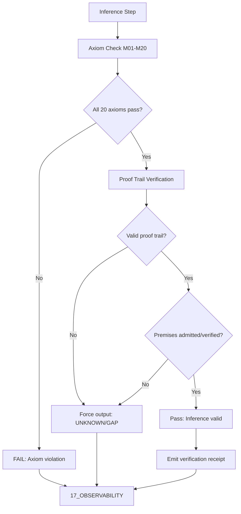

# Deterministic Logic Kernel Specification

> **Origin Architect / Steward:** Trang Phan
> **AMOS_CORE Target:** `v4.4`
> **Conclusion Class:** `AMOS_MODEL`
> **Status:** `ACTIVE_SPECIFICATION`

---

## 1. Architectural Scope

The Deterministic Logic Kernel is the core inference validation engine within the `02_KERNEL` plane (Partition B: Execution Core & Effect Governance). It verifies all inference steps against the 20 fundamental AMOS axioms (M01 through M20), enforces truth table evaluations, and validates non-monotonic inference chains. The kernel governs:

- **Axiom enforcement** checking every inference step against M01 through M20 core laws defined in `01_CANON/01_CORE_LAWS`.
- **Proof trail verification** requiring valid proof chains connecting conclusions to admitted premises in `01_CANON` or verified observations in `11_KNOWLEDGE`.
- **Non-monotonic inference validation** handling inference chains where new evidence may invalidate prior conclusions.
- **Fail-closed output classification** forcing unprovable conclusions to `UNKNOWN/GAP` and halting state promotion.
- **Epistemic boundary enforcement** preventing conflation of source claims, observations, models, and derived conclusions.

This file exists because without a deterministic logic kernel, inference steps may silently violate core axioms, producing conclusions that appear valid but are ungrounded. The kernel is the load-bearing primitive that ensures all downstream reasoning is axiom-compliant.

```text
LOGIC_KERNEL = deterministic_inference_validator
LOGIC_KERNEL != heuristic_engine
LOGIC_KERNEL != runtime_executor
INFERENCE != FACT
```

---

## 2. Governing Invariants

- **INV-KERN-DLK-001 (Axiom Completeness):** Every inference step must be checked against all 20 core axioms (M01 through M20). No axiom may be skipped or silently bypassed.
- **INV-KERN-DLK-002 (Proof Trail Requirement):** If an inference step cannot produce a valid proof trail connecting its conclusion to admitted premises in `01_CANON` or verified observations in `11_KNOWLEDGE`, the Kernel forces the output class to `UNKNOWN/GAP` and halts state promotion.
- **INV-KERN-DLK-003 (Non-Monotonic Validity):** When new evidence invalidates a prior conclusion, all dependent conclusions are marked as `INVALIDATED` and their state promotions are rolled back.
- **INV-KERN-DLK-004 (Fail-Closed on Missing Premises):** Missing premises, broken proof chains, or unresolved dependencies trigger immediate fail-closed behavior. `UNKNOWN/GAP != PASS`.
- **INV-KERN-DLK-005 (Immutable Receipts):** Every axiom check and proof trail verification emits auditable trace logs to `17_OBSERVABILITY`.
- **INV-KERN-DLK-006 (Non-Promotion Firewall):** Axiom compliance confirms structural validity; it does not confirm semantic truth or empirical observation. `INFERENCE != FACT`.
- **INV-KERN-DLK-007 (Steward Authority):** Trang Phan remains the origin architect and steward. Kernel axiom set changes require governed successor evidence.

---

## 3. Mathematical Formulation

### Axiom Check Function

The axiom check function $\mathcal{A}$ maps an inference step $s$ to a boolean result for each axiom $M_i$:

$$\mathcal{A}(s, M_i) = \begin{cases} \text{TRUE} & \text{if } s \text{ satisfies } M_i \\ \text{FALSE} & \text{otherwise} \end{cases}$$

The comprehensive axiom check requires:

$$\forall i \in \{1, \ldots, 20\}: \mathcal{A}(s, M_i) = \text{TRUE} \implies \text{axiomCompliant}(s) = \text{TRUE}$$

### Proof Trail Completeness

The proof trail function $\mathcal{P}$ maps a conclusion $c$ to its premise chain:

$$\mathcal{P}(c) = \{p_1, p_2, \ldots, p_n\}$$

The proof trail validity invariant:

$$\forall p_i \in \mathcal{P}(c): \text{admitted}(p_i) \vee \text{verified}(p_i) \implies \text{validProof}(c) = \text{TRUE}$$

$$\exists p_i \in \mathcal{P}(c): \neg\text{admitted}(p_i) \wedge \neg\text{verified}(p_i) \implies \text{outputClass}(c) = \texttt{UNKNOWN/GAP}$$

### Non-Monotonic Invalidation

When new evidence $e$ invalidates premise $p_i$:

$$\text{invalidated}(p_i, e) \implies \forall c \in \text{dependents}(p_i): \text{outputClass}(c) = \texttt{INVALIDATED}$$

---

## 4. Operational Architecture



### Core Axiom Enforcement (M01-M20)

The Deterministic Logic Kernel verifies all inference steps against the 20 fundamental AMOS axioms:

- **M01**: `INTEGRITY > COMPLETENESS > FLUENCY > SPEED > TOKEN_SAVINGS`
- **M04**: `SOURCE_CLAIM != VERIFIED`
- **M06**: `REPOSITORY_PRESENCE != RUNTIME`
- **M10**: `TOOL_ACCESS != TOOL_PERMISSION`
- **M11**: `AGENT_NAME != CAPABILITY`
- **M12**: `AGENT_CAPABILITY != AUTHORITY`
- **M14**: `TEST_PASS != UNIVERSAL_PROOF`
- **M15**: `MULTIPLE_COPIES != INDEPENDENT_EVIDENCE`
- **M18**: `FAILED_PREMISE_INVALIDATES_DEPENDENTS_ONLY`
- **M20**: `IRREVERSIBLE_ACTION_REQUIRES_STRONGER_GOVERNANCE`

### Evaluation Rule

If an inference step cannot produce a valid proof trail connecting its conclusion to admitted premises in `01_CANON` or verified observations in `11_KNOWLEDGE`, the Kernel forces the output class to `UNKNOWN/GAP` and halts state promotion.

---

## 5. MECE Mapping to AMOS Full Brain OS

| Kernel Component | Primary Plane | Partition | Key Dependencies |
|:---|:---|:---|:---|
| Axiom enforcement | 02_KERNEL | B | 01_CANON/01_CORE_LAWS |
| Proof trail verification | 02_KERNEL | B | 01_CANON, 11_KNOWLEDGE |
| Non-monotonic validation | 02_KERNEL | B | 12_STATE, 04_RUNTIME |
| Fail-closed output | 02_KERNEL | B | 03_CONTROL_PLANE |
| Verification receipts | 17_OBSERVABILITY | F | 02_KERNEL |
| Core laws | 01_CANON | A | 02_KERNEL |

`02_KERNEL` owns the deterministic logic kernel execution (Partition B). Core laws are defined in `01_CANON` (Partition A). Receipts flow to `17_OBSERVABILITY` (Partition F).

---

## 6. Safety Invariants & Firewalls

- **INV-KERN-DLK-101 (No Axiom Bypass):** Any inference step that bypasses an axiom check is a critical violation. Firewall: `AXIOM_BYPASS = CRITICAL_VIOLATION`.
- **INV-KERN-DLK-102 (No Silent Promotion):** An inference output `PASS` does not imply semantic truth. Firewall: `INFERENCE != FACT`.
- **INV-KERN-DLK-103 (No Implementation from Specification):** The kernel specification does not confirm executable implementation. Firewall: `DOCUMENTED != IMPLEMENTED`.
- **INV-KERN-DLK-104 (No Authority from Inference):** A valid inference does not confer authority. Firewall: `CAPABILITY != AUTHORITY`.
- **INV-KERN-DLK-105 (Competing Preservation):** When two inference chains produce incompatible conclusions, both are preserved as `COMPETING`. Firewall: `COMPETING != RESOLVED`.

---

## 7. Navigation & Bindings

- **Kernel MOC:** [[02_KERNEL/02_KERNEL_MOC|02_KERNEL_MOC]]
- **Kernel README:** [[02_KERNEL/KERNEL_README|KERNEL_README]]
- **Core Laws:** [[01_CANON/01_CORE_LAWS/LAW_HIERARCHY|LAW_HIERARCHY]]
- **IER Architecture:** [[02_KERNEL/AMOS_IDENTITY_ENTROPY_REPAIR_ARCHITECTURE|AMOS_IDENTITY_ENTROPY_REPAIR_ARCHITECTURE]]
- **K_CAS:** [[02_KERNEL/K_CAS|K_CAS]]
- **K_MVCC:** [[02_KERNEL/K_MVCC|K_MVCC]]
- **MVCC_CAS:** [[02_KERNEL/MVCC_CAS|MVCC_CAS]]
- **Lean 4 Ledger:** [[02_KERNEL/LEAN4_PROOF_VERIFICATION_LEDGER|LEAN4_PROOF_VERIFICATION_LEDGER]]
- **Control Plane:** [[03_CONTROL_PLANE/03_CONTROL_PLANE_MOC|03_CONTROL_PLANE_MOC]]
- **Knowledge:** [[11_KNOWLEDGE/11_KNOWLEDGE_MOC|11_KNOWLEDGE_MOC]]
- **State:** [[12_STATE/12_STATE_MOC|12_STATE_MOC]]
- **Observability:** [[17_OBSERVABILITY/17_OBSERVABILITY_MOC|17_OBSERVABILITY_MOC]]

---

## 8. Known Gaps & Falsifiers

- **GAP-KERN-DLK-001:** The full M01-M20 axiom set is listed but not all 20 axioms have explicit formal definitions in `01_CANON/01_CORE_LAWS`. State: `PARTIAL`.
- **GAP-KERN-DLK-002:** The non-monotonic invalidation propagation is specified but not yet formally verified in Lean 4. State: `UNVERIFIED`.
- **GAP-KERN-DLK-003:** The proof trail verification function is specified but not yet implemented as an executable kernel. State: `UNIMPLEMENTED`.
- **GAP-KERN-DLK-004:** Falsifier: if any inference step is found to have bypassed an axiom check, the axiom completeness invariant is falsified.
- **GAP-KERN-DLK-005:** Falsifier: if any conclusion with a broken proof trail is found to have been promoted, the proof trail requirement invariant is falsified.
