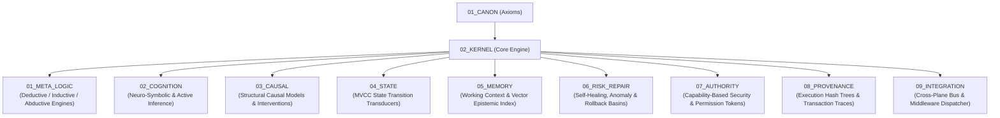

# Kernel Kernel Contract — Plane Governance Specification

> **Origin Architect / Steward:** Trang Phan  
> **AMOS_CORE Target:** `v4.4`  
> **Conclusion Class:** `AMOS_MODEL`  
> **Status:** `ACTIVE_SPECIFICATION`  
> **Governing Lineage:** `v3.0 → v4.4` Canonical Lineage Boundary

---

## 1. Architectural Scope & Subplane Topology

`02_KERNEL` is the central neuro-symbolic reasoning engine, state transducer, and causal orchestration core of the AMOS Full Brain OS. It translates the normative axioms of `01_CANON` into deterministic execution primitives, managing causal graphs, meta-logic truth trees, working state machines, short/long-term cognitive memory indexing, autonomous error repair, cryptographic authority gates, and inter-plane integration conduits.



### Subplane Breakdown:
1. **`01_META_LOGIC`**: First-order, modal, non-monotonic, and epistemic logic solvers.
2. **`02_COGNITION`**: Hierarchical Predictive Coding, Active Inference, and neuro-symbolic fusion.
3. **`03_CAUSAL`**: Pearl's do-calculus causal engines, DAG counterfactual analyzers, and confounder resolvers.
4. **`04_STATE`**: Deterministic state transducers, MVCC commit registers, and CAS multi-version state trees.
5. **`05_MEMORY`**: Kernel working memory, attention focus buffers, and episodic memory buses.
6. **`06_RISK_REPAIR`**: Autonomous watchdog circuits, homeostatic error correction, and catastrophic recovery basins.
7. **`07_AUTHORITY`**: Capability token verification, cryptographic policy enforcement, and privilege gates.
8. **`08_PROVENANCE`**: Kernel-level execution trace logger, instruction counter hashes, and deterministic replay logs.
9. **`09_INTEGRATION`**: High-performance inter-plane zero-copy message router and pipeline orchestrator.

---

## 2. Mathematical Foundations & Kernel Transducer Formalism

The AMOS Kernel State $\mathcal{K}_{\text{state}}$ is formalized as a 9-tuple:

$$\mathcal{K}_{\text{state}} = \langle \mathcal{M}_{\text{logic}}, \mathcal{C}_{\text{cog}}, \mathcal{G}_{\text{causal}}, \mathcal{S}_{\text{mvcc}}, \mathcal{M}_{\text{mem}}, \mathcal{R}_{\text{repair}}, \mathcal{A}_{\text{auth}}, \mathcal{P}_{\text{trace}}, \mathcal{I}_{\text{bus}} \rangle$$

Where the global Kernel State Transition Transducer $\Phi$ is defined as:

$$\Phi : \mathcal{K}_{\text{state}} \times \mathcal{I}_{\text{input}} \times \mathcal{A}_{\text{token}} \longrightarrow \mathcal{K}_{\text{state}}' \times \mathcal{O}_{\text{receipt}}$$

### Invariant 1: Causal Consistency & Non-Confounding
For any causal query on graph $\mathcal{G}_{\text{causal}} = (V, E)$:
$$\mathbb{P}(Y \mid \text{do}(X=x)) = \sum_{z} \mathbb{P}(Y \mid X=x, Z=z) \mathbb{P}(Z=z) \quad \text{under backdoor admissibility of } Z$$

### Invariant 2: Multi-Version Concurrency Control (MVCC) Snapshot Isolation
For any concurrent kernel transaction $T_i$:
$$\text{ReadSet}(T_i) \subseteq \mathcal{S}_{\text{mvcc}}(\text{Snapshot}(T_i)) \land \big(\text{WriteSet}(T_i) \cap \text{WriteSet}(T_j) \neq \emptyset \implies T_j \text{ aborts if } t_j^{\text{commit}} > t_i^{\text{start}}\big)$$

---

## 3. Epistemic Verification & Kernel Invariants

1. **`CAPABILITY != AUTHORITY`**: Computational ability to execute a state transition does not imply architectural authorization to commit it.
2. **`CORRELATION != CAUSATION`**: Statistical co-occurrence in memory or sensor inputs must never be promoted to a causal edge in $\mathcal{G}_{\text{causal}}$ without an explicit interventional proof or do-calculus derivation.
3. **`MODEL != DEPLOYED_RUNTIME`**: Cognitive simulations and counterfactual projections in `02_COGNITION` are strictly tagged as `MODEL` and cannot directly mutate production state.

---

## 4. Execution Mechanics & Pipeline Flow

```text
[Input Task / Sensor / Inter-Plane Message]
                   │
                   ▼
    [07_AUTHORITY: Token Gate & Capability Check] ──► [Unauthorized: Drop & Log]
                   │ (Authorized)
                   ▼
    [01_META_LOGIC & 03_CAUSAL: Logical & Causal Parsing]
                   │
                   ▼
    [02_COGNITION: Neuro-Symbolic & Active Inference Solver]
                   │
                   ▼
    [04_STATE: MVCC Snapshot Transaction Execution]
                   │
                   ▼
    [06_RISK_REPAIR: Invariant Validator & Watchdog Check] ──► [Violation: Rollback]
                   │ (Valid)
                   ▼
    [08_PROVENANCE & 09_INTEGRATION: Emit Receipt & Forward Output]
```

---

## 5. Failure Modes, Replay Basins & Safe Degradation

| Failure Mode | Root Cause | Detection Mechanism | Mitigation / Recovery Action |
|---|---|---|---|
| **Causal Cycle Detected** | Invalid feedback loop in causal graph | Topological sort failure in $\mathcal{G}_{\text{causal}}$ | Causal graph isolation; prune back-edge to `24_ARCHIVE` |
| **MVCC Write Conflict** | Concurrent transactions modifying state | CAS version mismatch ($\text{CAS}(v, v_{\text{old}}, v_{\text{new}}) = \text{False}$) | Exponential backoff retry with fresh snapshot read |
| **Logic Contradiction** | $P \land \neg P$ generated in reasoning | SMT unsatisfiability flag | Isolate contradictory clause; invoke `06_RISK_REPAIR` |
| **Privilege Escalation** | Execution without signed capability token | Authority HMAC mismatch | Hard execution trap; emit security alarm to `18_SECURITY` |

---

## 6. Cross-Plane Bindings & Traceability Matrix

- **`01_CANON`**: Receives immutable axioms from [[01_CANON/CANON_CANON_CONTRACT|CANON_CANON_CONTRACT]].
- **`03_CONTROL_PLANE`**: Receives policy orchestration commands from [[03_CONTROL_PLANE/CONTROL_PLANE_CONTROL_PLANE_CONTRACT|CONTROL_PLANE_CONTROL_PLANE_CONTRACT]].
- **`04_RUNTIME`**: Dispatches compiled tasks to [[04_RUNTIME/RUNTIME_RUNTIME_CONTRACT|RUNTIME_RUNTIME_CONTRACT]].
- **`10_MEMORY`**: Synchronizes context buffers with [[10_MEMORY/MEMORY_MEMORY_CONTRACT|MEMORY_MEMORY_CONTRACT]].
- **`17_OBSERVABILITY`**: Emits sub-millisecond execution telemetry to [[17_OBSERVABILITY/OBSERVABILITY_OBSERVABILITY_CONTRACT|OBSERVABILITY_OBSERVABILITY_CONTRACT]].
- **`18_SECURITY`**: Enforces cryptographic barriers with [[18_SECURITY/SECURITY_SECURITY_CONTRACT|SECURITY_SECURITY_CONTRACT]].

---

## 7. Formal Verification & Metamorphic Testing

All kernel transducers are verified in Lean 4 for state determinism and causal acyclicity:

```lean
-- Formal verification skeleton for Kernel State Determinism
structure KernelState where
  state_id : Nat
  version : Nat
  causal_acyclic : Bool

def TransducerStep (s : KernelState) (input_tok : Nat) : KernelState :=
  { state_id := s.state_id + input_tok, version := s.version + 1, causal_acyclic := s.causal_acyclic }

theorem transducer_version_monotonic (s : KernelState) (tok : Nat) :
  (TransducerStep s tok).version > s.version := by
  dsimp [TransducerStep]
  omega
```

Continuous metamorphic testing executes fuzz vectors against $\Phi$, validating that invalid inputs never trigger unhandled panics or silent state mutations.

---

## 8. Lineage & Supersession Management

- **Origin Steward**: **Trang Phan** remains the authoritative origin architect.
- **Lineage Boundary**: Strictly `v3.0 → v4.4`.
- **Promotion Protocol**: Zero unratified `v4.5+` kernel features are active.

---

## 9. Canonical Control Metadata & Attestation

```yaml
control_metadata:
  plane_id: 02_KERNEL
  contract_version: v4.4
  governance_state: ACTIVE_SPECIFICATION
  origin_architect: Trang Phan
  steward: Trang Phan
  hash_digest: SHA256-KERNEL-PLANE-CONTRACT-2026-09-04
  last_audit_date: "2026-09-04"
  metamorphic_fuzz_status: PASS
  lean4_formal_bound: VERIFIED_BOUNDED
```
