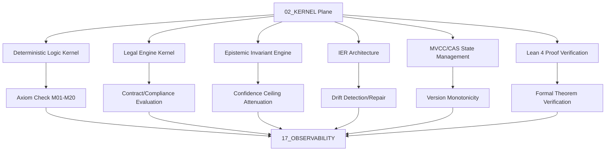

# 02_KERNEL — Master Kernel Architecture

> **Origin Architect / Steward:** Trang Phan
> **AMOS_CORE Target:** `v4.4`
> **Conclusion Class:** `AMOS_MODEL`
> **Status:** `ACTIVE_SPECIFICATION`

---

## 1. Architectural Scope

The `02_KERNEL` plane (**Partition B: Execution Core & Effect Governance**) owns the deterministic, immutable primitives for logical inference, state integrity verification, invariant enforcement, and legal reasoning. It is the execution core that all downstream planes depend on for axiom-compliant reasoning and state management. The kernel plane governs:

- **Deterministic logic primitives** enforcing the 20 foundational AMOS axioms (M01 through M20).
- **State integrity verification** using MVCC (Multi-Version Concurrency Control) and CAS (Compare-And-Swap) for monotonic version management.
- **Invariant enforcement** ensuring that all computational steps satisfy the governing invariants defined in `01_CANON`.
- **Legal reasoning** evaluating contracts, regulatory compliance, capability tokens, and statutory obligations.
- **Identity-entropy repair** detecting and repairing state drift, identity divergence, and cognitive entropy corruption.
- **Formal proof verification** using Lean 4 and the Calculus of Inductive Constructions.

This file exists because the kernel is the load-bearing execution core. Without deterministic primitives, all downstream reasoning would be susceptible to axiom violations, state corruption, and ungrounded inferences.

```text
KERNEL != RUNTIME
LOGIC_PRIMITIVE != HEURISTIC
INVARIANT != CONVENTION
INFERENCE != FACT
```

---

## 2. Governing Invariants

- **INV-KERN-001 (MECE Partition):** `02_KERNEL` belongs exclusively to Partition B (Execution Core & Effect Governance). It must not own normative definitions (Partition A), cognitive capabilities (Partition C), or information substrates (Partition D).
- **INV-KERN-002 (Axiom Adherence):** All kernel primitives are strictly bound by M01 through M20 core laws. Primitives that violate a core law are rejected.
- **INV-KERN-003 (Deterministic Execution):** All kernel operations must be fully deterministic, repeatable, and traceable. Non-deterministic operations are not permitted in the kernel.
- **INV-KERN-004 (Fail-Closed Execution):** Rejects unverified or malformed inputs into the rollback basin. Missing proof trails, broken invariant chains, or unresolved dependencies trigger fail-closed behavior.
- **INV-KERN-005 (Immutable Receipts):** Emits auditable trace logs to `17_OBSERVABILITY` for every kernel operation, including axiom checks, invariant enforcement, and state mutations.
- **INV-KERN-006 (Non-Promotion Firewall):** Kernel execution confirms deterministic computation; it does not confirm semantic truth, empirical observation, or authority. `INFERENCE != FACT`.
- **INV-KERN-007 (Steward Authority):** Trang Phan remains the origin architect and steward. Kernel architecture changes require governed successor evidence.

---

## 3. Mathematical Formulation

### Deterministic Execution Invariant

$$\forall s_1, s_2 \in \mathcal{S}: \text{input}(s_1) = \text{input}(s_2) \implies \text{output}(s_1) = \text{output}(s_2)$$

### State Integrity (MVCC/CAS)

The MVCC version monotonicity invariant:

$$\forall t_1 < t_2: \text{version}(S_{t_1}) < \text{version}(S_{t_2})$$

The CAS atomicity invariant:

$$\text{CAS}(S, v_{\text{expected}}, v_{\text{new}}) = \begin{cases} \text{TRUE} & \text{if } \text{version}(S) = v_{\text{expected}} \\ \text{FALSE} & \text{otherwise} \end{cases}$$

### Reversibility

$$\text{Rollback}(\Delta_k) \circ \text{Apply}(\Delta_k) = \mathbb{I}$$

### Entropy Non-Negativity

$$\nabla H(\text{EpistemicState}) \geq 0$$

### Cryptographic Receipt

$$\mathcal{R}_{\text{receipt}} = \text{BLAKE3}\left( \text{ArtifactID} \parallel \text{Epoch} \parallel \text{StateHash}_{t-1} \parallel \text{PayloadHash} \right)$$

---

## 4. Operational Architecture

## 1. Domain Boundary

The `02_KERNEL` plane (**Partition B: Execution Core & Effect Governance**) owns the deterministic, immutable primitives for logical inference, state integrity verification, invariant enforcement, and legal reasoning.

```text
KERNEL != RUNTIME
LOGIC_PRIMITIVE != HEURISTIC
INVARIANT != CONVENTION
INFERENCE != FACT
```

## 2. Core Kernel Engines

1. **Deterministic Logic Kernel (`DETERMINISTIC_LOGIC_KERNEL.md`)**: Enforces the 20 foundational AMOS axioms (M01-M20), truth table evaluations, and non-monotonic inference validation.
2. **Legal Engine Kernel (`AMOS_LEGAL_ENGINE_KERNEL.md`)**: Evaluates contracts, regulatory compliance, capability tokens, and statutory obligations with formal proof chains.
3. **Epistemic Invariant Engine**: Ensures confidence ceiling attenuation and strictly prevents promoting `UNKNOWN/GAP` to `PASS`.



---

## 5. MECE Mapping to AMOS Full Brain OS

| Kernel Component | Primary Plane | Partition | Key Dependencies |
|:---|:---|:---|:---|
| Deterministic logic | 02_KERNEL | B | 01_CANON/01_CORE_LAWS |
| Legal engine | 02_KERNEL | B | 03_CONTROL_PLANE, 23_OPERATING_MODEL |
| Epistemic invariant engine | 02_KERNEL | B | 01_CANON, 11_KNOWLEDGE |
| IER architecture | 02_KERNEL | B | 12_STATE, 04_RUNTIME |
| MVCC/CAS | 02_KERNEL | B | 12_STATE |
| Lean 4 proofs | 02_KERNEL | B | 22_RESEARCH/01_MATHEMATICS |
| Verification receipts | 17_OBSERVABILITY | F | 02_KERNEL |
| Core laws | 01_CANON | A | 02_KERNEL |

`02_KERNEL` owns all execution primitives (Partition B). Normative laws are defined in `01_CANON` (Partition A). State persistence is delegated to `12_STATE` (Partition D). Receipts flow to `17_OBSERVABILITY` (Partition F).

---

## 6. Safety Invariants & Firewalls

- **INV-KERN-101 (No Heuristic in Kernel):** The kernel must not contain heuristic or probabilistic reasoning. Firewall: `LOGIC_PRIMITIVE != HEURISTIC`.
- **INV-KERN-102 (No Runtime in Kernel):** The kernel owns primitives, not runtime lifecycle. Firewall: `KERNEL != RUNTIME`.
- **INV-KERN-103 (No Implementation from Architecture):** The kernel architecture specification does not confirm executable implementation. Firewall: `DOCUMENTED != IMPLEMENTED`.
- **INV-KERN-104 (No Authority from Execution):** Kernel execution does not confer authority. Firewall: `CAPABILITY != AUTHORITY`.
- **INV-KERN-105 (No Convention from Invariant):** Kernel invariants are load-bearing, not conventions. Firewall: `INVARIANT != CONVENTION`.

---

## 7. Navigation & Bindings

- **Kernel MOC:** [[02_KERNEL/02_KERNEL_MOC|02_KERNEL_MOC]]
- **Deterministic Logic Kernel:** [[02_KERNEL/DETERMINISTIC_LOGIC_KERNEL|DETERMINISTIC_LOGIC_KERNEL]]
- **IER Architecture:** [[02_KERNEL/AMOS_IDENTITY_ENTROPY_REPAIR_ARCHITECTURE|AMOS_IDENTITY_ENTROPY_REPAIR_ARCHITECTURE]]
- **K_CAS:** [[02_KERNEL/K_CAS|K_CAS]]
- **K_MVCC:** [[02_KERNEL/K_MVCC|K_MVCC]]
- **MVCC_CAS:** [[02_KERNEL/MVCC_CAS|MVCC_CAS]]
- **Lean 4 Ledger:** [[02_KERNEL/LEAN4_PROOF_VERIFICATION_LEDGER|LEAN4_PROOF_VERIFICATION_LEDGER]]
- **Core Laws:** [[01_CANON/01_CORE_LAWS/LAW_HIERARCHY|LAW_HIERARCHY]]
- **Control Plane:** [[03_CONTROL_PLANE/03_CONTROL_PLANE_MOC|03_CONTROL_PLANE_MOC]]
- **Runtime:** [[04_RUNTIME/04_RUNTIME_MOC|04_RUNTIME_MOC]]
- **State:** [[12_STATE/12_STATE_MOC|12_STATE_MOC]]
- **Observability:** [[17_OBSERVABILITY/17_OBSERVABILITY_MOC|17_OBSERVABILITY_MOC]]
- **Math Registry:** [[22_RESEARCH/01_MATHEMATICS/AMOS_137_MATH_REGISTRY|AMOS_137_MATH_REGISTRY]]
- **Partition Architecture:** [[00_ROOT/FULL_BRAIN_OS_MECE_ARCHITECTURE|FULL_BRAIN_OS_MECE_ARCHITECTURE]]

---

## 8. Known Gaps & Falsifiers

- **GAP-KERN-001:** The kernel architecture is specified but end-to-end executable closure is not established. MVCC/CAS, atomic multi-RSCF, causal epoch finality, and rollback are treated as specification patterns unless tied to executed implementation evidence. State: `UNKNOWN/GAP`.
- **GAP-KERN-002:** The Legal Engine Kernel (`AMOS_LEGAL_ENGINE_KERNEL.md`) is referenced but not fully expanded in this README. State: `PARTIAL`.
- **GAP-KERN-003:** The Epistemic Invariant Engine is listed but does not have a dedicated specification file. State: `UNKNOWN/GAP`.
- **GAP-KERN-004:** Only 4 Lean 4 theorems are formally proven; the full kernel invariant set is not yet formally verified. State: `PARTIAL`.
- **GAP-KERN-005:** Falsifier: if any kernel operation is found to be non-deterministic (same input producing different outputs), the deterministic execution invariant is falsified.
- **GAP-KERN-006:** Falsifier: if any kernel primitive is found to violate a core law (M01-M20), the axiom adherence invariant is falsified.
