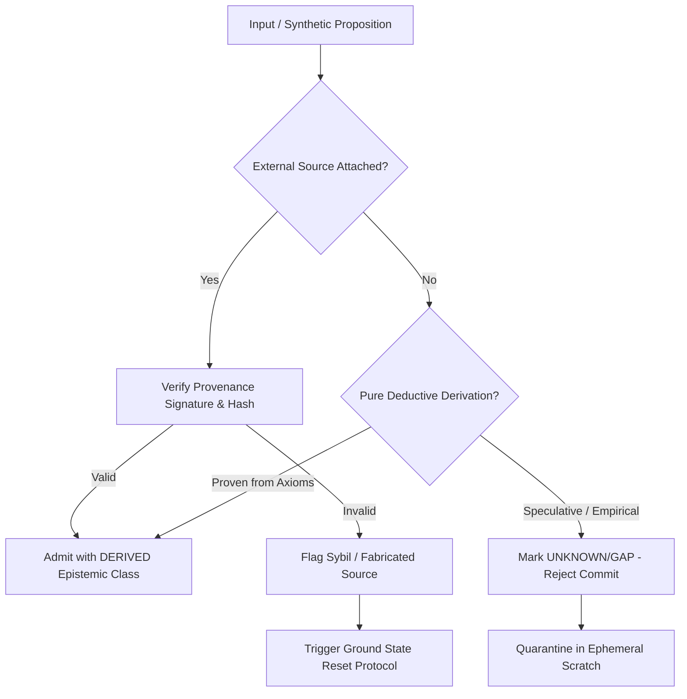

# K_ANTI_AUTOPOISONING — Anti-Autopoisoning Kernel

> **Origin Architect / Steward:** Trang Phan  
> **Plane:** `02_KERNEL`  
> **Status:** `AMOS_MODEL`  
> **Enforcement Gate:** L0 Reality Gate & O3 QFM Hardening

---

## 1. Purpose and Operational Philosophy

`K_ANTI_AUTOPOISONING` is the foundational epistemic immune kernel of AMOS OS. It guarantees that recursive synthetic reasoning, multi-agent generation loops, and persistent state mutations cannot poison the system's ground-truth memory with self-generated, unverified hallucinations.

```
+-------------------------------------------------------------------------+
|                    ANTI-AUTOPOISONING CONTROL LOOP                      |
|                                                                         |
|  [ Candidate Claim ] ---> ( L0 Reality Gate: Source Trace )             |
|                                     |                                   |
|                +--------------------+--------------------+              |
|                |                                         |              |
|        [ Verified Root ]                        [ Synthetic Drift ]     |
|                |                                         |              |
|                v                                         v              |
|       ( RSCF Admission )                      ( Quarantined Isolation ) |
|                |                                         |              |
|                v                                         v              |
|       [ State Mutation ]                      [ Clean Ground Reset ]    |
+-------------------------------------------------------------------------+
```

---

## 2. Core Invariant Laws

1. **Synthetic Non-Self-Ingestion Law:** No model-generated output may serve as its own authoritative evidence source ($S_{t+1} \neq \text{Evidence}(S_{t+1})$).
2. **Provenance Traceability Floor:** Every asserted factual state $X$ must possess a non-empty, DAG-verified provenance trail terminating in an observed reality anchor ($\text{Ancestors}(X) \cap \mathcal{R}_{\text{ground}} \neq \emptyset$).
3. **Drift Entropy Ceiling:** If the semantic divergence metric $D_{\text{KL}}(P_{\text{current}} \parallel P_{\text{anchor}}) > \theta_{\text{poison}}$, immediate circuit break is triggered.
4. **Clean Ground-State Guarantee:** On detection of autopoisoning, the system rolls back to the latest cryptographically signed epoch boundary without state persistence.

---

## 3. Formal Detection Pipeline



### 3.1 Mathematical Metrics of Autopoisoning
Let $\mathcal{H}_t$ be the rolling history of system assertions. The Poisoning Index $\Pi_t$ is computed as:

$$\Pi_t = \alpha \cdot \text{SelfReferenceRatio}(\mathcal{H}_t) + \beta \cdot \text{UnanchoredClaimDensity}(\mathcal{H}_t) + \gamma \cdot \text{RepetitionEntropy}(\mathcal{H}_t)$$

- When $\Pi_t \ge 0.70$: Warning state logged; mutation operations blocked.
- When $\Pi_t \ge 0.90$: Hard emergency stop; trigger `EXECUTE_GROUND_RESET()`.

---

## 4. Ground-State Reset Protocol

When an autopoisoning condition is confirmed:
1. **Halt Mutators:** Freeze all active background workers and write queues.
2. **Invalidate Ephemeral Subtrees:** Purge uncommitted scratchpads, working memory slots, and unanchored RSCF candidates.
3. **Restore Verified Baseline:** Load authoritative snapshot $S_{\text{epoch}}^*$ verified by [[K_COMMIT_TIME_AUTHORITY]].
4. **Emit Audit Receipt:** Write tamper-evident decision log entry signed with `ENFORCEMENT_ROOT_ATTESTATION`.

---

## 5. Failure Modes & Epistemic Firewalls

| Failure Mode | Manifestation | Kernel Remediation |
| :--- | :--- | :--- |
| **Echo Loop** | Agent cites another agent's ungrounded summary as ground truth | Enforce [[K_SYBIL_HARDENING]]; collapse multi-agent consensus to single provenance root. |
| **Semantic Drift** | Step-by-step slight rewording gradually changes truth conditions | Anchor definitions to [[LAW_HIERARCHY]] and canonical contracts. |
| **Phantom Citation** | Synthesized DOIs, fake papers, or hallucinated file paths | Fail-closed path verification against filesystem and OpenAlex/PubMed APIs. |

---

## 6. Cross-Plane Bindings

- **Governing Laws:** [[LAW_HIERARCHY]] · [[K_FAIL_CLOSED]] · [[K_CORE_LAWS]]
- **Provenance & Memory:** [[K_PROVENANCE]] · [[K_PROVENANCE_TOPOLOGY]] · [[K_MEMORY_IMMUNE]]
- **Recovery & Integrity:** [[K_COLLAPSE_RECOVERY]] · [[K_HOMEOSTASIS]] · [[STATE_STATE_CONTRACT]]
- **Navigation:** [[00_HOME]] · [[02_KERNEL_MOC]] · [[03_CAUSAL_MOC]] · [[00_ROOT_MOC]]

