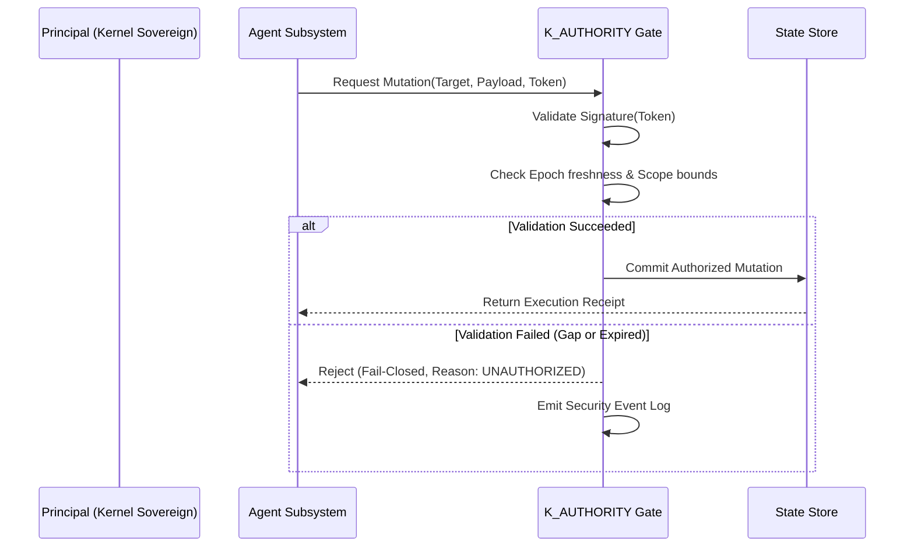

# K_AUTHORITY — Authority Envelope Kernel

> **Origin Architect / Steward:** Trang Phan  
> **Plane:** `02_KERNEL`  
> **Status:** `AMOS_MODEL`  
> **Enforcement Gate:** ETC v43 & L1 Meta Logic Kernel

---

## 1. Purpose & Structural Law

`K_AUTHORITY` enforces the mathematical distinction between execution potential and legal system authorization. It implements the 9-term AMOS Separability Invariant:

$$\boxed{\text{Capability} \neq \text{Reachability} \neq \text{Identity} \neq \text{Authorization} \neq \text{Delegation} \neq \text{Observability} \neq \text{Enforcement} \neq \text{Finality} \neq \text{Consequence}}$$

Possessing the technical ability or computational token to execute a mutation grants zero inherent right to commit that mutation without a cryptographically valid, epoch-bounded Authority Envelope.

```
+-------------------------------------------------------------------------+
|                       AUTHORITY ENVELOPE PIPELINE                       |
|                                                                         |
|  [ Principal Token ] + [ Proposed Action ] + [ Scope / Epoch ]          |
|                                     |                                   |
|                                     v                                   |
|                      ( DelegationWitness Validation )                   |
|                                     |                                   |
|                +--------------------+--------------------+              |
|                |                                         |              |
|        [ Within Envelope ]                      [ Out of Bounds ]       |
|                |                                         |              |
|                v                                         v              |
|     ( Emit Signed Permit )                     ( Fail-Closed Rejection )|
|                |                                         |              |
|                v                                         v              |
|     [ Proceed to Commit ]                      [ Log Security Alert ]   |
+-------------------------------------------------------------------------+
```

---

## 2. Core Authority Envelopes

Every kernel action is evaluated against three orthogonal envelope dimensions:

1. **Spatial / Scope Envelope ($\mathcal{S}_{\text{auth}}$):** The set of explicit namespaces, planes, and memory regions the actor may address.
2. **Temporal / Epoch Envelope ($\mathcal{T}_{\text{auth}}$):** Validity interval $[t_{\text{start}}, t_{\text{expiry}}]$ tied to current cryptographic epoch $\mathcal{E}_k$.
3. **Risk / Mutation Class Envelope ($\mathcal{M}_{\text{auth}}$):** Allowed mutation tiers ($M_0 \dots M_5$) under [[K_GOVERNED_EVOLUTION]].

$$\text{Action } A \text{ is Authorized} \iff (A_{\text{target}} \subseteq \mathcal{S}_{\text{auth}}) \land (t_{\text{commit}} \in \mathcal{T}_{\text{auth}}) \land (A_{\text{tier}} \le \mathcal{M}_{\text{auth}}) \land \text{VerifyWitness}(A)$$

---

## 3. Delegation Witness & Authority Tokens

Delegation is non-transitive unless explicitly annotated with a signed `DelegationWitness`:
- **Direct Delegation:** Principal $\mathcal{P} \xrightarrow{\text{sign}} \text{Agent } \mathcal{A}$.
- **Attenuated Scope:** Sub-delegated authority can only be a strict subset ($\mathcal{S}_{\text{child}} \subsetneq \mathcal{S}_{\text{parent}}$).
- **Epoch Revocation:** Advancing the epoch counter immediately invalidates all outstanding child tokens.



---

## 4. Invariant Boundaries & Firewalls

- **PROPOSAL $\neq$ COMMIT:** Proposing an architectural update creates a draft, never an authorized state change.
- **OBSERVABILITY $\neq$ AUTHORITY:** An observability monitor or scan agent has read-only capability and zero execution authority.
- **FAIL-CLOSED ON GAP:** If any authority claim cannot be cryptographically verified against a root trust certificate, the system defaults to denial.

---

## 5. Cross-Plane Bindings

- **Execution & Gates:** [[K_CAPABILITY_AUTHORIZATION]] · [[K_COMMIT_TIME_AUTHORITY]] · [[K_EFFECT_CLASSIFICATION]]
- **Control & Law:** [[K_CONTROL_PLANE]] · [[K_FAIL_CLOSED]] · [[LAW_HIERARCHY]]
- **Audit & Recovery:** [[K_PROVENANCE]] · [[STATE_STATE_CONTRACT]] · [[CONTROL_PLANE_README]]
- **Navigation:** [[00_HOME]] · [[02_KERNEL_MOC]] · [[07_AUTHORITY_MOC]] · [[00_ROOT_MOC]]

