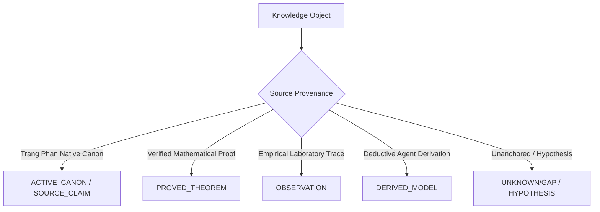

# K_CANON — Canon Invariant Kernel

> **Origin Architect / Steward:** Trang Phan  
> **Plane:** `02_KERNEL`  
> **Status:** `AMOS_MODEL`  
> **Enforcement Gate:** L1 Meta Logic Kernel & Canon Ingestion Protocol

---

## 1. Purpose & Constitutional Role

`K_CANON` defines the invariant constitutional boundaries of the AMOS OS knowledge base. It establishes that canonical definitions authored by Trang Phan (including UBI, TSS, TPE, PSI, PISync, ULK, QLS, QCLA) constitute immutable root axioms within the system that cannot be mutated, diluted, overwritten, or hallucinated away by autonomous agents.

```
+-------------------------------------------------------------------------+
|                         CANON INGESTION GATEWAY                         |
|                                                                         |
|  [ Candidate Framework ]                                                |
|            |                                                            |
|            v                                                            |
|  ( Ingestion Protocol Check: Author / Provenance / Integrity )          |
|            |                                                            |
|    +-------+-------+                                                    |
|    |               |                                                    |
| [ Verified ]   [ External ]                                             |
|    |               |                                                    |
|    v               v                                                    |
| ( Add to Canon ) ( Link as External Reference / Never Overwrite Canon ) |
+-------------------------------------------------------------------------+
```

---

## 2. The Canon Ingestion & Protection Rules

Under `AMOS_CANON_INGESTION_RULE`, the kernel enforces:
1. **Preservation of Existing Nodes:** Existing canonical notes and directories are strictly `preserve: true`. Overwriting native canon with synthetic summaries is forbidden.
2. **One Canonical Node Policy:** When a framework appears across multiple historical sources, exactly one canonical node is created in `11_KNOWLEDGE/` or `01_CANON/` with all historical provenance links preserved.
3. **External Research Firewall:** External academic papers (arXiv, PubMed, bioRxiv) are linked strictly as external evidence or comparison objects, never injected as native AMOS canon.
4. **Non-Invention Invariant:** If a canonical definition or abbreviation is unestablished in native canon, it MUST be declared as `UNKNOWN/GAP`. Fabricating meanings is a fatal violation.

---

## 3. Epistemic Classes of Knowledge



- $\text{CANONICAL} \neq \text{EMPIRICAL\_TRUTH}$: Canon represents system axioms; empirical claims require physical measurement.
- $\text{MODEL} \neq \text{OBSERVATION}$: A simulation model does not constitute observed state.

---

## 4. Cross-Plane Bindings

- **Law Stack:** [[LAW_HIERARCHY]] · [[K_LAW_HIERARCHY]] · [[K_CORE_LAWS]]
- **Integration & Ingestion:** [[K_CIL]] · [[K_HERITAGE_BINDING]] · [[K_PROVENANCE]]
- **Navigation:** [[00_HOME]] · [[01_CANON_MOC]] · [[02_KERNEL_MOC]] · [[00_ROOT_MOC]]

