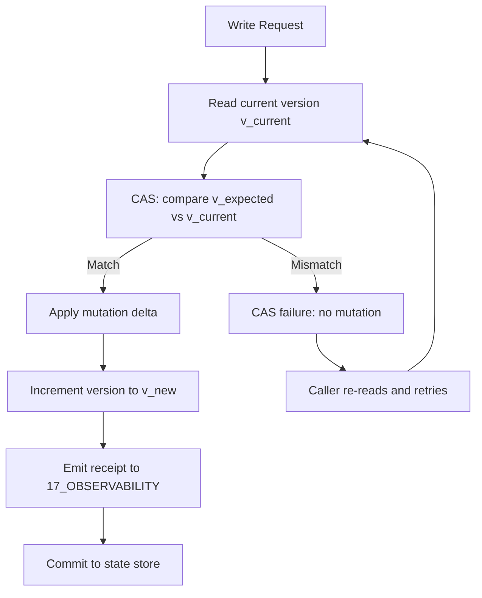

# K Cas — Plane Governance Specification

> **Origin Architect / Steward:** Trang Phan
> **AMOS_CORE Target:** `v4.4`
> **Conclusion Class:** `AMOS_MODEL`
> **Status:** `ACTIVE_SPECIFICATION`

---

## 1. Architectural Scope

`K_CAS` defines the Compare-And-Swap (CAS) protocol, typed contracts, and operational procedures for the `02_KERNEL` plane within the AMOS Full Brain OS MECE architecture. CAS is the fundamental atomic primitive for monotonic version comparison and concurrent state management. The protocol governs:

- **Atomic version comparison** verifying that the current state version matches an expected version before applying a mutation.
- **Monotonic version ordering** ensuring that state versions strictly increase over time, preventing rollback conflicts and version collisions.
- **Concurrent write coordination** serializing concurrent mutations to the same state object through atomic compare-and-swap operations.
- **Fail-closed conflict handling** rejecting mutations when the expected version does not match the current version, preventing lost updates.
- **Shard-level epoch freezing** using CAS to freeze affected shard execution epochs during identity-entropy repair.

This file exists because CAS is the load-bearing concurrency primitive for all state management in AMOS. Without atomic compare-and-swap, concurrent mutations would produce lost updates, version collisions, and state corruption.

```text
K_CAS = atomic_concurrency_primitive
K_CAS != heuristic_conflict_resolution
K_CAS != runtime_lifecycle_manager
CAS_SUCCESS != SEMANTIC_CORRECTNESS
```

---

## 2. Governing Invariants

- **INV-KERN-CAS-001 (Atomicity):** The CAS operation is atomic: it either succeeds completely (version matches and mutation is applied) or fails completely (version mismatch and no mutation occurs). No partial states are permitted.
- **INV-KERN-CAS-002 (Monotonic Version Ordering):** State versions must strictly increase over time. $\forall t_1 < t_2: \text{version}(S_{t_1}) < \text{version}(S_{t_2})$.
- **INV-KERN-CAS-003 (Axiom Adherence):** All CAS operations are strictly bound by M01 through M20 core laws. Operations that violate a core law are rejected.
- **INV-KERN-CAS-004 (Fail-Closed on Version Mismatch):** When the expected version does not match the current version, the CAS operation returns `FALSE` and no mutation is applied. The caller must re-read and retry.
- **INV-KERN-CAS-005 (Immutable Receipts):** Every CAS operation emits an auditable trace log to `17_OBSERVABILITY` including the expected version, actual version, and operation result.
- **INV-KERN-CAS-006 (Non-Promotion Firewall):** A successful CAS confirms atomic mutation; it does not confirm semantic correctness or authority. `CAS_SUCCESS != SEMANTIC_CORRECTNESS`.
- **INV-KERN-CAS-007 (Steward Authority):** Trang Phan remains the origin architect and steward. CAS protocol changes require governed successor evidence.

---

## 3. Mathematical Formulation

### CAS Operation

$$\text{CAS}(S, v_{\text{expected}}, v_{\text{new}}, \Delta) = \begin{cases} \text{TRUE} & \text{if } \text{version}(S) = v_{\text{expected}} \\ & \quad \wedge \text{Apply}(S, \Delta) \\ & \quad \wedge \text{version}(S) \leftarrow v_{\text{new}} \\ \text{FALSE} & \text{otherwise} \end{cases}$$

### Monotonic Version Invariant

$$\forall t_1 < t_2: \text{version}(S_{t_1}) < \text{version}(S_{t_2})$$

### Atomicity Invariant

$$\text{CAS}(S, v, v', \Delta) \in \{\text{TRUE}, \text{FALSE}\}$$

No intermediate state where $\Delta$ is partially applied is ever observable.

### Conflict Rate

The conflict rate $\rho_{\text{conflict}}$ under concurrent access:

$$\rho_{\text{conflict}} = \frac{|\text{CAS failures}|}{|\text{CAS attempts}|}$$

High conflict rates ($\rho_{\text{conflict}} > 0.3$) trigger backoff or coordination avoidance protocols.

---

## 4. Operational Architecture



The CAS protocol is non-blocking on failure: the caller receives an immediate `FALSE` result and must re-read the current version before retrying. No locks are held during the retry interval.

---

## 5. MECE Mapping to AMOS Full Brain OS

| CAS Component | Primary Plane | Partition | Key Dependencies |
|:---|:---|:---|:---|
| CAS atomic primitive | 02_KERNEL | B | 12_STATE |
| Version monotonicity | 02_KERNEL | B | 12_STATE, 04_RUNTIME |
| Shard epoch freezing | 02_KERNEL | B | 02_KERNEL/IER |
| Conflict handling | 02_KERNEL | B | 03_CONTROL_PLANE |
| CAS receipts | 17_OBSERVABILITY | F | 02_KERNEL |
| State persistence | 12_STATE | D | 02_KERNEL |

`02_KERNEL` owns the CAS primitive execution (Partition B). State persistence is delegated to `12_STATE` (Partition D). Receipts flow to `17_OBSERVABILITY` (Partition F).

---

## 6. Safety Invariants & Firewalls

- **INV-KERN-CAS-101 (No Partial Application):** Any observable partial application of a CAS mutation is a critical violation. Firewall: `PARTIAL_APPLICATION = CRITICAL_VIOLATION`.
- **INV-KERN-CAS-102 (No Version Regression):** A version number must never decrease. Any version regression is a critical violation. Firewall: `VERSION_REGRESSION = CRITICAL_VIOLATION`.
- **INV-KERN-CAS-103 (No Implementation from Specification):** The CAS protocol specification does not confirm executable implementation. Firewall: `DOCUMENTED != IMPLEMENTED`.
- **INV-KERN-CAS-104 (No Authority from CAS):** A successful CAS does not confer authority over the mutated state. Firewall: `CAPABILITY != AUTHORITY`.
- **INV-KERN-CAS-105 (No Silent Conflict Resolution):** CAS conflicts are reported, not silently resolved. The caller must explicitly retry. Firewall: `CONFLICT != RESOLVED`.

---

## 7. Navigation & Bindings

- **Master MOC:** [[00_ROOT/00_ROOT_MOC|00_ROOT_MOC]]
- **Partition Architecture:** [[00_ROOT/FULL_BRAIN_OS_MECE_ARCHITECTURE|FULL_BRAIN_OS_MECE_ARCHITECTURE]]
- **Kernel MOC:** [[02_KERNEL/02_KERNEL_MOC|02_KERNEL_MOC]]
- **Kernel README:** [[02_KERNEL/KERNEL_README|KERNEL_README]]
- **K_MVCC:** [[02_KERNEL/K_MVCC|K_MVCC]]
- **MVCC_CAS:** [[02_KERNEL/MVCC_CAS|MVCC_CAS]]
- **IER Architecture:** [[02_KERNEL/AMOS_IDENTITY_ENTROPY_REPAIR_ARCHITECTURE|AMOS_IDENTITY_ENTROPY_REPAIR_ARCHITECTURE]]
- **Deterministic Logic Kernel:** [[02_KERNEL/DETERMINISTIC_LOGIC_KERNEL|DETERMINISTIC_LOGIC_KERNEL]]
- **Lean 4 Ledger:** [[02_KERNEL/LEAN4_PROOF_VERIFICATION_LEDGER|LEAN4_PROOF_VERIFICATION_LEDGER]]
- **Core Laws:** [[01_CANON/01_CORE_LAWS/LAW_HIERARCHY|LAW_HIERARCHY]]
- **Control Plane:** [[03_CONTROL_PLANE/03_CONTROL_PLANE_MOC|03_CONTROL_PLANE_MOC]]
- **State:** [[12_STATE/12_STATE_MOC|12_STATE_MOC]]
- **Observability:** [[17_OBSERVABILITY/17_OBSERVABILITY_MOC|17_OBSERVABILITY_MOC]]

---

## 8. Known Gaps & Falsifiers

- **GAP-KERN-CAS-001:** The CAS protocol is specified but not yet fully implemented as an executable kernel primitive. State: `UNIMPLEMENTED`.
- **GAP-KERN-CAS-002:** The conflict backoff and coordination avoidance protocols are referenced but not fully specified. State: `PARTIAL`.
- **GAP-KERN-CAS-003:** The CAS protocol has not been formally verified in Lean 4. State: `UNVERIFIED`.
- **GAP-KERN-CAS-004:** Falsifier: if any CAS operation is found to produce a partial application, the atomicity invariant is falsified.
- **GAP-KERN-CAS-005:** Falsifier: if any version number is found to have decreased, the monotonic version ordering invariant is falsified.
