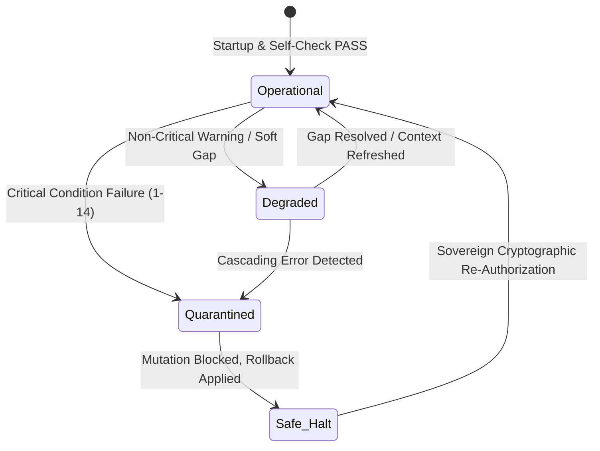

# K_FAIL_CLOSED — Fail-Closed Enforcement Kernel

> **Origin Architect / Steward:** Trang Phan  
> **Plane:** `02_KERNEL`  
> **Status:** `AMOS_MODEL`  
> **Enforcement Gate:** ETC v43 & L0 Cognitive Reality Gate

---

## 1. Constitutional Law of Fail-Closed Behavior

`K_FAIL_CLOSED` establishes that in any condition of ambiguity, missing data, unverified provenance, unauthorized mutation, contract violation, or unhandled exception:

$$\boxed{\text{UNKNOWN / GAP} \neq \text{PASS} \implies \text{HALT } \lor \text{ SAFE\_QUARANTINE}}$$

The system MUST NOT optimistically guess, fabricate plausible filler, bypass security gates, or proceed with state-altering mutations when any prerequisite invariant is unsatisfied.

```
+-------------------------------------------------------------------------+
|                       FAIL-CLOSED DECISION LATTICE                      |
|                                                                         |
|  [ Inbound Operation ] ---> ( Complete Invariant Validation )           |
|                                         |                               |
|                +------------------------+------------------------+      |
|                |                                                 |      |
|     [ 100% Invariants Pass ]                           [ Any Gap / Ambiguity ]
|                |                                                 |      |
|                v                                                 v      |
|     ( Authorize & Commit )                             ( FAIL-CLOSED HALT )
|                |                                                 |      |
|                v                                                 v      |
|     [ Authoritative State ]                            [ Isolate & Rollback ]
+-------------------------------------------------------------------------+
```

---

## 2. The 14 Fail-Closed Trust Conditions

Every execution path must satisfy all 14 mandatory conditions:

1. **Epoch Freshness:** Action timestamp matches current active epoch ($t \in \mathcal{E}_k$).
2. **Provenance Validity:** Input references valid, non-cyclic DAG roots.
3. **Identity Attestation:** Subsystem signature matches registered manifest.
4. **Authority Envelope:** Scope, action tier, and target plane explicitly authorized.
5. **Delegation Witness:** Any sub-delegated authority includes valid witness chain.
6. **Separability Compliance:** Capability does not bypass authorization check.
7. **Type-Guard Conformance:** All payloads pass compile-time & runtime type guards.
8. **RSCF Status Legality:** Target node status allows the requested transition.
9. **Resource Ceiling:** Mutation cost remains within allocated token/compute budget.
10. **Replay Determinism:** Action can be replayed to exact identical state from log.
11. **Reality Grounding:** Empirical claims cite verified external observation.
12. **Domain Isolation:** Cross-domain operations declare explicit interfaces.
13. **Rollback Basin Readiness:** Undo/revert snapshot successfully persisted before mutation.
14. **Contract Digest Match:** SHA-256 digest matches signed enforcement contract.

---

## 3. Circuit-Breaker State Machine



---

## 4. Cross-Plane Bindings

- **Law Stack:** [[LAW_HIERARCHY]] · [[K_LAW_HIERARCHY]] · [[K_CORE_LAWS]]
- **Authority & Risk:** [[K_AUTHORITY]] · [[K_RISK_CONSTRAINT]] · [[K_COLLAPSE_RECOVERY]]
- **Memory & Integrity:** [[K_ANTI_AUTOPOISONING]] · [[K_MEMORY_IMMUNE]] · [[STATE_STATE_CONTRACT]]
- **Navigation:** [[00_HOME]] · [[02_KERNEL_MOC]] · [[03_CAUSAL_MOC]] · [[06_RISK_REPAIR_MOC]] · [[00_ROOT_MOC]]

