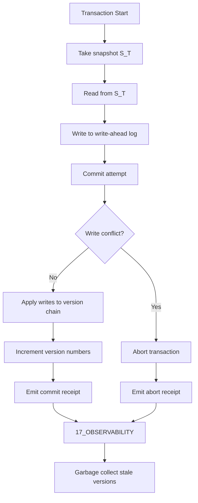

# K Mvcc — Plane Governance Specification

> **Origin Architect / Steward:** Trang Phan
> **AMOS_CORE Target:** `v4.4`
> **Conclusion Class:** `AMOS_MODEL`
> **Status:** `ACTIVE_SPECIFICATION`

---

## 1. Architectural Scope

`K_MVCC` defines the Multi-Version Concurrency Control (MVCC) protocol, typed contracts, and operational procedures for the `02_KERNEL` plane within the AMOS Full Brain OS MECE architecture. MVCC is the fundamental state versioning primitive that enables concurrent reads and writes without locking, maintaining multiple versions of each state object. The protocol governs:

- **Multi-version state management** maintaining a versioned history of each state object, allowing concurrent readers to access consistent snapshots.
- **Snapshot isolation** ensuring that each transaction operates on a consistent snapshot of the state at its start timestamp, preventing read anomalies.
- **Garbage collection of stale versions** removing versions that are no longer visible to any active transaction, preventing unbounded version growth.
- **Write-ahead logging** recording all state mutations in a causal journal for deterministic replay and rollback.
- **Causal consistency** ensuring that causally related transactions are ordered correctly, preventing causal anomalies.

This file exists because MVCC is the load-bearing state versioning primitive for all concurrent state management in AMOS. Without multi-version concurrency control, concurrent transactions would produce read anomalies, lost updates, and state corruption.

```text
K_MVCC = state_versioning_primitive
K_MVCC != locking_protocol
K_MVCC != runtime_lifecycle_manager
MVCC_COMMIT != SEMANTIC_CORRECTNESS
```

---

## 2. Governing Invariants

- **INV-KERN-MVCC-001 (Snapshot Isolation):** Each transaction $T$ operates on a consistent snapshot $S_T$ taken at its start timestamp. Reads within $T$ always see the same snapshot, regardless of concurrent commits.
- **INV-KERN-MVCC-002 (Version Monotonicity):** State versions must strictly increase over time. $\forall t_1 < t_2: \text{version}(S_{t_1}) < \text{version}(S_{t_2})$.
- **INV-KERN-MVCC-003 (Axiom Adherence):** All MVCC operations are strictly bound by M01 through M20 core laws. Operations that violate a core law are rejected.
- **INV-KERN-MVCC-004 (Fail-Closed on Conflict):** When two concurrent transactions conflict on the same state object, the later transaction is aborted and must retry. No silent conflict resolution is permitted.
- **INV-KERN-MVCC-005 (Immutable Receipts):** Every MVCC commit and abort emits an auditable trace log to `17_OBSERVABILITY` including the transaction ID, snapshot version, and commit/abort result.
- **INV-KERN-MVCC-006 (Non-Promotion Firewall):** A successful MVCC commit confirms atomic state transition; it does not confirm semantic correctness or authority. `MVCC_COMMIT != SEMANTIC_CORRECTNESS`.
- **INV-KERN-MVCC-007 (Steward Authority):** Trang Phan remains the origin architect and steward. MVCC protocol changes require governed successor evidence.

---

## 3. Mathematical Formulation

### MVCC Version Chain

Each state object $O$ has a version chain:

$$\text{versions}(O) = \{v_1, v_2, \ldots, v_n\}, \quad v_1 < v_2 < \ldots < v_n$$

### Snapshot Isolation

A transaction $T$ starting at timestamp $\tau_T$ sees the snapshot:

$$S_T = \{O_i \mapsto v_j \mid v_j = \max\{v \in \text{versions}(O_i) \mid \text{timestamp}(v) \leq \tau_T\}\}$$

### Commit Conflict Detection

Two transactions $T_1$ and $T_2$ conflict if:

$$\text{writeSet}(T_1) \cap \text{writeSet}(T_2) \neq \emptyset \wedge \text{commit}(T_1) < \text{commit}(T_2)$$

The later transaction $T_2$ is aborted:

$$\text{conflict}(T_1, T_2) \implies \text{abort}(T_2)$$

### Garbage Collection

A version $v_j$ of object $O_i$ is eligible for garbage collection when:

$$\forall T \in \text{activeTransactions}: \text{snapshot}(T, O_i) \geq v_{j+1}$$

### Reversibility

$$\text{Rollback}(\Delta_k) \circ \text{Apply}(\Delta_k) = \mathbb{I}$$

---

## 4. Operational Architecture



The MVCC protocol is non-blocking for reads: readers access consistent snapshots without acquiring locks. Writers detect conflicts at commit time and abort the later transaction.

---

## 5. MECE Mapping to AMOS Full Brain OS

| MVCC Component | Primary Plane | Partition | Key Dependencies |
|:---|:---|:---|:---|
| Version chain management | 02_KERNEL | B | 12_STATE |
| Snapshot isolation | 02_KERNEL | B | 04_RUNTIME |
| Write-ahead logging | 02_KERNEL | B | 12_STATE |
| Conflict detection | 02_KERNEL | B | 02_KERNEL/K_CAS |
| Garbage collection | 02_KERNEL | B | 12_STATE |
| MVCC receipts | 17_OBSERVABILITY | F | 02_KERNEL |
| State persistence | 12_STATE | D | 02_KERNEL |

`02_KERNEL` owns the MVCC protocol execution (Partition B). State persistence is delegated to `12_STATE` (Partition D). Receipts flow to `17_OBSERVABILITY` (Partition F).

---

## 6. Safety Invariants & Firewalls

- **INV-KERN-MVCC-101 (No Dirty Reads):** A transaction must never read uncommitted data from another transaction. Firewall: `DIRTY_READ = CRITICAL_VIOLATION`.
- **INV-KERN-MVCC-102 (No Lost Updates):** Concurrent updates to the same object must not silently overwrite each other. Firewall: `LOST_UPDATE = CRITICAL_VIOLATION`.
- **INV-KERN-MVCC-103 (No Implementation from Specification):** The MVCC protocol specification does not confirm executable implementation. Firewall: `DOCUMENTED != IMPLEMENTED`.
- **INV-KERN-MVCC-104 (No Authority from Commit):** A successful MVCC commit does not confer authority. Firewall: `CAPABILITY != AUTHORITY`.
- **INV-KERN-MVCC-105 (No Silent Conflict Resolution):** MVCC conflicts are reported via abort, not silently resolved. Firewall: `CONFLICT != RESOLVED`.

---

## 7. Navigation & Bindings

- **Master MOC:** [[00_ROOT/00_ROOT_MOC|00_ROOT_MOC]]
- **Partition Architecture:** [[00_ROOT/FULL_BRAIN_OS_MECE_ARCHITECTURE|FULL_BRAIN_OS_MECE_ARCHITECTURE]]
- **Kernel MOC:** [[02_KERNEL/02_KERNEL_MOC|02_KERNEL_MOC]]
- **Kernel README:** [[02_KERNEL/KERNEL_README|KERNEL_README]]
- **K_CAS:** [[02_KERNEL/K_CAS|K_CAS]]
- **MVCC_CAS:** [[02_KERNEL/MVCC_CAS|MVCC_CAS]]
- **IER Architecture:** [[02_KERNEL/AMOS_IDENTITY_ENTROPY_REPAIR_ARCHITECTURE|AMOS_IDENTITY_ENTROPY_REPAIR_ARCHITECTURE]]
- **Deterministic Logic Kernel:** [[02_KERNEL/DETERMINISTIC_LOGIC_KERNEL|DETERMINISTIC_LOGIC_KERNEL]]
- **Lean 4 Ledger:** [[02_KERNEL/LEAN4_PROOF_VERIFICATION_LEDGER|LEAN4_PROOF_VERIFICATION_LEDGER]]
- **Core Laws:** [[01_CANON/01_CORE_LAWS/LAW_HIERARCHY|LAW_HIERARCHY]]
- **Control Plane:** [[03_CONTROL_PLANE/03_CONTROL_PLANE_MOC|03_CONTROL_PLANE_MOC]]
- **State:** [[12_STATE/12_STATE_MOC|12_STATE_MOC]]
- **Runtime:** [[04_RUNTIME/04_RUNTIME_MOC|04_RUNTIME_MOC]]
- **Observability:** [[17_OBSERVABILITY/17_OBSERVABILITY_MOC|17_OBSERVABILITY_MOC]]

---

## 8. Known Gaps & Falsifiers

- **GAP-KERN-MVCC-001:** The MVCC protocol is specified but not yet fully implemented as an executable kernel primitive. State: `UNIMPLEMENTED`.
- **GAP-KERN-MVCC-002:** The garbage collection policy for stale versions is specified but the exact retention window is not canonically fixed. State: `UNKNOWN/GAP`.
- **GAP-KERN-MVCC-003:** The MVCC protocol has not been formally verified in Lean 4. State: `UNVERIFIED`.
- **GAP-KERN-MVCC-004:** Falsifier: if any transaction is found to have read uncommitted data, the snapshot isolation invariant is falsified.
- **GAP-KERN-MVCC-005:** Falsifier: if any concurrent updates are found to have silently overwritten each other, the no-lost-updates invariant is falsified.
