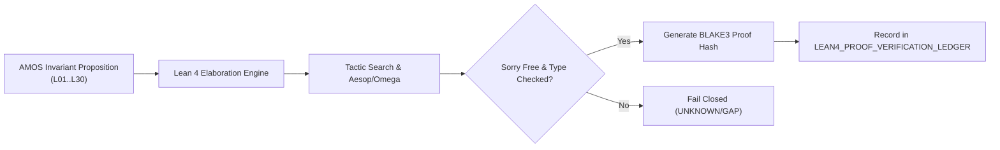

# Lean 4 Formal Kernel

> **Origin Architect / Steward:** Trang Phan  
> **AMOS_CORE Target:** `v4.4`  
> **Epistemic Class:** `AMOS_MODEL`  
> **Conclusion Class:** `DERIVED`

---

## 1. Architectural Scope & Type Theory

The **Lean 4 Formal Kernel** is the AMOS OS mathematical core for mechanical formal verification of kernel invariants and state-transition safety proofs. It formalizes AMOS Core Laws (`L01` through `L30`) inside the **Calculus of Inductive Constructions (CIC)** with dependent type theory, inductive families, and computational reflection.

```text
FORMAL_MODEL != RUNTIME_VERIFIER
PROVEN_IN_LEAN != AMOS_CANONICAL
DOCUMENTED != IMPLEMENTED
CAPABILITY != AUTHORITY
```

---

## 2. Formal Type Definitions & Invariant Schemas

### 2.1 Inductive Epoch & RSCF State Types
```lean
namespace Amos.Kernel

/-- Epistemic classification regime for claims in the AMOS vault -/
inductive EpistemicClass where
  | source_claim : EpistemicClass
  | observation   : EpistemicClass
  | derived       : EpistemicClass
  | amos_model    : EpistemicClass
  | decision      : EpistemicClass
  | unknown_gap   : EpistemicClass
deriving Repr, DecidableEq

/-- Monotonic epoch identifier for Compare-And-Swap (CAS) state commits -/
structure Epoch where
  val : Nat
  monotonic : val > 0
deriving Repr

/-- RSCF Node representation in Lean 4 -/
structure RSCFNode where
  node_id : String
  epistemic_class : EpistemicClass
  provenance_hash : String
  confidence_ceiling : Float
  epoch : Epoch
```

### 2.2 Formal State Transition & CAS Correctness Theorem
```lean
/-- Atomic Compare-And-Swap state transition predicate -/
def CAS_Valid (current_epoch next_epoch : Epoch) (prev_hash next_hash : String) : Prop :=
  next_epoch.val = current_epoch.val + 1 ∧ prev_hash ≠ next_hash ∧ next_hash.length = 64

/-- Theorem: Monotonic Epoch Evolution guarantees anti-rollback in CAS commits -/
theorem epoch_monotonic_anti_rollback (e1 e2 : Epoch) (h : CAS_Valid e1 e2 p n) :
  e2.val > e1.val := by
  rcases h with ⟨h_succ, _, _⟩
  rw [h_succ]
  exact Nat.lt_succ_self e1.val
```

---

## 3. Kernel Verification Pipeline & Proof Ledgers



---

## 4. Governing Invariants

- **INV-L4FK-001 (Constructive Soundness):** Proofs must not invoke classical axioms (`Classical.choice`, `Classical.em`) unless explicitly tagged with `noncomputable` and bounded within epistemic modeling domains.
- **INV-L4FK-002 (Zero Sorry Tolerance):** No artifact claiming formal verification may contain unproven `sorry` axioms or unverified admits.
- **INV-L4FK-003 (Cryptographic Proof Binding):** Every verified theorem is anchored to a SHA-256 / BLAKE3 hash of its syntax tree and recorded in [[02_KERNEL/LEAN4_PROOF_VERIFICATION_LEDGER|LEAN4_PROOF_VERIFICATION_LEDGER]].
- **INV-L4FK-004 (Origin Stewardship):** Origin stewardship is held by Trang Phan under AMOS v4.4 canonical lineage.

---

## 5. Navigation & Cross-Plane References

- [[02_KERNEL/02_KERNEL_MOC|02_KERNEL_MOC]] — Kernel Master Map
- [[02_KERNEL/LEAN4_INVARIANT_PROVER_ENGINE|LEAN4_INVARIANT_PROVER_ENGINE]] — Invariant Construction Engine
- [[02_KERNEL/LEAN4_PROOF_VERIFICATION_LEDGER|LEAN4_PROOF_VERIFICATION_LEDGER]] — Proof Verification Ledger
- [[01_CANON/01_CORE_LAWS/L22_ATOMIC_REASONING|L22_ATOMIC_REASONING]] — Atomic Reasoning Law
- [[22_RESEARCH/01_MATHEMATICS/AMOS_137_MATH_REGISTRY|AMOS_137_MATH_REGISTRY]] — Mathematics Registry
