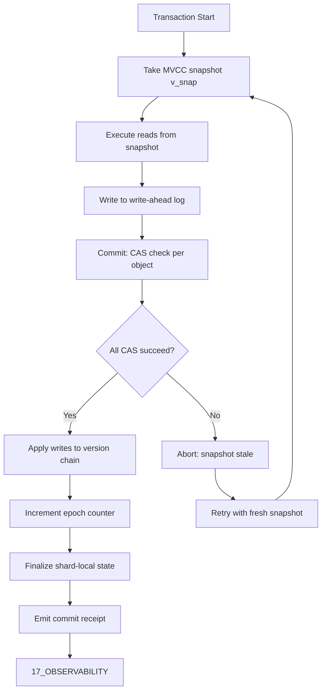

# Mvcc Cas — Plane Governance Specification

> **Origin Architect / Steward:** Trang Phan  
> **AMOS_CORE Target:** `v4.4`  
> **Conclusion Class:** `AMOS_MODEL`  
> **Status:** `ACTIVE_SPECIFICATION`

---

## 1. Architectural Scope

`MVCC_CAS` defines the integrated Multi-Version Concurrency Control with Compare-And-Swap protocol, typed contracts, and operational procedures for the `02_KERNEL` plane within the AMOS Full Brain OS MECE architecture. This specification combines MVCC's snapshot isolation with CAS's atomic version comparison to provide a unified state management primitive. The integrated protocol governs:

- **Combined version management** using MVCC version chains for snapshot isolation and CAS for atomic commit attempts.
- **Causal epoch finality** ensuring that committed transactions achieve causal consistency through CAS-verified epoch ordering.
- **Shard-local finalization** allowing individual shards to finalize their local state using CAS before propagating to the global MVCC version chain.
- **Proof-based coordination avoidance** permitting transactions to bypass distributed coordination when they can prove non-interference with concurrent transactions.
- **Replay and rollback integration** using the MVCC write-ahead log for deterministic replay and CAS for atomic rollback application.

This file exists because MVCC and CAS are complementary primitives that must be integrated at the protocol level. Without an integrated specification, the interaction between snapshot isolation and atomic commit would be underspecified, producing race conditions and state corruption.

```text
MVCC_CAS = integrated_state_management_primitive
MVCC_CAS != MVCC_alone
MVCC_CAS != CAS_alone
MVCC_CAS != runtime_lifecycle_manager
COMMIT != SEMANTIC_CORRECTNESS
```

---

## 2. Governing Invariants

- **INV-KERN-MC-001 (Snapshot + Atomicity):** Each transaction operates on an MVCC snapshot and commits via CAS. The CAS check verifies that the snapshot version is still current at commit time.
- **INV-KERN-MC-002 (Causal Epoch Finality):** Committed transactions are ordered by causal epoch. The epoch counter is monotonically increasing and CAS-protected.
- **INV-KERN-MC-003 (Axiom Adherence):** All MVCC_CAS operations are strictly bound by M01 through M20 core laws. Operations that violate a core law are rejected.
- **INV-KERN-MC-004 (Fail-Closed on Epoch Conflict):** When the CAS check at commit time detects that the snapshot version is stale (another transaction has committed to the same object), the transaction is aborted and must retry with a fresh snapshot.
- **INV-KERN-MC-005 (Immutable Receipts):** Every MVCC_CAS commit and abort emits an auditable trace log to `17_OBSERVABILITY` including the transaction ID, snapshot version, CAS result, and epoch counter.
- **INV-KERN-MC-006 (Non-Promotion Firewall):** A successful MVCC_CAS commit confirms atomic state transition with snapshot isolation; it does not confirm semantic correctness or authority. `COMMIT != SEMANTIC_CORRECTNESS`.
- **INV-KERN-MC-007 (Steward Authority):** Trang Phan remains the origin architect and steward. MVCC_CAS protocol changes require governed successor evidence.

---

## 3. Mathematical Formulation

### Integrated CAS-MVCC Commit

The integrated commit operation for transaction $T$ with snapshot version $v_{\text{snap}}$:

$$\text{Commit}_{\text{MC}}(T, v_{\text{snap}}) = \begin{cases} \text{TRUE} & \text{if } \forall O_i \in \text{writeSet}(T): \text{CAS}(O_i, v_{\text{snap}}, v_{\text{new}}, \Delta_i) = \text{TRUE} \\ \text{FALSE} & \text{otherwise} \end{cases}$$

### Causal Epoch Finality

The epoch counter $E$ is monotonically increasing:

$$\forall T_1, T_2: \text{commit}(T_1) < \text{commit}(T_2) \implies E(T_1) < E(T_2)$$

### Shard-Local Finalization

A shard $s$ finalizes its local state when:

$$\text{finalize}(s) = \text{CAS}(s, v_{\text{local}}, v_{\text{local}} + 1, \Delta_{\text{local}})$$

### Coordination Avoidance

A transaction $T$ may bypass distributed coordination if:

$$\forall T' \in \text{concurrent}: \text{writeSet}(T) \cap \text{writeSet}(T') = \emptyset$$

### Reversibility

$$\text{Rollback}(\Delta_k) \circ \text{Apply}(\Delta_k) = \mathbb{I}$$

### Replay Determinism

$$\text{Replay}(\text{WAL}[t_0, t_1]) = S_{t_1}, \quad \forall \text{ execution order} \in \text{causalOrder}$$

---

## 4. Operational Architecture



The MVCC_CAS protocol combines snapshot isolation (MVCC) with atomic commit (CAS). The CAS check at commit time detects stale snapshots and aborts the transaction, ensuring no lost updates.

---

## 5. MECE Mapping to AMOS Full Brain OS

| MVCC_CAS Component | Primary Plane | Partition | Key Dependencies |
|:---|:---|:---|:---|
| Snapshot isolation | 02_KERNEL | B | 02_KERNEL/K_MVCC |
| Atomic commit | 02_KERNEL | B | 02_KERNEL/K_CAS |
| Causal epoch finality | 02_KERNEL | B | 03_CONTROL_PLANE |
| Shard-local finalization | 02_KERNEL | B | 04_RUNTIME |
| Coordination avoidance | 02_KERNEL | B | 09_PROTOCOLS |
| Replay and rollback | 02_KERNEL | B | 12_STATE |
| Commit receipts | 17_OBSERVABILITY | F | 02_KERNEL |
| State persistence | 12_STATE | D | 02_KERNEL |

`02_KERNEL` owns the integrated MVCC_CAS protocol execution (Partition B). State persistence is delegated to `12_STATE` (Partition D). Authority for epoch finality is gated by `03_CONTROL_PLANE` (Partition B). Receipts flow to `17_OBSERVABILITY` (Partition F).

---

## 6. Safety Invariants & Firewalls

- **INV-KERN-MC-101 (No Stale Snapshot Commit):** A transaction must never commit on a stale snapshot. The CAS check must reject stale snapshots. Firewall: `STALE_SNAPSHOT_COMMIT = CRITICAL_VIOLATION`.
- **INV-KERN-MC-102 (No Epoch Regression):** The epoch counter must never decrease. Firewall: `EPOCH_REGRESSION = CRITICAL_VIOLATION`.
- **INV-KERN-MC-103 (No Implementation from Specification):** The MVCC_CAS protocol specification does not confirm executable implementation. Firewall: `DOCUMENTED != IMPLEMENTED`.
- **INV-KERN-MC-104 (No Authority from Commit):** A successful commit does not confer authority. Firewall: `CAPABILITY != AUTHORITY`.
- **INV-KERN-MC-105 (No Silent Coordination Bypass):** Coordination avoidance requires proof of non-interference. Unproven bypass is a violation. Firewall: `UNPROVEN_BYPASS = VIOLATION`.

---

## 7. Navigation & Bindings

- **Master MOC:** [[00_ROOT/00_ROOT_MOC|00_ROOT_MOC]]
- **Partition Architecture:** [[00_ROOT/FULL_BRAIN_OS_MECE_ARCHITECTURE|FULL_BRAIN_OS_MECE_ARCHITECTURE]]
- **Kernel MOC:** [[02_KERNEL/02_KERNEL_MOC|02_KERNEL_MOC]]
- **Kernel README:** [[02_KERNEL/KERNEL_README|KERNEL_README]]
- **K_CAS:** [[02_KERNEL/K_CAS|K_CAS]]
- **K_MVCC:** [[02_KERNEL/K_MVCC|K_MVCC]]
- **IER Architecture:** [[02_KERNEL/AMOS_IDENTITY_ENTROPY_REPAIR_ARCHITECTURE|AMOS_IDENTITY_ENTROPY_REPAIR_ARCHITECTURE]]
- **Deterministic Logic Kernel:** [[02_KERNEL/DETERMINISTIC_LOGIC_KERNEL|DETERMINISTIC_LOGIC_KERNEL]]
- **Lean 4 Ledger:** [[02_KERNEL/LEAN4_PROOF_VERIFICATION_LEDGER|LEAN4_PROOF_VERIFICATION_LEDGER]]
- **Core Laws:** [[01_CANON/01_CORE_LAWS/LAW_HIERARCHY|LAW_HIERARCHY]]
- **Control Plane:** [[03_CONTROL_PLANE/03_CONTROL_PLANE_MOC|03_CONTROL_PLANE_MOC]]
- **State:** [[12_STATE/12_STATE_MOC|12_STATE_MOC]]
- **Runtime:** [[04_RUNTIME/04_RUNTIME_MOC|04_RUNTIME_MOC]]
- **Protocols:** [[09_PROTOCOLS/09_PROTOCOLS_MOC|09_PROTOCOLS_MOC]]
- **Observability:** [[17_OBSERVABILITY/17_OBSERVABILITY_MOC|17_OBSERVABILITY_MOC]]

---

## 8. Known Gaps & Falsifiers

- **GAP-KERN-MC-001:** The MVCC_CAS integrated protocol is specified but not yet fully implemented as an executable kernel primitive. State: `UNIMPLEMENTED`.
- **GAP-KERN-MC-002:** The proof-based coordination avoidance protocol is specified but the proof construction mechanism is not fully defined. State: `PARTIAL`.
- **GAP-KERN-MC-003:** The MVCC_CAS protocol has not been formally verified in Lean 4. State: `UNVERIFIED`.
- **GAP-KERN-MC-004:** The shard-local finalization protocol is specified but the exact shard boundary definitions are not canonically fixed. State: `UNKNOWN/GAP`.
- **GAP-KERN-MC-005:** Falsifier: if any transaction is found to have committed on a stale snapshot, the stale snapshot commit invariant is falsified.
- **GAP-KERN-MC-006:** Falsifier: if the epoch counter is found to have decreased, the epoch regression invariant is falsified and the protocol must be revised.
