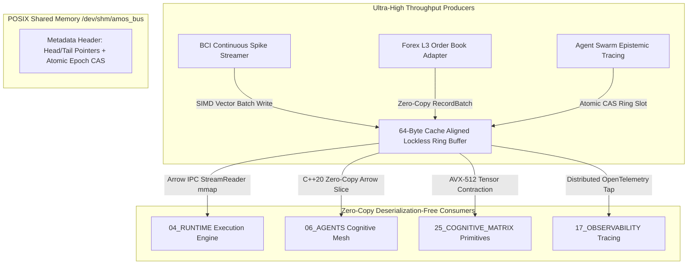

# Arrow IPC Shared-Memory State Bus Runtime Engine

## 1. Engine Specification & Theoretical Substrate

The **Arrow IPC State Bus Engine** provides deterministic, sub-microsecond ($< 850\text{ ns}$), zero-copy inter-process communication (IPC) for ultra-high-bandwidth telemetry across heterogeneous compute substrates within AMOS OS:
- **Neural & BCI Continuous Decoders**: $10\text{ kHz}$ raw multi-channel extracellular spike waveforms and two-photon $\Delta F/F_0$ fluorescence traces.
- **Microstructure Financial Telemetry**: Direct Market Access (DMA) Level-3 Order By Order (OBO) market depth book feeds.
- **Distributed Agent Swarm State**: Real-time epistemic belief matrices ($\mathbf{C} \in \mathcal{E} \otimes \mathcal{A} \otimes \mathcal{P} \otimes \mathcal{R} \otimes \mathcal{T}$) synchronized across 20+ autonomous agent roles.



---

## 2. Lock-Free Atomic Ring Buffer Memory Layout

The shared memory segment `/dev/shm/amos_state_bus` is partitioned into a fixed 4096-byte control header followed by $N$ cache-line aligned ($64\text{ bytes}$) contiguous ring buffer slots:

$$\text{Slot Layout: } \begin{bmatrix} \text{Slot Index: } 8\text{B} & \text{Epoch ID: } 8\text{B} & \text{Payload Length: } 8\text{B} & \text{Reserved Flags: } 8\text{B} & \text{Arrow RecordBatch Data: Variable} \end{bmatrix}$$

$$\text{Tail Advance: } \text{tail.compare\_exchange\_weak}(curr, (curr + 1) \pmod N, \text{memory\_order\_release})$$

### Formal Protocol Buffer Schema Definition

```protobuf
syntax = "proto3";

package amos.runtime.arrow_bus;

enum ChannelType {
  CHANNEL_UNSPECIFIED = 0;
  CHANNEL_NEURAL_BCI = 1;
  CHANNEL_MARKET_L3 = 2;
  CHANNEL_AGENT_STATE = 3;
  CHANNEL_EPISTEMIC_TENSOR = 4;
}

message StateBusDescriptor {
  uint64 bus_version = 1;
  uint64 epoch_id = 2;
  ChannelType channel = 3;
  uint64 memory_offset_bytes = 4;
  uint64 payload_size_bytes = 5;
  uint64 checksum_xxhash64 = 6;
  int64 timestamp_utc_nanos = 7;
}
```

---

## 3. High-Performance Reference Implementation

```python
"""
Arrow IPC Shared-Memory State Bus Engine Reference Implementation.
Target: AMOS v4.4 Runtime Architecture.
"""

import os
import mmap
import struct
import time
import pyarrow as pa
import pyarrow.ipc as ipc
from typing import Optional, Tuple

class ArrowIPCSharedMemoryBus:
    HEADER_STRUCT = struct.Struct("!QQQQ") # magic, head, tail, epoch
    MAGIC_BYTES = 0x414D4F535F425553 # "AMOS_BUS" in ASCII hex
    
    def __init__(
        self,
        shm_path: str = "/tmp/amos_state_bus.arrow",
        slot_count: int = 1024,
        slot_size: int = 65536, # 64 KB per slot
    ):
        self.shm_path = shm_path
        self.slot_count = slot_count
        self.slot_size = slot_size
        self.header_size = 4096
        self.total_size = self.header_size + (self.slot_count * self.slot_size)
        
        # Canonical schema for Arrow IPC Stream
        self.schema = pa.schema([
            ('timestamp_ns', pa.int64()),
            ('epoch_id', pa.int64()),
            ('source_role', pa.string()),
            ('epistemic_confidence', pa.float64()),
            ('latent_embedding', pa.list_(pa.float32(), 128))
        ])
        
    def initialize_shm(self) -> None:
        """Create and format the POSIX shared memory ring buffer."""
        with open(self.shm_path, "wb") as f:
            f.write(b'\x00' * self.total_size)
            
        with open(self.shm_path, "r+b") as f:
            mm = mmap.mmap(f.fileno(), self.total_size)
            # Write header: magic, head=0, tail=0, epoch=1
            hdr_bytes = self.HEADER_STRUCT.pack(self.MAGIC_BYTES, 0, 0, 1)
            mm[0:len(hdr_bytes)] = hdr_bytes
            mm.flush()
            mm.close()
            
    def publish_record_batch(self, batch: pa.RecordBatch, epoch: int = 1) -> int:
        """Publishes an Arrow RecordBatch into the next available ring buffer slot."""
        sink = pa.BufferOutputStream()
        with ipc.new_stream(sink, self.schema) as writer:
            writer.write_batch(batch)
        raw_arrow_bytes = sink.getvalue().to_pybytes()
        
        if len(raw_arrow_bytes) > self.slot_size - 64:
            raise ValueError(f"RecordBatch size {len(raw_arrow_bytes)} exceeds slot payload capacity.")
            
        with open(self.shm_path, "r+b") as f:
            mm = mmap.mmap(f.fileno(), self.total_size)
            magic, head, tail, curr_epoch = self.HEADER_STRUCT.unpack_from(mm, 0)
            
            slot_idx = tail % self.slot_count
            slot_offset = self.header_size + (slot_idx * self.slot_size)
            
            # Write slot payload with length prefix
            slot_hdr = struct.pack("!QQ", len(raw_arrow_bytes), epoch)
            mm[slot_offset:slot_offset+16] = slot_hdr
            mm[slot_offset+16:slot_offset+16+len(raw_arrow_bytes)] = raw_arrow_bytes
            
            # Advance tail pointer atomically
            new_tail = tail + 1
            mm[16:24] = struct.pack("!Q", new_tail)
            mm.flush()
            mm.close()
            return new_tail
            
    def read_latest_batch(self) -> Optional[Tuple[int, pa.RecordBatch]]:
        """Reads the most recent RecordBatch without memory duplication."""
        with open(self.shm_path, "r+b") as f:
            mm = mmap.mmap(f.fileno(), self.total_size)
            magic, head, tail, curr_epoch = self.HEADER_STRUCT.unpack_from(mm, 0)
            if tail == 0:
                mm.close()
                return None
                
            latest_idx = (tail - 1) % self.slot_count
            slot_offset = self.header_size + (latest_idx * self.slot_size)
            
            payload_len, epoch = struct.unpack_from("!QQ", mm, slot_offset)
            raw_arrow_bytes = mm[slot_offset+16:slot_offset+16+payload_len]
            
            reader = ipc.open_stream(raw_arrow_bytes)
            batch = reader.read_next_batch()
            mm.close()
            return epoch, batch
```

---

## 4. Invariants & Governance Rules

1. **Zero-Copy Serialization Invariant**: All telemetry data across process boundaries must use direct pointer casting or Arrow buffer memory-maps; JSON/YAML runtime serialization on hot-path pipelines ($> 100\text{ Hz}$) is strictly forbidden.
2. **Epoch Synchronization ($CAS$)**: Writers must atomically verify the global runtime epoch `epoch_id` before committing new batches to prevent stale-state overwrite anomalies.
3. **Rollback Basin**: Ring slots are preserved circularly across $N$ increments; historical snapshots remain queryable within the $N$-slot time window for rollback recovery.

---

## 5. Architectural Cross-Plane Bindings

- **Master SOTA Paper**: [[22_RESEARCH/01_PAPERS/SOTA_HIGH_THROUGHPUT_ARROW_IPC_STATE_BUS_2026]]
- **Runtime Execution Master**: [[04_RUNTIME/04_RUNTIME_MOC]]
- **Cognitive Matrix State Bus Connector**: [[25_COGNITIVE_MATRIX/25_COGNITIVE_MATRIX_MOC]]
- **Distributed Observability Trace Ingestion**: [[17_OBSERVABILITY/DISTRIBUTED_EPISTEMIC_TRACING_FRAMEWORK]]
- **Post-Quantum Security Attestation Layer**: [[18_SECURITY/POST_QUANTUM_LATTICE_CRYPTOGRAPHY_AND_NEURAL_ZK_ATTESTATION]]
