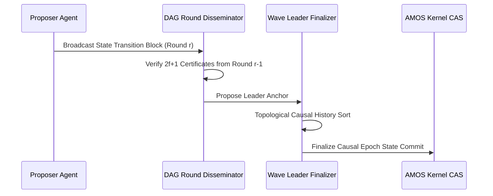

# Asynchronous DAG BFT-SMR Consensus Runtime Engine

## 1. Engine Specification
The Asynchronous DAG BFT-SMR Consensus Engine establishes deterministic state ordering and multi-shard coordination avoidance across autonomous AMOS agent swarms.

## 2. SOTA Methods

### BFT consensus protocols
- **PBFT (Practical Byzantine Fault Tolerance)**: 3-phase protocol (pre-prepare → prepare → commit); O(n²) message complexity; tolerates f < n/3 Byzantine faults; primary-based leader election
- **HotStuff**: 3-chain commit with linear view-change; O(n) message complexity via threshold signatures; pipelined BFT for higher throughput; used by Aptos/AptosB
- **DiemBFT/LibraBFT**: HotStuff variant with Pacemaker separation; leader rotation per round; 2-chain commit
- **Narwhal-Bullshark**: DAG-based BFT separating data dissemination (Narwhal) from consensus ordering (Bullshark); zero-overhead consensus; used by Sui/Aptos

### DAG-based consensus
- **Narwhal**: mempool layer using structured DAG for data dissemination; each block references 2f+1 predecessors; guarantees data availability before ordering
- **Bullshark**: zero-message consensus on Narwhal DAG; leader selected deterministically from DAG rounds; validators vote by extending the DAG
- **Advantages**: separates data plane (DAG) from consensus plane (ordering); consensus has zero additional message overhead; high throughput (100k+ TPS demonstrated)

### State Machine Replication (SMR)
- **Deterministic replication**: all replicas apply the same ordered sequence of commands; safety = all honest replicas agree on order; liveness = commands eventually commit
- **Causal ordering**: Lamport clocks or vector clocks for partial ordering; total ordering via consensus for conflicting transactions
- **Multi-shard coordination**: shard-local transactions processed independently; cross-shard transactions require atomic commit (2PC or proof-based coordination avoidance)

### Proof-based coordination avoidance
- **Optimistic concurrency**: transactions execute without coordination; conflicts detected at commit time via read-set/write-set tracking
- **Proofs of non-conflict**: transactions carry read/write sets as proofs; validators verify no overlap → commit without global coordination
- **BOHM/MVCC**: multi-version data items allow read-only transactions to proceed without blocking; snapshot isolation per shard

## 3. AMOS Integration

- **L23 MVCC-CAS canon**: [[01_CANON/01_CORE_LAWS/L23_MVCC_CAS|L23 MVCC-CAS canon]] — canonical concurrency model
- **L24 causal epoch**: [[01_CANON/01_CORE_LAWS/L24_CAUSAL_EPOCH|L24 causal epoch law]] — epoch monotonicity
- **L25 shard-local**: [[01_CANON/01_CORE_LAWS/L25_SHARD_LOCAL|L25 shard-local law]] — shard-local finalization
- **L26 proof coordination**: [[01_CANON/01_CORE_LAWS/L26_PROOF_COORDINATION|L26 proof coordination avoidance]] — coordination avoidance
- **K_CAS kernel**: [[02_KERNEL/K_CAS|K_CAS]] — compare-and-swap primitive
- **K_MVCC kernel**: [[02_KERNEL/K_MVCC|K_MVCC]] — multi-version concurrency control
- **Runtime pipeline**: [[04_RUNTIME/04_RUNTIME_MOC|04_RUNTIME MOC]] — execution stage

## 4. Invariants

1. Safety: all honest replicas agree on the same ordered sequence of committed transactions
2. Liveness: a transaction submitted by an honest client eventually commits (assuming partial synchrony)
3. Fault tolerance: system tolerates f < n/3 Byzantine replicas (n = total replicas)
4. Causal monotonicity: epoch counters are strictly monotonically increasing (L24)
5. Shard-local finalization: shards finalize independently; cross-shard coordination only for conflicting transactions (L25)
6. `CONSENSUS_REACHED != STATE_CORRECT` — consensus guarantees ordering, not semantic correctness

## 5. Integration Links
- **Research Basis**: [[22_RESEARCH/01_PAPERS/SOTA_BFT_SMR_DISTRIBUTED_CONSENSUS_FOR_AGENTIC_SWARMS_2026]]
- **Microkernel Invariants**: [[02_KERNEL/K_CAS]] and [[02_KERNEL/K_MVCC]]
- **Finalizer Pipeline**: [[04_RUNTIME/09_FINALIZATION/CAUSAL_EPOCH_FINALIZER]]
